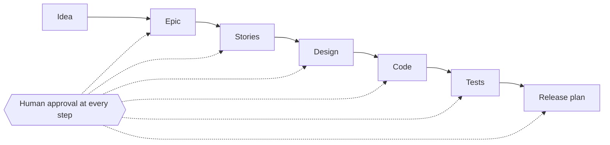

# AURA

AI agents for the software delivery lifecycle, with a human approving every step.



- Agents for **PO, BA, Architect, Developer, QA, Tester and Deployer** draft the work.
- **Jira** holds the work items.
- **Permissions, approvals and audit** are plain code, outside the model.

## Quick start

```bash
pnpm install   # install everything
make env       # create .env files, then fill them in
make dev       # run runtime + api + web
```

Full guide: [SETUP.md](SETUP.md) · `make help` lists every command.

## Repository

| Folder | Contents |
|---|---|
| `apps/web` | React UI |
| `apps/api` | Express API: auth, policy, approvals, audit |
| `apps/agent-runtime` | Mastra agents and workflows |
| `apps/vscode` | AURA for VS Code (developers) |
| `packages/aura-client` | Shared typed API client |
| `packages/aura-bridge` | Cloud ↔ VS Code bridge protocol |
| `docs/` | Documentation |

## Documentation

| Doc | For |
|---|---|
| [docs/story.md](docs/story.md) | Plain-English introduction |
| [docs/ARCHITECTURE.md](docs/ARCHITECTURE.md) | How the system is built |
| [SETUP.md](SETUP.md) | Install and run |
| [docs/README.md](docs/README.md) | Full documentation index |
