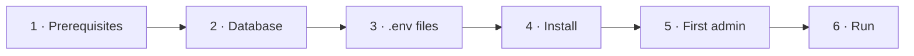

# AURA Setup

How to install, configure and run AURA on your machine.



---

## 1. Prerequisites

| Need | Required | Notes |
|---|---|---|
| Node.js ≥ 22.13 | Yes | `node --version` |
| pnpm 11 | Yes | `corepack enable` |
| git | Yes | Set `user.name` and `user.email` |
| Supabase project | Yes | Free tier works |
| Groq API key | Yes | https://console.groq.com/keys |
| Google AI Studio key | Yes | Fallback model · https://aistudio.google.com |
| Jira Cloud + API token | Yes | https://id.atlassian.com/manage-profile/security/api-tokens |
| python3 | For the full web terminal | Preinstalled on Linux/macOS |
| Docker | For Gate 4 scaffolds and Gate 7 tests | Not needed by the Coding Council |
| make | Optional | Every target is also a pnpm command |

Run `make doctor` to check all of these.

---

## 2. Database

Run every file in `apps/api/supabase/migrations/` **in order** in the Supabase SQL editor
(`0001` → `0009`).

---

## 3. Environment files

```bash
make env    # creates each missing .env from its .env.example (never overwrites)
```

Every variable is described in its `.env.example`. The main ones:

| File | Key values |
|---|---|
| `apps/agent-runtime/.env` | `GROQ_API_KEY`, `GOOGLE_GENERATIVE_AI_API_KEY`, Jira MCP settings, `JIRA_PROJECT_KEY`, `AURA_WORKSPACE_ROOT` (absolute path), `DATABASE_URL` (optional locally, required in server mode) |
| `apps/api/.env` | `SUPABASE_URL`, `SUPABASE_ANON_KEY`, `SUPABASE_SERVICE_ROLE_KEY`, `WEB_ORIGIN`, `MASTRA_RUNTIME_URL`, Jira read credentials |
| `apps/web/.env` | `VITE_SUPABASE_URL`, `VITE_SUPABASE_ANON_KEY`, `VITE_API_URL` |

### Shared secrets

These two values must be **the same** in `apps/api/.env` and `apps/agent-runtime/.env`.
Generate each with `make terminal-secret`.

| Variable | Purpose | Needed when |
|---|---|---|
| `MASTRA_RUNTIME_TOKEN` | Only the API may call the runtime | Always in `AURA_MODE=server`. Optional locally (Mastra Studio can't send it) |
| `TERMINAL_TICKET_SECRET` | Signs web terminal tickets | To use the web terminal |

### Postgres for runtime state

Set `DATABASE_URL` in **both** `apps/agent-runtime/.env` and `apps/api/.env` to the Supabase
**direct** connection string
(Project Settings → Database, session mode, port 5432). The runtime creates the `mastra` and
`aura_runtime` schemas; the API's turn queue creates `pgboss`. To keep the drafts you already have locally:

```bash
DATABASE_URL=postgresql://... pnpm --filter agent-runtime migrate-state
```

Never commit `.env` files.

---

## 4. Install

```bash
pnpm install    # or: make install
```

This installs every app, applies `patches/`, and builds `packages/aura-client`.

---

## 5. First admin

```bash
pnpm --filter api bootstrap-admin -- --email you@company.com --name "Your Name" --password "..."
```

Sign in as the admin and add users in **Admin → Users**. Roles: `project_owner`,
`business_analyst`, `architect`, `developer`, `qa_engineer`, `deployer`.

---

## 6. Run

```bash
make dev    # runtime + api + web together; Ctrl+C stops all
```

| Service | Command | URL |
|---|---|---|
| Agent runtime | `make runtime` | http://localhost:4111 (Mastra Studio) |
| API | `make api` | http://localhost:4000 |
| Web | `make web` | http://localhost:5173 |

Check: `curl http://localhost:4000/health`, then sign in at http://localhost:5173.

### Common commands

| Command | Does |
|---|---|
| `make test` | Unit tests (Vitest), same as CI |
| `make typecheck` | TypeScript check of everything |
| `make lint` | Lint the web app |
| `make build` | Production build |
| `make doctor` | Check prerequisites and `.env` files |
| `make clean` | Remove `node_modules`, `dist`, `.mastra` |
| `pnpm --filter <app> add <pkg>` | Add a dependency to one app |

---

## 7. Optional settings

### Web terminal (agent-runtime `.env`)

| Variable | Default | Meaning |
|---|---|---|
| `TERMINAL_MODE` | `full` on loopback, else `restricted` | `full` · `restricted` · `off` |
| `TERMINAL_HOST` / `TERMINAL_PORT` | `127.0.0.1` / `4112` | WebSocket address |
| `TERMINAL_ALLOWED_ORIGINS` | `http://localhost:5173` | Allowed web origins |

### Dashboard settings

Admins change agent limits, approval expiry, the prompt-injection policy and the turn time limit
in **Admin → Settings**, globally or per project. Users set their own council mode and a lower
token budget in **Profile → Preferences**. These override the `.env` values below, which remain
fallbacks.

### Coding Council (agent-runtime `.env` fallbacks)

| Variable | Default | Meaning |
|---|---|---|
| `COUNCIL_MODE` | `auto` | `lean` · `full` · `auto` |
| `COUNCIL_PLAN_ROUNDS` | `1` | Plan review rounds |
| `COUNCIL_MAX_ROUNDS` | `2` | Code review rounds |
| `COUNCIL_IMPLEMENTER_STEPS` | `15` | Tool steps for the build |
| `COUNCIL_FIX_STEPS` | `8` | Tool steps per fix |
| `COUNCIL_TOKEN_BUDGET` | `150000` | Stop the run at this many tokens |
| `SANDBOX_MODE` | `host` | Where checks run: `host` or `docker` |

Long council runs: raise `RUN_TURN_TIMEOUT_MS` in `apps/api/.env` (e.g. `1800000`).

### Models

Models are set in code in `apps/agent-runtime/src/mastra/agents/registry.ts`. To use Claude, set
`ANTHROPIC_API_KEY` and put `anthropic/claude-sonnet-5` first in each `COUNCIL_*_MODEL_IDS` list.

---

## 8. Where data is stored

| Location | Contents |
|---|---|
| `$AURA_WORKSPACE_ROOT/<EPIC>/architecture/` | Design docs (Gate 3) |
| `$AURA_WORKSPACE_ROOT/<EPIC>/dev/<discipline>/` | Base repo (Gate 4) |
| `…/dev/<discipline>/.worktrees/<TASK>/` | Task worktree on `feature/<TASK>` |
| `$AURA_WORKSPACE_ROOT/<EPIC>/qa/` | Test plan and Playwright specs (Gate 6) |
| Postgres (`DATABASE_URL`): schemas `mastra`, `aura_runtime` | Agent memory, drafts, token and model usage, approval use |
| `mastra.db`, `aura-drafts.db` | The same, locally, when `DATABASE_URL` is empty |
| Supabase | Users, runs, approvals, audit log, tokens, projects |

---

## 9. Troubleshooting

| Problem | Fix |
|---|---|
| API: runtime unreachable | Start the runtime; check `MASTRA_RUNTIME_URL` |
| API: runtime responded 401 | `MASTRA_RUNTIME_TOKEN` differs between the two `.env` files |
| Mastra Studio shows 401 | Unset `MASTRA_RUNTIME_TOKEN` locally |
| Server mode won't start | It lists every problem; fix them or use `AURA_MODE=local` |
| Council stops on budget or rate limits | Wait, or raise the council token budget in Admin → Settings |
| Council cut off at 10 minutes | Raise `RUN_TURN_TIMEOUT_MS` |
| Web terminal won't connect | Same `TERMINAL_TICKET_SECRET` in both files; restart both |
| Groq `Invalid API Key` | Renew `GROQ_API_KEY` |
| Patch not applied on install | Keep `@mastra/schema-compat` at 1.3.10 |
| `make: command not found` | Install make, or use the pnpm command |
