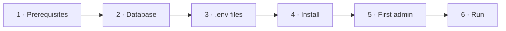
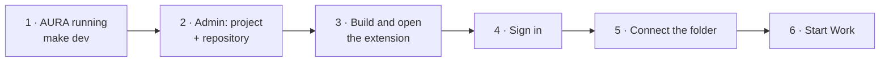
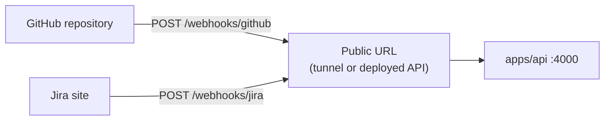

# AURA Setup

How to install, configure and run AURA on your machine.



---

## 1. Prerequisites

| Need | Required | Notes |
|---|---|---|
| Node.js ≥ 22.13 | Yes | `node --version` |
| pnpm 11 | Yes | `corepack enable` |
| git | Yes | Set `user.name` and `user.email` |
| Supabase project | Yes | Free tier works |
| Groq API key | Yes | https://console.groq.com/keys |
| Google AI Studio key | Yes | Fallback model · https://aistudio.google.com |
| Jira Cloud + API token | Yes | https://id.atlassian.com/manage-profile/security/api-tokens |
| GitHub CLI (`gh`) | For developers | Opens pull requests at Gate 6 |
| VS Code | For developers | With the AURA extension ([apps/vscode](apps/vscode/README.md)) |
| make | Optional | Every target is also a pnpm command |
| `cloudflared` (or another tunnel) | For webhooks locally | Gives GitHub and Jira a public URL to the API (§8) |

Run `make doctor` to check all of these.

---

## 2. Database

Run every file in `apps/api/supabase/migrations/` **in order** in the Supabase SQL editor
(`0001` → `0013`). Run each file **once**: nothing records which ones ran, so keep a note of the
last one applied.

---

## 3. Environment files

```bash
make env    # creates each missing .env from its .env.example (never overwrites)
```

Every variable is described in its `.env.example`. The main ones:

| File | Key values |
|---|---|
| `apps/agent-runtime/.env` | `GROQ_API_KEY`, `GOOGLE_GENERATIVE_AI_API_KEY`, Jira MCP settings, `JIRA_PROJECT_KEY`, `DATABASE_URL` (optional locally, required in server mode) |
| `apps/api/.env` | `SUPABASE_URL`, `SUPABASE_ANON_KEY`, `SUPABASE_SERVICE_ROLE_KEY`, `WEB_ORIGIN`, `MASTRA_RUNTIME_URL`, Jira read credentials |
| `apps/web/.env` | `VITE_SUPABASE_URL`, `VITE_SUPABASE_ANON_KEY`, `VITE_API_URL` |

### Where to find each value

| Value | Where |
|---|---|
| `SUPABASE_URL`, `VITE_SUPABASE_URL` | Supabase → your project → **Project Settings → API** → *Project URL* |
| `SUPABASE_ANON_KEY`, `VITE_SUPABASE_ANON_KEY` | Same page → *anon / public* key (safe in the browser) |
| `SUPABASE_SERVICE_ROLE_KEY` | Same page → *service_role / secret* key (server only, never in `apps/web`) |
| `SUPABASE_JWT_SECRET` | Leave **empty**. It only works for projects on the legacy HS256 JWT secret; with JWT signing keys (the default now) every login fails |
| `DATABASE_URL` | Supabase → **Connect** (top bar) → **Session pooler** (see below) |
| `GROQ_API_KEY` | https://console.groq.com/keys → *Create API Key* |
| `GOOGLE_GENERATIVE_AI_API_KEY` | https://aistudio.google.com → *Get API key* |
| `JIRA_URL` | Your site address, `https://<site>.atlassian.net` |
| `JIRA_USERNAME` | The Atlassian account's email |
| `JIRA_API_TOKEN` | https://id.atlassian.com/manage-profile/security/api-tokens, signed in as `JIRA_USERNAME`. Tokens expire: a 401 from Jira means create a new one and update **both** `.env` files |
| `JIRA_PROJECT_KEY` | The prefix of the project's issue keys (`KAN` in `KAN-36`) |
| `MASTRA_RUNTIME_TOKEN` | Generated: `make secret` |
| `GITHUB_WEBHOOK_SECRET`, `JIRA_WEBHOOK_SECRET` | Generated: `make secret` (§8) |

### Shared secrets

This value must be **the same** in `apps/api/.env` and `apps/agent-runtime/.env`.
Generate it with `make secret`.

| Variable | Purpose | Needed when |
|---|---|---|
| `MASTRA_RUNTIME_TOKEN` | Only the API may call the runtime | Always in `AURA_MODE=server`. Optional locally (Mastra Studio can't send it) |

### Postgres for runtime state

Set `DATABASE_URL` in **both** `apps/agent-runtime/.env` and `apps/api/.env` to the Supabase
**Session pooler** string: Supabase → **Connect** → **Session pooler**.

```text
postgresql://postgres.<project-ref>:<db-password>@aws-0-<region>.pooler.supabase.com:5432/postgres
```

| Check | Why |
|---|---|
| Session pooler, port **5432** | Transaction mode (6543) breaks pg-boss and Mastra |
| Not the *direct* string (`db.<ref>.supabase.co`) | It is IPv6-only; on an IPv4 network it fails with `ENETUNREACH`. The shared pooler takes IPv4 for free; the dedicated IPv4 add-on is not needed |
| The **database password**, not an API key | Reset it under Project Settings → Database. URL-encode `@ : / # ?` (`@` → `%40`) |

The runtime creates the `mastra` and `aura_runtime` schemas; the API's turn queue creates
`pgboss`. To keep the drafts you already have locally:

```bash
DATABASE_URL=postgresql://... pnpm --filter agent-runtime migrate-state
```

Never commit `.env` files.

---

## 4. Install

```bash
pnpm install    # or: make install
```

This installs every app, applies `patches/`, and builds `packages/aura-client`.

---

## 5. First admin

```bash
pnpm --filter api bootstrap-admin -- --email you@company.com --name "Your Name" --password "..."
```

Sign in as the admin and add users in **Admin → Users**. Roles: `project_owner`,
`business_analyst`, `architect`, `developer`, `qa_engineer`, `deployer`.

---

## 6. Run

```bash
make dev    # runtime + api + web together; Ctrl+C stops all
```

| Service | Command | URL |
|---|---|---|
| Agent runtime | `make runtime` | http://localhost:4111 (Mastra Studio) |
| API | `make api` | http://localhost:4000 |
| Web | `make web` | http://localhost:5173 |

Check: `curl http://localhost:4000/health`, then sign in at http://localhost:5173.

### Common commands

| Command | Does |
|---|---|
| `make test` | Unit tests (Vitest), same as CI |
| `make typecheck` | TypeScript check of everything |
| `make lint` | Lint the web app |
| `make build` | Production build |
| `make doctor` | Check prerequisites and `.env` files |
| `make clean` | Remove `node_modules`, `dist`, `.mastra` |
| `pnpm --filter <app> add <pkg>` | Add a dependency to one app |

---

## 7. AURA for VS Code (developers)

Developers work on Tasks in VS Code. The agent runs in AURA; every file it reads or changes and
every command it runs happens in your open folder, and every change asks you first.



**1. Before you start**

| Need | How |
|---|---|
| AURA running | `make dev` (API on :4000, runtime on :4111) |
| A **developer** account | Admin → Users. Only developers can approve the VS Code sign-in |
| A project | Admin → **Projects & Repositories**: Jira key = `JIRA_PROJECT_KEY`, plus its repository |
| `AURA_API_URL` | In `apps/agent-runtime/.env`, the API's URL (`http://localhost:4000` locally) |
| GitHub CLI | `gh auth login` once, so Gate 6 can open pull requests |
| A folder to work in | A clone of the project's repository, or an empty folder for a new project. Not the AURA repo itself |

**2. Build and open the extension** (from the AURA repo root):

```bash
pnpm --filter aura-vscode build      # → apps/vscode/dist/extension.cjs
code --extensionDevelopmentPath="$PWD/apps/vscode" /path/to/your/project
```

A window titled **[Extension Development Host]** opens on your folder, with the **AURA** icon in
the activity bar. To try it safely, use an empty folder:
`mkdir -p ~/aura-sandbox && code --extensionDevelopmentPath="$PWD/apps/vscode" ~/aura-sandbox`.

**3. Sign in.** Command Palette (`Ctrl+Shift+P`) → **AURA: Sign In**. The browser opens AURA;
sign in as the developer and approve the code shown in VS Code. Or use **AURA: Sign In with a
Token** with a token from Profile → Access tokens.

**4. Connect the folder** (once per folder):

| Folder | Command | Does |
|---|---|---|
| Existing clone | **AURA: Connect Repository** | Links it to the project |
| Empty folder | **AURA: Initialize Project** | Scaffolds, creates `main` and `development`, adds `aura-ci.yml` and `.aura/`; after the push it offers to protect the branches |
| Either, on GitHub | **AURA: Protect Branches** | Protects `main` and `development`: reviewed PRs and passing checks only; adds `.github/CODEOWNERS`. Needs admin rights and `gh auth login` |

**5. Work on a Task.** In the **AURA** sidebar, open **Tasks**, pick a Task → **Start Work**, or
type in **Chat**.

| Step | Where |
|---|---|
| Gate 4 plan | **Plan** view and a card in the chat: Approve, Revise or Reject |
| Coding | Coders and the Evaluator work on `feat/<EPIC>/<TASK>`; type in the chat to send a note |
| Gate 5 review | **Review** view: click a file for its diff |
| Gate 6 pull request | Chat card and **Pull Request** view: approve, and AURA commits, pushes and opens the PR into `development` |
| After the PR | CI result, then the merge, appear in the Pull Request view |

`aura-ci.yml` from Initialize Project includes the `contract` job (API contract lint and
breaking-change check). A repository initialized earlier needs it added by hand: copy the
`contract` job from `CONTRACT_JOB` in `apps/vscode/src/project-setup.ts` into
`.github/workflows/aura-ci.yml`, and add `contract` to the `needs` of `aura-report`.

**Stop** (button, `Esc`, status bar or **AURA: Stop**) ends the turn; **AURA: Resume**
continues it; **AURA: Open Run in Web** shows the run's steps and approvals. The status bar shows
the permission mode; click it to change it. The **AURA** output channel logs every file change and
command.

**6. After changing the extension's code:** `pnpm --filter aura-vscode build`, then
**Developer: Reload Window** in the Extension Development Host.

**Settings** (VS Code → Settings → search "aura"):

| Setting | Default | Change when |
|---|---|---|
| `aura.apiUrl` | `http://localhost:4000` | The API runs elsewhere |
| `aura.webUrl` | your last sign-in's address | Open Run in Web should go elsewhere |

**If something goes wrong**

| Problem | Fix |
|---|---|
| Sign-in page says only developers can approve | Sign in to the browser as a developer, not the admin |
| "no projects exist yet" | Admin → Projects & Repositories: create the project |
| Chat never answers | `make dev` running? `AURA_API_URL` set in `apps/agent-runtime/.env`? |
| "waits for KAN-… to be merged first" | The Task depends on another Task; merge that one first |
| PR not opened at Gate 6 | Run `gh auth login`; without `gh` AURA pushes and gives a compare link |
| Extension changes not showing | Rebuild, then Developer: Reload Window |

Details: [apps/vscode/README.md](apps/vscode/README.md).

---

## 8. Optional settings

### Dashboard settings

Admins change agent limits, approval expiry, the prompt-injection policy and the turn time limit
in **Admin → Settings**, globally or per project. Developers can lower their own Evaluator rounds
in **Profile → Preferences**. Settings override `.env` values, which remain fallbacks.

### Models

Models are set in code in `apps/agent-runtime/src/mastra/agents/registry.ts`. Each agent tries Groq
first and falls back to Gemini (`config/models.ts`).

---

### Webhooks (GitHub and Jira)

GitHub and Jira tell AURA what happens there: a pull request opened or merged by a person, a Jira
Task moved or labelled. AURA uses these events to move Jira status, record merges and queue plans
(roadmap Phase 3). Each endpoint is **off** until its secret is set.



**1. Secrets.** Run `make secret` twice; put the values in `apps/api/.env` as
`GITHUB_WEBHOOK_SECRET` and `JIRA_WEBHOOK_SECRET`; restart the API.

**2. A public URL.** GitHub and Jira cannot reach `localhost`. Locally, run a tunnel:

```bash
cloudflared tunnel --url http://localhost:4000   # prints https://<random>.trycloudflare.com
```

The address changes each time the tunnel starts; update both webhooks when it does. A deployed
API uses its own address.

**3. GitHub webhook** (repository admin): repository → **Settings → Webhooks → Add webhook**
(`https://github.com/<owner>/<repo>/settings/hooks`).

| Field | Value |
|---|---|
| Payload URL | `https://<public URL>/webhooks/github` |
| Content type | **`application/json`** (form-encoded is rejected) |
| Secret | `GITHUB_WEBHOOK_SECRET` |
| SSL verification | Enable |
| Events | *Let me select individual events* → **Pull requests** only |
| Active | ✓ |

Add it to every project repository AURA works on. After saving, **Recent Deliveries** shows the
`ping`; AURA answers `{"outcome":"ignored"}`.

**4. Jira webhook** (Jira administrator): ⚙ **Settings → System → WebHooks** (under *Advanced*)
→ **Create a WebHook** (`https://<site>.atlassian.net/plugins/servlet/webhooks`).

| Field | Value |
|---|---|
| URL | `https://<public URL>/webhooks/jira` |
| Secret | `JIRA_WEBHOOK_SECRET` |
| Events | Issue → **updated** (optional JQL: `project = <JIRA_PROJECT_KEY>`) |

With the Jira webhook on, adding the label `aura` to a Task (or moving it into the status set
in **Admin → Settings → Jira workflow → Status that offers the work**) notifies its assignee,
and their VS Code offers **Start Work**. The assignee is matched to an AURA developer by email;
if Jira hides the email, every developer is notified.

**Check:** every accepted delivery appears in **Admin → Audit** as `webhook.received`.

**5. Jira status names.** AURA moves each Task to *In Progress*, *In Review*, *Ready for Release*
and *Done* as its work progresses. If your Jira workflow uses other names, set them in
**Admin → Settings → Jira workflow** (exact names, or `none` to skip a move). A default Jira
software workflow has only To Do, In Progress and Done: add *In Review* and *Ready for Release* in
Jira (Project settings → Workflows), or point those settings at statuses you have.

---

## 9. Where data is stored

| Location | Contents |
|---|---|
| Developer's clone | Source code; Task worktrees under `.aura/worktrees/` |
| Supabase `design_docs` | Design documents, ADRs, SRS, test plan and scenarios |
| Postgres (`DATABASE_URL`): schemas `mastra`, `aura_runtime` | Agent memory, drafts, token usage, approval use |
| `mastra.db`, `aura-drafts.db` | The same, locally, when `DATABASE_URL` is empty |
| Supabase | Users, runs, approvals, audit log, tokens, projects |

---

## 10. Troubleshooting

| Problem | Fix |
|---|---|
| API: runtime unreachable | Start the runtime; check `MASTRA_RUNTIME_URL` |
| API: runtime responded 401 | `MASTRA_RUNTIME_TOKEN` differs between the two `.env` files |
| Mastra Studio shows 401 | Unset `MASTRA_RUNTIME_TOKEN` locally |
| Server mode won't start | It lists every problem; fix them or use `AURA_MODE=local` |
| A long turn is cut off at 10 minutes | Raise the turn time limit in Admin → Settings |
| Groq `Invalid API Key` | Renew `GROQ_API_KEY` |
| Patch not applied on install | Keep `@mastra/schema-compat` at 1.3.10 |
| `make: command not found` | Install make, or use the pnpm command |
| `connect ENETUNREACH 2406:…` (turn queue, runtime) | `DATABASE_URL` uses the IPv6-only direct host; use the Session pooler string (§3) |
| Web: "Invalid or expired session" | Empty `SUPABASE_JWT_SECRET` and restart the API |
| Jira page empty or Jira tools fail with 401 | `JIRA_API_TOKEN` expired; create a new one (§3) and update both `.env` files |
| Mastra: "Another development server instance is already running" | Stop the old process; if none is running, delete `apps/agent-runtime/.mastra/dev.lock` |
| Webhook delivery shows 401 | The secret in GitHub or Jira differs from `.env`, or the content type is not `application/json` |
| Webhook delivery fails to connect | The tunnel stopped or its address changed |
