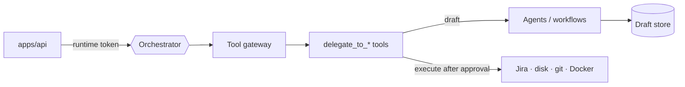

# AURA Agent Runtime

Mastra server with every AURA agent, workflow and the tool gateway. Only `apps/api` may call it.
Mastra Studio: http://localhost:4111.

## How a run works

1. The **Orchestrator** chats with the user and calls a `delegate_to_*` tool in `draft` mode.
2. The agent or workflow returns structured JSON. It is stored in the **draft store**.
3. The Orchestrator pauses with `ask_user`. The API turns this into an approval request.
4. **Revise** creates a new draft version. **Approve** runs the tool's execute mode: plain code
   writes to Jira, disk or git, with a provenance stamp.

Agents hold no write tools (except the coding agents inside the Task worktree). The Orchestrator
cannot reach Jira or the filesystem directly.

## Layout (`src/mastra/`)

| Folder | Contents |
|---|---|
| `agents/` | Orchestrator, PO, BA, Architect, Dev, QA, Tester, Deployer, council agents; `registry.ts` (versions, models) |
| `workflows/` | `architect-workflow`, `coding-council`, `qa-workflow`, `tester-workflow` |
| `tools/delegate-tools/` | One file per gate: draft / revise / execute |
| `gateway/` | Risk tiers, single-use approvals, loop guards, injection defense |
| `contracts/` | Zod schemas, prompts, Markdown and Jira renderers |
| `store/` | Draft store, token ledger, council notes, usage |
| `workspace/` | Per-Epic architecture, dev (worktrees) and QA workspaces |
| `git/` | `GitProvider` interface and `local` provider |
| `terminal/` | Web terminal server, tickets, PTY, restricted mode |
| `server/` | Custom HTTP routes, runtime auth, metrics |
| `config/` | `AURA_MODE`, models, dashboard settings from the request context |
| `lib/` | Docker exec, sandbox checks, metrics, structured-output helper |
| `evals/` | Eval suites, scoring, baseline test |

## Commands

| Command | Does |
|---|---|
| `pnpm --filter agent-runtime dev` | Run (or `make runtime`) |
| `pnpm --filter agent-runtime test` | Unit tests |
| `pnpm --filter agent-runtime eval` | Evals (uses model quota) |

The Groq patch in `patches/` needs a full restart, not a hot reload. Setup: [SETUP.md](../../SETUP.md).
