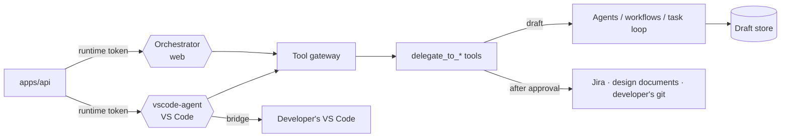

# AURA Agent Runtime

Mastra server with every AURA agent, workflow and the tool gateway. Only `apps/api` may call it.
Mastra Studio: http://localhost:4111.

## How a run works

1. The **Orchestrator** (web) or the **vscode-agent** (VS Code) calls a `delegate_to_*` tool in a
   low-risk mode (`draft`, `revise`, `status`).
2. The agent, workflow or code returns structured JSON, stored in the **draft store**.
3. The agent pauses with `ask_user`. The API turns this into an approval request.
4. **Revise** creates a new draft version. **Approve** lets the medium-risk mode run once: plain
   code writes to Jira, design documents or the developer's git, with provenance.

Drafting agents hold no write tools. The vscode-agent's coders edit files only in the developer's
workspace, through the bridge and the developer's permission rules.

## Layout (`src/mastra/`)

| Folder | Contents |
|---|---|
| `agents/` | Orchestrator, PO, BA, Architect, QA, Deployer, vscode-agent, coders, Evaluator; legacy Dev, Tester and council agents; `registry.ts` (versions, models) |
| `task/` | VS Code Task loop: router, plan split, coder ↔ Evaluator rounds, git operations, merge step, pull request |
| `bridge/` | Bridge client, filesystem and sandbox: a Mastra `Workspace` on the developer's VS Code |
| `workflows/` | `architect-workflow`, `qa-workflow`; legacy `coding-council`, `tester-workflow` |
| `tools/` | `delegate-tools/` (web gates), `task-tools.ts` (VS Code Gates 4–6); legacy `file-tools.ts`, `council-tools.ts` |
| `skills/` | AURA's skill library for the vscode-agent and coders |
| `gateway/` | Risk tiers, single-use approvals, loop guards, injection defense |
| `contracts/` | Zod schemas, prompts, Markdown and Jira renderers |
| `store/` | Runtime database, draft store, token ledger, usage |
| `config/` | `AURA_MODE`, models, dashboard settings from the request context |
| `mcp/` | Jira MCP client used by the delegate tools |
| `lib/` | API client helpers, metrics, structured-output helper; legacy Docker exec and sandbox checks |
| `server/` | Custom HTTP routes, runtime auth, metrics |
| `evals/` | Eval suites, scoring, baseline test |
| Legacy, removed in V7 | `workspace/` (server worktrees), `terminal/` (web terminal), `git/` (unused `GitProvider`) |

## Commands

| Command | Does |
|---|---|
| `pnpm --filter agent-runtime dev` | Run (or `make runtime`) |
| `pnpm --filter agent-runtime test` | Unit tests |
| `pnpm --filter agent-runtime eval` | Evals (uses model quota) |

The Groq patch in `patches/` needs a full restart, not a hot reload. Setup: [SETUP.md](../../SETUP.md).
