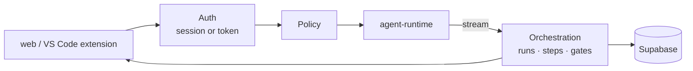

# AURA API

Express + TypeScript. Owns authentication, policy, approvals, the run record and the audit log.
It is the only service that calls `apps/agent-runtime`.

## Layout

| Path | Contents |
|---|---|
| `src/app.ts` · `src/index.ts` | App factory and bootstrap |
| `src/middleware/` | Auth, request id, rate limits, errors |
| `src/modules/policy/` | Role → agent grants and gate approver roles (data) |
| `src/modules/orchestration/` | Turns the runtime stream into runs, steps and approval requests |
| `src/modules/approvals/` | Inbox, decide, resume |
| `src/modules/audit/` | Append-only writer, explorer, export |
| `src/modules/identity/` | `/me`, users, access tokens, git identity |
| `src/modules/projects/` | Projects and repositories (admin) |
| `src/modules/terminal/` | Web terminal tickets |
| `src/modules/*` | `threads`, `runs`, `agents`, `jira`, `council`, `dashboard`, workspaces, `runners`, `health` |
| `src/modules/settings/` | Settings registry, resolution, API |
| `src/modules/bridge/` | VS Code bridge: hub, tickets, WebSocket, internal call route |
| `src/modules/orchestration/turn-jobs.ts` | Turn queue (pg-boss), heartbeat, stale-run sweep |
| `supabase/migrations/` | SQL migrations `0001`–`0011` |

## Routes

| Mount | Who | Purpose |
|---|---|---|
| `/health` | Anyone | API and runtime liveness |
| `/me` | Signed in | Profile, grants, access tokens, git identity |
| `/users` · `/projects` | Admin | Users, projects and repositories |
| `/bridge` | Developer | `POST /bridge/tickets` (WebSocket ticket), `GET /bridge/status`; WebSocket at `/bridge?ticket=` |
| `/internal/bridge/calls` | Runtime token | The runtime's file and command calls, forwarded to the developer's VS Code |
| `/settings` | Signed in (shared values: admin) | Settings registry, effective values, global/project/user values |
| `/threads` | Run grant | Conversations; `POST /threads/:id/messages` streams a turn (SSE) |
| `/approvals` | Approver role | Inbox; `POST /approvals/:id/decide` streams the continuation (SSE) |
| `/runs` | Requester, approver, admin | Runs and step timeline; `GET /runs/:id/events?after=` replays and follows a run's events (SSE); `POST /runs/:id/stop` stops the requester's running turn; `POST /runs/:id/notes` adds a note to a running Task |
| `/audit` | Admin | Audit explorer and export |
| `/dashboard` | Signed in | Summary, agent quality, token usage |
| `/agents` · `/jira` · `/council` · `/terminal` · `/runners` | Per grant | Registry, Jira reads, council notes, terminal tickets, runners |
| `/design-docs` | Every pipeline role reads; Architect and QA edit their kinds | Design documents per Epic, versioned (`GET /epics`, `GET /`, `GET /:id`, `GET /:id/versions/:n`, `POST /`, `PUT /:id` with `baseVersion`) |
| `/internal/design-docs` | Runtime token | Agents save approved documents and the VS Code agent reads them |
| `/workspace` · `/dev-workspace` · `/qa-workspace` · `/test-runs` · `/docker` | Per grant | Workspace files on the server; no web page uses them since V3, removed in V7 |

SSE events: `run`, `text`, `tool`, `progress`, `council`, `gate`, `decision`, `error`, `done`.

## Security

| Control | Detail |
|---|---|
| Auth | Supabase token or `aura_pat_…`; both resolve to the same role checks |
| Policy | Grants are data in `modules/policy/policy.ts`; admins cannot decide gates |
| Input | Strict Zod schemas; 256 KB JSON limit |
| Abuse | Rate limits per IP, per user and per agent turn; `RUN_TURN_TIMEOUT_MS` per turn |
| Transport | Helmet, CORS limited to `WEB_ORIGIN` |
| Data | RLS on; `audit_logs` append-only |

## Run

See [SETUP.md](../../SETUP.md). Quick: `make api` (port 4000).
