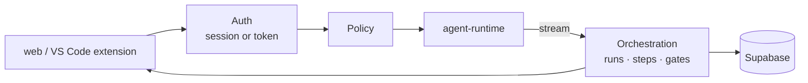
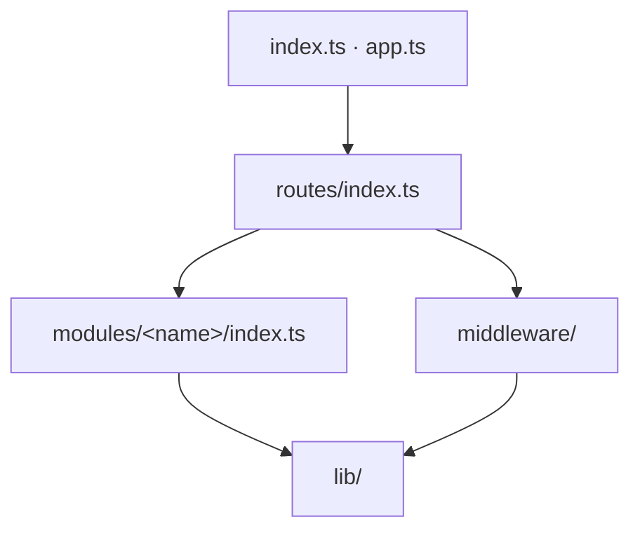

# AURA API

Express + TypeScript. Owns authentication, policy, approvals, the run record and the audit log.
It is the only service that calls `apps/agent-runtime`.

## Layout

The API is a modular monolith. Each module exposes a public `index.ts`; `routes/`, the bootstrap
and other modules import a module only through that file. `src/architecture.test.ts` enforces it.

| Path | Contents |
|---|---|
| `src/index.ts` · `src/app.ts` | Bootstrap (server, bridge WebSocket, turn queue) and app factory |
| `src/routes/index.ts` | `apiRouter` (public, then signed-in mounts) and `internalRouter` (runtime token) |
| `src/middleware/` | `requireAuth`, `requireRuntime`, request id, rate limits, error handler |
| `src/lib/` | Shared infrastructure: `auth/` (roles, JWT, `currentUser`, `requireRole`, `requireAccess`), `http/` (errors, validation, schemas, SSE, bearer, rate limit), `db`, `hash`, `json`, `ttl-cache`, `web-url`, `supabase`, `logger` |
| `src/config/env.ts` | Environment parsing |
| `supabase/migrations/` | SQL migrations `0001`–`0012` |
| `scripts/` | `bootstrap-admin`, `import-design-docs` |

Files in a module follow one pattern:

| File | Role |
|---|---|
| `<name>.router.ts` | Express routes: parse input, check access, call the service, audit |
| `<name>.internal.router.ts` | Routes mounted under `/internal` for the runtime |
| `<name>.service.ts` | Business logic |
| `<name>.repository.ts` | Supabase queries for the module's own tables |
| `<name>.schemas.ts` | Zod request schemas |
| `<name>.types.ts` | Row and view types, row → view mappers |
| `index.ts` | The module's public surface |

| Module | Owns |
|---|---|
| `policy` | Role → agent grants, gate approver roles, every access check |
| `identity` | Profiles, `/me`, users, access tokens, sessions, VS Code device sign-in |
| `audit` | Append-only writer, explorer, CSV/JSON export |
| `runtime` | HTTP client and stream parsing for `apps/agent-runtime` |
| `agents` | Agent registry filtered by role |
| `threads` | Conversations, sending a message |
| `runs` | Runs, steps, notes, visibility |
| `approvals` | Inbox, decide, expiry |
| `orchestration` | Turns the runtime stream into runs, steps, events and approvals; turn queue (pg-boss); stop |
| `bridge` | VS Code bridge: hub, tickets, WebSocket, forwarded tool calls |
| `projects` | Projects and repositories |
| `settings` | Settings registry, resolution, values |
| `design-docs` | Versioned design documents per Epic |
| `task-prs` | Each Task's pull request and CI result; CI reports via GitHub OIDC |
| `notifications` | Per-user notifications |
| `jira` | Jira reads, transitions, comments |
| `dashboard` | Summary, agent quality, token usage |
| `health` | API and runtime liveness |

## Routes

| Mount | Who | Routes |
|---|---|---|
| `/health` | Anyone | `GET /`, `GET /runtime` |
| `/auth/device` | Anyone | `POST /start`, `POST /token` (VS Code device sign-in, RFC 8628) |
| `/ci` | GitHub Actions OIDC token (audience `AURA_CI_AUDIENCE`) | `POST /report`: `aura-ci.yml` reports CI for a branch of a registered repository |
| `/me` | Signed in | `GET /` (profile, grants), `GET /tokens`, `POST /tokens`, `DELETE /tokens/:id` |
| `/users` | Admin | `GET /`, `POST /`, `PATCH /:id/role`, `DELETE /:id` |
| `/projects` | Signed in reads; admin writes | `GET /`, `POST /`, `DELETE /:id`, `PUT /:id/repository`, `DELETE /:id/repository` |
| `/design-docs` | Every pipeline role reads; Architect and QA edit their kinds | `GET /epics`, `GET /`, `GET /:id`, `GET /:id/versions/:version`, `POST /`, `PUT /:id` (with `baseVersion`) |
| `/task-prs` | QA workspace audience | `GET /?epicKey=&taskKey=` |
| `/notifications` | Signed in | `GET /`, `POST /read` (`ids`, or none for all) |
| `/settings` | Signed in; shared values admin | `GET /definitions`, `GET /effective`, `GET /mine`, `GET /` (admin), `PUT /:key`, `DELETE /:key` |
| `/bridge` | Developer | `POST /tickets`, `GET /status`; WebSocket at `/bridge?ticket=` |
| `/device` | Developer | `GET /:userCode`, `POST /approve`, `POST /deny` |
| `/agents` | Per grant | `GET /`, `GET /:agentId` |
| `/threads` | Per grant | `GET /`, `POST /`, `GET /:threadId/messages`, `POST /:threadId/messages` (SSE), `PATCH /:threadId`, `DELETE /:threadId` |
| `/runs` | Requester, approver, admin | `GET /`, `GET /:id`, `GET /:id/events?after=` (SSE), `POST /:id/stop`, `POST /:id/notes` |
| `/approvals` | Approver role | `GET /`, `GET /:id`, `POST /:id/decide` (SSE) |
| `/audit` | Admin | `GET /`, `GET /export` |
| `/dashboard` | Signed in; quality and usage admin | `GET /summary`, `GET /agent-quality`, `GET /token-usage` |
| `/jira` | Per grant | `GET /status`, `GET /epics`, `GET /epics/:epicKey`, `GET /issues/:key`, `GET` · `POST /issues/:key/transitions`, `GET` · `POST /issues/:key/comments` |
| `/internal/bridge` | Runtime token | `POST /calls`: file and command calls forwarded to the developer's VS Code |
| `/internal/runs` | Runtime token | `GET /:id/notes`: take a running Task's undelivered notes |
| `/internal/design-docs` | Runtime token | `POST /` (save an approved document), `GET /`, `GET /:id?version=` |
| `/internal/task-prs` | Runtime token | `POST /` (Gate 6 records its PR), `GET /:taskKey` |

SSE events: `run`, `text`, `tool`, `progress`, `gate`, `decision`, `error`, `done`.

## Security

| Control | Detail |
|---|---|
| Auth | Supabase token or `aura_pat_…`; both resolve to the same role checks |
| Policy | Every access rule is code in `modules/policy/policy.ts`; admins cannot decide gates |
| Input | Strict Zod schemas; 256 KB JSON limit (8 MB under `/internal`) |
| Abuse | Rate limits per IP, per user and per agent turn; at most 5 active turns per user; `RUN_TURN_TIMEOUT_MS` per turn |
| CI | Reports are accepted only for the repository named in the OIDC token and registered to a project |
| Transport | Helmet, CORS limited to `WEB_ORIGIN` |
| Data | RLS on; `audit_logs` append-only |

## Test

`pnpm --filter api test` runs the Vitest suites colocated as `*.test.ts`, including
`src/architecture.test.ts`, which fails on a deep cross-module import or on `lib/` importing a module.

## Run

See [SETUP.md](../../SETUP.md). Quick: `make api` (port 4000).
