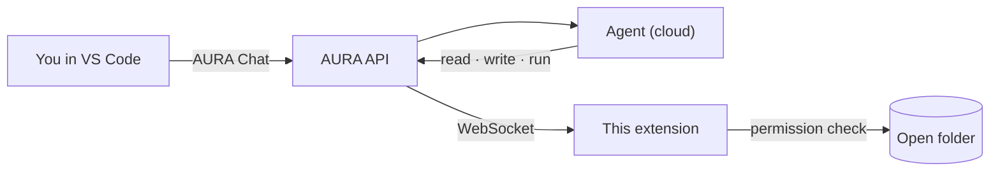

# AURA for VS Code

The developer's client for AURA ([ADR-4](../../docs/adr/0004-vscode-developer-workspace.md)).
Agents run in the AURA cloud; every file they read or change and every command they run happens
**on your machine, inside the open folder**, and every change asks you first.

**Status: V1**: browser sign-in, the **AURA** sidebar (Tasks: Epic → Stories and Tasks; Chat
with the agent, streamed, tool calls inline, resumes after a reload), **Start Work on Task**,
**Stop** / **Resume** / **Open Run in Web**, **Connect Repository** and **Initialize Project**.
**V2**: permission modes, project rules and hooks, background processes, project memory and skills. Specialist agents, branches and PRs come in V2–V6
([plan](../../docs/plans/aura-vscode-agents.md)).



## Try it

```bash
pnpm install
pnpm --filter aura-vscode build            # → apps/vscode/dist/extension.cjs
code --extensionDevelopmentPath="$PWD/apps/vscode" /path/to/your/project
```

In that window:

1. **AURA: Sign In** opens the browser; approve the code shown (developers only). **AURA: Sign In
   with a Token** still accepts a pasted access token.
2. **AURA: Connect Repository** (existing repo) or **AURA: Initialize Project** (empty folder:
   scaffold, `main` + `development`, CI, `.aura/`).
3. In the **AURA** sidebar, pick a Task → **Start Work**, or type in **Chat**. Every file change
   and command asks you first; the **AURA** output channel logs them.
4. **Stop** (the button, **Esc** in the chat, the status bar or **AURA: Stop**) kills the running
   command and ends the turn. **AURA: Resume** continues it. **AURA: Open Run in Web** shows the
   run's steps and approvals in the web app.

Set `aura.apiUrl` in Settings if the API isn't at `http://localhost:4000`, and `aura.webUrl` if
the web app isn't where you last signed in. The runtime needs
`AURA_API_URL` pointing at the same API.

## What the agent may do

| Request | Behaviour |
|---|---|
| Read, list, search, stat files | Allowed |
| `git status/diff/log`, `ls`, `npm test`, `npm run lint/typecheck/build` | Allowed |
| Write, move, delete files; any other command; starting a background process | **Asks you**: Allow once · Allow for this session · Allow for this project · Deny |
| Chained or redirected commands (`&&`, `;`, `\|`, `>`, `$(...)`) | Always asks |
| Force push, `sudo`, `curl … \| sh`, deleting outside the folder, reading `~/.ssh`, `~/.aws`… | **Always refused** |
| Any path outside the open folder (including through symlinks) | **Always refused** |

### Modes

The status bar shows the mode; click it (or **AURA: Set Permission Mode**) to change it. An admin
can limit the modes per project (Admin → Settings → *VS Code permission modes*).

| Mode | File changes | Commands |
|---|---|---|
| Plan | Refused | Only the read-only commands and checks above |
| Default | Ask | Ask unless allowed |
| Accept edits | Allowed in this folder | Ask unless allowed |

### Project rules and hooks

`.aura/settings.json` is shared with the team; `.aura/settings.local.json` is yours (git-ignored;
**Allow for this project** writes there). Deny beats ask beats allow; the built-in refusals above
always win.

```json
{
  "defaultMode": "default",
  "permissions": {
    "allow": ["Bash(npm run e2e:*)", "Edit(docs/**)"],
    "ask": ["Edit(package.json)"],
    "deny": ["Read(**/.env)"]
  },
  "hooks": {
    "afterEdit": ["npx prettier --write {file}"],
    "beforeCommit": ["npm run lint"]
  }
}
```

`.aura/AURA.md` is the project memory every agent turn starts with (like `CLAUDE.md`), and
`.aura/skills/<name>/SKILL.md` adds a skill the agent can load next to AURA's own.

The agent also reads the Task's Epic design documents (architecture plan, ADRs, SRS, test plan
and scenarios) from AURA with its `design_docs` tool. It never changes them; the Architect and QA
edit them on the web.

Commands run through your shell in the folder, with secrets (tokens, keys, passwords) removed
from their environment. Output is capped at 30,000 characters.

## Layout

| File | Contents |
|---|---|
| `src/extension.ts` | VS Code commands, status bar, prompts |
| `src/chat/` | Chat panel: conversation per Task, streaming, Stop / Resume |
| `src/tasks-tree.ts`, `src/project*.ts`, `src/session.ts` | Tasks view, Connect / Initialize, sign-in |
| `src/bridge-client.ts` | WebSocket to the API: tickets, reconnect, permission → run → result |
| `src/permissions.ts` | Modes, built-in and project allow / ask / deny rules |
| `src/project-settings.ts`, `src/governance.ts` | `.aura/settings*.json`, modes allowed by the admin |
| `src/hooks.ts` | `afterEdit` and `beforeCommit` hooks |
| `src/executor.ts` | File operations, search, commands and background processes inside the folder |

Protocol: [`packages/aura-bridge`](../../packages/aura-bridge/src/index.ts).
