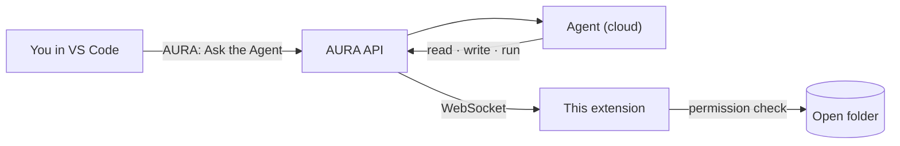

# AURA for VS Code

The developer's client for AURA ([ADR-4](../../docs/adr/0004-vscode-developer-workspace.md)).
Agents run in the AURA cloud; every file they read or change and every command they run happens
**on your machine, inside the open folder**, and every change asks you first.

**Status: V0** — sign in, connect, and ask the VS Code agent to work in the open folder.
The Tasks view, chat panel and the full flow come in V1–V6
([plan](../../docs/plans/aura-vscode-agents.md)).



## Try it

```bash
pnpm install
pnpm --filter aura-vscode build            # → apps/vscode/dist/extension.cjs
code --extensionDevelopmentPath="$PWD/apps/vscode" /path/to/your/project
```

In that window:

1. **AURA: Sign In**: paste an access token from the web app (Profile → Access tokens). Developers only.
2. The status bar shows **AURA** connected. **AURA: Connect** / **AURA: Disconnect** toggle it.
3. **AURA: Ask the Agent**: the answer and every action appear in the **AURA** output channel.

Set `aura.apiUrl` in Settings if the API isn't at `http://localhost:4000`. The runtime needs
`AURA_API_URL` pointing at the same API.

## What the agent may do

| Request | Behaviour |
|---|---|
| Read, list, stat files | Allowed |
| `git status/diff/log`, `ls`, `npm test`, `npm run lint/typecheck/build` | Allowed |
| Write, move, delete files; any other command | **Asks you**: Allow once · Allow for this session · Deny |
| Chained or redirected commands (`&&`, `;`, `\|`, `>`, `$(...)`) | Always asks |
| Force push, `sudo`, `curl … \| sh`, deleting outside the folder, reading `~/.ssh`, `~/.aws`… | **Always refused** |
| Any path outside the open folder (including through symlinks) | **Always refused** |

Commands run through your shell in the folder, with secrets (tokens, keys, passwords) removed
from their environment. Output is capped at 30,000 characters.

## Layout

| File | Contents |
|---|---|
| `src/extension.ts` | VS Code commands, status bar, prompts |
| `src/bridge-client.ts` | WebSocket to the API: tickets, reconnect, permission → run → result |
| `src/permissions.ts` | Allow / ask / deny rules |
| `src/executor.ts` | File operations and commands inside the folder |

Protocol: [`packages/aura-bridge`](../../packages/aura-bridge/src/index.ts).
