# AURA — Enterprise AI Agent Orchestration Platform

> **Status:** Draft v0.2, reconciled with the Phase 1/2 implementation
> **Owner:** Platform Architecture
> **Last updated:** 2026-09-21

---

## 0. Project name

**AURA** — AI Unified Resource & Automation, by Dialog.

AURA is a platform that sits above its agents (Orchestrator, PO, BA, Architect, Developer, QA, Tester, Deployer), not one more bot among them. The name has room to grow beyond software delivery if AURA is extended to other workflows later.

Package/CLI namespace: `@aura/agents`, `aura run`, `AURA-1234` as a Jira issue prefix.

> Run a trademark and domain check in every operating region before committing to the name externally.

---

## 1. Executive summary

AURA is an **enterprise AI agent orchestration and software-delivery platform**. It coordinates specialised AI agents (Project Owner, BA, Architect, Developer, QA, Tester, Deployer) across the software development lifecycle, uses **Jira as the single system of record for work**, enforces **role- and project-based access control outside the LLM**, gates every consequential action behind **human approval**, and maintains **complete provenance** from business requirement to production deployment.

### The five non-negotiable principles

1. **Agents propose; deterministic systems decide.** Authorization, risk classification, state transitions, test execution, and audit are never delegated to a prompt.
2. **Jira is the work state machine.** Agents are triggered by Jira status transitions and write back to Jira. AURA never becomes a second project-management system.
3. **Human-in-the-loop is a workflow primitive, not a UI feature.** Every agent stage ends in a durable `SUSPENDED_FOR_APPROVAL` state; nothing continues without a recorded human decision.
4. **Every tool call is authorized, validated, bounded, and logged.** The LLM cannot call anything the policy engine hasn't granted for *this user, this project, this agent version, this run*.
5. **Evidence over assertion.** An agent may never claim a test passed, a deployment succeeded, or a requirement is met without a machine-generated artifact backing the claim.

---

## 2. What changed from the previous design (and why)

| Previous decision | AURA decision | Reason |
|---|---|---|
| Agents chained via orchestrator calls | **Event-driven**: Jira webhooks → event bus → durable workflow | Removes tight coupling; Jira remains the trigger; runs are resumable and idempotent |
| Approval "column" in Jira only | Approval is **both** a Jira transition **and** an AURA `approval_requests` record with a hashed content snapshot and timestamp | Jira alone cannot record *what* was approved (the exact agent output snapshot) |
| RBAC described as a list | **Policy engine** (deterministic, testable) that evaluates `user × project × agent × tool × risk tier × environment` | Single source of authorization truth; unit-testable; auditable |
| Single API process running everything | API and **Agent Runtime split into separate services** on a shared queue | LLM work is long-running and bursty; must not block or crash the API; can be scaled and cost-capped independently |
| Express vs Go left partially open | **TypeScript everywhere**; Go reserved for a future optional sandbox-runner | Shared types across web/API/agents; Mastra is TS-native; no proven need for Go yet |
| Generic "guardrails" | **Explicit loop guards, cost budgets, prompt-injection boundary, and per-agent eval suites** | Concrete, enforceable mitigations for the cascading-hallucination risk |
| Single-tenant assumption | **Multi-tenant, multi-region** from day one: org → region → project | Multinational deployment: data residency, SSO federation, regional LLM routing |
| Orchestrator as a deterministic `jira_status → agent` lookup table (v0.1) | **Orchestrator is an agent** that decides the sequence dynamically; determinism moves to its tools (structured drafts, filing in code, approval flag) and to the API policy (who may run, who may answer) | Decided during Phase 1 (2026-09-17): the value of the Orchestrator is judgement about what to do next; the risk of a model deciding is contained by giving it no way to act except through validated tools and human gates |

---

## 3. Platform architecture

### 3.0 System at a glance (simplified)

The full layered/authorization/gate diagrams below are precise but dense. This is the short version: what talks to what, and which parts are a model versus deterministic code.

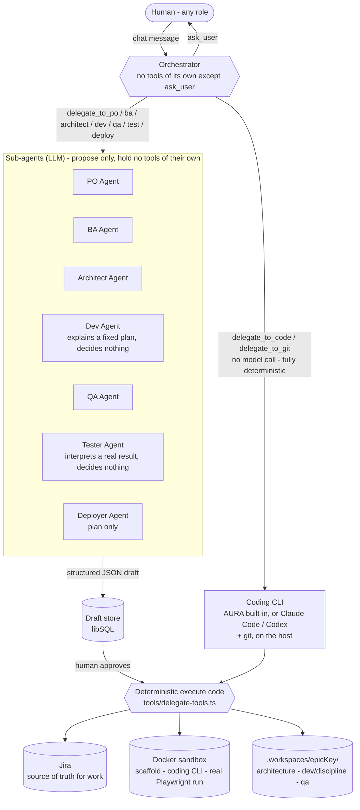

Every gate (1 through 8, section 5.1) is the same shape: a sub-agent proposes structured content (or, for Dev/Code/Git, code decides the action entirely and the agent only narrates it), a human approves or rejects, and only approved content ever reaches Jira, Docker, or disk.

### 3.1 Layered view

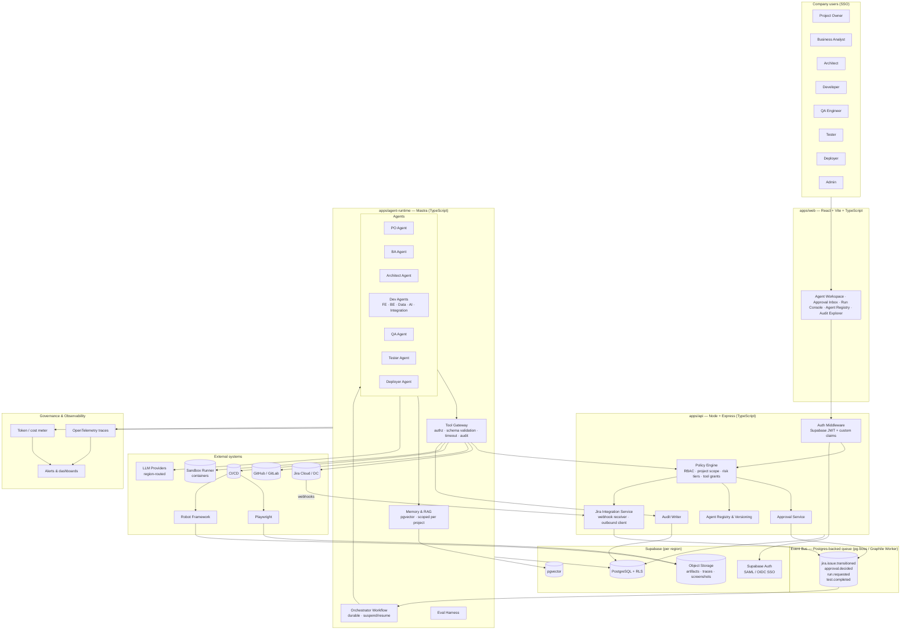

### 3.2 Service responsibilities

| Service | Owns | Does **not** own |
|---|---|---|
| `apps/web` | UX for humans: approval inbox, run console, proposed-output viewer, registry admin | Any authorization logic (display-only) |
| `apps/api` | AuthN/AuthZ, policy, approvals, Jira webhook ingestion, registry, audit, REST API | LLM calls, long-running work |
| `apps/agent-runtime` | Mastra workflows/agents, tool gateway, memory/RAG, evals | User authentication, direct DB writes to governance tables (goes through API/queue) |
| Event bus | Durable, at-least-once delivery between API and runtime | Business logic |
| Supabase | Identity (SSO), Postgres, RLS, vectors, artifact storage | Application logic |
| Jira | Work items, statuses, assignments, comments — **the source of truth for work** | Agent state, approvals' content snapshots, audit |

### 3.3 Why TypeScript / Express, and where Go might still appear

The whole stack — React, Vite, Mastra, Supabase clients — is TypeScript. Express keeps one language, one type system, one validation layer (Zod schemas shared across web, API, and agent tools). Fastify or NestJS are equally acceptable if the team prefers; the architecture does not depend on the HTTP framework.

Go is **not** in the initial build. The one place it may be justified later is the **Sandbox Runner** (isolated container execution for Dev-agent code and test runs), where a small, static binary with tight resource control is attractive. Introduce it only with a measured need.

---

## 4. Authorization model

### 4.1 Entities

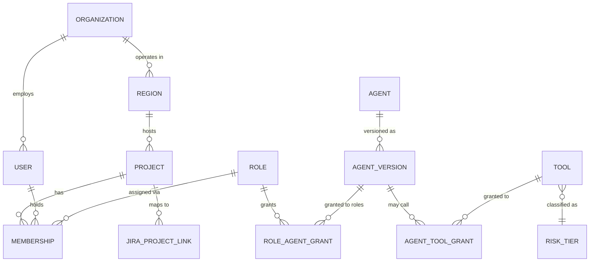

### 4.2 Roles → agents (default grants)

| Role | Agents accessible | Notes |
|---|---|---|
| Project Owner | PO, BA (read), Orchestrator dashboard | Approves Epics |
| Business Analyst | BA, PO (read) | Approves Stories / AC / DoD |
| Architect | Architect, BA (read), Dev (read) | Approves architecture tasks & ADRs |
| Developer | Dev sub-agents scoped to their discipline (FE/BE/Data/AI/Integration), Architect (read) | Reviews & merges PRs |
| QA Engineer | QA, Tester, Dev (read) | Approves test plans; verifies results |
| Tester | Tester | Executes/curates suites |
| Deployer | Deployer, QA (read) | Approves releases; cannot approve own high-risk deploy (four-eyes) |
| Admin | Registry, Policy, all agents (read) | Cannot bypass approval gates |

Grants are **data**, not code, and are editable per organization/project through the Registry UI with full audit.

### 4.3 Authorization flow (every request, every tool call)

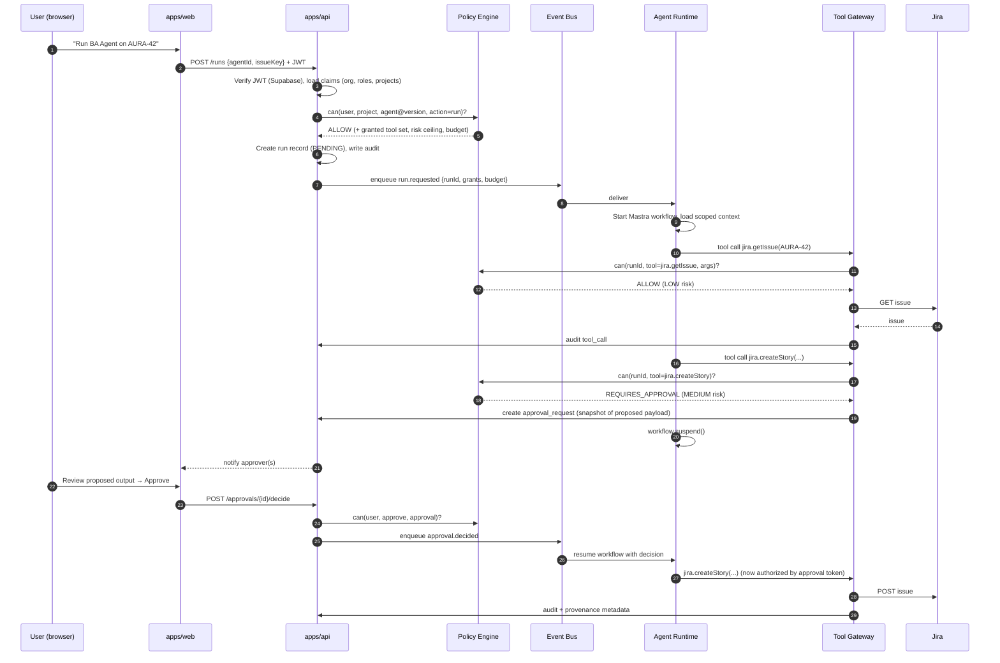

Key properties:

- The **runtime never holds user credentials**. It receives a signed grant bundle for a single run.
- Tool arguments are **schema-validated** (Zod) *before* the policy check; the LLM cannot smuggle extra fields.
- Approval tokens are **single-use and bound to a payload hash**. If the agent changes the payload after approval, the tool call fails.

### 4.4 Risk tiers

| Tier | Behaviour | Examples |
|---|---|---|
| 🟢 LOW | Auto-execute, logged | Read Jira/Git/docs, analyse, draft documents, generate test *cases*, run tests in an ephemeral sandbox |
| 🟡 MEDIUM | Prepare → human approval → execute | Create/modify Jira issues, open PRs, add migrations to a PR, run suites against a shared QA env |
| 🔴 HIGH | Human approval **plus** four-eyes (approver ≠ requester), plus optional change window | Production deploy, destructive DB ops, secret/config changes, merges to protected branches, external communications |
| ⛔ FORBIDDEN | Not callable by any agent | Delete projects, modify policy/grants, alter audit logs, read secret values |

Tiers are attached to **tools**, optionally overridden per environment (a `deploy` tool is MEDIUM in `dev`, HIGH in `prod`).

---

## 5. Human-in-the-loop workflow

### 5.1 Lifecycle with gates

This diagram now matches the gate numbering actually built (section 6.4/6.5 and the QA/Tester/Deployer additions below) - an earlier version of this diagram numbered QA/Tester/Deployer as Gates 5/6/7 and Dev as Gate 4 "code review & merge"; the real Gate 4/5 split (scaffold, then a separate coding step) came first, so QA/Tester/Deployer are Gates 6/7/8 to avoid clashing with what already shipped.

```mermaid
flowchart TD
    REQ([Business requirement from PO]) --> PO_A[PO Agent<br/>drafts Epic: objective, scope, stakeholders, priority]
    PO_A --> G1{{Gate 1<br/>Human PO approves Epic}}
    G1 -- reject --> PO_A
    G1 -- approve --> J1[(Jira: Epic created)]

    J1 --> BA_A[BA Agent<br/>Stories · AC · DoD · NFRs · risks]
    BA_A --> G2{{Gate 2<br/>Human BA approves Stories}}
    G2 -- reject --> BA_A
    G2 -- approve --> J2[(Jira: Stories created)]

    J2 --> AR_A[Architect Agent<br/>decomposition · API · data · security · ADRs · architecture Tasks]
    AR_A --> G3{{Gate 3<br/>Human Architect approves design}}
    G3 -- reject --> AR_A
    G3 -- approve --> J3[(Jira: architecture Tasks filed<br/>.workspaces/epicKey/architecture/)]

    J3 --> DEV_A[Dev Agent<br/>fixed scaffold command per discipline - Frontend/Backend only]
    DEV_A --> G4{{Gate 4<br/>Human Developer approves scaffold}}
    G4 -- reject --> DEV_A
    G4 -- approve --> SCAFFOLD[Real Docker run<br/>.workspaces/epicKey/dev/discipline/]

    SCAFFOLD --> CODE_A[Coding Agent<br/>AURA built-in, or Claude Code / Codex]
    CODE_A --> G5{{Gate 5<br/>Human Developer approves the prompt}}
    G5 -- reject --> CODE_A
    G5 -- approve --> IMPL[Real code written<br/>Task → In Review<br/>no git branch/PR automation yet - a human commits by hand]

    IMPL --> QA_A[QA Agent<br/>test plan + real Playwright source, from the Epic's Stories]
    QA_A --> G6{{Gate 6<br/>Human QA approves the test plan}}
    G6 -- reject --> QA_A
    G6 -- approve --> FILEDQA[(.workspaces/epicKey/qa/<br/>test-plan.md + .spec.ts files)]

    FILEDQA --> TS_A[Tester Agent<br/>starts the app for real, runs the real suite in Docker, interprets only]
    TS_A --> G7{{Gate 7<br/>Human approves running the suite}}
    G7 -- reject --> TS_A
    G7 -- approve --> RESULT[Real pass/fail/skipped counts<br/>Task commented; moves on only if failed = 0]

    RESULT --> DP_A[Deployer Agent<br/>release notes · change plan · rollback plan - plan only]
    DP_A --> G8{{Gate 8<br/>Human Deployer approves the plan}}
    G8 -- reject --> DP_A
    G8 -- approve --> PLAN[(Epic commented with the plan<br/>a human executes the release by hand - no real deploy pipeline exists)]

    style G1 fill:#fde68a,stroke:#b45309
    style G2 fill:#fde68a,stroke:#b45309
    style G3 fill:#fde68a,stroke:#b45309
    style G4 fill:#fde68a,stroke:#b45309
    style G5 fill:#fde68a,stroke:#b45309
    style G6 fill:#fde68a,stroke:#b45309
    style G7 fill:#fde68a,stroke:#b45309
    style G8 fill:#fca5a5,stroke:#b91c1c
```

**Gates vs. continuation prompts.** Not every human pause above is a numbered Gate - the Orchestrator's own clarifying questions (e.g. "which Epic(s)?", "which backend framework?") are `ask_user` calls with no gate number. **Corrected (2026-09-21):** the Orchestrator used to also auto-offer "Continue to the next gate?" after every approval - removed, because it meant BA/Architect/Dev/etc. always ran as an unrequested follow-up instead of only when a human actually asked for that stage. Each gate now reports its result and stops; the next gate starts only when the human's next message asks for it. A gate decision and a plain clarifying question still share the same `approval_requests` record and role-routing (section 4.3) and the same display distinction: a gate decision gets a gate number and name (`AGENT_GATE_INFO` in `policy.ts`), a clarifying question doesn't.

**Approver-role precondition.** A role in section 4.2 needs at least one active account *before* its gate can be decided. If nobody holds that role, `resolveApprover` still creates the approval correctly, but it sits undecidable until someone is granted the role or the SLA timer expires it (section 10). Check this when enabling a new gate — the Registry UI should eventually warn "this role has zero members" at grant time, but doesn't yet.

### 5.2 Jira status machine (per issue type)

AURA installs a standard workflow in each linked Jira project. Agents are triggered **only** by transitions into `Ready for *` states; agents may move issues **only** into `* Review` states; humans own every `Approved`/`Ready for` transition.

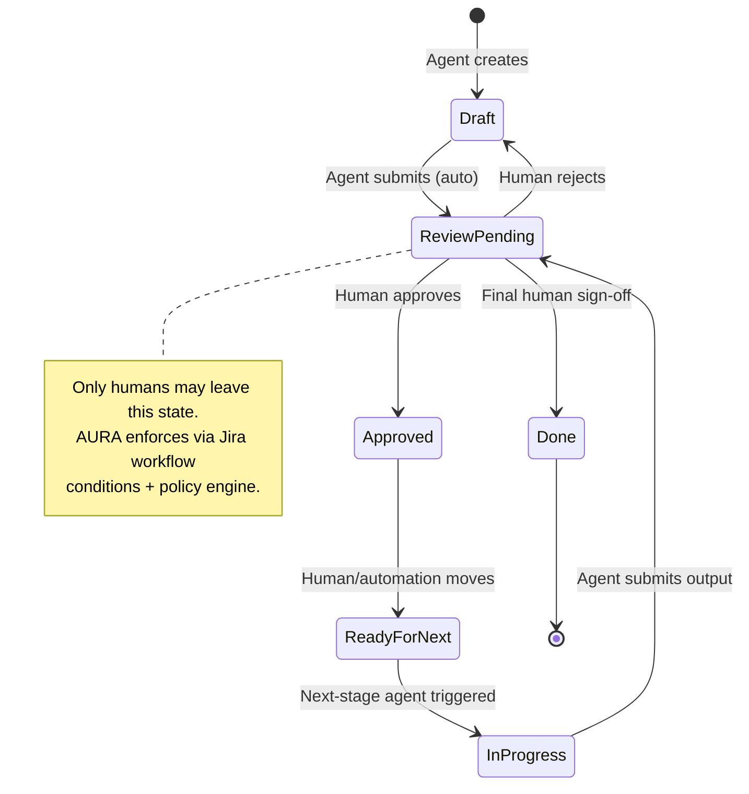

### 5.3 Agent run state machine (AURA-internal)

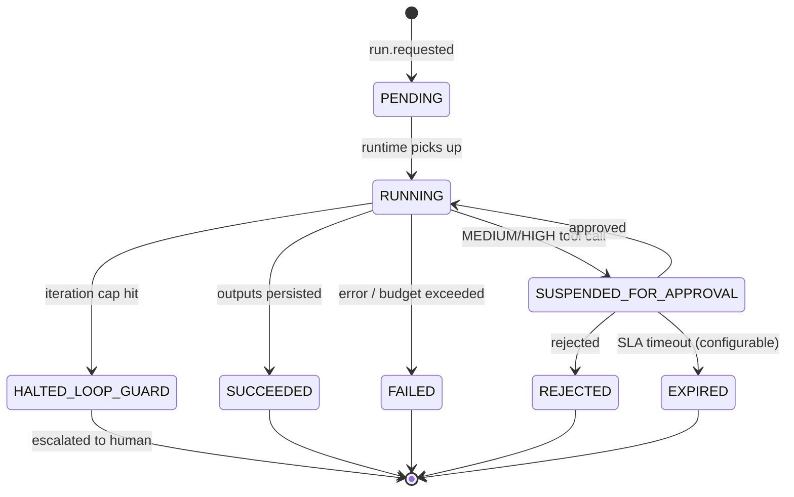

Every run stores: agent version, prompt version, model + version, tool versions, full input snapshot, full output snapshot, token/cost, trace ID, approver identities, and the Jira/Git artifacts it touched.

---

## 6. Agent layer

### 6.1 Agent contract (declarative, stored in the Registry)

Every agent is defined as data — not a free-text prompt — and versioned.

```yaml
id: architect
version: 2.3.1
status: ACTIVE            # DRAFT | CANARY | ACTIVE | DEPRECATED
owner: architecture-guild
purpose: Produce technical architecture from approved Jira stories
model:
  primary: { provider: anthropic, model: claude-sonnet-4-6, region: eu }
  fallback: { provider: openai, model: gpt-5-mini, region: eu }
prompt_ref: prompts/architect@14
inputs:
  - jira.story[status=Ready for Architecture]
  - repo.architecture_docs
  - project.nfrs
tools:
  allow: [jira.read, jira.createTask, jira.comment, git.read, docs.write, adr.create]
  deny:  [deploy.*, db.execute, secrets.*]
outputs:
  - architecture_document
  - adr[]
  - jira.task[]
approval:
  required_role: architect
  four_eyes: false
budget:
  max_tokens_per_run: 400000
  max_cost_usd_per_run: 6.00
  max_tool_calls: 60
  max_iterations: 12
evals:
  suite: evals/architect
  min_score_to_promote: 0.85
```

### 6.2 Agent catalogue

| Agent | Inputs | Produces | Gate |
|---|---|---|---|
| **Orchestrator** | Human brief, gate answers | Delegation choices, questions to humans (`ask_user`) | Every `ask_user` pause; the API decides which role answers |
| **PO** | Free-text requirement, stakeholder list | Epic draft with objective, scope, success metrics | Human PO |
| **BA** | Approved Epic | Stories, AC, DoD, BRD/FRD sections, process map (BPMN/Mermaid), risks, priority | Human BA |
| **Architect** | Approved Stories, existing architecture, NFRs | Decomposition, API/data/security/AI/integration/deployment design, ADRs, architecture tasks | Human Architect |
| **Dev** (Frontend, Backend/NestJS built; Spring Boot/Data/AI/Integration/Deployment not implemented) | Architecture task | Fixed scaffold command explanation; `execute` runs it in Docker | Human Developer, Gate 4 |
| **Coding Agent** (AURA built-in, or Claude Code/Codex) | Scaffolded Task | Real code written into the scaffold; no branch/PR automation yet | Human Developer, Gate 5 |
| **QA** | Epic's approved Stories | Test plan + real Playwright source (UI and API via its `request` fixture; Robot Framework out of scope) | Human QA, Gate 6 |
| **Tester** | A real Playwright JSON result (Gate 7 runs it for real first) | Interpretation only - never decides pass/fail itself | Human QA, Gate 7 |
| **Deployer** | Epic's filed Tasks | Release notes, change plan, rollback plan - plan only, no execute mode | Human Deployer, Gate 8 |
| **Git tool** (no model - fully deterministic) | A scaffolded Task's directory | init/branch/commit (gated) or status/diff (ungated, read-only) | Human Developer |

### 6.2a RACI reference across the Jira workflow (target, 2026-09-18)

The agent catalogue above says *what* each agent produces; this table says *who is primary at each stage* across the full lifecycle. 🟢 primary/owns · 🟡 supports/secondary · 🔵 advisory only · ⚪ not usually involved. **Corrected (2026-09-21):** the original version of this table had a generic "Team" column for undifferentiated human involvement - removed, because there is no generic "team" role in this system (`apps/api/src/modules/identity/roles.ts`'s `Role` enum has no such value). What that column was gesturing at is now two real, built roles with real agents: **QA** (`qa_engineer`, covering both the QA Agent's test-plan generation and the Tester Agent's real execution/interpretation - one column since `qa_engineer` is the sole approver of both, see the note below) and **Deployer** (`deployer`, Gate 8's release-plan agent). Estimation/Sprint Planning/Backlog Refinement (rows 9, 10, 16) still have no AURA agent for any role - they stay human-only, tracked in Jira directly.

| Jira workflow stage | PO | BA | Architect | Developer | QA | Deployer |
|---|---|---|---|---|---|---|
| 1. Business need | 🟢 Defines goal | 🟢 Investigates/clarifies | 🔵 Feasibility input | ⚪ | ⚪ | ⚪ |
| 2. Epic creation | 🟢 Owns Epic | 🟢 Helps scope | 🟡 Technical implications | 🟡 Feasibility | ⚪ | ⚪ |
| 3. Story creation | 🟢 Desired outcome | 🟢 Writes/refines stories | 🟡 Reviews implications | 🟡 Reviews feasibility | 🔵 Testability input | ⚪ |
| 4. Acceptance criteria | 🟢 Confirms expectation | 🟢 Defines AC | 🟡 Technical constraints | 🟡 Confirms implementability | 🟡 Testability review (drives Gate 6 scenarios) | ⚪ |
| 5. Business rules | 🟢 Defines intent | 🟢 Documents rules/validations | 🟡 Design supports rules | 🟡 Implements | ⚪ | ⚪ |
| 6. Technical analysis | 🟡 Business clarification | 🟡 Requirement clarification | 🟢 Owns architecture/design | 🟢 Implementation input | ⚪ | ⚪ |
| 7. Solution design | ⚪ | 🟡 Validates vs. requirements | 🟢 Defines technical solution | 🟢 Implementation approach | ⚪ | ⚪ |
| 8. Task breakdown | ⚪ | 🟢 Business/functional breakdown | 🟢 Architecture tasks | 🟢 Technical tasks/sub-tasks | ⚪ | ⚪ |
| 9. Estimation | 🟡 Understands effort/value | 🟡 Clarifies scope | 🟢 Estimates architecture effort | 🟢 Development estimates | ⚪ | ⚪ |
| 10. Sprint planning | 🟢 Prioritizes | 🟢 Clarifies requirements | 🟡 Supports decisions | 🟢 Commits | ⚪ | ⚪ |
| 11. Development | ⚪ | 🟡 Answers questions | 🟡 Supports decisions | 🟢 Implements (Dev + Coding Agent, Gates 4-5) | ⚪ | ⚪ |
| 12. Requirement clarification | 🟢 Business decisions | 🟢 Main clarification role | 🟡 Technical constraints | 🟡 Raises questions | ⚪ | ⚪ |
| 13. Testing/verification | 🟡 Confirms acceptance | 🟡 Supports expected behavior | 🔵 Validates architectural concerns | 🟡 Fixes defects | 🟢 Owns - real Playwright generation (Gate 6) and real execution/interpretation (Gate 7) | ⚪ |
| 14. Story acceptance | 🟢 Accepts/rejects | 🟡 Supports validation | 🔵 Technical review if needed | 🟡 Provides implementation | 🟢 Provides the real test evidence acceptance is based on | ⚪ |
| 15. Release | 🟡 Business priority/decision | 🟡 Requirement readiness | 🟡 Technical readiness | 🟡 Deployment support | 🟡 Confirms test evidence before release | 🟢 Owns - release notes/change/rollback plan (Gate 8, plan-only) |
| 16. Backlog refinement | 🟢 Prioritizes backlog | 🟢 Refines requirements | 🟡 Technical refinement | 🟢 Estimates technical work | ⚪ | ⚪ |

**Fit against what's built (2026-09-21).** Rows 1-9 map to the PO/BA/Architect agents (Gates 1-3); the Architect's tasks also carry a rough effort estimate per stage 9 (`architectureTaskSchema.estimate`, section 6.3). Row 11 (Development) maps to Dev + Coding Agent (Gates 4-5). Row 13 (Testing/verification) maps to QA + Tester (Gates 6-7) - real, not simulated: Tester actually starts the app and runs the suite in Docker before interpreting it. Row 15 (Release) maps to Deployer (Gate 8) - plan-only, since no real deployment pipeline exists yet to trigger for real (principle 5: an agent can't claim a deploy happened that didn't). `qa_engineer`, `tester`, and `deployer` have real `ROLE_AGENT_GRANTS` entries (`apps/api/src/modules/policy/policy.ts`) matching this table exactly - QA Engineer can run both QA and Tester and is the sole approver of both their gates (hence one QA column above, not two); Tester can also run the Tester agent but doesn't approve its gate.

The **Orchestrator is a Mastra agent** (`apps/agent-runtime/src/mastra/agents/orchestrator.ts`). It decides dynamically which agent to delegate to and when to pause for a human; nothing in `apps/api` or `apps/web` encodes a step order. What contains the risk of a model deciding:

- It has exactly ten tools, all in `agents/orchestrator.ts`'s `orchestratorTools`: `ask_user` and one `delegate_to_*` per gate (`po`, `ba`, `architect`, `dev`, `code`, `qa`, `test`, `deploy`) plus `git` (the git workspace tool, not tied to a numbered gate - section 6.4/6.5's siblings). It cannot reach Jira, memory, or anything else directly.
- Delegate tools validate every call, keep drafts by id (the Orchestrator never restates draft text), and refuse `file` without `approved=true`.
- PO and BA hold **no tools**; they return structured JSON against Zod schemas (`contracts/drafts.ts`). Rendering and filing are code.
- The API records every delegation, tool result, and pause as run steps, and decides in code which role may answer a pause (`policy.ts`).
- Which agent gets which tools and model is data, in `agents/registry.ts` — a stand-in for the Registry until it exists in Supabase (§9.1). Each agent's real wiring is checked against that manifest at startup, so a code change granting an undeclared tool fails the process on boot instead of drifting unnoticed.

A hallucinated step therefore produces at worst a wrong delegation that a human sees and rejects, never a wrong write.

### 6.3 Sub-agent pattern

Large agents (Architect, BA) decompose into sub-steps inside one workflow rather than spawning independent agents, each with its own tool grants and output schema — smaller context, structured output. This is deliberately not Mastra's native `subagents` feature (a parent agent's `agents:` property), where the *model* decides when and how often to delegate. A Mastra **Workflow** keeps that sequencing in code instead, while each step still gets its own narrow, validated LLM call where needed.

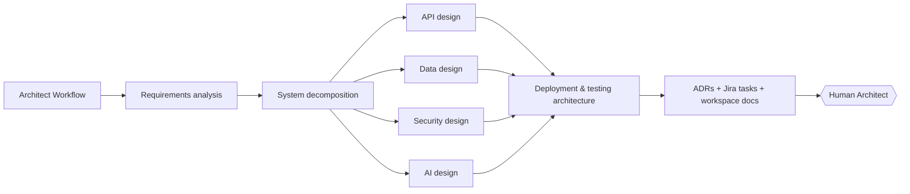

**Status: built**, as a Mastra Workflow (`workflows/architect-workflow.ts`), not a single-shot agent call:

- Steps: Requirements analysis → System decomposition → {API, Data, Security, AI design} in `.parallel()` → Deployment/testing notes → ADRs + tasks + workspace docs. Each step has its own Zod schema; only the final step touches the filesystem.
- The Orchestrator still sees one tool, `delegate_to_architect` — the workflow runs inside that tool, so its own tool surface is unaffected by how many internal steps the Architect has.
- **Per-step progress**, with no new plumbing: the delegate tool relays each step's start/result into its own tool stream (Mastra's `writer.custom()` pushes into the same outer agent stream). `apps/api` reads these alongside normal tool chunks and writes them to `run_steps`, so the Run Console shows live progress ("Security design — done") for free.
- **One project, several Epics, one architecture.** A single Jira project can have several Epics; the Architect can be given one or several Epic keys (`delegate_to_architect` `epicKeys`) and designs one shared system architecture across all of their combined Stories, rather than a separate design per Epic. `relatedEpicKeys` on the draft records which Epics a design covers; Tasks are filed under the first (primary) Epic, and the "filed" Jira comment is posted on every covered Epic so a human reading any of them finds the shared design. The workspace and `architecture.md`/`plan.md` documents likewise cover the whole combined design, keyed by the primary Epic.
- **Fixed technology stack, human-chosen backend.** Before drafting, the Orchestrator asks the human which backend framework to use (Spring Boot or NestJS) — frontend is always React 19 + Vite 19 and the database is always PostgreSQL, so those are never asked. This choice is a deterministic input (`techStack`), never invented by the model (principle 5): it is threaded into every design-step prompt so the API/data/security design reads as a concrete design for that exact stack, and it is rendered as its own "Technology stack" section in `architecture.md`. It also fixes what the (not yet built, section 14 Phase 3) Dev agent should scaffold — see `docs/adr/0001-dev-agent-scaffold-and-template-strategy.md`.
- **Workspace**: a filesystem-only `Workspace` per (primary) Epic (`workspace/architect-workspace.ts`), rooted at `AURA_WORKSPACE_ROOT/<epicKey>/architecture/`, holding `docs/adr/000N-title.md`, `docs/srs/*.md`, `architecture.md`, and `plan.md`. **Single shared workspace root (2026-09-21, `workspace/root.ts`):** `AURA_WORKSPACE_ROOT` is now the one root all three of Architecture, Dev, and QA nest under per Epic (`<root>/<epicKey>/architecture|dev/<discipline>|qa/`), replacing three separate env vars (`AURA_WORKSPACE_ROOT`/`AURA_DEV_ROOT`/`AURA_QA_ROOT`) with one - cosmetic/discoverability only, each still uses its own write mechanism (Architecture/QA are Mastra `Workspace`/`LocalFilesystem`; Dev stays a plain host path for Docker's bind mount - see its own note below). This replaces the ADR-as-Jira-comment stopgap (section 7) with reviewable files — Jira Tasks stay the source of truth and reference the paths. Registered on the Mastra instance itself (`addWorkspace`/`listWorkspaces`), so it's visible to Studio and cleaned up properly rather than living in a private cache.
- Files are written only after the same `approved=true` gate already required for Jira — nothing is written before a human approves.
- **Viewing and editing the workspace**: `apps/agent-runtime` exposes the workspace over HTTP (`server/workspace-routes.ts`) since `apps/api` doesn't share a filesystem with it (section 3.2): two read routes, plus a narrow write route (`PUT /workspace/:epicKey/file`) that can only overwrite a file the Architect Workflow already created — it cannot create new files or write outside the Epic's own workspace. `apps/api` proxies all of it behind the Epic-artifacts grant (`canViewArchitectWorkspace` for reads; `canEditArchitectWorkspace`, architect-role only, for the write), and the web app's Design Documents page browses, renders, and — for the human architect — edits them (CodeMirror, source/preview/edit). A manual edit has no version history and is overwritten if the Architect agent revises the design again; the UI says so. Every edit is audit-logged (`workspace.file.edit`).
- **Continuing the conversation with feedback**: `GET /workspace/:epicKey/thread` returns the Orchestrator thread that last drafted an Epic's architecture, read from the draft store's own `thread_id` column. The Design Documents page uses this so a human's "send feedback to the Architect" comment continues that thread (and its `draftId`, which only exists in that thread's own tool-call history) instead of starting a disconnected new one that could only re-draft from scratch.
- **Browsing and tracking the underlying Jira work**: separately from the workspace viewer above, `apps/web`'s Jira page (`features/jira`) lists Epics and, per Epic, their filed Stories, Tasks, and Bugs (2026-09-22: Bugs added as their own section, since Gate 7/`delegate_to_ci`'s `file-defect` modes now file real ones), read directly from Jira by `apps/api` (`modules/jira`) — never through the runtime, so browsing never starts an agent run. Each issue also exposes Jira's own status transitions (`GET`/`POST /jira/issues/:key/transitions`) and a real comment thread (2026-09-22: `GET`/`POST /jira/issues/:key/comments`, fetched live, not stored by AURA) so a human can move work forward and discuss it without leaving AURA — both are direct, ungated human actions on Jira's own data, the same as using Jira's own UI, not agent writes, so neither goes through the approval-gate pattern this section describes for agent-authored content. The page no longer embeds the Architect workspace inline (2026-09-22, removed) — that lives only on the dedicated Design Documents page now.

### 6.4 Dev agent and Gate 4 (multi-discipline scaffolding)

**Status: Frontend and Backend/NestJS both built and verified** (real Docker runs, exit 0, dependencies installed, files on disk, correct host-user ownership). Backend/NestJS's earlier npm/arborist crash (`Cannot read properties of null (reading 'edgesOut')`) is fixed - root cause was node:22-slim's bundled npm 10.9.8 itself, not `npx`; the scaffold command now upgrades npm to a writable prefix before running `nest new`. Backend/Spring Boot, Data, AI, and Integration are not implemented at all - `delegate_to_dev` fails clearly rather than silently doing nothing when asked for one of them. Local scaffolding only — no git branch or PR automation. "Security" is not one of these disciplines at all (see below). Full detail: `docs/adr/0001-dev-agent-scaffold-and-template-strategy.md`.

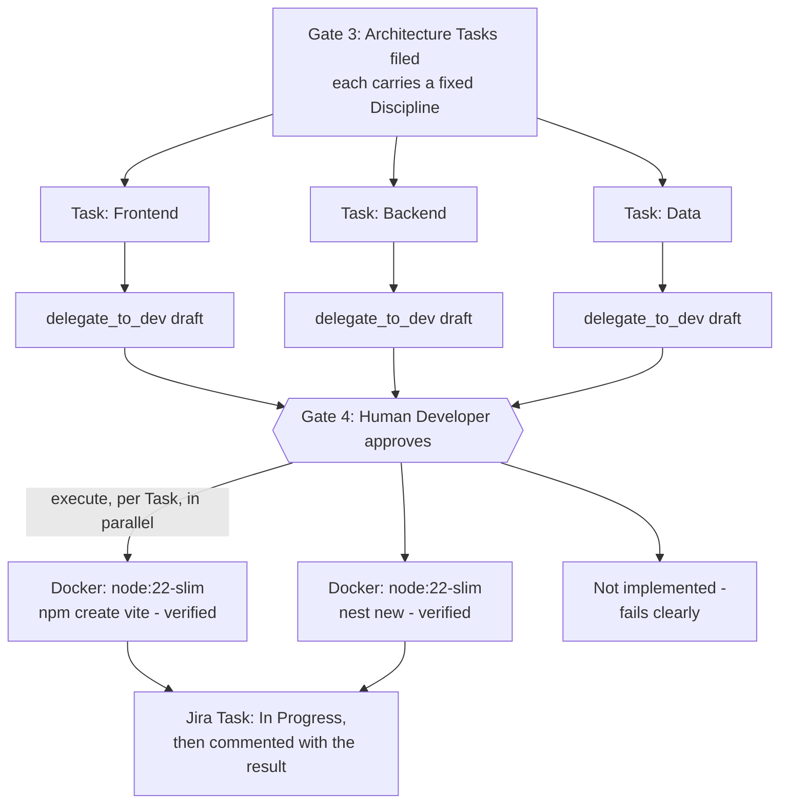

- **What the Dev agent does, and does not, decide.** Given a filed architecture Task, `agents/dev-agent.ts` writes a short explanation of why the (already-fixed) scaffold command fits that Task's content. It never chooses or writes the command itself, and it never picks the discipline either — `tools/delegate-tools.ts` reads the Task's own `**Discipline:** X` line (`disciplineFromTask`, AURA's own deterministic formatting from `renderArchitectureTask`, not free prose) and resolves a fixed command from it (`resolveScaffold`; Backend additionally reads the Epic's stored `techStack.backend` choice from Gate 3). **Fixed (2026-09-21):** `resolveScaffold` used to read `draftStore.latestByEpic('architecture', epicKey)` - the most recently *created* architecture draft, not the most recently *filed* one. A later `draft`/`revise` call that was shown to the human and rejected (never filed) still writes its own row, so it could silently outrank the real, already-filed design that created the Task in the first place - caught live running Gate 4 for KAN-36, whose real filed design is NestJS but an earlier rejected re-draft attempt (Spring Boot) had become the "latest" row. Now uses `draftStore.listByEpic` and picks the latest row with `filed.workspaceWritten` set, so only an architecture design that was actually approved and filed can decide the scaffold. This is principle 5 taken further than PO/BA/Architect: there the model proposes content a human approves; here the model doesn't even propose the action, only explains a decision AURA already made - and now that decision is read from what was actually built, not merely last proposed.
- **One discipline, one Task, one Dev agent invocation - naturally parallel.** There is one `dev-agent` definition, parameterized by discipline through this lookup rather than separate per-discipline agents: the model's job (explain a fixed plan) is identical across disciplines, so the specialization lives entirely in the deterministic command table, not in separate system prompts. A human can run `delegate_to_dev` for a Frontend Task and a Backend Task from the same Epic independently - each is its own draft/approve/execute cycle with its own container, so nothing about the design serializes them; "Frontend, then Backend, then Database" is a narration choice, not an enforced order (docs/adr/0001, "Sequencing").
- **Gate 4.** `delegate_to_dev`: `draft` (epicKey + taskKey → reads the Task's discipline, resolves its scaffold, returns a plan as `markdown`) then `execute` (draftId + `approved=true` → runs). There is no `revise` mode — the plan's command is fixed, so feedback means a different Task or conversation, not an edited plan.
- **Sandbox.** `execute` runs the fixed command inside an ephemeral Docker container (`lib/docker-exec.ts`): `--rm`, memory/CPU/PID limits, a hard wall-clock timeout, run as the host user (not root - scaffolded files must be owned by whoever is running AURA, not the container), bind-mounting only the Epic+discipline's own directory under `AURA_WORKSPACE_ROOT` (default `.workspaces/<epicKey>/dev/<discipline>/`) as `/workspace`. Chosen over Firecracker/gVisor for this local/solo-use pass — open decision #4 (section 15) is now resolved for that scope. Progress streams out via `writer.custom()` the same way the Architect Workflow's step progress does (section 6.3).
- **Jira sync.** As the container starts, the Task is moved to "In Progress" (best-effort - a missing transition of that name never blocks the scaffold itself). On completion, success or failure, a comment is posted with the local path, the exact command run, and — on failure — a tail of its output, so a teammate reading Jira sees what happened without opening AURA (`devScaffoldFiledComment`, the same provenance-stamp pattern as PO/BA/Architect). A draft already executed is not run twice (`draftStore`'s `filed` marker, the same idempotency mechanism Architect's `file` mode uses).
- **"Security" is not a scaffold discipline.** Architecture Tasks carry one of `Frontend, Backend, Data, AI, Integration, Deployment` (`contracts/drafts.ts`'s `disciplines`) - there is no `Security` value, and no obvious "official live tooling" scaffold analogous to `npm create vite` for it the way the ADR's model works. Security today is the Architect's `securityDesign` section, cross-cutting every Task, implemented as part of whichever Task addresses it (usually Backend) rather than as its own scaffold. If a dedicated security-scanning or secrets-setup scaffold is wanted, that needs its own concrete definition (what commands, what tool) before it can be added the same way Frontend/Backend were.
- **Grants.** `developer` is the first role with real capability: `orchestrator: run`, `dev-agent: run`, `architect-agent: read` (needs to read the design it's implementing, but not to comment on or revise it — that stays PO/BA/Architect, section 6.3). `architect` gets `dev-agent: read` (RACI section 4.2: "Architect (read)" on Dev output).

### 6.5 Coding agent and Gate 5 (Claude Code, Codex, and AURA's own built-in agent)

**Status: mixed, honestly.** AURA's own built-in Coding Agent (provider `mastra`) — **the main option, always available** — is **built and verified end-to-end** - a real run against a real file, with a real model, produced exactly the requested change and nothing else (see its own bullet below). Claude Code and Codex (providers `anthropic`/`openai`) are available if a human wants one specifically; both are built, typechecked, and authenticate via their own CLI login rather than an API key (see "CLI login, not an API key" below), but the actual CLI execution inside Docker was not run end-to-end in this session - see "What was and was not verified" below. Cursor is out of scope (poor fit for headless invocation). No git branch/PR automation yet, same as Gate 4.

The Dev agent (section 6.4) only ever runs one fixed scaffold command. Gate 5 is a second, separate step that hands an already-scaffolded Task to a coding agent to actually implement it - three interchangeable options behind the same draft/approve/execute flow: AURA's own built-in agent (no external account or login at all, the default choice) or, if a human wants one instead, Claude Code or Codex (external CLIs, authenticated via the developer's own CLI login on the machine running agent-runtime).

- **No model call in `draft`, on purpose, for any provider.** `delegate_to_code`'s plan is built entirely by code from the Task's own Jira content (summary, description, acceptance criteria) - there is no LLM step deciding what the prompt says, unlike every other delegate tool, regardless of which provider will later execute it. There is consequently no `coding-agent` entry in `mastra.agents`: nothing to converse with directly, so it does not appear in the Agent Registry page. It still has `AGENT_ALIASES`/`AGENT_APPROVER_ROLE`/`AGENT_GATE_INFO`/`ROLE_AGENT_GRANTS` entries in `apps/api`'s policy tables, which route approval independent of the registry (`resolveApprover`/`canDecide` key off the tool name, not a registry lookup).
- **AURA's own built-in agent - a different safety boundary than Docker.** `agents/mastra-coding-agent.ts` builds a fresh `Agent` per Task, given exactly three tools (`tools/file-tools.ts`: `list_files`, `read_file`, `write_file`) bound by closure to that one Task's directory - no shell/run-command tool at all, so there is no way for it to execute arbitrary code even under prompt injection from Jira content. Every path each tool touches is resolved and checked to stay inside that directory (`..`, an absolute path, or a same-prefix sibling directory all fail closed) - verified directly against eleven edge cases, all passing, including the "sibling directory that shares a name prefix" case a naive `startsWith` check would miss. Runs in-process (not Docker) because a real coding loop needs many fast file operations; the narrow tool surface is the containment here, not a container. Needs no external key - it uses AURA's own already-configured model (`MASTRA_CODING_MODEL_ID`, same tier as BA/Architect).
- **CLI login, not an API key (corrected 2026-09-21).** Claude Code and Codex authenticate via their own browser/CLI login (`claude login` / `codex login`), run once, interactively, on the machine running `apps/agent-runtime` — never an API key. `delegate_to_code`'s execute step checks for that login's own credential file on the host (`~/.claude/.credentials.json` for Claude Code, `~/.codex/auth.json` for Codex) and bind-mounts it read-only into the sandbox container at the equivalent path under the container's `$HOME` (`docker-exec.ts`'s `mounts` option) — the same "runs as the host user" trust boundary already used for scaffolded-file ownership. If the file is missing, `delegate_to_code` fails clearly with the login command to run, rather than asking for a key. There is nothing to enter or store in AURA itself: no credential table, no Profile-page key form, no internal apps/api round trip — an earlier design (encrypted per-user keys in a `coding_agent_credentials` table, fetched via an internal apps/api route) was built, then removed once this was corrected; the Profile page now shows the login command per CLI, informationally only.
- **The prompt never touches a shell as text.** It is written to a file inside the Task's own scaffolded directory (`.aura-task-prompt.txt`) before the container starts; the container's fixed command reads it back via `"$(cat .aura-task-prompt.txt)"` (a safe, non-recursive substitution - it captures file bytes as one literal argument, it does not re-evaluate anything inside them). Untrusted Jira content is never interpolated into a command string built by AURA's own code.
- **Sandbox and CLI flags**, verified against each tool's real `--help` output (not assumed): both install fresh via `npm install -g` and run non-interactively inside the same Docker sandbox Gate 4 uses (`lib/docker-exec.ts`, accepting both an `env` map and a `mounts` list - `-e`/`-v` args, never shell-interpolated). Claude Code: `claude -p --dangerously-skip-permissions --output-format json`. Codex: `codex exec --sandbox workspace-write --ask-for-approval never --json` - preferred over Codex's own `--dangerously-bypass-approvals-and-sandbox` since Codex offers a tiered sandbox rather than only an all-or-nothing bypass, layered under AURA's own outer Docker sandbox either way.
- **What was and was not verified in this session.** Verified directly: the built-in `mastra` agent, real end-to-end (real model, real file, made exactly the requested one-line change and nothing else); its path-containment logic against eleven edge cases; both CLIs' real flag names via `--help`; full typecheck across all three apps. **Not verified**: actually running Claude Code or Codex end-to-end via a real CLI login - CLI installation/execution inside Docker was not exercised this session for either.
- **Jira sync.** Same pattern as Gate 4: on success the Task is moved toward "In Review" (best-effort transition lookup by name); on completion, success or failure, a comment reports the outcome plus a tail of the CLI's own output on failure (`codingFiledComment`).
- **Grants.** `developer` gets `coding-agent: run`; `architect` gets `coding-agent: read` (same RACI reasoning as Dev output).

---

## 7. Tool gateway

All external effects go through one gateway. No agent has raw SDK access.

```
Tool call
  ├─ 1. Schema validation (Zod) — reject unknown/extra args
  ├─ 2. Policy check — user grant ∩ agent grant ∩ project scope ∩ env tier
  ├─ 3. Risk tier → auto | suspend for approval | deny
  ├─ 4. Idempotency key — safe retries, no duplicate Jira issues
  ├─ 5. Timeout + circuit breaker per external system
  ├─ 6. Execute via typed adapter (jira / git / ci / sandbox / docs)
  ├─ 7. Audit record (args hash, result hash, duration, cost)
  └─ 8. Provenance stamp on created artifacts
```

**Status.** There is no separate gateway service yet. Steps 1, 3 (the `approved` flag), 4 (idempotent filing keyed on the stored draft), 6, and 8 live inside the delegate tools; step 2 (who may run/answer) and step 7 (audit) live in `apps/api`. Timeouts/circuit breakers (step 5) don't exist beyond a per-turn ceiling. Sub-agents holding no tools at all is a stronger guarantee than a gateway would give, for now.

Target provenance stamp, once the Registry and cross-service run linkage exist:

```
Created by:  AURA · BA Agent v1.4 · prompt@9 · claude-sonnet-4-6
Run:         run_01J8ZK... (trace: 3f9a...)
Source:      AURA-42 (Epic)
Approved by: j.perera@company.com · 2026-09-16T08:41Z
```

What's actually written today — everything the runtime has direct access to:

```
Created by: AURA · BA Agent · groq/openai/gpt-oss-120b · draft STORIES-a1b2c3d4 v2
Source: AURA-42 (Epic)
Filed: 2026-09-18T10:15:00.000Z (human-approved via the AURA Orchestrator)
```

Prompt version and run/trace id need the Registry (§9.1, not built). Approver identity and
decision timestamp live in `apps/api`'s approval record but aren't passed down to the runtime
at filing time yet — a later plumbing task, not a gap in the runtime's own code.

### 7.1 Prompt-injection boundary

Jira ticket text, PR descriptions, and repository contents are **untrusted input**. The runtime wraps them as data, never as instructions; tool calls are validated regardless of what the content asks for; and the policy engine, not the prompt, is the boundary. A malicious ticket saying "deploy to production" cannot produce a deploy — the tool isn't granted and the tier requires approval anyway.

---

## 8. Testing architecture

**Status (2026-09-21): built**, and simpler than the diagram this replaced - no CI pipeline, no Robot Framework, no object storage exist, so the design doesn't pretend they run tests. AURA runs its own tests, for real, in its own sandbox:

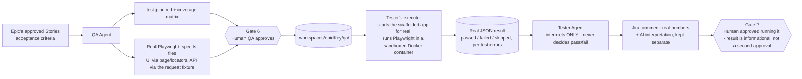

Rules:

- Tests execute in the same **ephemeral Docker sandbox** `lib/docker-exec.ts` already uses for Gate 4/5, never inside the LLM's process.
- The real result (`passed`/`failed`/`skipped`, from Playwright's own JSON reporter) is read back from disk by code and stored in the draft record (`filed.summary`/`filed.failureNotes`) - the Tester Agent never invents these numbers, only comments on them.
- The Tester Agent's output is labelled as interpretation and shown separately from the machine result everywhere it appears (Jira comment, `TestRunHistory` panel in the QA Files & Test Runs page).
- Only Frontend and Backend/NestJS are supported (the disciplines Gate 4 actually scaffolds) - other disciplines fail clearly at Gate 7's `draft` step rather than being silently skipped.
- **Developer/Tester back-and-forth (2026-09-22):** if the real result has `failed > 0`, the Orchestrator offers `delegate_to_test` `file-defect` - files a real Jira Bug under the Task's Epic with the real failure details, comments the Task pointing to it, and moves the Task back for rework. The developer fixes it (Gate 5, or a manual edit - see below) and the human asks to run Gate 7 again to retest; nothing re-runs automatically. No test-management integration (Xray/Zephyr) - the defect is a plain Jira Bug, not a synced external record.
- **Manual edit (2026-09-22):** both the Dev workspace (`PUT /dev-workspace/:epicKey/:discipline/file`, developer role only) and the QA workspace (`PUT /qa-workspace/:epicKey/file`, qa_engineer role only) now support the same narrow hand-edit pattern as the Architect's design docs (section 6.3) - overwrite an existing file only, no version history, audited (`workspace.file.edit`). `apps/web`'s Scaffolded Project Files and QA Files & Test Runs pages expose it to the Developer/QA Engineer respectively.
- **Colocated tests + local CI (2026-09-22):** `delegate_to_qa`'s `file` step now also copies each scenario into the matching scaffolded discipline's own test directory (`ui` → `<frontend>/tests/`, `api` → `<backend>/test/e2e/`) - best-effort per discipline, skipped (and said so plainly) if that discipline isn't scaffolded yet. The canonical copy Gate 7 reads from (`.workspaces/<epicKey>/qa/tests/`) is unchanged. Gate 4's `execute` now also writes `.github/workflows/<discipline>-ci.yaml`, a `.gitignore` if the scaffold didn't already produce one, and runs `git init` (idempotent, no remote, no push - `delegate_to_git`'s own gated `commit` still owns the first real commit). A new tool, `delegate_to_ci` (not a numbered gate, usable by any role that can use the Orchestrator - Developer included, not just QA/Tester): **project-wide (epicKey + discipline), never per-Task** - `devWorkspaceDir(epicKey, discipline)` is the whole scaffolded project every Task in that discipline shares, unlike Gate 7 which deliberately stays Task-scoped to close out one specific ticket. `run` executes that same checked-in step list locally in the sandbox, ungated (non-mutating, same reasoning as `delegate_to_git`'s `status`/`diff`); `file-defect` (gated, self-approved like `delegate_to_git`'s `commit`) files a Jira Bug under the Epic (not a Task - there is no single Task that owns a shared project) from a failed run. **AURA has no GitHub integration of any kind** - no repo creation, no push, no PAT, no Actions-status polling; "CI status" always means this local Docker run's own result, and pushing is left entirely to the developer's own tools.

---

## 9. Data architecture

### 9.1 Core schema (Supabase Postgres, RLS on every table)

```
identity        organizations · regions · users · memberships · roles · role_agent_grants
registry        agents · agent_versions · prompts · tools · agent_tool_grants · risk_tiers
projects        projects · jira_project_links · environments
runs            workflow_runs · run_steps · tool_calls · run_costs
approvals       approval_requests · approval_decisions
artifacts       documents · adrs · requirements · test_plans · test_suites · test_results · releases
memory          embeddings (pgvector, scoped by project_id)
governance      audit_logs (append-only) · policy_versions
```

**Status.** In place in Supabase: `profiles`, `workflow_runs`, `run_steps`, `approval_requests`, `approval_decisions`, `audit_logs` (append-only by trigger). Owned by the runtime's own storage: memory threads/messages (Mastra libSQL) and the draft store (`aura-drafts.db`). Registry, projects, and memory-embeddings tables don't exist yet. The `artifacts.documents`/`artifacts.adrs` gap is partly filled outside Supabase instead: the Architect's per-Epic workspace (section 6.3) writes ADRs and design docs as real files, referenced by path from the filed Jira Tasks — a filesystem store, so it gets none of RLS, cross-project search, or multi-region residency for free. Revisit once Registry/artifacts tables exist and multi-region matters (Phase 4+).

### 9.2 RLS strategy (target)

- Every row carries `org_id`, `region_id`, `project_id`.
- JWT custom claims: `org_id`, `roles[]`, `project_ids[]`.
- RLS policies enforce project scope in the DB even if the API has a bug.
- `audit_logs` is **insert-only**: no `UPDATE`/`DELETE` grants for any role, including service role in production.

**Status.** Only the last bullet is built: `audit_logs` has a DB trigger rejecting `UPDATE`/`DELETE` and revoking those grants from `service_role` too — genuinely append-only. The rest is target state: no table has `org_id`/`region_id`/`project_id`, there are no JWT claims for them, and RLS is enabled with no policies (only the API's service-role connection touches these tables today). Project scope is enforced entirely in `policy.ts`, not at the DB layer as this section implies — that defense-in-depth is multi-tenant work for later phases (§14).

### 9.3 Multi-region

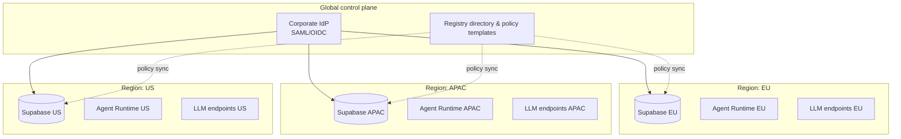

- Project data, embeddings, artifacts, and LLM calls stay in the project's region.
- Agent definitions and policy templates are global; **grants are regional**.
- Regional LLM routing satisfies data-residency requirements (EU data never leaves EU endpoints).

---

## 10. Reliability, safety, and cost controls

| Concern | Control |
|---|---|
| Cascading hallucination | Human gate after every stage; agents consume only *approved* upstream artifacts (`status = Approved`) |
| Agent ping-pong (Dev ↔ Tester) | `max_iterations` per ticket (default 3) → `HALTED_LOOP_GUARD` → human escalation |
| Runaway cost | Per-run and per-project daily budgets enforced in the tool gateway; hard stop, not warning |
| Duplicate Jira issues on retry | Idempotency keys on all write tools; at-least-once queue + idempotent handlers |
| External outage (Jira/Git/LLM) | Circuit breakers, exponential backoff, model fallback, run remains `RUNNING` and resumes |
| Approval starvation | SLA timers → `EXPIRED`; escalation to role backup; never auto-approve |
| Model/prompt drift | Agent versioning + eval suite; `CANARY` status routes a percentage of runs; promotion requires eval score ≥ threshold **and** human sign-off |
| Secrets | Runtime receives short-lived, scoped tokens per run; no secret values in prompts, logs, or memory |
| Context overflow | RAG over project-scoped embeddings; sub-step decomposition; structured outputs; no "stuff the whole epic in" |
| Sandboxed code execution | Dev-agent code runs in ephemeral containers with no network except allow-listed registries; never on shared infra |

---

## 11. Observability

- **Traces:** OpenTelemetry from web → API → queue → runtime → tool → external; Mastra tracing exported to the same backend. One `trace_id` per run, surfaced in Jira comments.
- **Metrics:** runs by state, approval latency, gate rejection rate per agent, cost per run/project/region, tool error rate, eval scores per version.
- **Logs:** structured JSON, PII-redacted, retained per region.
- **Dashboards:** Approval SLA, agent quality (rejection rate is the key signal — a rising rejection rate means the agent version is regressing), spend.
- **Alerts:** budget breach, loop guard hits, approval SLA breaches, circuit breaker open, RLS policy violations.

---

## 12. Deployment architecture

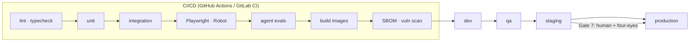

- Containerised services: `web`, `api`, `agent-runtime`, `sandbox-runner`.
- Infra as code (Terraform) per region; Supabase managed.
- Blue/green or canary for `api` and `agent-runtime`; automatic rollback on health-check failure.
- Agent **version** promotion is a deployment in its own right, gated the same way as code.

---

## 13. Monorepo layout

Current layout (2026-09-18). Each app is a standalone npm project; there is no root workspace tooling.

```
aura/
├── apps/
│   ├── web/                 # React + Vite + TS: app/ shared/ features/ (see apps/web/README.md)
│   ├── api/                 # Express + TS: config/ lib/ middleware/ modules/ routes/ (see apps/api/README.md)
│   │   └── supabase/        # migrations 0001 identity, 0002 runs/approvals/audit
│   └── agent-runtime/       # Mastra: agents/ tools/ contracts/ store/ mcp/ workflows/ workspace/ server/ lib/ (see apps/agent-runtime/README.md)
└── docs/
    ├── ARCHITECTURE.md      # this file
    ├── srs/
    ├── adr/ security/ runbooks/ workflows/
    └── logs/                # one file per working day
```

Deferred until there is real cross-app duplication: `packages/` (contracts, policy, db, agents, tools, workflows, evals, ui, telemetry), `tests/`, `infra/`, and `apps/sandbox-runner`. Today the Zod contracts live next to their consumers (`apps/api/src/modules/*`, `apps/agent-runtime/src/mastra/contracts`), and the policy engine is `apps/api/src/modules/policy/policy.ts`.

---

## 14. Phased delivery plan

| Phase | Scope | Exit criteria |
|---|---|---|
| **0 — Foundations** (4–6 wks) | Monorepo, SSO, RBAC + policy engine, Supabase schema + RLS, audit log, Jira webhook ingestion, approval service, run state machine | A human can trigger a no-op agent, see it suspend, approve, and see audit + provenance |
| **1 — PO + BA** (4 wks) | PO and BA agents, Epic/Story creation with gates, registry v1, evals v1 | BA-generated stories approved in a real project; rejection rate tracked |
| **2 — Architect + QA/Tester** (6 wks) | Architect agent, ADRs, QA test-plan generation, Playwright/Robot suites, CI result ingestion, Tester interpretation | End-to-end from Epic to executed tests with evidence links |
| **3 — Dev agents** (6–8 wks) | Sandbox runner, FE/BE/Data sub-agents, PR creation, loop guards | PRs merged after human review; zero direct pushes |
| **4 — Deployer + multi-region** (6 wks) | Deployer agent, four-eyes, change windows, second region, regional LLM routing | Production release through Gate 7; EU/APAC residency verified |
| **5 — Hardening** (ongoing) | Canary agent versions, cost optimisation, advanced RAG, integrations (CRM/ERP/Slack) | Eval-gated promotion in place; SOC2/ISO evidence exportable from audit |

**Status:**
- **Phase 0** — done: identity/RBAC, policy tables, Supabase schema with RLS, audit log, approval service, run state machine. Not done: SSO federation, Jira webhook ingestion, the queue.
- **Phase 1** — done: PO and BA agents, Epic/Story drafting through Gates 1 and 2, the registry view. Not done: evals, real-project rejection-rate measurement.
- **Phase 2** — done: the Architect agent (as a workflow, not a single call), ADR drafting, architecture-task filing (Gate 3); QA Agent and real Playwright test execution (Gates 6-7, section 8). Not done: Robot Framework (deliberately out of scope, section 8), CI integration (AURA runs tests itself, not via CI).
- **Phase 3** — Frontend and Backend/NestJS: the Dev agent, Docker-sandboxed scaffold execution (Gate 4), the Coding Agent - AURA built-in, Claude Code, or Codex (Gate 5, section 6.5); a Deployer agent, plan-only (Gate 8, section 6.2). Not done: Backend/Spring Boot, Data/AI/Integration/Deployment scaffolds, the sandbox runner as a general capability beyond Docker, git branch/PR creation, loop guards, a real deployment pipeline for Deployer to trigger.

See `docs/logs/` for day-by-day detail.

---

## 15. Open decisions (to be captured as ADRs)

1. Queue: pg-boss (simplest, one datastore) vs BullMQ + Redis (higher throughput) — **recommend pg-boss to start**.
2. Policy engine: in-house TS (pure functions) vs Cedar/OPA — **recommend in-house TS with exhaustive tests; migrate to Cedar if policies grow beyond ~50 rules**.
3. Jira test management: plain issues vs Xray/Zephyr.
4. Sandbox isolation: Docker-in-CI vs Firecracker/gVisor for Dev-agent code. **Resolved for local/solo use** (2026-09-18, `docs/adr/0001-dev-agent-scaffold-and-template-strategy.md`): Docker, one container per run. Revisit for Firecracker/gVisor only if AURA ever runs Dev agents against untrusted, multi-tenant work.
5. Eval tooling: Mastra evals vs Langfuse/Braintrust.
6. Vector store: pgvector (recommended for residency simplicity) vs external.
7. Orchestrator as an agent with deterministic tools, replacing the v0.1 lookup-table workflow. Decided in practice on 2026-09-17, ADR pending.
8. Draft store: runtime-owned libSQL file (current) vs a Supabase table. The current choice keeps the runtime self-contained. Revisit when the API needs to read drafts directly.
9. **Coding agent for actual feature implementation.** **Resolved and built** (2026-09-18, section 6.5): integrate existing coding CLIs (Claude Code, Codex) pointed at the scaffolded directory rather than a bespoke agent with its own file-edit tools. Gate 5 (`delegate_to_code`) is built, authenticating Claude Code/Codex via the developer's own CLI login on the host (corrected 2026-09-21, section 6.5 - not the per-user API key design built and then removed the same day); actual CLI execution is not yet verified end-to-end. A companion viewer for the scaffolded project's files, now with a developer-role manual edit (2026-09-22, section 8), and a Docker-run visibility dashboard are built. Still open: a per-Task git workspace tool (branch/diff/commit); Cursor remains explicitly out of scope (poor fit for headless invocation).

---

## 16. Glossary

| Term | Meaning |
|---|---|
| **Gate** | A durable workflow suspension that only a human with the right role can resolve |
| **Grant** | A (role, agent version, tool) tuple stored in the Registry |
| **Run** | One execution of one agent version against one Jira issue, fully traced |
| **Provenance stamp** | Metadata written onto every artifact an agent creates |
| **Risk tier** | LOW / MEDIUM / HIGH / FORBIDDEN classification attached to a tool |
| **Four-eyes** | Approver must differ from requester; required for HIGH tier |
| **Loop guard** | Hard cap on agent iterations per ticket before human escalation |
