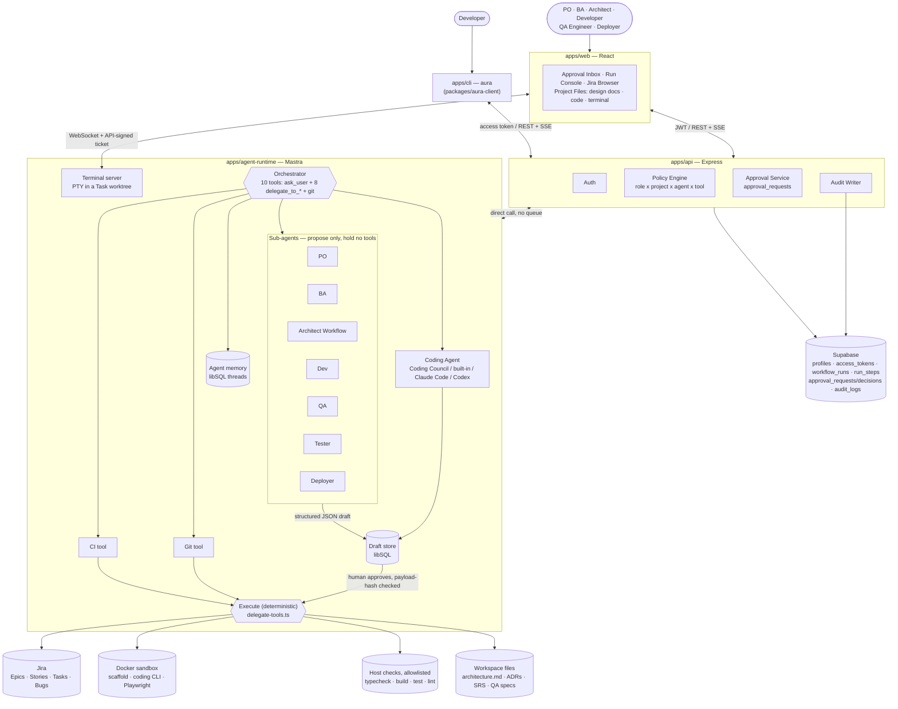
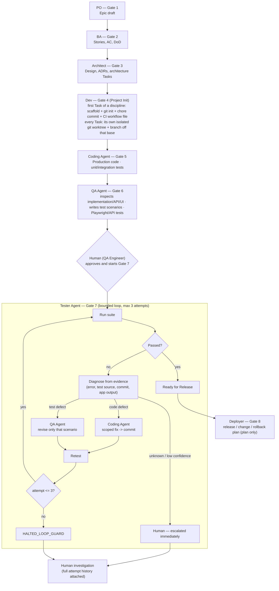
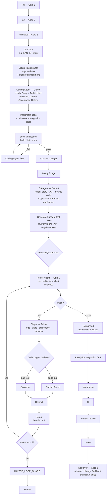

# AURA — Enterprise AI Agent Orchestration Platform

> **Status:** v0.3 — rewritten to separate what is built from what is planned
> **Owner:** Platform Architecture
> **Last updated:** 2026-09-23

This document describes the **built system** first, then lists everything
planned but not implemented in one place: [Section 5 — Pending (Future)](#5-pending-future).
If a capability isn't mentioned in Sections 1–4, assume it doesn't exist yet.

---

## 1. What AURA is

AURA is an AI agent orchestration platform for the software delivery
lifecycle. It coordinates specialised agents (PO, BA, Architect, Developer,
QA, Tester, Deployer), uses **Jira as the single system of record**, and
gates every consequential action behind human approval. There is no human
"Tester" role — Tester is an agent capability QA Engineer starts and
oversees (a bounded test/diagnose/route/retest loop, section 2.4), not a
person a project assigns.

### Six principles

1. **Agents propose; deterministic code decides.** Authorization, risk
   classification, and audit are never delegated to a prompt.
2. **Jira is the work state machine.** Agents react to Jira transitions and
   write back to Jira; AURA is not a second project-management system.
3. **Human-in-the-loop is a workflow primitive.** Every stage ends in a
   durable "waiting for approval" state; nothing continues without a
   recorded human decision. One deliberate, narrow exception: once a human
   approves *starting* the Tester Agent loop (Gate 7), its own bounded
   internal retries (up to 3 attempts) do not each ask for approval again —
   the same trust boundary the Architect workflow's many internal model
   calls already rely on for Gate 3. The loop still never guesses on an
   unsure diagnosis (principle 5) and always halts to a human at the cap.
4. **Every tool call is authorized, validated, and logged.** An agent can
   only call what the policy engine grants for *this user, project, and
   agent* — never what the model decides to try.
5. **Evidence over assertion.** An agent may never claim a test passed or a
   requirement is met without a machine-generated artifact behind it.
6. **Every Task gets an isolated workspace; agents never share a mutable
   one.** Two Tasks of the same Epic and discipline never touch the same
   working directory at the same time — each gets its own git worktree and
   branch (section 2.4, "Concurrent Task Execution"). This is about
   concurrent *developers/Tasks* within one project, a different problem
   from multi-*tenant* isolation between organizations (not built — see
   section 5.3): worktrees solve the first, not the second.

---

## 2. Built: system overview

### 2.1 Services

| Service | Stack | Owns |
|---|---|---|
| `apps/web` | React + Vite + TS | UI: approval inbox, run console, Jira browser, **Project Files** - one VS Code-style workspace per Epic: Explorer with the Epic's design documents (every pipeline role reads; Architect edits; PO/BA/Architect send feedback to the Architect agent) and the Task's code (Developer/Architect/QA/admin; Developer edits), CodeMirror editor, integrated terminal (Developer) - and access tokens |
| `apps/api` | Node + Express + TS | Auth (Supabase sessions and personal access tokens), policy engine, approvals, Jira read/write, audit log, terminal tickets |
| `apps/agent-runtime` | Mastra (TS) | Agents, workflows (incl. the Coding Council), delegate tools, draft store, workspace files, the web terminal's WebSocket server |
| `apps/cli` | Node + TS (`aura`) | The developer's terminal client: Tasks, worktrees, coding runs, gate decisions, commits/pushes as the developer |
| `packages/aura-client` | TS library | Typed REST + SSE client for `apps/api`, shared by the CLI (and later the web app / VS Code extension) |

Flow: browser or `aura` CLI → `apps/api` (authorizes) → `apps/agent-runtime`
(runs the agent) → external systems (Jira, Docker, filesystem), all behind
the same approval gate. The CLI gets no privilege the web app doesn't have:
starting a coding run is a chat turn, deciding a gate is the same
`POST /approvals/:id/decide`.

There is **no event bus / queue yet** — API and runtime talk directly.

### Full system diagram (as built)



### 2.2 Authorization

Every role → agent grant is data in `apps/api/src/modules/policy/policy.ts`,
not a prompt:

| Role | Can run | Approves |
|---|---|---|
| Project Owner | PO | Gate 1 (Epic) |
| Business Analyst | BA | Gate 2 (Stories) |
| Architect | Architect | Gate 3 (design) |
| Developer | Dev, Coding Agent (incl. Coding Council), Git | Gates 4–5 |
| QA Engineer | QA, Tester | Gates 6–7 (sole approver of both; starts and oversees the Tester Agent loop) |
| Deployer | Deployer | Gate 8 |

Risk tiers, attached to tools:

| Tier | Behaviour |
|---|---|
| 🟢 LOW | Auto-execute, logged (reads, drafts) |
| 🟡 MEDIUM | Draft → human approval → execute (Jira writes, scaffolds, code, tests) |
| 🔴 HIGH | Not used yet — reserved for production actions |
| ⛔ FORBIDDEN | Not callable by any agent |

Every gated tool call: schema-validate args (Zod) → policy check (`can(user,
project, agent, tool)`) → if MEDIUM+, create an `approval_requests` row with
a hash of the exact payload → suspend → human decides → resume with a
single-use, payload-bound approval token → execute → audit record.

The runtime never holds user credentials or raw Jira/DB access; it only
calls its own gated tools.

**Personal access tokens** (`access_tokens`, migration 0006) let the `aura`
CLI authenticate without a browser: `aura_pat_…`, stored only as a SHA-256
hash, expiring (default 90 days), revocable from the Profile page, audited
on create/revoke. `middleware/auth.ts` resolves a token to its owner and then
applies exactly the same profile/role checks as a Supabase session — a token
never grants more than its owner's role. A token cannot mint another token
(creation is browser-session-only). Opening the web terminal mints a
short-lived (8h) token of kind `terminal`, hidden from the Profile list, so
`aura` inside it works without `aura login`; it reaches the shell encrypted
inside the terminal ticket (AES-256-GCM), never in plain text in the browser.

**Web terminal tickets**: `POST /terminal/tickets` (Developer role only,
audited as `terminal.session.start`) signs a 60-second, single-use ticket
(HMAC-SHA256, `TERMINAL_TICKET_SECRET` shared with the runtime). The
runtime's terminal server only verifies tickets; it never decides who may
connect.

### 2.3 Human approval gates

One Mastra agent, **the Orchestrator**, decides which agent to delegate to
next and asks the human when it needs input (`ask_user`). It has exactly
ten tools — `ask_user` and one `delegate_to_*` per gate below, plus `git` —
and cannot reach Jira, memory, or anything else directly. A wrong decision
by the Orchestrator produces a delegation a human can reject, never a
direct write.

| Gate | Agent | Produces | Approver |
|---|---|---|---|
| 1 | PO | Epic draft | PO |
| 2 | BA | Stories, AC, DoD, risks | BA |
| 3 | Architect | Design, ADRs, architecture Tasks | Architect |
| 4 | Dev | Project init: git + scaffold (Frontend and/or Backend, per Task) + CI workflow file | Developer |
| 5 | Coding Agent | Real code in the scaffold | Developer |
| 6 | QA | Test plan + real Playwright specs, informed by the real code | QA Engineer |
| 7 | Tester | Bounded test/diagnose/route/retest loop (up to 3 attempts) | QA Engineer starts it; the loop's own retries need no further approval |
| 8 | Deployer | Release / change / rollback plan (plan only) | Deployer |

### Delivery pipeline (as built)



Two things this diagram makes explicit that the table doesn't. First, Gate 4 fires **once per Task**, not once per discipline: the scaffold command itself (git init, `npm create vite@latest`/`nest new`, CI workflow file) only runs for the *first* Task of a discipline in an Epic — every Task after that, including that first one, gets its own isolated git worktree checked out on its own branch (`feature/<taskKey>`) off the shared base repo (`workspace/dev-workspace.ts`'s `ensureTaskWorktree`). This is the actual fix for two Tasks of the same discipline racing or overwriting each other in one shared directory — every agent from here on (Coding Agent, Git tool, Tester Agent) operates on that Task's own worktree, never the base. Dependency installs aren't repeated per Task either: a fresh worktree's `node_modules` is symlinked from the base repo's already-installed one rather than reinstalled.

Second, "test infrastructure" (a dedicated Playwright config/directory, as opposed to the scenario files themselves) is still not a distinct Dev deliverable — the test directory is created lazily, by QA's own file step (Gate 6) and by Tester's run step (Gate 7), not provisioned upfront at Gate 4.

This is the "Concurrent Task Execution" milestone, not full "enterprise readiness": it solves multiple Tasks/developers safely sharing one project (git isolation), which is a different, narrower problem than multi-*tenant* isolation between organizations (`org_id`/RLS — still not built, section 5.3). Deliberately deferred alongside it: an Integration Agent to detect (not auto-resolve) merge conflicts between Tasks' branches, real remote Git (a GitHub App, push, PR, required checks), and multi-repository support — worktrees only solve isolation *within* one repository.

Rules:
- A gate only fires when a human asks for that stage; nothing auto-advances
  to the next gate after an approval.
- Only content approved at a gate is ever written to Jira, Docker, or disk.
- PO and BA hold no tools at all — they return structured JSON (Zod
  schemas); rendering and filing is code, not the model.

### 2.4 Agents

- **PO / BA** — draft Epics and Stories as structured JSON only; no tools.
- **Architect** — a multi-step Mastra **Workflow**, not one model call:
  requirements → decomposition → parallel API/data/security/AI design →
  deployment notes → ADRs + architecture Tasks + workspace docs. Frontend
  is fixed to React 19 + Vite; database fixed to PostgreSQL; the human
  picks the backend (NestJS or Spring Boot) before drafting starts. Design
  docs (`architecture.md`, `plan.md`, ADRs, SRS) are written to
  `<AURA_WORKSPACE_ROOT>/<epicKey>/architecture/` only after Gate 3 approval,
  and are editable by an Architect in the web app's Project Files page, where
  every pipeline role reads them next to the code (no version history on
  manual edits).
- **Dev (Gate 4)** — project init, per Task: explains, but does not choose,
  a fixed scaffold command read from the Task's own discipline field. On
  approval: if this is the *first* Task of that discipline in the Epic, it
  runs the scaffold in an ephemeral, non-root Docker container against a
  shared **base repo**, then finishes it (CI workflow file, `.gitignore` if
  missing, `git init` + `chore: initial scaffold` commit). Either way — first
  Task or not — it then creates that Task's own isolated **git worktree**,
  checked out on its own branch (`feature/<taskKey>`) off the base
  (`workspace/dev-workspace.ts`'s `ensureTaskWorktree`), and every downstream
  tool for that Task (Coding Agent, Git tool, Tester Agent) operates on the
  worktree, never the base or another Task's worktree. A worktree's
  `node_modules` is symlinked from the base's, not reinstalled. **Frontend
  and Backend/NestJS are implemented and verified** (real Docker run,
  correct file ownership). Backend/Spring Boot, Data, AI, Integration, and
  Deployment are **not implemented** — the tool fails clearly rather than
  doing nothing.
- **Coding Agent (Gate 5)** — implements the Task, in that Task's own
  worktree (never the shared base, never another Task's worktree), and is
  now also asked to write/update unit and integration tests alongside it,
  using whatever test runner the scaffold already includes — end-to-end/UI
  testing stays QA's job (Gate 6), not this agent's. Three interchangeable
  providers behind the same draft/approve/execute flow:
  - **AURA Coding Council** (`provider: "council"`,
    `workflows/coding-council.ts`, the default for the `aura` CLI) — three
    agents discuss the work inside one approved Gate 5 execute: a **Planner**
    (read-only file tools) writes a file-by-file plan, a **Reviewer** (no
    tools; structured JSON verdict) critiques it, an **Implementer** (the
    only role with write/edit tools and allowlisted checks) implements it,
    the project's own typecheck/build/test/lint run on the host
    (`lib/sandbox.ts`, fixed check ids, no shell, no Docker needed), and the
    Reviewer reviews the real diff + real check output → APPROVE or
    CHANGES → the Implementer fixes only the listed issues, for a bounded
    number of rounds. A failing check forces CHANGES regardless of the
    Reviewer. Each round ends in a checkpoint commit (`council: round N`,
    AURA identity) on the Task branch; every turn streams live as SSE event
    `council` and is persisted in `run_steps`; the transcript is written to
    `<worktree>/.aura/council/<draftId>.md` (git-excluded). If the Reviewer
    never approves, the Task is **not** moved to In Review. Runs on
    free-tier models: an ordered Groq/Gemini fallback chain per role, set in
    `agents/registry.ts` (`COUNCIL_*_MODEL_IDS`) like every other agent's
    model; moving to Claude means putting `anthropic/claude-sonnet-5` first
    in each list.
    It has its own Agent Registry entry and policy row (`coding-council`:
    Developer runs it and approves Gate 5; Architect and admin read), reported
    live by the runtime (`GET /council/registry`: real tools per role and the
    registry's model chains), and council runs carry their own provenance
    stamp (`coding-council`).
    **Partially verified:** plan → plan review → build → checks → checkpoint
    ran end-to-end with real models; the code-review step then failed on an
    expired Groq key, and the retry behavior added in response has not been
    re-run yet.
  - **AURA's own built-in agent** (single agent, no external account) — three
    file tools only (`list_files`/`read_file`/`write_file`), no shell
    access, every path checked to stay inside the Task's own worktree.
    Verified end-to-end with a real model and file.
  - **Claude Code** / **Codex** — external CLIs, authenticated via the
    developer's own CLI login on the host (no API key stored by AURA), run
    non-interactively inside the same Docker sandbox as Gate 4. Built and
    typechecked; **CLI execution has not been verified end-to-end.**
  - No server-side git push/PR at any provider. Pushing is done by the
    developer from their own machine with `aura push [--pr]`, using their
    own git credentials and `gh`; AURA never holds a GitHub credential.
- **QA (Gate 6)** — drafts a test plan and real Playwright spec files from
  the Epic's approved Stories **and, if Frontend/Backend is already
  scaffolded or implemented, the real code** (`workspace/read-scaffold-
  context.ts`) — so scenarios prefer real routes/`data-testid`s over
  guessing when the app exists yet. Only Frontend and Backend/NestJS are
  supported (the disciplines Gate 4 can scaffold). Can also revise a single
  failing scenario in isolation (`revise-scenario`) instead of regenerating
  the whole plan — every scenario carries its own revision counter.
- **Tester (Gate 7)** — a bounded loop (`workflows/tester-workflow.ts`), not
  a single pass: starts the Task's own worktree for real and runs the suite
  in Docker (never a shared directory another Task could also be changing);
  the pass/failed/skipped counts always come from Playwright's own
  JSON output, read by code, never a model's claim. On failure it collects
  evidence (the real error, the failing test's own source, the current git
  commit, the app's own output) and diagnoses each failure through an
  explicit hierarchy — infra failure? app startup failure? test/env
  problem? test implementation problem? application defect? requirements
  ambiguity? — before acting. Only two outcomes route automatically: a test
  implementation problem back to QA (revising only that one scenario) or an
  application defect to the Coding Agent (a scoped fix against that same
  Task's own worktree, filing/updating one linked Jira Bug rather than a
  new one per attempt). Everything else — including any diagnosis
  the model isn't confident about — routes straight to a human; the loop
  never guesses. Retries up to 3 attempts, then sets the run to
  `HALTED_LOOP_GUARD` with the full attempt history attached.
- **Deployer (Gate 8)** — produces a release note, change plan, and
  rollback plan only. There is no execute mode and no deployment pipeline.
- **Git tool** — local `init`/`branch`/`commit` (gated) and `status`/`diff`
  (ungated, read-only), always against the Task's own worktree — `status`/
  `diff` show exactly this Task's changes, never another Task's sharing the
  same discipline. The Git tool itself never pushes; the only push path is
  the developer's own `aura push` (section 2.9). `init` is close
  to a no-op now (a worktree is already a real git checkout from creation).
  Gate 4's scaffold step also makes its own first commit automatically
  (`chore: initial <discipline> scaffold`) in the **base repo** right after
  scaffolding, before any worktree branches off it, under a fixed
  `AURA <aura@localhost>` identity (not the host's git config) — so `git
  diff` after Gate 5 shows exactly what the Coding Agent changed versus the
  raw scaffold, not every file as untracked.
- **CI tool** (`delegate_to_ci`) — re-runs a project's own checked-in local
  checks inside the same Docker sandbox, and can file a Jira Bug on failure.
  Takes an optional `taskKey`: given one, it runs against that Task's own
  worktree (recommended, tests real code); omitted, it runs against the
  shared base scaffold, which reflects no Task's changes once worktrees are
  in use. "CI" here means this local run; there is no external CI system
  involved.

### 2.5 Testing

Tests run for real, in AURA's own Docker sandbox — there is no CI pipeline
and no Robot Framework.

- Real Playwright specs are filed under `.workspaces/<epicKey>/qa/` and,
  best-effort, also copied into the shared **base** scaffold's own test
  directory (a convenience so a plain local `npm test` sees them too) — not
  into every Task's individual worktree, since that copy isn't what any
  gate actually reads from anyway (see below).
- Tester's `execute` starts the app and runs the suite in the same sandbox
  Gates 4–5 use; the JSON result is stored on the draft record, not
  invented by the model. On `failed > 0`, it no longer just reports and
  stops — it diagnoses and retests automatically (up to 3 attempts) before
  ever asking a human, and only files/updates one Jira Bug per genuine
  application defect it finds (not one per attempt).
- A developer or QA Engineer can hand-edit scaffolded or QA files directly
  through the web UI (audited as `workspace.file.edit`, no version history).

### 2.6 Data

Built, in Supabase Postgres:
`profiles` (incl. `git_name`/`git_email`), `access_tokens`, `workflow_runs`,
`run_steps`, `approval_requests`, `approval_decisions`, `audit_logs`
(append-only — a DB trigger blocks `UPDATE`/`DELETE`, including for the
service role).

Owned by the runtime, not Supabase:
- Memory threads/messages — Mastra libSQL.
- Drafts — a local `aura-drafts.db` (libSQL) file; the same file holds
  `aura_model_usage` (per-day, per-model request/token counts for the
  Coding Council, shown by `aura status`).
- Council transcripts — `<worktree>/.aura/council/*.md`, excluded from git.
- Design docs, scaffolds, QA specs — plain files under
  `<AURA_WORKSPACE_ROOT>/<epicKey>/...`, referenced by path from Jira.

Project scope (who can see/run what) is enforced entirely in
`policy.ts` — there is no per-row database enforcement yet.

### 2.7 Provenance and audit evidence

Every filed/revised Jira artifact (Epic, Story, architecture Task, dev
scaffold, coding-agent change, QA plan, test result, defect, release plan,
git op, CI run) carries a full provenance stamp: producing agent id, agent
version, prompt version, model (or provider) id, draft id/version, and the
thread id it was produced in (the run/trace correlator — the same value
`workflow_runs.thread_id` carries, so an artifact can be traced back to its
exact run and approval history). `apps/agent-runtime/src/mastra/agents/registry.ts`
is the source of truth for agent/prompt versions, bumped by hand alongside
the agent's tool/prompt file; `tools/delegate-tools/shared.ts` renders the
stamp into Jira content and returns the same data as a structured
`provenance` field on the tool's result, which `apps/api`'s
`orchestration/run-stream.service.ts` already mirrors verbatim into
`run_steps.payload` — no separate plumbing needed to make it durable and
queryable.

`GET /audit/export` (admin-only) produces a downloadable evidence bundle
(JSON or CSV) from `audit_logs` for SOC2/ISO reviews: unpaginated within a
50,000-row safety cap, framed with an export manifest (who pulled it, when,
under what filter, and a note that the table is DB-enforced append-only),
and the export itself is audited (`audit.exported`).

### 2.8 Monorepo layout

```
aura/
├── apps/
│   ├── web/             React + Vite + TS
│   ├── api/             Express + TS (+ supabase/migrations)
│   ├── agent-runtime/   Mastra: agents/ tools/ contracts/ store/ workflows/ workspace/ server/ terminal/
│   └── cli/             the `aura` command
├── packages/
│   └── aura-client/     typed API + SSE client (@aura/client)
├── patches/             pnpm patches (Groq fix for @mastra/schema-compat)
├── docs/                ARCHITECTURE.md · plans/ · srs/ adr/ security/ runbooks/ workflows/ · logs/
├── package.json         workspace root (scripts only)
├── pnpm-workspace.yaml  workspace members, patches, overrides, allowed build scripts
├── pnpm-lock.yaml       the single lockfile
├── Makefile             `make help` - install, dev, build, typecheck, cli, doctor…
└── SETUP.md             how to set up and run everything
```

A **pnpm workspace**: every folder under `apps/` and `packages/` keeps its
own `package.json`, with one root lockfile. `apps/cli` depends on
`@aura/client` via `workspace:*`. Zod contracts still live next to their
consumers; `packages/` only holds code more than one app actually shares.

### 2.9 Developer surfaces: `aura` CLI and the web terminal

- **`aura` CLI** (`apps/cli`) — `login` (access token), `tasks`, `open`
  (prints or opens the Task's worktree, `--code` for VS Code), `code` (asks
  the Orchestrator for a Gate 5 draft with every argument spelled out, then
  streams the turn), `approve`/`reject`/`revise` (the same governed decision
  endpoint as the web inbox, pinned with the gate's snapshot hash), `say`
  (a note for the council's next round), `status` (pending gates and today's
  model usage), `diff`, `commit`, `push [--pr]`. `commit` runs locally, so the
  commit is authored by the **developer** (their git config and signing); it
  folds the council's AURA-authored checkpoint commits into that one commit
  and adds `Co-authored-by: AURA Coding Council`, `AURA-Task:` and `AURA-Run:`
  trailers. It never rewrites the developer's own commits.
- **Web terminal** — an xterm.js panel under the Project Files
  editor (Developer role only). The runtime's terminal server
  (`terminal/server.ts`, port 4112, loopback by default) opens a shell in the
  Task's worktree: `full` mode is a real PTY via a small Python 3 `pty`
  bridge (no native Node module), and is only allowed on a loopback bind;
  `restricted` mode runs allowlisted commands only (`aura`, `git`
  read/commit subcommands, `npm test/run`, `ls`, `cat`, `pwd`) with argv and
  path containment, no shell. The shell's environment is an allowlist (no
  LLM keys, Jira token or ticket secret), plus `AURA_TOKEN`/`AURA_API_URL`
  for the CLI. Origin-checked, at most 3 sessions per user, closed after 30
  minutes idle.
- **Runners tab** — next to the terminal (Developer, Architect, QA, admin):
  a live snapshot from `GET /runners` (runtime `server/runners-routes.ts`,
  polled every 5s while visible) of AURA's Docker containers with CPU /
  memory / process usage against the fixed per-container limits
  (`CONTAINER_LIMITS` in `lib/docker-exec.ts`), host CPU/memory, Coding
  Council runs in progress (round, phase, token budget), project checks
  running on the host, and terminal sessions (other users' shown only as
  "another user"). Observational only; scoped to the loaded Epic or all.
- Server-side commits (the Git tool, council checkpoints) still use the
  fixed `AURA <aura@localhost>` identity; `profiles.git_name/git_email` are
  stored (`aura login` fills them in) for a later change to make approved
  server-side commits author as the approving developer.

---

## 3. Delivery status by phase

| Phase | Built | Not built |
|---|---|---|
| 0 — Foundations | Identity/RBAC, policy tables, Supabase schema + RLS trigger, audit log, approval service, run state machine | SSO federation, Jira webhooks, event queue |
| 1 — PO + BA | PO/BA agents, Gates 1–2, registry view | Evals, rejection-rate tracking |
| 2 — Architect + QA/Tester | Architect workflow, ADRs, architecture Tasks (Gate 3), QA + real Playwright execution (Gates 6–7) | Robot Framework (out of scope), CI integration |
| 3 — Dev + Coding + Deployer | Frontend + Backend/NestJS scaffold (Gate 4), Coding Agent + Coding Council (Gate 5), `aura` CLI, web terminal, Deployer plan (Gate 8) | Other disciplines, server-side PR automation, VS Code extension, remote (non-local) worktrees, real deploy pipeline |
| 4 — Multi-region | — | Everything |
| 5 — Hardening | — | Everything |

---

## 4. Glossary

| Term | Meaning |
|---|---|
| **Gate** | A durable workflow suspension only a human with the right role can resolve |
| **Grant** | A (role, agent, tool) permission tuple in `policy.ts` |
| **Run** | One execution of one agent against one Jira issue |
| **Risk tier** | LOW / MEDIUM / HIGH / FORBIDDEN classification on a tool |
| **Draft** | A structured, unfiled agent output awaiting approval |

---

## 5. Pending (Future)

Everything below is design intent, not running code.

### Target per-Task pipeline (once Integration + remote Git land)

The diagram below is the target shape once the still-pending pieces below
(Integration Agent, real remote Git, PR-gated merge) exist. Some of it is
already true today, some is not — read the labels, not just the shape:

- **Already built exactly as drawn:** PO/BA/Architect (Gates 1–3), branch +
  worktree + Docker environment creation (Gate 4), the Coding Agent (Gate 5,
  reading Story/Architecture/existing code/AC, writing code + unit +
  integration tests), the QA Agent (Gate 6, reading Story/AC/source/OpenAPI/
  the running app, generating UI/Playwright/API/negative-case tests), Human
  QA approval, and the Tester Agent's evidence-based diagnose → route
  (Coding Agent for a code bug, QA Agent for a bad test) → commit → retest →
  `HALTED_LOOP_GUARD` after 3 attempts loop (Gate 7).
- **Not built yet:** "Local verification" as an enforced build/lint/test
  gate before a commit is allowed (the Coding Agent is only *asked* to write
  tests today, nothing currently blocks a commit on them failing);
  Integration (conflict detection between Tasks' branches); CI as a gate
  between Integration and Human Review; Human Review as a PR step; and the
  merge to `main` itself — there is no remote Git integration at all today
  (§2.4's Git tool is local-only).
- Deployer (Gate 8) is unchanged from §2.4 either way — it produces a
  release/change/rollback plan only, whether or not `main` reflects an
  automated merge or a human's own manual one.



### Improvements to plan — reliability, scale & enterprise hardening

The gaps below are grouped by category. This is the priority order to close
them, and why each one matters for turning AURA from a working prototype
into a reliable, scalable, enterprise-grade platform.

**1. Reliability — survive failure without losing state**
- Durable event bus (pg-boss) between API and runtime, so a crashed runtime
  resumes a suspended run instead of losing it — today a process restart
  mid-run drops the run.
- Loop guards (`max_iterations` → `HALTED_LOOP_GUARD`) - built for one agent
  so far (the Tester Agent loop, section 2.4/2.5: 3 attempts, then halts to
  a human with the full attempt history) - and circuit breakers/backoff on
  Jira, Docker, and LLM calls generally, so one flaky external call doesn't
  fail an entire run.
- Idempotency keys on every write tool, so an at-least-once queue can retry
  safely without duplicate Jira issues.

**2. Scalability — beyond one runtime process**
- Move the Draft store and agent memory off local libSQL files onto shared
  Postgres/pgvector, so `apps/agent-runtime` can run as multiple horizontally
  scaled workers instead of one process holding local state.
- Extract the Sandbox Runner (Docker execution) into its own pooled service,
  so scaffold/coding/test runs don't compete for one host's containers.
- Split long-running agent work onto a worker queue instead of holding an
  HTTP request open for the duration of a run.

**3. Enterprise readiness — the parts a buyer will ask for**
- Multi-tenant data model: `org_id`/`region_id`/`project_id` on every table,
  enforced by RLS at the DB layer — today scope is enforced only in
  `policy.ts`, a single point of failure.
- SSO/SAML federation and per-region deployment for data residency.
- ~~Full provenance stamp (agent version, prompt version, model + version,
  run/trace ID) on every artifact, and exportable audit evidence for
  SOC2/ISO reviews.~~ Built — see section 2.7.
- Server-enforced cost budgets per run/project/org, not just recorded cost.

**4. AI harness — hardening the agent control plane itself**
This is the part worth the most engineering investment: not more agents,
but a stronger, auditable boundary around the ones that exist.
- Unify the Tool Gateway into one real pipeline (schema validation → policy
  → risk tier → idempotency → timeout/circuit breaker → execute → audit →
  provenance) — today these steps are split across delegate tools and
  `apps/api`, which makes the guarantee harder to verify by inspection.
- Active prompt-injection defense: today untrusted Jira/PR content is
  wrapped as data, not instructions, but there's no scanning step —
  add detection before untrusted content reaches an agent's context.
- Eval harness per agent version with regression scoring, gating
  `DRAFT → CANARY → ACTIVE` promotion on a score threshold *and* human
  sign-off, so a prompt/model change can't silently regress an agent.
- Replayable run traces (OpenTelemetry, one `trace_id` per run) so any
  agent decision — not just its Jira comment — can be reproduced and
  audited after the fact.
- Model/provider abstraction with automatic fallback and region-aware
  routing, so a single LLM provider outage doesn't stop every agent.

**Platform**
- Event bus / durable queue (pg-boss vs BullMQ+Redis) between API and runtime.
- Tool Gateway as its own service (today its steps live split across delegate tools and `apps/api`).
- Timeouts / circuit breakers beyond a per-turn ceiling.
- Agent Registry as a real service (today a static file, `agents/registry.ts`).

**Authorization & multi-tenancy**
- SSO federation (SAML/OIDC) and Jira webhook ingestion.
- HIGH risk tier and four-eyes approval (not exercised yet — no production actions exist).
- Row-level `org_id`/`region_id`/`project_id` + RLS policies (only the append-only audit trigger is DB-enforced today).
- Multi-region deployment and regional LLM routing for data residency.

**Agents**
- Dev/Coding: Backend/Spring Boot, Data, AI, Integration, Deployment disciplines.
- Git branch/PR automation; any GitHub/GitLab integration (push, PAT, Actions status).
- Claude Code / Codex execution verified end-to-end (built, not yet run for real).
- Deployer: an actual execute mode against a real deployment pipeline.
- Test-management integration (Xray/Zephyr) — defects are plain Jira Bugs today.
- Sandbox isolation beyond Docker (Firecracker/gVisor) — revisit only if AURA runs untrusted, multi-tenant workloads.

**Reliability & observability**
- Loop guards (`max_iterations` cap → human escalation) beyond the Tester Agent - every other agent still has no cap.
- Cost budgets enforced in the tool gateway.
- Circuit breakers, backoff, model fallback for external outages.
- Approval SLA timers/expiry and "role has zero members" warnings.
- OpenTelemetry tracing, metrics dashboards, alerting.
- Eval harness and eval-gated agent version promotion (`CANARY` status).

**Deployment**
- CI/CD pipeline (lint, tests, evals, build, scan) for AURA itself.
- Blue/green or canary rollout for `api` and `agent-runtime`.
- Infra as code (Terraform) per region.

**Open decisions**
- Queue: pg-boss vs BullMQ + Redis.
- Jira test management: plain issues vs Xray/Zephyr.
- Eval tooling: Mastra evals vs Langfuse/Braintrust.
- Vector store: pgvector vs external.
- Draft store: keep runtime-owned libSQL vs move to a Supabase table.
