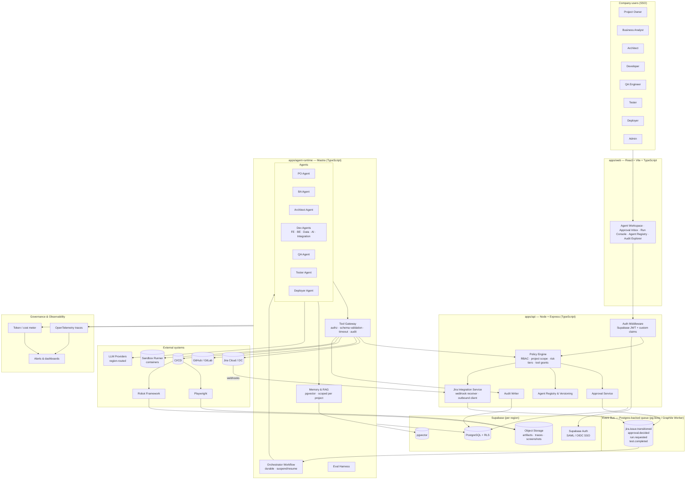
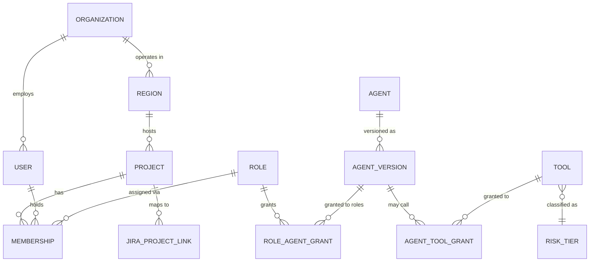
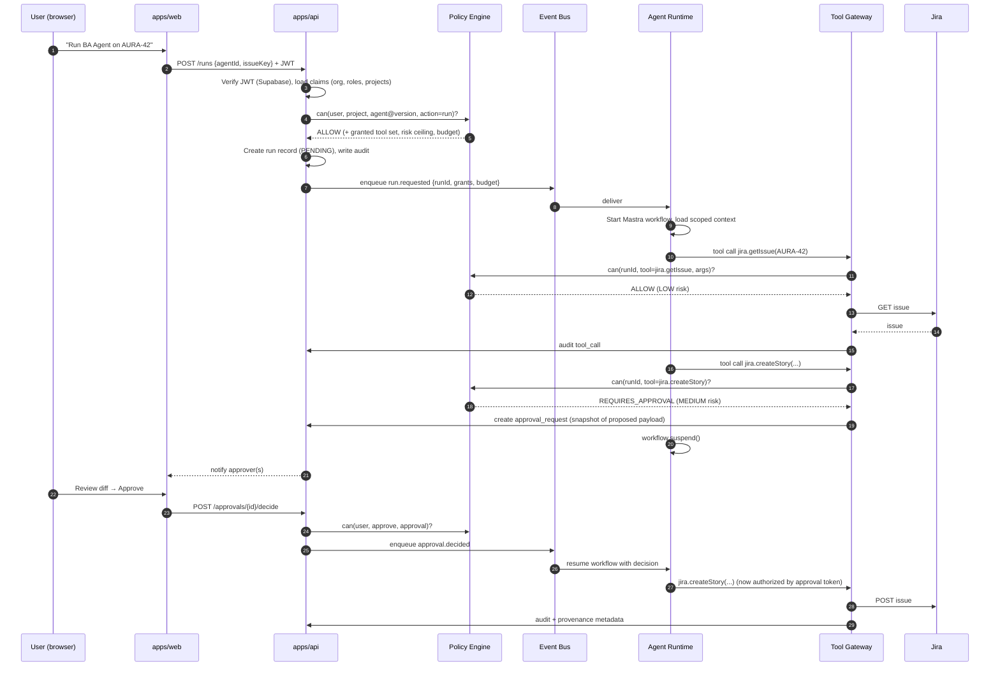
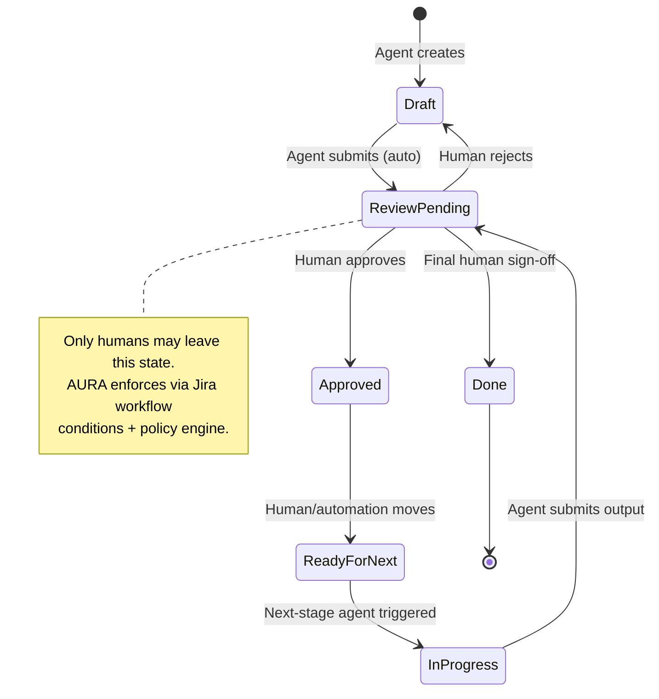
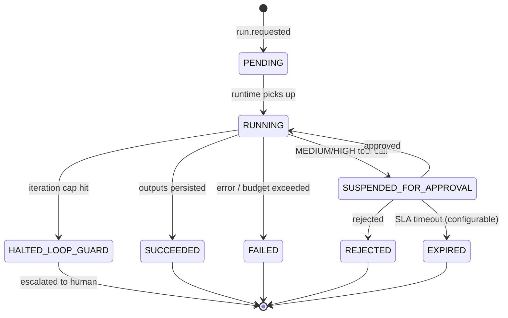
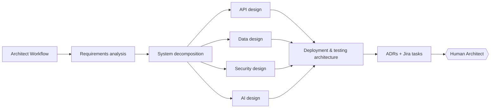
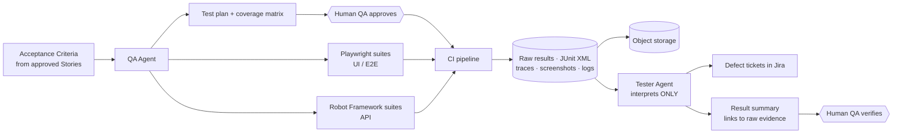
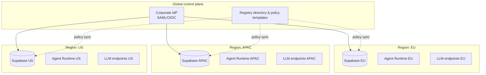
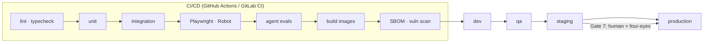

# AURA — Enterprise AI Agent Orchestration Platform

> **Status:** Draft v0.2, architecture baseline reconciled with the Phase 1 implementation
> **Owner:** Platform Architecture
> **Last updated:** 2026-09-17

---

## 0. Project name

**AURA** — AI Unified Resource & Automation, by Dialog.

AURA is a platform, not a single agent: the name reads as infrastructure that sits above the Orchestrator, BA, Architect, Developer, QA, Tester, and Deployer agents, not as one more bot in the lineup. "Unified" reflects the monorepo/centralized-platform shape; "Automation" states the purpose plainly; and the name has room to grow beyond software delivery if AURA is extended to other Dialog workflows later.

Package/CLI namespace: `@aura/agents`, `aura run`, `AURA-1234` as a Jira issue prefix.

> Run a trademark and domain check in every operating region before committing to the name externally.

---

## 1. Executive summary

AURA is an **enterprise AI agent orchestration and software-delivery platform**. It coordinates specialised AI agents (Project Owner, BA, Architect, Developer, QA, Tester, Deployer) across the software development lifecycle, uses **Jira as the single system of record for work**, enforces **role- and project-based access control outside the LLM**, gates every consequential action behind **human approval**, and maintains **complete provenance** from business requirement to production deployment.

### The five non-negotiable principles

1. **Agents propose; deterministic systems decide.** Authorization, risk classification, state transitions, test execution, and audit are never delegated to a prompt.
2. **Jira is the work state machine.** Agents are triggered by Jira status transitions and write back to Jira. AURA never becomes a second project-management system.
3. **Human-in-the-loop is a workflow primitive, not a UI feature.** Every agent stage ends in a durable `SUSPENDED_FOR_APPROVAL` state; nothing continues without a recorded human decision.
4. **Every tool call is authorized, validated, bounded, and logged.** The LLM cannot call anything the policy engine hasn't granted for *this user, this project, this agent version, this run*.
5. **Evidence over assertion.** An agent may never claim a test passed, a deployment succeeded, or a requirement is met without a machine-generated artifact backing the claim.

---

## 2. What changed from the previous design (and why)

| Previous decision | AURA decision | Reason |
|---|---|---|
| Agents chained via orchestrator calls | **Event-driven**: Jira webhooks → event bus → durable workflow | Removes tight coupling; Jira remains the trigger; runs are resumable and idempotent |
| Approval "column" in Jira only | Approval is **both** a Jira transition **and** an AURA `approval_requests` record with signature, timestamp, and diff | Jira alone cannot record *what* was approved (the exact agent output snapshot) |
| RBAC described as a list | **Policy engine** (deterministic, testable) that evaluates `user × project × agent × tool × risk tier × environment` | Single source of authorization truth; unit-testable; auditable |
| Single API process running everything | API and **Agent Runtime split into separate services** on a shared queue | LLM work is long-running and bursty; must not block or crash the API; can be scaled and cost-capped independently |
| Express vs Go left partially open | **TypeScript everywhere**; Go reserved for a future optional sandbox-runner | Shared types across web/API/agents; Mastra is TS-native; no proven need for Go yet |
| Generic "guardrails" | **Explicit loop guards, cost budgets, prompt-injection boundary, and per-agent eval suites** | Concrete, enforceable mitigations for the cascading-hallucination risk |
| Single-tenant assumption | **Multi-tenant, multi-region** from day one: org → region → project | Multinational deployment: data residency, SSO federation, regional LLM routing |
| Orchestrator as a deterministic `jira_status → agent` lookup table (v0.1) | **Orchestrator is an agent** that decides the sequence dynamically; determinism moves to its tools (structured drafts, filing in code, approval flag) and to the API policy (who may run, who may answer) | Decided during Phase 1 (2026-09-17): the value of the Orchestrator is judgement about what to do next; the risk of a model deciding is contained by giving it no way to act except through validated tools and human gates |

---

## 3. Platform architecture

### 3.1 Layered view



### 3.2 Service responsibilities

| Service | Owns | Does **not** own |
|---|---|---|
| `apps/web` | UX for humans: approval inbox, run console, diff viewer, registry admin | Any authorization logic (display-only) |
| `apps/api` | AuthN/AuthZ, policy, approvals, Jira webhook ingestion, registry, audit, REST API | LLM calls, long-running work |
| `apps/agent-runtime` | Mastra workflows/agents, tool gateway, memory/RAG, evals | User authentication, direct DB writes to governance tables (goes through API/queue) |
| Event bus | Durable, at-least-once delivery between API and runtime | Business logic |
| Supabase | Identity (SSO), Postgres, RLS, vectors, artifact storage | Application logic |
| Jira | Work items, statuses, assignments, comments — **the source of truth for work** | Agent state, approvals' content snapshots, audit |

### 3.3 Why TypeScript / Express, and where Go might still appear

The whole stack — React, Vite, Mastra, Supabase clients — is TypeScript. Express keeps one language, one type system, one validation layer (Zod schemas shared across web, API, and agent tools). Fastify or NestJS are equally acceptable if the team prefers; the architecture does not depend on the HTTP framework.

Go is **not** in the initial build. The one place it may be justified later is the **Sandbox Runner** (isolated container execution for Dev-agent code and test runs), where a small, static binary with tight resource control is attractive. Introduce it only with a measured need.

---

## 4. Authorization model

### 4.1 Entities



### 4.2 Roles → agents (default grants)

| Role | Agents accessible | Notes |
|---|---|---|
| Project Owner | PO, BA (read), Orchestrator dashboard | Approves Epics |
| Business Analyst | BA, PO (read) | Approves Stories / AC / DoD |
| Architect | Architect, BA (read), Dev (read) | Approves architecture tasks & ADRs |
| Developer | Dev sub-agents scoped to their discipline (FE/BE/Data/AI/Integration), Architect (read) | Reviews & merges PRs |
| QA Engineer | QA, Tester, Dev (read) | Approves test plans; verifies results |
| Tester | Tester | Executes/curates suites |
| Deployer | Deployer, QA (read) | Approves releases; cannot approve own high-risk deploy (four-eyes) |
| Admin | Registry, Policy, all agents (read) | Cannot bypass approval gates |

Grants are **data**, not code, and are editable per organization/project through the Registry UI with full audit.

### 4.3 Authorization flow (every request, every tool call)



Key properties:

- The **runtime never holds user credentials**. It receives a signed grant bundle for a single run.
- Tool arguments are **schema-validated** (Zod) *before* the policy check; the LLM cannot smuggle extra fields.
- Approval tokens are **single-use and bound to a payload hash**. If the agent changes the payload after approval, the tool call fails.

### 4.4 Risk tiers

| Tier | Behaviour | Examples |
|---|---|---|
| 🟢 LOW | Auto-execute, logged | Read Jira/Git/docs, analyse, draft documents, generate test *cases*, run tests in an ephemeral sandbox |
| 🟡 MEDIUM | Prepare → human approval → execute | Create/modify Jira issues, open PRs, add migrations to a PR, run suites against a shared QA env |
| 🔴 HIGH | Human approval **plus** four-eyes (approver ≠ requester), plus optional change window | Production deploy, destructive DB ops, secret/config changes, merges to protected branches, external communications |
| ⛔ FORBIDDEN | Not callable by any agent | Delete projects, modify policy/grants, alter audit logs, read secret values |

Tiers are attached to **tools**, optionally overridden per environment (a `deploy` tool is MEDIUM in `dev`, HIGH in `prod`).

---

## 5. Human-in-the-loop workflow

### 5.1 Lifecycle with gates

```mermaid
flowchart TD
    REQ([Business requirement from PO]) --> PO_A[PO Agent<br/>drafts Epic: objective, scope, stakeholders, priority]
    PO_A --> G1{{Gate 1<br/>Human PO approves Epic}}
    G1 -- reject --> PO_A
    G1 -- approve --> J1[(Jira: Epic created<br/>status: Ready for Analysis)]

    J1 --> BA_A[BA Agent<br/>As-Is / To-Be · Stories · AC · DoD · NFRs · risks]
    BA_A --> G2{{Gate 2<br/>Human BA approves Stories}}
    G2 -- reject --> BA_A
    G2 -- approve --> J2[(Jira: Stories created<br/>status: Ready for Architecture)]

    J2 --> AR_A[Architect Agent<br/>decomposition · API · data · security · ADRs]
    AR_A --> G3{{Gate 3<br/>Human Architect approves ADRs & tasks}}
    G3 -- reject --> AR_A
    G3 -- approve --> J3[(Jira: Architecture tasks<br/>status: Ready for Development)]

    J3 --> DEV_A[Dev Agents<br/>code in sandbox → branch → PR linked to task]
    DEV_A --> G4{{Gate 4<br/>Human code review & merge}}
    G4 -- changes requested --> DEV_A
    G4 -- merged --> J4[(Jira: task → In QA)]

    J4 --> QA_A[QA Agent<br/>test plan · Playwright/Robot suites from AC]
    QA_A --> G5{{Gate 5<br/>Human QA approves test plan}}
    G5 -- reject --> QA_A
    G5 -- approve --> EXEC[CI executes suites<br/>machine-generated results + traces]

    EXEC --> TS_A[Tester Agent<br/>interprets results · files defects · flags flakiness]
    TS_A --> G6{{Gate 6<br/>Human QA verifies results}}
    G6 -- defects --> DEV_A
    G6 -- pass --> J5[(Jira: story → Ready for Release)]

    J5 --> DP_A[Deployer Agent<br/>release notes · change plan · rollback plan]
    DP_A --> G7{{Gate 7<br/>Human Deployer + second approver<br/>change window check}}
    G7 -- reject --> DP_A
    G7 -- approve --> PROD[(Production deploy via CI/CD<br/>with automatic rollback trigger)]
    PROD --> J6[(Jira: Done · release linked)]

    style G1 fill:#fde68a,stroke:#b45309
    style G2 fill:#fde68a,stroke:#b45309
    style G3 fill:#fde68a,stroke:#b45309
    style G4 fill:#fde68a,stroke:#b45309
    style G5 fill:#fde68a,stroke:#b45309
    style G6 fill:#fde68a,stroke:#b45309
    style G7 fill:#fca5a5,stroke:#b91c1c
```



### 5.2 Jira status machine (per issue type)

AURA installs a standard workflow in each linked Jira project. Agents are triggered **only** by transitions into `Ready for *` states; agents may move issues **only** into `* Review` states; humans own every `Approved`/`Ready for` transition.



### 5.3 Agent run state machine (AURA-internal)



Every run stores: agent version, prompt version, model + version, tool versions, full input snapshot, full output snapshot, token/cost, trace ID, approver identities, and the Jira/Git artifacts it touched.

---

## 6. Agent layer

### 6.1 Agent contract (declarative, stored in the Registry)

Every agent is defined as data — not a free-text prompt — and versioned.

```yaml
id: architect
version: 2.3.1
status: ACTIVE            # DRAFT | CANARY | ACTIVE | DEPRECATED
owner: architecture-guild
purpose: Produce technical architecture from approved Jira stories
model:
  primary: { provider: anthropic, model: claude-sonnet-4-6, region: eu }
  fallback: { provider: openai, model: gpt-5-mini, region: eu }
prompt_ref: prompts/architect@14
inputs:
  - jira.story[status=Ready for Architecture]
  - repo.architecture_docs
  - project.nfrs
tools:
  allow: [jira.read, jira.createTask, jira.comment, git.read, docs.write, adr.create]
  deny:  [deploy.*, db.execute, secrets.*]
outputs:
  - architecture_document
  - adr[]
  - jira.task[]
approval:
  required_role: architect
  four_eyes: false
budget:
  max_tokens_per_run: 400000
  max_cost_usd_per_run: 6.00
  max_tool_calls: 60
  max_iterations: 12
evals:
  suite: evals/architect
  min_score_to_promote: 0.85
```

### 6.2 Agent catalogue

| Agent | Inputs | Produces | Gate |
|---|---|---|---|
| **Orchestrator** | Human brief, gate answers | Delegation choices, questions to humans (`ask_user`) | Every `ask_user` pause; the API decides which role answers |
| **PO** | Free-text requirement, stakeholder list | Epic draft with objective, scope, success metrics | Human PO |
| **BA** | Approved Epic | Stories, AC, DoD, BRD/FRD sections, process map (BPMN/Mermaid), risks, priority | Human BA |
| **Architect** | Approved Stories, existing architecture, NFRs | Decomposition, API/data/security/AI/integration/deployment design, ADRs, architecture tasks | Human Architect |
| **Dev — Frontend** | Architecture task, design system | Branch + PR (React/Vite/TS) | Human reviewer |
| **Dev — Backend** | Architecture task, API spec | Branch + PR (Express/TS) | Human reviewer |
| **Dev — Data** | Architecture task, schema | Migration PR, RLS policies | Human reviewer + DBA for prod |
| **Dev — AI** | Architecture task | Mastra agents/tools/evals PR | Human reviewer |
| **Dev — Integration** | Architecture task | Connector PR (Jira, CRM, ERP, email…) | Human reviewer |
| **QA** | Stories + AC + DoD | Test plan, Playwright (UI) & Robot Framework (API) suites, coverage matrix | Human QA |
| **Tester** | CI results, traces, screenshots | Result interpretation, defect tickets, flakiness report | Human QA |
| **Deployer** | Approved release candidate | Release notes, change plan, rollback plan, deployment execution request | Human Deployer + second approver |

The **Orchestrator is a Mastra agent** (`apps/agent-runtime/src/mastra/agents/orchestrator.ts`). It decides dynamically which agent to delegate to and when to pause for a human; nothing in `apps/api` or `apps/web` encodes a step order. What contains the risk of a model deciding:

- It has exactly three tools: `ask_user`, `delegate_to_po`, `delegate_to_ba`. It cannot reach Jira, memory, or anything else.
- Delegate tools validate every call, keep drafts by id (the Orchestrator never restates draft text), and refuse `file` without `approved=true`.
- The PO and BA agents hold **no tools**; they return structured JSON against Zod schemas (`contracts/drafts.ts`). Rendering and filing are code.
- The API records every delegation, tool result, and pause as run steps and decides in code which role may answer a pause (`apps/api/src/modules/policy/policy.ts`).

A hallucinated step therefore produces at worst a wrong delegation that a human sees and rejects, never a wrong write.

### 6.3 Sub-agent pattern

Large agents (Architect, BA) decompose into sub-steps inside one workflow rather than spawning independent agents. Each sub-step has its own tool grants and output schema. This keeps context small and outputs structured.



---

## 7. Tool gateway

All external effects go through one gateway. No agent has raw SDK access.

```
Tool call
  ├─ 1. Schema validation (Zod) — reject unknown/extra args
  ├─ 2. Policy check — user grant ∩ agent grant ∩ project scope ∩ env tier
  ├─ 3. Risk tier → auto | suspend for approval | deny
  ├─ 4. Idempotency key — safe retries, no duplicate Jira issues
  ├─ 5. Timeout + circuit breaker per external system
  ├─ 6. Execute via typed adapter (jira / git / ci / sandbox / docs)
  ├─ 7. Audit record (args hash, result hash, duration, cost)
  └─ 8. Provenance stamp on created artifacts
```

**Phase 1 status (2026-09-17).** There is no separate gateway service yet. Steps 1, 3 (as the `approved` flag), 4 (idempotent filing keyed on the stored draft), 6, and 8 are implemented inside the delegate tools in `apps/agent-runtime`; step 2 (who may run, who may answer) and step 7 (audit) are implemented in `apps/api`. Timeouts and circuit breakers (step 5) are not yet in place beyond a per-turn ceiling in the API. Sub-agents have no tools at all, which is stronger than a gateway for Phase 1.

Provenance stamp written to every Jira issue / PR / document created by an agent:

```
Created by:  AURA · BA Agent v1.4 · prompt@9 · claude-sonnet-4-6
Run:         run_01J8ZK... (trace: 3f9a...)
Source:      AURA-42 (Epic)
Approved by: j.perera@company.com · 2026-09-16T08:41Z
```

### 7.1 Prompt-injection boundary

Jira ticket text, PR descriptions, and repository contents are **untrusted input**. The runtime wraps them as data, never as instructions; tool calls are validated regardless of what the content asks for; and the policy engine, not the prompt, is the boundary. A malicious ticket saying "deploy to production" cannot produce a deploy — the tool isn't granted and the tier requires approval anyway.

---

## 8. Testing architecture



Rules:

- Tests execute in **CI or an ephemeral sandbox**, never inside the LLM's process.
- A `test_results` row is written **by the CI reporter**, not by an agent. Agents have read-only access to it.
- The Tester Agent's output is labelled `AI interpretation` and stored separately from `machine result`.
- Test evidence is retained per regional policy and linked from Jira (Xray/Zephyr optional).

---

## 9. Data architecture

### 9.1 Core schema (Supabase Postgres, RLS on every table)

```
identity        organizations · regions · users · memberships · roles · role_agent_grants
registry        agents · agent_versions · prompts · tools · agent_tool_grants · risk_tiers
projects        projects · jira_project_links · environments
runs            workflow_runs · run_steps · tool_calls · run_costs
approvals       approval_requests · approval_decisions
artifacts       documents · adrs · requirements · test_plans · test_suites · test_results · releases
memory          embeddings (pgvector, scoped by project_id)
governance      audit_logs (append-only) · policy_versions
```

**Phase 1 status (2026-09-17).** In place in Supabase: `profiles` (identity), `workflow_runs`, `run_steps`, `approval_requests`, `approval_decisions`, `audit_logs` (append-only by trigger). Owned by the runtime's own storage and referenced by id from Supabase: memory threads and messages (Mastra libSQL) and the draft store (`aura-drafts.db`). Registry, projects, artifacts, and memory embeddings tables are not yet created.

### 9.2 RLS strategy

- Every row carries `org_id`, `region_id`, `project_id`.
- JWT custom claims: `org_id`, `roles[]`, `project_ids[]`.
- RLS policies enforce project scope in the DB even if the API has a bug.
- `audit_logs` is **insert-only**: no `UPDATE`/`DELETE` grants for any role, including service role in production.

### 9.3 Multi-region



- Project data, embeddings, artifacts, and LLM calls stay in the project's region.
- Agent definitions and policy templates are global; **grants are regional**.
- Regional LLM routing satisfies data-residency requirements (EU data never leaves EU endpoints).

---

## 10. Reliability, safety, and cost controls

| Concern | Control |
|---|---|
| Cascading hallucination | Human gate after every stage; agents consume only *approved* upstream artifacts (`status = Approved`) |
| Agent ping-pong (Dev ↔ Tester) | `max_iterations` per ticket (default 3) → `HALTED_LOOP_GUARD` → human escalation |
| Runaway cost | Per-run and per-project daily budgets enforced in the tool gateway; hard stop, not warning |
| Duplicate Jira issues on retry | Idempotency keys on all write tools; at-least-once queue + idempotent handlers |
| External outage (Jira/Git/LLM) | Circuit breakers, exponential backoff, model fallback, run remains `RUNNING` and resumes |
| Approval starvation | SLA timers → `EXPIRED`; escalation to role backup; never auto-approve |
| Model/prompt drift | Agent versioning + eval suite; `CANARY` status routes a percentage of runs; promotion requires eval score ≥ threshold **and** human sign-off |
| Secrets | Runtime receives short-lived, scoped tokens per run; no secret values in prompts, logs, or memory |
| Context overflow | RAG over project-scoped embeddings; sub-step decomposition; structured outputs; no "stuff the whole epic in" |
| Sandboxed code execution | Dev-agent code runs in ephemeral containers with no network except allow-listed registries; never on shared infra |

---

## 11. Observability

- **Traces:** OpenTelemetry from web → API → queue → runtime → tool → external; Mastra tracing exported to the same backend. One `trace_id` per run, surfaced in Jira comments.
- **Metrics:** runs by state, approval latency, gate rejection rate per agent, cost per run/project/region, tool error rate, eval scores per version.
- **Logs:** structured JSON, PII-redacted, retained per region.
- **Dashboards:** Approval SLA, agent quality (rejection rate is the key signal — a rising rejection rate means the agent version is regressing), spend.
- **Alerts:** budget breach, loop guard hits, approval SLA breaches, circuit breaker open, RLS policy violations.

---

## 12. Deployment architecture



- Containerised services: `web`, `api`, `agent-runtime`, `sandbox-runner`.
- Infra as code (Terraform) per region; Supabase managed.
- Blue/green or canary for `api` and `agent-runtime`; automatic rollback on health-check failure.
- Agent **version** promotion is a deployment in its own right, gated the same way as code.

---

## 13. Monorepo layout

Current layout (2026-09-17). Each app is a standalone npm project; there is no root workspace tooling.

```
aura/
├── apps/
│   ├── web/                 # React + Vite + TS: app/ shared/ features/ (see apps/web/README.md)
│   ├── api/                 # Express + TS: config/ lib/ middleware/ modules/ routes/ (see apps/api/README.md)
│   │   └── supabase/        # migrations 0001 identity, 0002 runs/approvals/audit
│   └── agent-runtime/       # Mastra: agents/ tools/ contracts/ store/ mcp/ (see apps/agent-runtime/README.md)
└── docs/
    ├── ARCHITECTURE.md      # this file
    ├── srs/
    ├── adr/ security/ runbooks/ workflows/
    └── logs/                # one file per working day
```

Deferred until there is real cross-app duplication: `packages/` (contracts, policy, db, agents, tools, workflows, evals, ui, telemetry), `tests/`, `infra/`, and `apps/sandbox-runner`. Today the Zod contracts live next to their consumers (`apps/api/src/modules/*`, `apps/agent-runtime/src/mastra/contracts`), and the policy engine is `apps/api/src/modules/policy/policy.ts`.

---

## 14. Phased delivery plan

| Phase | Scope | Exit criteria |
|---|---|---|
| **0 — Foundations** (4–6 wks) | Monorepo, SSO, RBAC + policy engine, Supabase schema + RLS, audit log, Jira webhook ingestion, approval service, run state machine | A human can trigger a no-op agent, see it suspend, approve, and see audit + provenance |
| **1 — PO + BA** (4 wks) | PO and BA agents, Epic/Story creation with gates, registry v1, evals v1 | BA-generated stories approved in a real project; rejection rate tracked |
| **2 — Architect + QA/Tester** (6 wks) | Architect agent, ADRs, QA test-plan generation, Playwright/Robot suites, CI result ingestion, Tester interpretation | End-to-end from Epic to executed tests with evidence links |
| **3 — Dev agents** (6–8 wks) | Sandbox runner, FE/BE/Data sub-agents, PR creation, loop guards | PRs merged after human review; zero direct pushes |
| **4 — Deployer + multi-region** (6 wks) | Deployer agent, four-eyes, change windows, second region, regional LLM routing | Production release through Gate 7; EU/APAC residency verified |
| **5 — Hardening** (ongoing) | Canary agent versions, cost optimisation, advanced RAG, integrations (CRM/ERP/Slack) | Eval-gated promotion in place; SOC2/ISO evidence exportable from audit |

**Status (2026-09-17).** Phase 0: identity and RBAC, policy tables, Supabase schema with RLS, audit log, approval service, and the run state machine are in place; SSO federation, Jira webhook ingestion, and the queue are not. Phase 1: PO and BA agents, Epic and Story drafting with Gates 1 and 2, and the registry view are built; evals and a real-project rejection-rate measurement are not. See `docs/logs/`.

---

## 15. Open decisions (to be captured as ADRs)

1. Queue: pg-boss (simplest, one datastore) vs BullMQ + Redis (higher throughput) — **recommend pg-boss to start**.
2. Policy engine: in-house TS (pure functions) vs Cedar/OPA — **recommend in-house TS with exhaustive tests; migrate to Cedar if policies grow beyond ~50 rules**.
3. Jira test management: plain issues vs Xray/Zephyr.
4. Sandbox isolation: Docker-in-CI vs Firecracker/gVisor for Dev-agent code.
5. Eval tooling: Mastra evals vs Langfuse/Braintrust.
6. Vector store: pgvector (recommended for residency simplicity) vs external.
7. Orchestrator as an agent with deterministic tools, replacing the v0.1 lookup-table workflow. Decided in practice on 2026-09-17, ADR pending.
8. Draft store: runtime-owned libSQL file (current) vs a Supabase table. The current choice keeps the runtime self-contained. Revisit when the API needs to read drafts directly.

---

## 16. Glossary

| Term | Meaning |
|---|---|
| **Gate** | A durable workflow suspension that only a human with the right role can resolve |
| **Grant** | A (role, agent version, tool) tuple stored in the Registry |
| **Run** | One execution of one agent version against one Jira issue, fully traced |
| **Provenance stamp** | Metadata written onto every artifact an agent creates |
| **Risk tier** | LOW / MEDIUM / HIGH / FORBIDDEN classification attached to a tool |
| **Four-eyes** | Approver must differ from requester; required for HIGH tier |
| **Loop guard** | Hard cap on agent iterations per ticket before human escalation |
