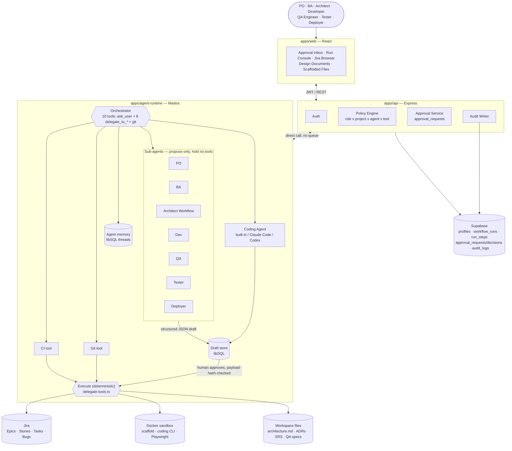

# AURA — Enterprise AI Agent Orchestration Platform

> **Status:** v0.3 — rewritten to separate what is built from what is planned
> **Owner:** Platform Architecture
> **Last updated:** 2026-09-23

This document describes the **built system** first, then lists everything
planned but not implemented in one place: [Section 5 — Pending (Future)](#5-pending-future).
If a capability isn't mentioned in Sections 1–4, assume it doesn't exist yet.

---

## 1. What AURA is

AURA is an AI agent orchestration platform for the software delivery
lifecycle. It coordinates specialised agents (PO, BA, Architect, Developer,
QA, Tester, Deployer), uses **Jira as the single system of record**, and
gates every consequential action behind human approval.

### Five principles

1. **Agents propose; deterministic code decides.** Authorization, risk
   classification, and audit are never delegated to a prompt.
2. **Jira is the work state machine.** Agents react to Jira transitions and
   write back to Jira; AURA is not a second project-management system.
3. **Human-in-the-loop is a workflow primitive.** Every stage ends in a
   durable "waiting for approval" state; nothing continues without a
   recorded human decision.
4. **Every tool call is authorized, validated, and logged.** An agent can
   only call what the policy engine grants for *this user, project, and
   agent* — never what the model decides to try.
5. **Evidence over assertion.** An agent may never claim a test passed or a
   requirement is met without a machine-generated artifact behind it.

---

## 2. Built: system overview

### 2.1 Services

| Service | Stack | Owns |
|---|---|---|
| `apps/web` | React + Vite + TS | UI: approval inbox, run console, Jira browser, Design Documents editor, scaffolded-project file viewer |
| `apps/api` | Node + Express + TS | Auth, policy engine, approvals, Jira read/write, audit log |
| `apps/agent-runtime` | Mastra (TS) | Agents, workflows, delegate tools, draft store, workspace files |

Flow: browser → `apps/web` → `apps/api` (authorizes) → `apps/agent-runtime`
(runs the agent) → external systems (Jira, Docker, filesystem), all behind
the same approval gate.

There is **no event bus / queue yet** — API and runtime talk directly.

### Full system diagram (as built)



### 2.2 Authorization

Every role → agent grant is data in `apps/api/src/modules/policy/policy.ts`,
not a prompt:

| Role | Can run | Approves |
|---|---|---|
| Project Owner | PO | Gate 1 (Epic) |
| Business Analyst | BA | Gate 2 (Stories) |
| Architect | Architect | Gate 3 (design) |
| Developer | Dev, Coding Agent, Git | Gates 4–5 |
| QA Engineer | QA, Tester | Gates 6–7 (sole approver of both) |
| Tester | Tester | — (can run, not approve) |
| Deployer | Deployer | Gate 8 |

Risk tiers, attached to tools:

| Tier | Behaviour |
|---|---|
| 🟢 LOW | Auto-execute, logged (reads, drafts) |
| 🟡 MEDIUM | Draft → human approval → execute (Jira writes, scaffolds, code, tests) |
| 🔴 HIGH | Not used yet — reserved for production actions |
| ⛔ FORBIDDEN | Not callable by any agent |

Every gated tool call: schema-validate args (Zod) → policy check (`can(user,
project, agent, tool)`) → if MEDIUM+, create an `approval_requests` row with
a hash of the exact payload → suspend → human decides → resume with a
single-use, payload-bound approval token → execute → audit record.

The runtime never holds user credentials or raw Jira/DB access; it only
calls its own gated tools.

### 2.3 Human approval gates

One Mastra agent, **the Orchestrator**, decides which agent to delegate to
next and asks the human when it needs input (`ask_user`). It has exactly
ten tools — `ask_user` and one `delegate_to_*` per gate below, plus `git` —
and cannot reach Jira, memory, or anything else directly. A wrong decision
by the Orchestrator produces a delegation a human can reject, never a
direct write.

| Gate | Agent | Produces | Approver |
|---|---|---|---|
| 1 | PO | Epic draft | PO |
| 2 | BA | Stories, AC, DoD, risks | BA |
| 3 | Architect | Design, ADRs, architecture Tasks | Architect |
| 4 | Dev | Scaffold command explanation | Developer |
| 5 | Coding Agent | Real code in the scaffold | Developer |
| 6 | QA | Test plan + real Playwright specs | QA Engineer |
| 7 | Tester | Runs the suite for real, interprets the result | QA Engineer |
| 8 | Deployer | Release / change / rollback plan (plan only) | Deployer |

Rules:
- A gate only fires when a human asks for that stage; nothing auto-advances
  to the next gate after an approval.
- Only content approved at a gate is ever written to Jira, Docker, or disk.
- PO and BA hold no tools at all — they return structured JSON (Zod
  schemas); rendering and filing is code, not the model.

### 2.4 Agents

- **PO / BA** — draft Epics and Stories as structured JSON only; no tools.
- **Architect** — a multi-step Mastra **Workflow**, not one model call:
  requirements → decomposition → parallel API/data/security/AI design →
  deployment notes → ADRs + architecture Tasks + workspace docs. Frontend
  is fixed to React 19 + Vite; database fixed to PostgreSQL; the human
  picks the backend (NestJS or Spring Boot) before drafting starts. Design
  docs (`architecture.md`, `plan.md`, ADRs, SRS) are written to
  `<AURA_WORKSPACE_ROOT>/<epicKey>/architecture/` only after Gate 3 approval,
  and are editable by an Architect through the Design Documents page (no
  version history on manual edits).
- **Dev (Gate 4)** — explains, but does not choose, a fixed scaffold command
  read from the Task's own discipline field. **Frontend and Backend/NestJS
  are implemented and verified** (real Docker run, correct file ownership).
  Backend/Spring Boot, Data, AI, Integration, and Deployment are **not
  implemented** — the tool fails clearly rather than doing nothing. Runs in
  an ephemeral, non-root Docker container mounted only to that Task's own
  workspace directory.
- **Coding Agent (Gate 5)** — implements the scaffolded Task. Three
  interchangeable providers behind the same draft/approve/execute flow:
  - **AURA's own built-in agent** (default, no external account) — three
    file tools only (`list_files`/`read_file`/`write_file`), no shell
    access, every path checked to stay inside the Task's own directory.
    Verified end-to-end with a real model and file.
  - **Claude Code** / **Codex** — external CLIs, authenticated via the
    developer's own CLI login on the host (no API key stored by AURA), run
    non-interactively inside the same Docker sandbox as Gate 4. Built and
    typechecked; **CLI execution has not been verified end-to-end.**
  - No git branch/PR automation at any provider.
- **QA (Gate 6)** — drafts a test plan and real Playwright spec files from
  the Epic's approved Stories. Only Frontend and Backend/NestJS are
  supported (the disciplines Gate 4 can scaffold).
- **Tester (Gate 7)** — starts the scaffolded app for real and runs the
  suite in Docker; the pass/failed/skipped counts come from Playwright's
  own JSON output, read by code. The agent only interprets that result —
  it never decides pass/fail itself. On failure, it can file a real Jira
  Bug under the Epic and route the Task back to the developer.
- **Deployer (Gate 8)** — produces a release note, change plan, and
  rollback plan only. There is no execute mode and no deployment pipeline.
- **Git tool** — local `init`/`branch`/`commit` (gated) and `status`/`diff`
  (ungated, read-only). No push, no PR, no GitHub/GitLab integration of any
  kind exists.
- **CI tool** (`delegate_to_ci`) — re-runs a scaffolded project's own local
  checks (not per-Task) inside the same Docker sandbox, and can file a Jira
  Bug on failure. "CI" here means this local run; there is no external CI
  system involved.

### 2.5 Testing

Tests run for real, in AURA's own Docker sandbox — there is no CI pipeline
and no Robot Framework.

- Real Playwright specs are filed under `.workspaces/<epicKey>/qa/` and
  copied into the scaffolded project's own test directory.
- Tester's `execute` starts the app and runs the suite in the same sandbox
  Gates 4–5 use; the JSON result is stored on the draft record, not
  invented by the model.
- On `failed > 0`, the Orchestrator can file a Jira Bug with the failure
  detail and move the Task back for rework. Retesting is manual — nothing
  re-runs automatically.
- A developer or QA Engineer can hand-edit scaffolded or QA files directly
  through the web UI (audited as `workspace.file.edit`, no version history).

### 2.6 Data

Built, in Supabase Postgres:
`profiles`, `workflow_runs`, `run_steps`, `approval_requests`,
`approval_decisions`, `audit_logs` (append-only — a DB trigger blocks
`UPDATE`/`DELETE`, including for the service role).

Owned by the runtime, not Supabase:
- Memory threads/messages — Mastra libSQL.
- Drafts — a local `aura-drafts.db` (libSQL) file.
- Design docs, scaffolds, QA specs — plain files under
  `<AURA_WORKSPACE_ROOT>/<epicKey>/...`, referenced by path from Jira.

Project scope (who can see/run what) is enforced entirely in
`policy.ts` — there is no per-row database enforcement yet.

### 2.7 Provenance and audit evidence

Every filed/revised Jira artifact (Epic, Story, architecture Task, dev
scaffold, coding-agent change, QA plan, test result, defect, release plan,
git op, CI run) carries a full provenance stamp: producing agent id, agent
version, prompt version, model (or provider) id, draft id/version, and the
thread id it was produced in (the run/trace correlator — the same value
`workflow_runs.thread_id` carries, so an artifact can be traced back to its
exact run and approval history). `apps/agent-runtime/src/mastra/agents/registry.ts`
is the source of truth for agent/prompt versions, bumped by hand alongside
the agent's tool/prompt file; `tools/delegate-tools/shared.ts` renders the
stamp into Jira content and returns the same data as a structured
`provenance` field on the tool's result, which `apps/api`'s
`orchestration/run-stream.service.ts` already mirrors verbatim into
`run_steps.payload` — no separate plumbing needed to make it durable and
queryable.

`GET /audit/export` (admin-only) produces a downloadable evidence bundle
(JSON or CSV) from `audit_logs` for SOC2/ISO reviews: unpaginated within a
50,000-row safety cap, framed with an export manifest (who pulled it, when,
under what filter, and a note that the table is DB-enforced append-only),
and the export itself is audited (`audit.exported`).

### 2.8 Monorepo layout

```
aura/
├── apps/
│   ├── web/            React + Vite + TS
│   ├── api/             Express + TS (+ supabase/migrations)
│   └── agent-runtime/   Mastra: agents/ tools/ contracts/ store/ workflows/ workspace/ server/
└── docs/
    ├── ARCHITECTURE.md  this file
    ├── srs/ adr/ security/ runbooks/ workflows/
    └── logs/            one file per working day
```

Each app is a standalone npm project; there is no root workspace tooling
and no `packages/` directory yet (Zod contracts live next to their
consumers).

---

## 3. Delivery status by phase

| Phase | Built | Not built |
|---|---|---|
| 0 — Foundations | Identity/RBAC, policy tables, Supabase schema + RLS trigger, audit log, approval service, run state machine | SSO federation, Jira webhooks, event queue |
| 1 — PO + BA | PO/BA agents, Gates 1–2, registry view | Evals, rejection-rate tracking |
| 2 — Architect + QA/Tester | Architect workflow, ADRs, architecture Tasks (Gate 3), QA + real Playwright execution (Gates 6–7) | Robot Framework (out of scope), CI integration |
| 3 — Dev + Coding + Deployer | Frontend + Backend/NestJS scaffold (Gate 4), Coding Agent (Gate 5), Deployer plan (Gate 8) | Other disciplines, git PR automation, real deploy pipeline |
| 4 — Multi-region | — | Everything |
| 5 — Hardening | — | Everything |

---

## 4. Glossary

| Term | Meaning |
|---|---|
| **Gate** | A durable workflow suspension only a human with the right role can resolve |
| **Grant** | A (role, agent, tool) permission tuple in `policy.ts` |
| **Run** | One execution of one agent against one Jira issue |
| **Risk tier** | LOW / MEDIUM / HIGH / FORBIDDEN classification on a tool |
| **Draft** | A structured, unfiled agent output awaiting approval |

---

## 5. Pending (Future)

Everything below is design intent, not running code.

### Improvements to plan — reliability, scale & enterprise hardening

The gaps below are grouped by category. This is the priority order to close
them, and why each one matters for turning AURA from a working prototype
into a reliable, scalable, enterprise-grade platform.

**1. Reliability — survive failure without losing state**
- Durable event bus (pg-boss) between API and runtime, so a crashed runtime
  resumes a suspended run instead of losing it — today a process restart
  mid-run drops the run.
- Loop guards (`max_iterations` → `HALTED_LOOP_GUARD`) and circuit
  breakers/backoff on Jira, Docker, and LLM calls, so one flaky external
  call doesn't fail an entire run.
- Idempotency keys on every write tool, so an at-least-once queue can retry
  safely without duplicate Jira issues.

**2. Scalability — beyond one runtime process**
- Move the Draft store and agent memory off local libSQL files onto shared
  Postgres/pgvector, so `apps/agent-runtime` can run as multiple horizontally
  scaled workers instead of one process holding local state.
- Extract the Sandbox Runner (Docker execution) into its own pooled service,
  so scaffold/coding/test runs don't compete for one host's containers.
- Split long-running agent work onto a worker queue instead of holding an
  HTTP request open for the duration of a run.

**3. Enterprise readiness — the parts a buyer will ask for**
- Multi-tenant data model: `org_id`/`region_id`/`project_id` on every table,
  enforced by RLS at the DB layer — today scope is enforced only in
  `policy.ts`, a single point of failure.
- SSO/SAML federation and per-region deployment for data residency.
- ~~Full provenance stamp (agent version, prompt version, model + version,
  run/trace ID) on every artifact, and exportable audit evidence for
  SOC2/ISO reviews.~~ Built — see section 2.7.
- Server-enforced cost budgets per run/project/org, not just recorded cost.

**4. AI harness — hardening the agent control plane itself**
This is the part worth the most engineering investment: not more agents,
but a stronger, auditable boundary around the ones that exist.
- Unify the Tool Gateway into one real pipeline (schema validation → policy
  → risk tier → idempotency → timeout/circuit breaker → execute → audit →
  provenance) — today these steps are split across delegate tools and
  `apps/api`, which makes the guarantee harder to verify by inspection.
- Active prompt-injection defense: today untrusted Jira/PR content is
  wrapped as data, not instructions, but there's no scanning step —
  add detection before untrusted content reaches an agent's context.
- Eval harness per agent version with regression scoring, gating
  `DRAFT → CANARY → ACTIVE` promotion on a score threshold *and* human
  sign-off, so a prompt/model change can't silently regress an agent.
- Replayable run traces (OpenTelemetry, one `trace_id` per run) so any
  agent decision — not just its Jira comment — can be reproduced and
  audited after the fact.
- Model/provider abstraction with automatic fallback and region-aware
  routing, so a single LLM provider outage doesn't stop every agent.

**Platform**
- Event bus / durable queue (pg-boss vs BullMQ+Redis) between API and runtime.
- Tool Gateway as its own service (today its steps live split across delegate tools and `apps/api`).
- Timeouts / circuit breakers beyond a per-turn ceiling.
- Agent Registry as a real service (today a static file, `agents/registry.ts`).

**Authorization & multi-tenancy**
- SSO federation (SAML/OIDC) and Jira webhook ingestion.
- HIGH risk tier and four-eyes approval (not exercised yet — no production actions exist).
- Row-level `org_id`/`region_id`/`project_id` + RLS policies (only the append-only audit trigger is DB-enforced today).
- Multi-region deployment and regional LLM routing for data residency.

**Agents**
- Dev/Coding: Backend/Spring Boot, Data, AI, Integration, Deployment disciplines.
- Git branch/PR automation; any GitHub/GitLab integration (push, PAT, Actions status).
- Claude Code / Codex execution verified end-to-end (built, not yet run for real).
- Deployer: an actual execute mode against a real deployment pipeline.
- Test-management integration (Xray/Zephyr) — defects are plain Jira Bugs today.
- Sandbox isolation beyond Docker (Firecracker/gVisor) — revisit only if AURA runs untrusted, multi-tenant workloads.

**Reliability & observability**
- Loop guards (`max_iterations` cap → human escalation).
- Cost budgets enforced in the tool gateway.
- Circuit breakers, backoff, model fallback for external outages.
- Approval SLA timers/expiry and "role has zero members" warnings.
- OpenTelemetry tracing, metrics dashboards, alerting.
- Eval harness and eval-gated agent version promotion (`CANARY` status).

**Deployment**
- CI/CD pipeline (lint, tests, evals, build, scan) for AURA itself.
- Blue/green or canary rollout for `api` and `agent-runtime`.
- Infra as code (Terraform) per region.

**Open decisions**
- Queue: pg-boss vs BullMQ + Redis.
- Jira test management: plain issues vs Xray/Zephyr.
- Eval tooling: Mastra evals vs Langfuse/Braintrust.
- Vector store: pgvector vs external.
- Draft store: keep runtime-owned libSQL vs move to a Supabase table.
