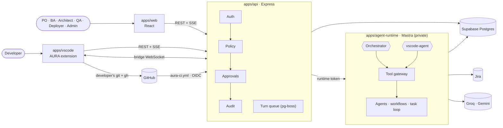
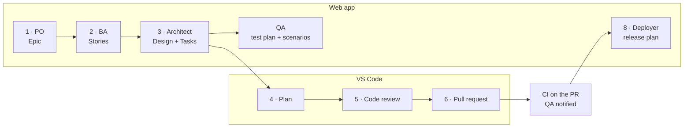
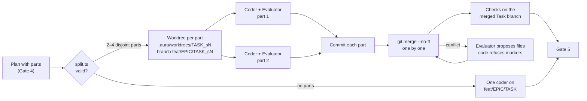
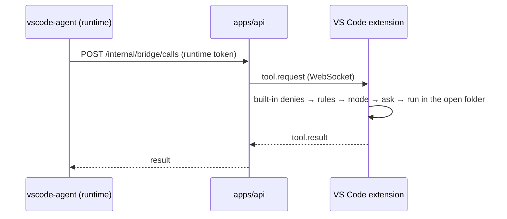
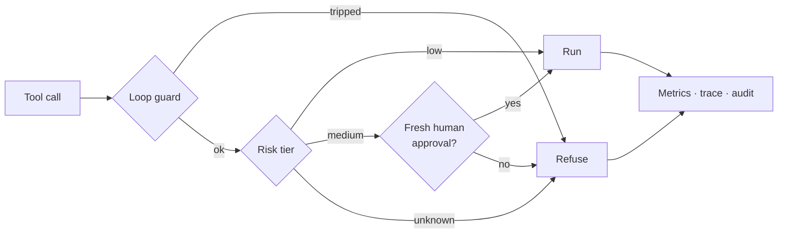
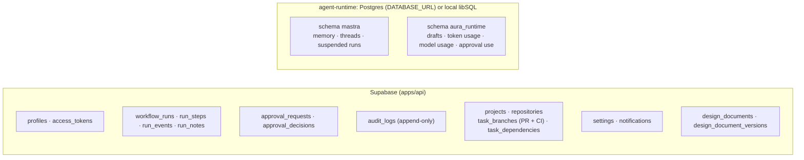
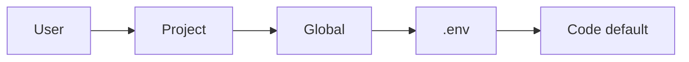
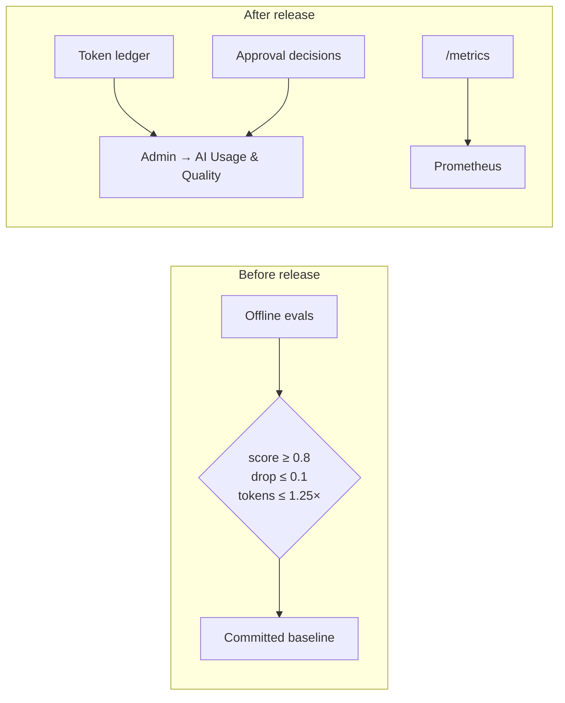

# AURA Architecture

| | |
|---|---|
| **Version** | 0.6 |
| **Updated** | 2026-10-02 |
| **Scope** | The system as it runs today. Planned work is in the [Roadmap](plans/aura-git-control-plane.md). |
| **Decisions** | [ADR-3](adr/0003-git-workflow.md) (Git workflow) · [ADR-4](adr/0004-vscode-developer-workspace.md) (VS Code workspace) |

AURA is a platform that runs AI agents across the software delivery lifecycle. Agents draft the
work, **Jira** holds the work items, and a **human approves** every step that changes something.
Developers work in **VS Code** with the AURA extension; every other role uses the **web app**.

---

## 1. Principles

| # | Principle | In practice |
|---|---|---|
| 1 | **Agents propose, code decides** | Permissions, risk, routing, merging and audit are plain code, never a prompt |
| 2 | **Jira is the source of truth for work** | Agents read from Jira and write back to Jira |
| 3 | **A human approves every change** | Every stage stops at a gate until the right person decides |
| 4 | **Every tool call is checked and logged** | Policy, risk tier, approval and audit on each call |
| 5 | **Evidence, not claims** | Check and test results come from exit codes and reports, never from a model |
| 6 | **Code stays with the developer** | The agent loop runs in the cloud; files, commands and git run in the developer's VS Code |

---

## 2. System overview

```mermaid
flowchart LR
    WEBU(["PO · BA · Architect · QA · Deployer · Admin"]) --> WEB["apps/web<br/>React"]
    DEVU(["Developer"]) --> EXT["apps/vscode<br/>AURA extension"]

    WEB -->|"REST + SSE"| API
    EXT -->|"REST + SSE"| API
    EXT <-->|"bridge WebSocket"| API

    subgraph API["apps/api · Express"]
        AUTH["Auth"] --> POL["Policy"] --> APR["Approvals"] --> AUD["Audit"]
        Q["Turn queue (pg-boss)"]
    end

    API -->|"runtime token"| RT

    subgraph RT["apps/agent-runtime · Mastra (private)"]
        ORCH{{"Orchestrator"}} --> GW["Tool gateway"]
        VSA{{"vscode-agent"}} --> GW
        GW --> AGENTS["Agents · workflows · task loop"]
    end

    API --> SUPA[("Supabase Postgres")]
    RT --> SUPA
    RT --> JIRA[("Jira")]
    RT --> LLM[("Groq · Gemini")]
    EXT -->|"developer's git + gh"| GH[("GitHub")]
    GH -->|"aura-ci.yml · OIDC"| API
```

| Part | Stack | Responsibility | Port |
|---|---|---|---|
| `apps/web` | React, Vite, Tailwind | Approvals, agent chat, runs, Jira, design documents, QA, admin | 5173 |
| `apps/api` | Express | Auth, policy, approvals, audit, settings, turn queue, bridge hub, design documents, Task PRs, CI reports, notifications | 4000 |
| `apps/agent-runtime` | Mastra 1.67 | Orchestrator, vscode-agent, agents, workflows, tool gateway, drafts | 4111 |
| `apps/vscode` | VS Code extension | Tasks, chat, gate cards, Plan / Review / PR views, permission engine, runs the agents' file and command calls | — |
| `packages/aura-bridge` | TypeScript | Bridge protocol shared by api, runtime and extension | — |
| `packages/aura-client` | TypeScript | Typed REST + SSE client used by the extension | — |

**Request path:** client → `apps/api` (who, what, audit) → `apps/agent-runtime`. Only `apps/api`
calls the runtime, and the extension talks only to `apps/api`. Each agent turn runs as a
**background job** (pg-boss when `DATABASE_URL` is set, in-process otherwise). Every event a
client sees is stored in `run_events` first, so a closed window doesn't stop a turn and a client
reconnects with `GET /runs/:id/events?after=<id>`.

---

## 3. Delivery flow

Gates 1–3 and the release plan run in the web app through the **Orchestrator**. A developer's Task
runs in VS Code through the **vscode-agent** (Gates 4–6). Each gate ends with a human decision:
**approve**, **revise** or **reject**.

```mermaid
flowchart LR
    subgraph WEBL["Web app"]
        G1["1 · PO<br/>Epic"] --> G2["2 · BA<br/>Stories"] --> G3["3 · Architect<br/>Design + Tasks"]
        QA["QA<br/>test plan + scenarios"]
        G8["8 · Deployer<br/>release plan"]
    end
    subgraph IDE["VS Code"]
        G4["4 · Plan"] --> G5["5 · Code review"] --> G6["6 · Pull request"]
    end
    G3 --> G4
    G3 --> QA
    G6 --> CI["CI on the PR<br/>QA notified"] --> G8
```

| Gate | Where | Agent | Output | Decides |
|---|---|---|---|---|
| 1 | Web | PO | Epic in Jira | Project Owner |
| 2 | Web | BA | Stories, acceptance criteria, definition of done | Business Analyst |
| 3 | Web | Architect (workflow) | Design documents, ADRs, SRS (Postgres); Tasks linked to their Stories | Architect |
| 4 | VS Code | Task Planner (vscode-agent) | Task plan, optionally split into parallel parts | The developer who started the run |
| 5 | VS Code | Coders + Evaluator | Reviewed change on the Task branch | The developer |
| 6 | VS Code | Git agent (code) | Pull request to `development` | The developer |
| QA | Web | QA | Test plan and scenarios (Postgres) | QA Engineer |
| 8 | Web | Deployer | Release, change and rollback plan (plan only) | Deployer |

Rules:
- A gate runs only when a person asks for that stage. Nothing moves forward on its own.
- Only approved content is written to Jira, design documents or git.
- Merging a PR is a human action on GitHub; AURA never merges.
- Code is written only in VS Code. The Orchestrator answers coding requests by pointing there.

---

## 4. Agents

| Agent | Lane | How it works | Tools |
|---|---|---|---|
| **Orchestrator** | Web | Chats with the user and calls the next delegate tool | `ask_user`, `delegate_to_*` |
| **PO, BA, Deployer** | Web | One structured-output call (Zod schema) | None |
| **Architect** | Web | Workflow: requirements → decomposition → frontend, API, integration, data, security and AI specialists in parallel → ADRs + Tasks | None |
| **QA** | Web | Test plan and scenarios from the Stories; the `test-writer` coder turns them into tests on the Task branch | None |
| **vscode-agent** | VS Code | The developer's agent; its workspace is the open folder, through the bridge | Workspace tools, `load_skill`, `design_docs`, Task tools |
| **Task Planner** | VS Code | The vscode-agent's plan, checked and routed by code (`delegate_to_planner`) | — |
| **Coders** | VS Code | `frontend-react`, `backend-nestjs`, `backend-spring`, `issue-solver`, `test-writer`; chosen by code (`task/router.ts`) | Workspace tools, `design_docs` |
| **Evaluator** | VS Code | Reviews the real diff and check output; different model family; never writes | None |
| **Git agent** | VS Code | Deterministic code: PR draft with provenance, commit, push, `gh pr create`, CI status | — (no model) |

Agents, versions and models are in `agent-runtime/src/mastra/agents/registry.ts`; the API's
grants are in `apps/api/src/modules/policy/policy.ts`.

### 4.1 A Task in VS Code (Gates 4–6)

```mermaid
sequenceDiagram
    actor D as Developer
    participant A as vscode-agent
    participant C as Coder (routed by code)
    participant E as Evaluator
    participant X as Extension (developer's machine)
    A->>X: read Task, design docs, code (read-only until Gate 4)
    A->>D: delegate_to_planner → Gate 4 plan
    D->>A: Approve
    A->>X: checkout feat/EPIC/TASK (from development)
    loop up to "VS Code review rounds"
        A->>C: plan + findings + developer notes
        C->>X: edit files, run commands
        A->>X: code runs the checks, reads git diff
        A->>E: diff + real check output
        E-->>A: verdict; code decides pass
    end
    A->>D: Gate 5 review (diff editor, findings, checks)
    D->>A: Approve → delegate_to_review accept
    A->>D: delegate_to_pr draft → Gate 6
    D->>A: Approve
    A->>X: commit (beforeCommit hooks), push, gh pr create --base development
```

| Step | Rule (in code) |
|---|---|
| Routing | Bug → `issue-solver`; test labels → `test-writer`; Frontend → `frontend-react`; Backend, Data, AI, Integration → `backend-nestjs` or `backend-spring` from the Epic's Gate 3 stack |
| Plan lock | Until Gate 4 is approved, the conversation's workspace is read-only, whatever the developer's mode |
| Task branch | `feat/<EPIC>/<TASK>` from `development` (else the current commit); never switched over uncommitted work |
| Checks | `.aura/settings.json` `checks`, else the plan's; run by code, not the coder |
| Round passes | Every check green, the Evaluator approves, and no blocker or major finding (`task/contracts.ts roundPassed`) |
| Notes | Text typed while a Task runs goes to `POST /runs/:id/notes`; coders read it at their next step |
| Gate 5 revise | Another pass of the same approved plan with the developer's feedback |
| Gate 6 | Commit, push and PR use the developer's own git and `gh`; without `gh`, the branch is pushed and a compare link is given |

### 4.2 Parallel parts and the merge step

```mermaid
flowchart LR
    P["Plan with parts<br/>(Gate 4)"] --> S{"split.ts<br/>valid?"}
    S -- "no parts" --> ONE["One coder on<br/>feat/EPIC/TASK"]
    S -- "2–4 disjoint parts" --> W["Worktree per part<br/>.aura/worktrees/TASK_sN<br/>branch feat/EPIC/TASK_sN"]
    W --> L1["Coder + Evaluator<br/>part 1"] & L2["Coder + Evaluator<br/>part 2"]
    L1 & L2 --> C["Commit each part"] --> M["git merge --no-ff<br/>one by one"]
    M -- conflict --> E["Evaluator proposes files<br/>code refuses markers"]
    E --> M
    M --> K["Checks on the<br/>merged Task branch"] --> G5["Gate 5"]
    ONE --> G5
```

- `task/split.ts` accepts parts only when every step is in exactly one part, scopes don't overlap
  and each step's files are in its part's scope. A part that edits outside its scope gets a
  blocker finding.
- Bridge calls for a part carry `worktree`; the extension resolves paths inside it and refuses
  paths that leave it.
- On a conflict the Evaluator proposes each conflicting file whole; code refuses a proposal with
  conflict markers or missing or extra files. An unresolved conflict aborts the merge and keeps
  that part's branch. Merged parts' worktrees and sub-branches are removed.

---

## 5. VS Code bridge

```mermaid
sequenceDiagram
    participant RT as vscode-agent (runtime)
    participant A as apps/api
    participant X as VS Code extension
    RT->>A: POST /internal/bridge/calls (runtime token)
    A->>X: tool.request (WebSocket)
    X->>X: built-in denies → rules → mode → ask → run in the open folder
    X-->>A: tool.result
    A-->>RT: result
```

The vscode-agent uses a Mastra `Workspace` whose filesystem and sandbox call the developer's
machine. The extension connects with a 60-second single-use ticket (`POST /bridge/tickets`,
developers only); every call is audited (`bridge.tool.call`). Overhead is 2–18 ms per call.

| Area | Behaviour |
|---|---|
| Tools | `read_file`, `write_file`, `edit_file`, `list_files`, `grep` (one call on the developer's machine), `file_stat`, `mkdir`, `delete`, `execute_command` (also `background: true`), `get_process_output`, `kill_process`, `load_skill`, `design_docs` |
| Modes | Plan (read-only), Default (ask), Accept edits. No bypass mode; Admin → Settings restricts modes per project |
| Rules | `.aura/settings.json` (team) and `.aura/settings.local.json` (personal): `Bash(cmd)`, `Edit(glob)`, `Read(glob)` in `allow` / `ask` / `deny`. Built-in denies always win (`git push --force`, writes outside the folder, `~/.ssh`, `~/.aws`, `curl … \| sh`) |
| Hooks | `afterEdit`, `beforeCommit` (a failure stops the commit), run by the extension |
| Memory, skills | `.aura/AURA.md` and the skill list are read at the start of each turn; repository text with an injection pattern is refused. Library skills: `nestjs-module`, `react-feature`, `debug-failing-test`, `write-unit-tests`, `playwright-e2e`, `code-review`, `git-hygiene`; `.aura/skills/<name>/SKILL.md` overrides one |
| Stop | `POST /runs/:id/stop` cancels the running call (`run.cancel`), refuses the next ones, and ends the turn `INTERRUPTED` |
| Limits | One call ≤ 4.5 minutes (long work uses background processes); one API process holds the WebSocket |

---

## 6. Security and governance

### 6.1 Roles

| Role | Client | Runs | Decides |
|---|---|---|---|
| Project Owner | Web | PO | Gate 1 |
| Business Analyst | Web | BA | Gate 2 |
| Architect | Web | Architect | Gate 3 |
| Developer | VS Code | vscode-agent, Task tools | Gates 4–6 of their own run |
| QA Engineer | Web | QA | Test plan; follows PRs and CI |
| Deployer | Web | Deployer | Gate 8 |
| Admin | Web | Users, projects, settings, audit | No gates |

### 6.2 Tool gateway

Every delegate tool call of the Orchestrator and the vscode-agent passes one pipeline in
`agent-runtime/src/mastra/gateway/`:

```mermaid
flowchart LR
    CALL["Tool call"] --> LOOP{"Loop guard"}
    LOOP -->|"tripped"| BLOCK["Refuse"]
    LOOP -->|"ok"| RISK{"Risk tier"}
    RISK -->|"low"| RUN["Run"]
    RISK -->|"medium"| HUMAN{"Fresh human<br/>approval?"}
    RISK -->|"unknown"| BLOCK
    HUMAN -->|yes| RUN
    HUMAN -->|no| BLOCK
    RUN --> REC["Metrics · trace · audit"]
    BLOCK --> REC
```

| Control | Rule |
|---|---|
| Risk tiers | `gateway/risk.ts`. Low: read, draft, revise, status. Medium: file, execute, accept, open. Unknown: refused |
| Single-use approval | One human **approve** authorizes one medium step |
| Loop guards | Same call 3× in 15 min · same tool fails 3× · draft reaches version 10 |
| Prompt injection | Jira and repository text is cleaned, scanned, fenced as `<untrusted>`; findings shown on the draft |
| Draft delivery | The full draft goes to the human; the model sees a 400-character preview |
| History | Earlier tool calls reach the Orchestrator's model as compact results (`ToolCallFilter`) |

### 6.3 Access and secrets

| Boundary | Control |
|---|---|
| User → API | Supabase session or personal access token (`aura_pat_…`, hashed, expiring, revocable) |
| Extension → API | Browser device sign-in; bridge ticket, 60 s, single use |
| API → runtime | `MASTRA_RUNTIME_TOKEN` bearer token |
| GitHub Actions → API | OIDC token, audience `AURA_CI_AUDIENCE`; proves the repository, no stored secret |
| Approval | Decision bound to the hash of the exact payload shown |
| Audit | `audit_logs` is append-only (database trigger) |

**Modes:** `AURA_MODE=local` (one developer on loopback) or `AURA_MODE=server` (shared). Server mode
refuses to start without the runtime token or `DATABASE_URL`.

Full threat model: [security/threat-model.md](security/threat-model.md).

---

## 7. Data

```mermaid
flowchart LR
    subgraph SUPA["Supabase (apps/api)"]
        A["profiles · access_tokens"]
        B["workflow_runs · run_steps · run_events · run_notes"]
        C["approval_requests · approval_decisions"]
        D["audit_logs (append-only)"]
        E["projects · repositories<br/>task_branches (PR + CI) · task_dependencies"]
        S["settings · notifications"]
        DD["design_documents · design_document_versions"]
    end
    subgraph RTDB["agent-runtime: Postgres (DATABASE_URL) or local libSQL"]
        F["schema mastra<br/>memory · threads · suspended runs"]
        G["schema aura_runtime<br/>drafts · token usage · model usage · approval use"]
    end
```

| Data | Detail |
|---|---|
| Runtime state | With `DATABASE_URL`, agent memory and the runtime's tables are in Postgres, so a restart or a second replica sees the same gates and drafts. `migrate-state` copies an old local `aura-drafts.db` once |
| Design documents | Migration `0010`. Architecture plan, SRS, delivery plan, ADRs, QA test plan and scenarios per Epic. Saved after approval through `/internal/design-docs`; edited on the web with `baseVersion` (stale save → 409); every version kept |
| Task PRs and CI | Migration `0012`. `task_branches` holds each Task's PR, reviewers and CI state; `aura-ci.yml` reports to `POST /ci/report` |
| Notifications | Migration `0012`. In-app: QA hears when a PR opens; QA and the developer hear when CI passes or fails |
| Source code | Not stored. Code lives in the developer's clone and on GitHub |

### 7.1 Settings

Tunable values live in the `settings` table, edited in **Admin → Settings** (global or per
project) and **Profile → Preferences** (per user). Secrets, URLs and security switches stay in
`.env`.

```mermaid
flowchart LR
    U["User"] --> P["Project"] --> G["Global"] --> E[".env"] --> C["Code default"]
```

The first value found wins; a user's Evaluator rounds can't exceed the project's. The API sends the
values with each turn (`auraSettings` request context). Every change is audited.

### 7.2 Provenance

Every Jira artifact and pull request carries provenance: agent, agent version, prompt version,
model, draft id and run. A PR description also lists the plan, checks with exit codes, the
Evaluator's verdict and rounds, and the Gate 4 and 5 drafts. `GET /audit/export` (admin) exports
the audit log as JSON or CSV.

---

## 8. Quality and cost

```mermaid
flowchart LR
    subgraph BEFORE["Before release"]
        EV["Offline evals"] --> GATE{"score ≥ 0.8<br/>drop ≤ 0.1<br/>tokens ≤ 1.25×"}
        GATE --> BASE["Committed baseline"]
    end
    subgraph AFTER["After release"]
        LEDGER["Token ledger"] --> PAGE["Admin → AI Usage & Quality"]
        DEC["Approval decisions"] --> PAGE
        MET["/metrics"] --> PROM["Prometheus"]
    end
```

| Agent | Eval score |
|---|---:|
| PO | 1.00 |
| BA | 0.958 |
| Deployer | not recorded |

Evals are deterministic code checks: structure, completeness, grounding, honesty about unknowns,
injection resistance and token cost. Agents run on Groq first and fall back to Gemini
(`config/models.ts`).

---

## 9. Status

| Area | Status | Notes |
|---|---|---|
| Gates 1–3, test plan, Gate 8 | Built | Gate 8 is a plan only |
| VS Code Gates 4–6, parallel parts, PR, CI lane, notifications | Built | Unit-tested; live run with a model pending |
| Tool gateway, evals, token ledger | Built | |
| Runtime state in Postgres, turn queue, resumable streams | Built | A restart marks a running turn `INTERRUPTED`; never re-run automatically |
| Jira status from Git events, merge tracking | Not built | |
| SSO, row-level security per project, team budgets | Not built | Scope is enforced in `policy.ts` |

Next steps: [Roadmap](plans/aura-git-control-plane.md).

---

## 10. Glossary

| Term | Meaning |
|---|---|
| **Gate** | A pause only a person with the right role can resolve |
| **Draft** | Agent output waiting for approval |
| **Grant** | A role → agent → tool permission |
| **Run** | One agent conversation's execution, with its steps and events |
| **Risk tier** | Low or medium label on a tool mode; unknown modes are refused |
| **Bridge** | The relay that runs an agent's tool call in the developer's VS Code |
| **Part** | One of 2–4 parallel slices of a Task plan, on its own `_s<N>` branch |
