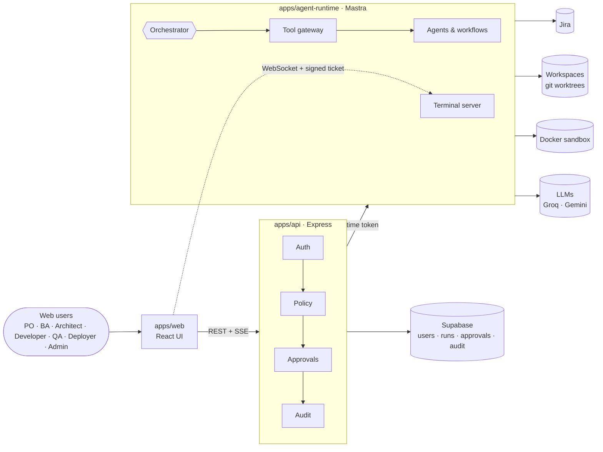
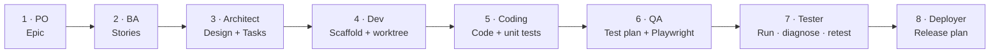
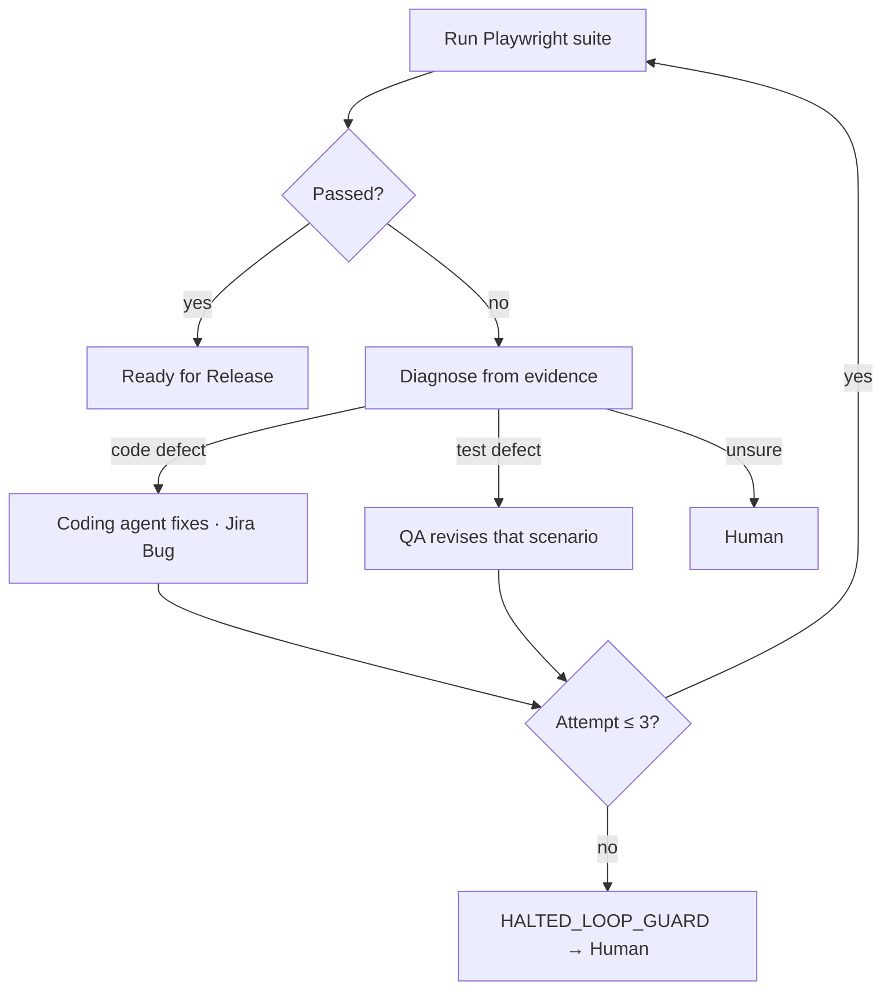
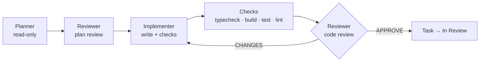
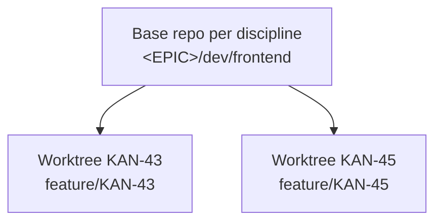
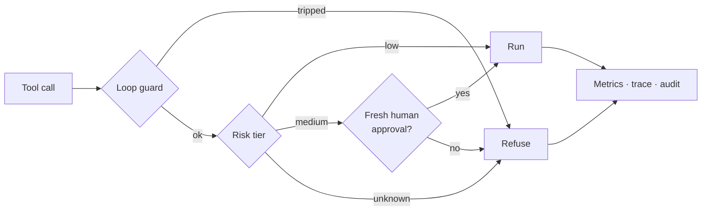
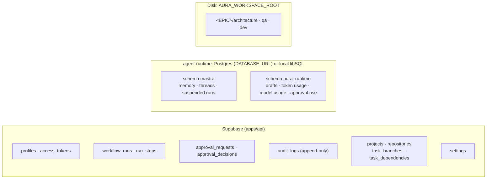
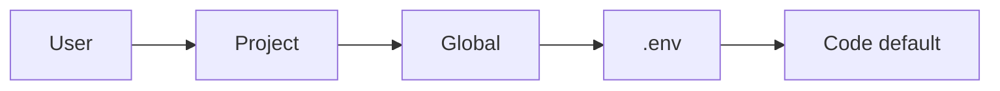
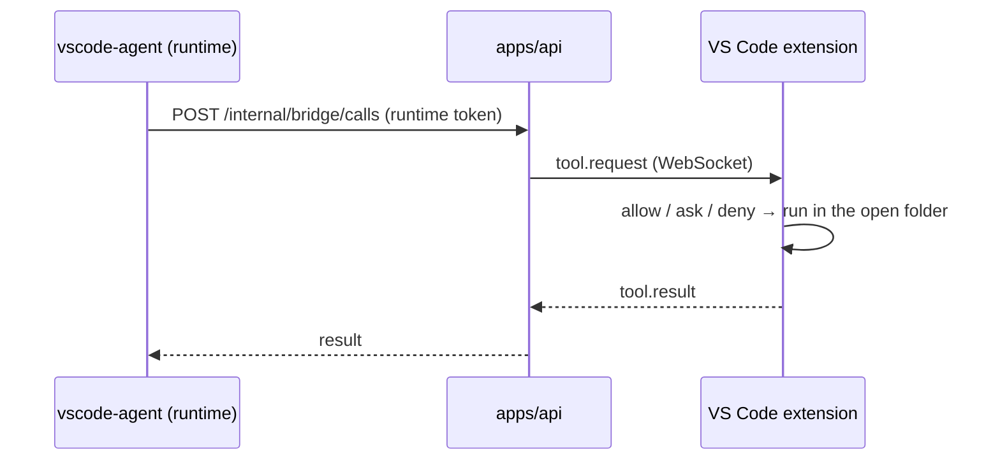
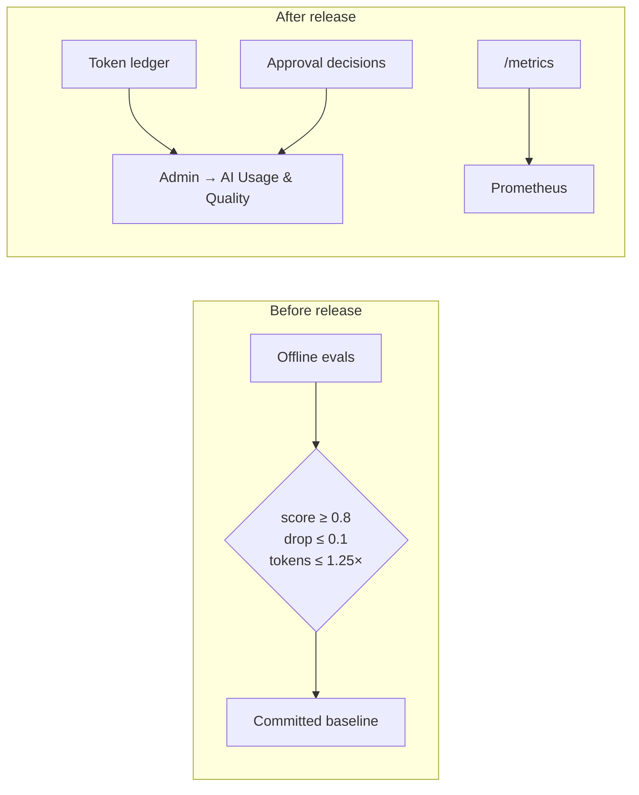

# AURA Architecture

| | |
|---|---|
| **Version** | 0.5 |
| **Updated** | 2026-10-02 |
| **Scope** | The system as it runs today. Planned work is in the [Roadmap](plans/aura-git-control-plane.md). |

AURA is a platform that runs AI agents across the software delivery lifecycle. Agents draft the
work, **Jira** holds the work items, and a **human approves** every step that changes something.

---

## 1. Principles

| # | Principle | In practice |
|---|---|---|
| 1 | **Agents propose, code decides** | Permissions, risk and audit are plain code, never a prompt |
| 2 | **Jira is the source of truth for work** | Agents read from Jira and write back to Jira |
| 3 | **A human approves every change** | Every stage stops at a gate until the right role decides |
| 4 | **Every tool call is checked and logged** | Policy, risk tier, approval and audit on each call |
| 5 | **Evidence, not claims** | Test results come from the test runner, never from a model |
| 6 | **One workspace per Task** | Each Task has its own git worktree and branch |

---

## 2. System overview

```mermaid
flowchart LR
    USERS(["Web users<br/>PO · BA · Architect · Developer · QA · Deployer · Admin"]) --> WEB["apps/web<br/>React UI"]

    WEB -->|"REST + SSE"| API
    WEB -.->|"WebSocket + signed ticket"| TERM

    subgraph API["apps/api · Express"]
        AUTH["Auth"] --> POL["Policy"] --> APR["Approvals"] --> AUD["Audit"]
    end

    API -->|"runtime token"| RT

    subgraph RT["apps/agent-runtime · Mastra"]
        ORCH{{"Orchestrator"}} --> GW["Tool gateway"]
        GW --> AGENTS["Agents & workflows"]
        TERM["Terminal server"]
    end

    API --> SUPA[("Supabase<br/>users · runs · approvals · audit")]
    RT --> JIRA[("Jira")]
    RT --> DISK[("Workspaces<br/>git worktrees")]
    RT --> DOCKER[("Docker sandbox")]
    RT --> LLM[("LLMs<br/>Groq · Gemini")]
```

| Part | Stack | Responsibility | Port |
|---|---|---|---|
| `apps/web` | React, Vite, Tailwind | Approval inbox, agent chat, runs, Jira view, Project Files, admin | 5173 |
| `apps/api` | Express | Auth, policy, approvals, audit, settings, Jira reads, terminal tickets | 4000 |
| `apps/agent-runtime` | Mastra | Orchestrator, agents, workflows, tool gateway, drafts, terminal | 4111 / 4112 |
| `apps/vscode` | VS Code extension | The developer's client (V0): agents' file and command calls run here, after a permission check | — |
| `packages/aura-client` | TypeScript | Typed REST + SSE client, used by the extension | — |
| `packages/aura-bridge` | TypeScript | Bridge protocol between the cloud and the extension | — |

**Request path:** client → `apps/api` (checks who and what) → `apps/agent-runtime` (runs the
agent) → Jira, disk, Docker. Only `apps/api` can call the runtime. Each agent turn runs as a
**background job** (pg-boss on Postgres when `DATABASE_URL` is set, in-process otherwise). Every
event a client sees is stored in `run_events` first, so a closed browser doesn't stop a turn and a
client reconnects with `GET /runs/:id/events?after=<id>`.

---

## 3. Delivery pipeline

Eight gates. Each gate ends with a human decision: **approve**, **revise** or **reject**.

```mermaid
flowchart LR
    G1["1 · PO<br/>Epic"] --> G2["2 · BA<br/>Stories"] --> G3["3 · Architect<br/>Design + Tasks"]
    G3 --> G4["4 · Dev<br/>Scaffold + worktree"] --> G5["5 · Coding<br/>Code + unit tests"]
    G5 --> G6["6 · QA<br/>Test plan + Playwright"] --> G7["7 · Tester<br/>Run · diagnose · retest"]
    G7 --> G8["8 · Deployer<br/>Release plan"]
```

| Gate | Agent | Output | Approver |
|---|---|---|---|
| 1 | PO | Epic | Project Owner |
| 2 | BA | Stories, acceptance criteria, definition of done | Business Analyst |
| 3 | Architect (workflow) | Design docs, ADRs, Tasks | Architect |
| 4 | Dev | Scaffold, git repo, Task worktree | Developer |
| 5 | Coding Council or single coding agent | Code and unit/integration tests | Developer |
| 6 | QA | Test plan and Playwright specs | QA Engineer |
| 7 | Tester (bounded loop) | Real test results and fixes | QA Engineer |
| 8 | Deployer | Release, change and rollback plan (plan only) | Deployer |

Rules:
- A gate runs only when a person asks for that stage. Nothing moves forward on its own.
- Only approved content is written to Jira, disk or git.

### 3.1 Tester loop (Gate 7)

```mermaid
flowchart TD
    RUN["Run Playwright suite"] --> OK{"Passed?"}
    OK -->|yes| DONE["Ready for Release"]
    OK -->|no| DIAG["Diagnose from evidence"]
    DIAG -->|"code defect"| FIX["Coding agent fixes · Jira Bug"]
    DIAG -->|"test defect"| QAFIX["QA revises that scenario"]
    DIAG -->|"unsure"| HUMAN["Human"]
    FIX --> CAP{"Attempt ≤ 3?"}
    QAFIX --> CAP
    CAP -->|yes| RUN
    CAP -->|no| HALT["HALTED_LOOP_GUARD → Human"]
```

One approval starts the loop. Pass/fail counts come from Playwright's JSON output.

---

## 4. Agents

| Agent | How it works | Tools |
|---|---|---|
| **Orchestrator** | Chats with the user and picks the next agent | `ask_user`, 8 × `delegate_to_*`, `git` |
| **PO, BA** | One structured-output call (Zod schema) | None |
| **Architect** | Multi-step workflow: requirements → decomposition → API/data/security/AI design → ADRs + Tasks | None |
| **Dev** | Runs a fixed scaffold command in Docker, then creates the Task worktree | None (code runs the command) |
| **Coding Council** | Planner, Implementer and Reviewer agents ([details](plans/aura-code-cli-council.md)) | File tools + allowlisted checks |
| **Single coding agent** | One agent with `list_files` / `read_file` / `write_file` | File tools |
| **QA** | Test plan and Playwright specs from Stories and the real code | None |
| **Tester** | Workflow: run → diagnose → route → retest | None |
| **Deployer** | Release, change and rollback plan | None |

**Tech stack the Architect designs for:** React 19 + Vite, PostgreSQL, and NestJS or Spring Boot
(chosen by the human).

**Disciplines Gate 4 can scaffold:** Frontend and Backend/NestJS. Spring Boot, Data, AI,
Integration and Deployment return a clear "not supported" error.

### 4.1 Coding Council (Gate 5)

```mermaid
flowchart LR
    P["Planner<br/>read-only"] --> R1["Reviewer<br/>plan review"]
    R1 --> I["Implementer<br/>write + checks"]
    I --> C["Checks<br/>typecheck · build · test · lint"]
    C --> R2{"Reviewer<br/>code review"}
    R2 -->|"CHANGES"| I
    R2 -->|"APPROVE"| DONE["Task → In Review"]
```

- **Modes:** `lean` (no separate planner), `full`, or `auto` (full for sensitive or large Tasks).
- A failing check always means CHANGES.
- Each round ends with a checkpoint commit on the Task branch.
- The run stops at the round limit or the token budget. Without reviewer approval, the Task
  does not move to *In Review*.

### 4.2 Task workspaces

```mermaid
flowchart TD
    BASE["Base repo per discipline<br/>&lt;EPIC&gt;/dev/frontend"] --> W1["Worktree KAN-43<br/>feature/KAN-43"]
    BASE --> W2["Worktree KAN-45<br/>feature/KAN-45"]
```

- The first Task of a discipline creates the base repo (scaffold + CI file + first commit).
- Every Task gets its own worktree on `feature/<TASK>`. Coding, git and tests run there only.
- Commits made on the server are authored by the approving developer (AURA is co-author).
- Pushing is done by the developer with their own git credentials. AURA holds no GitHub credential.

---

## 5. Security and governance

### 5.1 Roles

| Role | Runs | Approves |
|---|---|---|
| Project Owner | PO | Gate 1 |
| Business Analyst | BA | Gate 2 |
| Architect | Architect | Gate 3 |
| Developer | Dev, Coding, Git | Gates 4–5 |
| QA Engineer | QA, Tester | Gates 6–7 |
| Deployer | Deployer | Gate 8 |
| Admin | Users, projects, audit | No gates |

Grants are data in `apps/api/src/modules/policy/policy.ts`.

### 5.2 Tool gateway

Every Orchestrator tool call (except `ask_user`) passes one pipeline in
`agent-runtime/src/mastra/gateway/`:

```mermaid
flowchart LR
    CALL["Tool call"] --> LOOP{"Loop guard"}
    LOOP -->|"tripped"| BLOCK["Refuse"]
    LOOP -->|"ok"| RISK{"Risk tier"}
    RISK -->|"low"| RUN["Run"]
    RISK -->|"medium"| HUMAN{"Fresh human<br/>approval?"}
    RISK -->|"unknown"| BLOCK
    HUMAN -->|yes| RUN
    HUMAN -->|no| BLOCK
    RUN --> REC["Metrics · trace · audit"]
    BLOCK --> REC
```

| Control | Rule |
|---|---|
| Risk tiers | Low: read, draft, revise. Medium: file, execute, write. Unknown: refused |
| Single-use approval | One human **approve** authorizes one medium step |
| Loop guards | Same call 3× in 15 min · same tool fails 3× · draft reaches version 10 |
| Prompt injection | Jira text is cleaned, scanned (11 rules), wrapped in `<untrusted>`; findings shown on the draft |
| Draft delivery | Full draft goes to the human; the model sees a 400-character preview |

### 5.3 Access and secrets

| Boundary | Control |
|---|---|
| User → API | Supabase session or personal access token (`aura_pat_…`, hashed, expiring, revocable) |
| API → runtime | `MASTRA_RUNTIME_TOKEN` bearer token |
| Browser → terminal | 60-second, single-use HMAC ticket signed by the API |
| Approval | Decision bound to the hash of the exact payload shown |
| Audit | `audit_logs` is append-only (database trigger) |

**Modes:** `AURA_MODE=local` (one developer on loopback) or `AURA_MODE=server` (shared). Server mode
refuses to start without the runtime token, with `SANDBOX_MODE=host`, or with `TERMINAL_MODE=full`.

Full threat model: [security/threat-model.md](security/threat-model.md).

---

## 6. Data

```mermaid
flowchart LR
    subgraph SUPA["Supabase (apps/api)"]
        A["profiles · access_tokens"]
        B["workflow_runs · run_steps"]
        C["approval_requests · approval_decisions"]
        D["audit_logs (append-only)"]
        E["projects · repositories<br/>task_branches · task_dependencies"]
        S["settings"]
    end
    subgraph RTDB["agent-runtime: Postgres (DATABASE_URL) or local libSQL"]
        F["schema mastra<br/>memory · threads · suspended runs"]
        G["schema aura_runtime<br/>drafts · token usage · model usage · approval use"]
    end
    subgraph FS["Disk: AURA_WORKSPACE_ROOT"]
        H["&lt;EPIC&gt;/architecture · qa · dev"]
    end
```

With `DATABASE_URL` set, the runtime keeps agent memory and its own tables in Postgres, so a
restart or a second replica sees the same gates, drafts and ledgers. Without it, it uses local
libSQL files (one developer, one process). `pnpm --filter agent-runtime migrate-state` copies an
existing local `aura-drafts.db` into Postgres once.

### 6.1 Settings

Tunable values live in the `settings` table and are edited in **Admin → Settings** (global or per
project) and **Profile → Preferences** (per user). Secrets, URLs and security switches stay in
`.env`.

```mermaid
flowchart LR
    U["User"] --> P["Project"] --> G["Global"] --> E[".env"] --> C["Code default"]
```

The first value found wins; a user's token budget can't exceed the project's. The API sends the
runtime's values with each turn (`auraSettings` request context). A Gate 5 draft records the council
limits, so the run uses exactly what the approver saw. Every change is audited (`settings.updated`).

### 6.2 Provenance

Every Jira artifact carries a **provenance stamp**: agent, agent version, prompt version, model,
draft id and thread id. `GET /audit/export` (admin) exports the audit log as JSON or CSV.

---

## 7. Developer tools

| Tool | What it does |
|---|---|
| Project Files | One workspace per Epic: design docs, QA specs, code, terminal, test runs, runners |
| Web terminal | Shell in the Task worktree (`full` on loopback, otherwise `restricted`) |
| Runners tab | Live Docker containers, council runs, checks and terminal sessions |

Commands and settings: [SETUP.md](../SETUP.md). The developer client is moving to a VS Code
extension ([ADR-4](adr/0004-vscode-developer-workspace.md)); the `aura` CLI was removed.

---

### 7.1 VS Code bridge (V0)

```mermaid
sequenceDiagram
    participant RT as vscode-agent (runtime)
    participant A as apps/api
    participant X as VS Code extension
    RT->>A: POST /internal/bridge/calls (runtime token)
    A->>X: tool.request (WebSocket)
    X->>X: allow / ask / deny → run in the open folder
    X-->>A: tool.result
    A-->>RT: result
```

The `vscode-agent` uses a Mastra `Workspace` whose filesystem and sandbox live on the developer's
machine ([ADR-4](adr/0004-vscode-developer-workspace.md)). The extension connects with a 60-second
single-use ticket (`POST /bridge/tickets`, developers only). Every change it makes is audited
(`bridge.tool.call`).

## 8. Quality and cost

```mermaid
flowchart LR
    subgraph BEFORE["Before release"]
        EV["Offline evals"] --> GATE{"score ≥ 0.8<br/>drop ≤ 0.1<br/>tokens ≤ 1.25×"}
        GATE --> BASE["Committed baseline"]
    end
    subgraph AFTER["After release"]
        LEDGER["Token ledger"] --> PAGE["Admin → AI Usage & Quality"]
        DEC["Approval decisions"] --> PAGE
        MET["/metrics"] --> PROM["Prometheus"]
    end
```

| Agent | Eval score |
|---|---:|
| PO | 1.00 |
| BA | 0.958 |
| Deployer | not recorded |

Evals are deterministic code checks: structure, completeness, grounding, honesty about unknowns,
injection resistance and token cost.

**Token usage.** The Orchestrator used 69% of all tokens in the baseline. Compact instructions,
draft previews and a 16-message memory window cut its fixed cost per step from ~7,500 to ~4,250
tokens (estimated total saving ~40%).

---

## 9. Status

| Area | Status | Notes |
|---|---|---|
| Gates 1–8 | Built | Gate 8 is a plan only |
| Tool gateway, evals, token ledger | Built | |
| Projects, repositories, `GitProvider` | Partial | Local provider only; not used by Gate 4 yet |
| GitHub App, pull requests, merge flow | Not built | |
| Runtime state in Postgres | Built | Set `DATABASE_URL`; required in server mode |
| Job queue, resumable streams | Built | A restart marks a running turn `INTERRUPTED`; it is never re-run automatically |
| SSO, row-level security per project | Not built | Scope is enforced in `policy.ts` |
| Budgets per team | Not built | Per-run token budget only |

Next steps: [Roadmap](plans/aura-git-control-plane.md).

---

## 10. Glossary

| Term | Meaning |
|---|---|
| **Gate** | A pause only a person with the right role can resolve |
| **Draft** | Agent output waiting for approval |
| **Grant** | A role → agent → tool permission |
| **Run** | One agent execution for one Jira issue |
| **Risk tier** | Low / medium / high / forbidden label on a tool |
| **Worktree** | A Task's own checkout of the repository |
