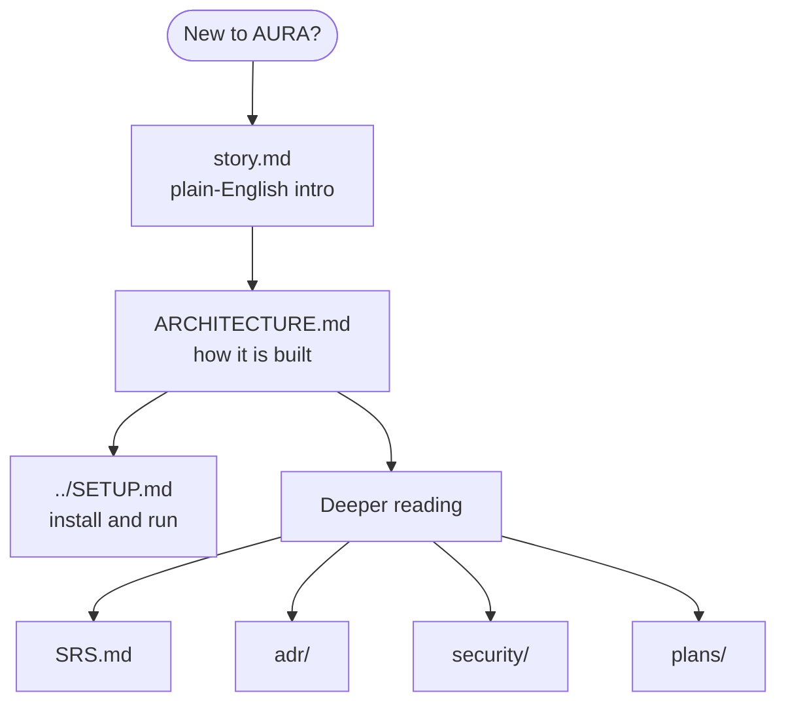

# AURA Documentation

| Document | Contents |
|---|---|
| [story.md](story.md) | What AURA is, in simple words |
| [ARCHITECTURE.md](ARCHITECTURE.md) | System design as built |
| [../SETUP.md](../SETUP.md) | Install, configure, run, troubleshoot |
| [SRS.md](SRS.md) | Requirements with build status |
| [plans/aura-code-cli-council.md](plans/aura-code-cli-council.md) | `aura` CLI, Coding Council, web terminal |
| [plans/aura-git-control-plane.md](plans/aura-git-control-plane.md) | Roadmap |
| [clarify.md](clarify.md) | Open questions and their status |
| [adr/](adr/) | Architecture decision records |
| [security/threat-model.md](security/threat-model.md) | Threats and controls |
| [runbooks/rotate-shared-secrets.md](runbooks/rotate-shared-secrets.md) | Rotate a leaked secret |
| [logs/](logs/) | Daily engineering logs |

## Decision records

| ADR | Decision | Status |
|---|---|---|
| [ADR-1](adr/0001-dev-agent-scaffold-and-template-strategy.md) | Scaffold from official tools, not templates | Accepted |
| [ADR-2](adr/0002-team-scale-deployment.md) | Team-scale deployment shape | Proposed |
| [ADR-3](adr/0003-git-workflow.md) | One repo per project, Task branches, PRs | Accepted, in progress |
