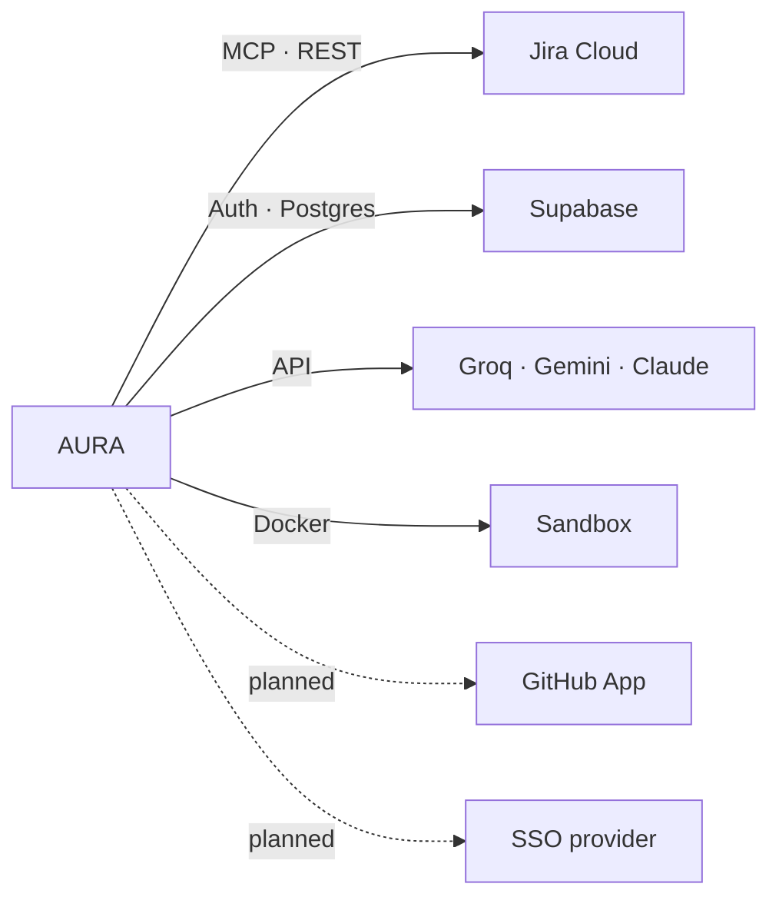
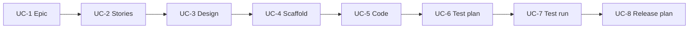

# AURA Software Requirements Specification

| | |
|---|---|
| **Version** | 0.3 |
| **Updated** | 2026-10-02 |
| **Companion** | [ARCHITECTURE.md](ARCHITECTURE.md) describes *how*; this document describes *what* |

**Status key:** 🟢 Built · 🟡 Partial · 🔴 Not built

---

## 1. Overview

### 1.1 Purpose

AURA coordinates AI agents across the software delivery lifecycle. It must:

- use **Jira** as the system of record for work,
- enforce **role-based access** outside the model,
- put **human approval** in front of every change,
- keep **full provenance** from requirement to release.

### 1.2 Out of scope

Replacing Jira · autonomous production changes · non-TypeScript services.

### 1.3 Users

| Role | Main activity | Gates |
|---|---|---|
| Project Owner | Briefs the Orchestrator, approves Epics | 1 |
| Business Analyst | Approves Stories, acceptance criteria, DoD | 2 |
| Architect | Approves design, ADRs, Tasks; edits design docs | 3 |
| Developer | Approves scaffolds and code; commits and pushes | 4, 5 |
| QA Engineer | Approves test plans; starts and oversees the Tester loop | 6, 7 |
| Deployer | Approves release plans | 8 |
| Admin | Users, projects, audit export; cannot approve gates | — |

### 1.4 Constraints

- TypeScript across the stack.
- Authorization, risk and state transitions are code, never model output.
- Tool arguments are schema-validated (Zod).
- `audit_logs` is append-only for every role.

---

## 2. Functional requirements

### FR-AUTH · Authentication and authorization

| ID | Requirement | Status |
|---|---|---|
| FR-AUTH-1 | Users sign in through corporate SSO (SAML/OIDC) | 🔴 Email/password, admin-provisioned |
| FR-AUTH-2 | Tool clients sign in with revocable, expiring personal access tokens | 🟢 |
| FR-AUTH-3 | Every request and tool call is checked against role → agent → tool grants | 🟢 |
| FR-AUTH-4 | Grants are data, editable per project, with audit | 🟡 Data in code; not editable in the UI |
| FR-AUTH-5 | The runtime never holds user credentials | 🟢 |
| FR-AUTH-6 | Only the API can call the runtime | 🟢 |
| FR-AUTH-7 | Admins change agent limits and governance values in the dashboard, globally or per project, with audit | 🟢 |

### FR-JIRA · Jira integration

| ID | Requirement | Status |
|---|---|---|
| FR-JIRA-1 | Approved output is written to Jira (Epics, Stories, Tasks, Bugs, comments) | 🟢 |
| FR-JIRA-2 | Jira writes are idempotent on retry | 🟢 |
| FR-JIRA-3 | Jira webhooks start agent runs | 🔴 Runs start from a person |
| FR-JIRA-4 | Task status follows Git events (In Progress → In Review → Ready for Release → Done) | 🔴 |

### FR-APPR · Human approval

| ID | Requirement | Status |
|---|---|---|
| FR-APPR-1 | Every medium-risk action waits for a durable human decision | 🟢 |
| FR-APPR-2 | The decision is bound to a hash of the exact payload | 🟢 |
| FR-APPR-3 | One approval authorizes one step only | 🟢 |
| FR-APPR-4 | Approvals expire on an SLA timer; never auto-approve on timeout | 🟢 |
| FR-APPR-5 | High-risk actions need two approvers (four-eyes) | 🔴 No high-risk actions exist |
| FR-APPR-6 | Approval inbox with approve, revise and reject (reason required) | 🟢 |

### FR-AGENT · Agents

| ID | Requirement | Status |
|---|---|---|
| FR-AGENT-1 | The Orchestrator holds only `ask_user`, delegate tools and `git` | 🟢 |
| FR-AGENT-2 | Drafting agents return structured output and hold no tools | 🟢 |
| FR-AGENT-3 | Large agents run as multi-step workflows | 🟢 Architect, QA, Tester, Coding Council |
| FR-AGENT-4 | Agents have versions, prompt versions and models in a registry | 🟢 Static file |
| FR-AGENT-5 | A new agent version must pass evals before use | 🟡 PO, BA, Deployer suites |
| FR-AGENT-6 | Loops stop at a limit and hand over to a person (`HALTED_LOOP_GUARD`) | 🟢 |
| FR-AGENT-7 | Every artifact carries a provenance stamp | 🟢 |

### FR-TOOL · Tool gateway

| ID | Requirement | Status |
|---|---|---|
| FR-TOOL-1 | Every tool call passes one gateway: risk tier, approval check, loop guard, record | 🟢 |
| FR-TOOL-2 | Untrusted text is treated as data and scanned for injection | 🟢 |
| FR-TOOL-3 | Timeouts and circuit breakers on external calls | 🔴 |

### FR-CODE · Code and Git

| ID | Requirement | Status |
|---|---|---|
| FR-CODE-1 | Each Task works in its own git worktree and branch | 🟢 |
| FR-CODE-2 | Coding output is reviewed by a second agent and verified by real checks | 🟢 |
| FR-CODE-3 | Developers commit and push with their own identity | 🟢 |
| FR-CODE-4 | Code lives in a registered project repository | 🟡 Registry built; Gate 4 not switched |
| FR-CODE-5 | AURA opens pull requests through a GitHub App | 🔴 |
| FR-CODE-6 | Coding and QA share one OpenAPI contract | 🔴 |

### FR-TEST · Testing

| ID | Requirement | Status |
|---|---|---|
| FR-TEST-1 | QA generates a test plan and Playwright specs from approved Stories and real code | 🟢 |
| FR-TEST-2 | Tests run in a sandbox, never in the model process | 🟢 Docker |
| FR-TEST-3 | Results come from the test runner's output, not a model | 🟢 |
| FR-TEST-4 | Failures are diagnosed and routed to Coding or QA, max 3 attempts | 🟢 |
| FR-TEST-5 | API test suites | 🔴 |

### FR-OBS · Observability and audit

| ID | Requirement | Status |
|---|---|---|
| FR-OBS-1 | Append-only audit log with explorer and export | 🟢 |
| FR-OBS-2 | Metrics: tool calls, blocks, injection findings, tokens | 🟢 `/metrics` |
| FR-OBS-3 | Approval and first-pass rates per agent | 🟢 |
| FR-OBS-4 | One trace id per run across services | 🟡 Runtime spans only |
| FR-OBS-5 | Alerts on budget, loop guard and SLA breaches | 🔴 |

---

## 3. Non-functional requirements

| ID | Area | Requirement | Status |
|---|---|---|---|
| NFR-SEC-1 | Security | No secrets in prompts, logs or agent memory | 🟢 |
| NFR-SEC-2 | Security | Forbidden tools (policy edits, audit changes) are never callable | 🟢 |
| NFR-SEC-3 | Security | Agent code runs in ephemeral, isolated containers | 🟡 Host checks allowed locally |
| NFR-SEC-4 | Security | Database enforces project scope (RLS) | 🔴 |
| NFR-REL-1 | Reliability | Runs survive a runtime restart | 🟡 Gates, drafts and memory survive (Postgres); running turns do not |
| NFR-REL-2 | Reliability | Durable queue between API and runtime | 🔴 |
| NFR-REL-3 | Reliability | Model fallback on provider failure | 🟢 Coding Council chains |
| NFR-COST-1 | Cost | Token budget per run | 🟢 Coding Council |
| NFR-COST-2 | Cost | Budgets per developer and team | 🔴 |
| NFR-COST-3 | Cost | Token usage visible per agent and model | 🟢 |
| NFR-SCALE-1 | Scale | API and runtime scale independently | 🔴 Local state |
| NFR-COMP-1 | Compliance | Audit export usable as SOC2/ISO evidence | 🟢 |
| NFR-COMP-2 | Compliance | Data stays in the project's region | 🔴 |
| NFR-MAINT-1 | Maintainability | Policy is pure, unit-tested functions | 🟢 |
| NFR-MAINT-2 | Maintainability | Deterministic code has unit tests in CI | 🟢 |

---

## 4. External interfaces

| System | Use | Status |
|---|---|---|
| Jira | Read issues; write approved Epics, Stories, Tasks, Bugs, comments | 🟢 |
| Supabase | Auth, users, runs, approvals, audit, projects | 🟢 |
| LLM providers | Groq and Gemini; Claude ready via registry | 🟢 |
| Docker | Scaffolds, tests, optional checks | 🟢 |
| GitHub | Branches, PRs, check runs, webhooks | 🔴 |
| SSO provider | SAML / OIDC | 🔴 |

---

## 5. Use cases

| UC | Actor | Trigger | On approve |
|---|---|---|---|
| UC-1 | Project Owner | Briefs the Orchestrator | Epic filed in Jira |
| UC-2 | Business Analyst | Epic approved | Stories filed under the Epic |
| UC-3 | Architect | Stories approved; picks backend | Tasks filed; design docs and ADRs written |
| UC-4 | Developer | Task ready | Scaffold (first Task) and Task worktree created |
| UC-5 | Developer | Worktree exists | Coding Council writes code; Task → In Review if approved |
| UC-6 | QA Engineer | Code exists | Test plan and Playwright specs filed |
| UC-7 | QA Engineer | Specs approved | Tester loop runs; Bugs filed for real defects |
| UC-8 | Deployer | Tests pass | Release, change and rollback plan filed |
| UC-9 | Admin | Any time | Manage users and projects; export audit |

**Revise** produces a new draft version for the same approver. **Reject** ends the run with nothing
written.

---

## 6. Data

| Store | Contents |
|---|---|
| Supabase | `profiles`, `access_tokens`, `workflow_runs`, `run_steps`, `approval_requests`, `approval_decisions`, `audit_logs`, `projects`, `repositories`, `task_branches`, `task_dependencies` |
| Runtime Postgres (or local libSQL) | Agent memory, drafts, token usage, model usage, approval use |
| Workspace files | Design docs, scaffolds, worktrees, QA specs |

Supabase stores runtime data by reference (`thread_id`, draft ids), never as a copy.
