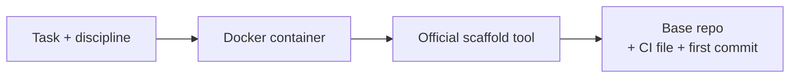

# ADR-1: Scaffold projects with official tools, not stored templates

| | |
|---|---|
| **Status** | Accepted · Frontend and Backend/NestJS built |
| **Date** | 2026-09-21 |
| **Updated by** | [ADR-3](0003-git-workflow.md): scaffold only when a repository is new |

## Context

Gate 4 turns a Task into a runnable project skeleton. Each Task has a discipline (Frontend,
Backend, Data, AI, Integration, Deployment). The stack is fixed by Gate 3: React 19 + Vite,
PostgreSQL, and NestJS or Spring Boot.

## Decision

Run the **official scaffolding tool** each time, inside a **Docker container** (one per run,
non-root, resource-limited).

| Discipline | Command | Status |
|---|---|---|
| Frontend | `npm create vite@latest <app> -- --template react-ts` | 🟢 Built |
| Backend · NestJS | `nest new <app> --package-manager npm` (with an upgraded npm) | 🟢 Built |
| Backend · Spring Boot | Spring Initializr API (`start.spring.io`) | 🔴 Not built |
| Data, AI, Integration, Deployment | — | 🔴 Not built; Gate 4 returns a clear error |

## Consequences

| Positive | Negative |
|---|---|
| Always current with upstream releases | Needs network access to npm / Spring Initializr |
| No template repo to maintain | Docker is weaker isolation than a microVM |
| Same steps a developer would run by hand | |

## Open

Database provisioning: a local Postgres container with a migration tool, or a managed instance.
