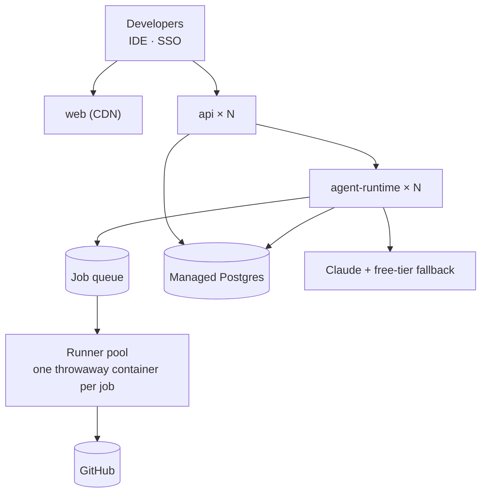
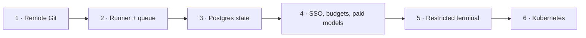

# ADR-2: Team-scale deployment

| | |
|---|---|
| **Status** | Proposed · D1–D2 and D5 superseded by [ADR-4](0004-vscode-developer-workspace.md); the rest is in the Roadmap |
| **Date** | 2026-09-25 |
| **Target** | A company with 30+ developers |

## Context

AURA runs in **local mode**: one machine runs all services, code lives on its disk, checks may run
on the host, state is in local libSQL files, and long runs live inside one HTTP request. That fits
one developer. Shared by 30, it would put everyone's code on one disk, let one developer's
agent-written code reach another's files, and not scale past one process.

## Decision

Split AURA into a **central control plane** and a **pooled execution plane**. Git is the only home
of code.

| # | Decision |
|---|---|
| D1 | **Git holds all code.** Each job clones the Task branch, works, pushes, and is deleted. Developers use `git pull` / `aura pull` |
| D2 | **Code runs only in ephemeral containers** on a runner pool (2 CPU, 2 GB, 512 PIDs, restricted network) |
| D3 | **Long work is queued**, not held in an HTTP request. Progress streams over pub/sub → SSE |
| D4 | **All state in Postgres**, so `api` and `agent-runtime` run as stateless replicas |
| D5 | **The IDE is primary.** The web terminal is restricted to the Task's container, or off |
| D6 | **Paid models with budgets** per run, developer and team; prompt caching on |
| D7 | **SSO** with roles from IdP groups; project membership required |
| D8 | **Hosting:** managed containers up to ~100 developers; Kubernetes beyond |

## Rollout

Local mode keeps working throughout (`AURA_MODE=local`).

**Built so far toward this ADR:** `AURA_MODE=server` refuses to start without the runtime token
or `DATABASE_URL`.

## Consequences

| Positive | Negative |
|---|---|
| Developer code never sits on a shared disk | More infrastructure: GitHub App, Redis, runners, Postgres |
| Each part scales on its own | Every job pays for a clone and install (needs a dependency cache) |
| Developers keep their IDE and Git flow | Paid model spend |
| Long runs survive restarts | Two modes to maintain |

**Not decided here:** isolation stronger than containers, multi-region.
