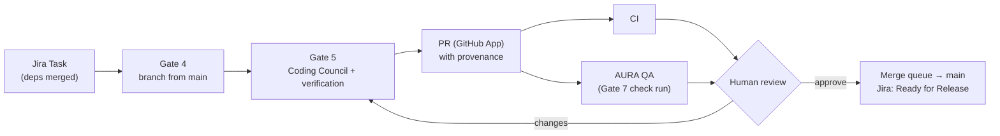

# ADR-3. Git workflow: product repositories, Task branches, pull requests, merge queue

**Status:** Accepted (2026-09-25). Implementation is planned in
[plans/aura-git-control-plane.md](../plans/aura-git-control-plane.md) (Phase 0 in progress, Phase 1 next).
Supersedes the per-Epic scaffold model described in ADR-1 and `docs/ARCHITECTURE.md` §2.4 once
Phase 1 lands. Complements [ADR-2](0002-team-scale-deployment.md) (where work runs) by deciding
**how code flows**.

## Context

AURA governs AI agents across the delivery lifecycle: gates, policy, approvals, audit and
provenance. The code side, though, was built for one machine:

- Gate 4 scaffolds **a new app per Epic** under `.workspaces/<EPIC>/dev/<discipline>/`.
- Task branches (`feature/<TASK>`, one git worktree each) **never leave the machine**: no push, no
  pull request, no CI, no merge, so the code part of a Task has no "done".
- Task dependencies are implicit. KAN-47 was built on KAN-43's code, which was only discovered
  from file timestamps.
- The QA agent and the Coding agent each read the Architect's **prose** API design and diverged:
  QA tested `/api/password-reset/...`, the code implemented `/v1/auth/...`.
- Coding could be delegated to Claude Code / Codex, which run on **developers' personal CLI
  logins**, outside AURA's model governance.

A mentor review (760/1000) confirmed the governance core is sound and named remote Git + PRs as the
most important missing piece. The questions and answers are recorded in [clarify.md](../clarify.md).

## Decision

| # | Decision |
|---|---|
| **D1** | **One repository per Project.** Epics and Tasks are units of *work*, not code boundaries; every Epic changes the Project's existing repository. Scaffolding happens only when a repository is new. Multi-repository Projects are a later step. |
| **D2** | **GitHub, through a GitHub App** that AURA owns (short-lived installation tokens, narrowly scoped: contents, pull requests, checks), behind a `GitProvider` interface. A `local` provider (bare repository on disk) serves AURA's own tests and offline use. Developers keep their own credentials for their own pushes. |
| **D3** | **Merged is not Done.** PR merged → Jira *Ready for Release*; released (Gate 8) → *Done*. Branch created → *In Progress*; PR opened → *In Review*. Status names are configurable per Jira project. |
| **D4** | **Dependencies are data.** Architect Tasks carry `dependsOn`, filed as Jira "is blocked by" links. Gate 4 refuses a Task whose dependencies are not merged, unless a human explicitly chooses to stack it on the dependency's branch (recorded in the audit log). The Architect should decompose work so most Tasks merge independently. |
| **D5** | **Contract-first APIs.** The Architect produces an **OpenAPI 3.1** file (`openapi/openapi.yaml`, through its own PR). The Coding Council and QA both receive it, and a deterministic **contract check** in verification compares implemented routes and QA request paths against it. |
| **D6** | **AURA's own agents do the coding.** The Claude Code and Codex providers (and their CLI-login/Docker path and credentials table) are removed. Models are chosen per role in the agent registry (any provider), later through a model gateway. |
| **D7** | **CI and QA run in parallel on the PR.** Merge requires CI ✓ + AURA QA (Gate 7 check run) ✓ + one human approval (CODEOWNERS), through a merge queue into a protected `main`. |
| **D8** | **Artifacts that describe the software live in the repository**: `openapi/`, `docs/adr/`, `docs/architecture/`, `e2e/` (Playwright). **AURA keeps operational evidence**: runs, approvals, audit, provenance, traces. |
| **D9** | **Local mode stays.** Developers work in their own IDE on clones/worktrees of the repository; the CLI, web terminal and Project Files operate on those. |

### Flow

## Consequences

**Positive**
- The code part of every Task has a clear end: a reviewed, CI-green, QA-green merge to `main`.
- Many developers work in parallel through standard Git practice (short-lived branches, protected
  `main`, merge queue) that companies already know how to operate.
- AI output never reaches `main` without CI, AURA QA and a human reviewer.
- One contract removes a whole class of disagreement between generated code and generated tests.
- All model use flows through AURA's governance (registry now, gateway later), not personal
  subscriptions.

**Negative**
- AURA needs a GitHub App, webhook handling (with a polling fallback for local use), and a
  projects/repositories data model.
- Existing per-Epic workspaces (KAN-36) must be migrated once into a registered repository.
- The contract check starts as a static heuristic (NestJS/Express route scan) and will miss some
  cases.
- Removing Claude Code/Codex removes an option some developers may like. Claude models remain
  available to AURA's own agents through the registry.

**Not decided here:** GitLab support, multi-repository Projects, deployment pipelines (Gate 8
automation), stronger sandboxing (ADR-2).
