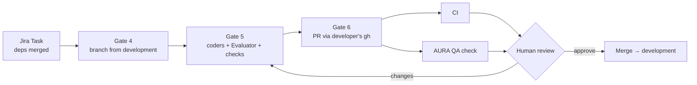

# ADR-3: Git workflow — project repositories, Task branches, pull requests

| | |
|---|---|
| **Status** | Accepted · D2 and D8 superseded by [ADR-4](0004-vscode-developer-workspace.md) · remaining work in the [Roadmap](../plans/aura-git-control-plane.md) |
| **Date** | 2026-09-25 |
| **Replaces** | The per-Epic scaffold model of [ADR-1](0001-dev-agent-scaffold-and-template-strategy.md) |
| **Questions** | [clarify.md](../clarify.md) |

## Context

The code side of AURA works on one machine only:

- Gate 4 creates a **new app per Epic**.
- Task branches never leave the machine: no push, PR, CI or merge.
- Task dependencies are hidden.
- QA and Coding read a prose API design and disagree on paths.

## Decision

| # | Decision | Status |
|---|---|---|
| D1 | **One repository per project.** Scaffold only when the repo is new | 🟢 Connect Repository / Initialize Project in VS Code |
| D2 | **GitHub through a GitHub App**, behind a `GitProvider` interface; a `local` provider for tests | ⚪ Superseded by ADR-4 D8 (developer's own `gh`) |
| D3 | **Merged is not Done.** Branch → In Progress · PR → In Review · merged → Ready for Release · released → Done | 🔴 |
| D4 | **Dependencies are data.** `dependsOn` → Jira links; Gate 4 waits for dependencies to merge | 🟡 Table only |
| D5 | **Contract-first APIs.** Architect writes OpenAPI 3.1; Coding and QA use it; a contract check verifies | 🔴 |
| D6 | **AURA's own agents do the coding.** No Claude Code / Codex providers | 🟢 Done |
| D7 | **CI and QA run in parallel on the PR.** Merge needs CI ✓, AURA QA ✓ and one human approval | 🟡 CI reported to AURA and QA; AURA QA check not built |
| D8 | **Engineering files live in the repo** (`openapi/`, `docs/`, `e2e/`); AURA keeps run evidence | ⚪ Superseded by ADR-4 D4 (design documents in Postgres) |
| D9 | **Local mode stays**, working on clones of the repo | 🟢 |

```mermaid
flowchart LR
    T["Jira Task<br/>deps merged"] --> B["Gate 4<br/>branch from development"]
    B --> C["Gate 5<br/>coders + Evaluator + checks"]
    C --> PR["Gate 6<br/>PR via developer's gh"]
    PR --> CI["CI"]
    PR --> QA["AURA QA check"]
    CI --> R{"Human review"}
    QA --> R
    R -- approve --> M["Merge → development"]
    R -- changes --> C
```

## Consequences

| Positive | Negative |
|---|---|
| Every Task's code has a clear end: a reviewed merge | Merge tracking needs CI reports or webhooks |
| Standard Git practice scales to many developers | KAN-36 must be migrated once |
| AI code never reaches `main` without CI, QA and a human | The contract check starts as a heuristic |
| One contract removes code/test mismatches | |

**Not decided here:** GitLab, multi-repo projects, deployment pipelines.
