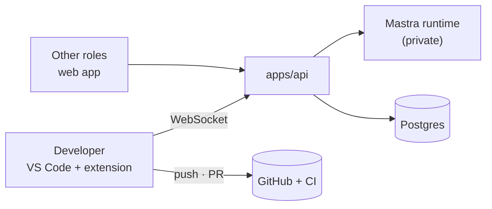

# ADR-4: Developers work in VS Code; AURA's cloud holds no code

| | |
|---|---|
| **Status** | Accepted · 2026-10-02 |
| **Plan** | [plans/aura-vscode-agents.md](../plans/aura-vscode-agents.md) |
| **Supersedes** | ADR-1 (Docker scaffolds), ADR-2 D1–D2 and D5 (runner pool, web terminal), ADR-3 D2 (GitHub App) and D8 (design docs in the repo) |
| **Keeps** | ADR-3 D1, D3–D5, D7 (one repo per project, merged ≠ done, dependencies, contract-first, CI on the PR) |

## Context

AURA runs agents that change code. Until now the code lived on the AURA server: per-Epic
`.workspaces/`, server git worktrees, Docker scaffolds and test runs, host checks, a web terminal
and a web code editor. For a company deployment in the cloud this means:

- every developer's code on one shared disk,
- agent-written code executing on shared infrastructure,
- a browser IDE that is weaker than the IDE developers already use.

## Decision

| # | Decision |
|---|---|
| D1 | **Developers use VS Code with the AURA extension.** Every other role (PO, BA, Architect, QA, Deployer, Admin) uses the web app only |
| D2 | **The agent loop runs in the cloud Mastra runtime; tools run on the developer's machine** through the extension (shell, files, git, checks), like Claude Code but with server-side governance |
| D3 | **The extension talks only to `apps/api`.** The API authenticates, applies policy and relays tool calls to the private runtime |
| D4 | **The cloud stores no source code.** Design documents, ADRs, SRS and QA plans are versioned in Postgres. `.workspaces/` and `AURA_WORKSPACE_ROOT` are removed |
| D5 | **No Docker in AURA.** Scaffolds, checks and local tests run on the developer's machine; CI on GitHub runs on the PR |
| D6 | **CI on the PR is the authoritative test result**; local runs are fast feedback |
| D7 | **Branches:** `feat/<EPIC>/<TASK>` from `development`, optional `feat/<EPIC>/<TASK>_s<N>` for parallel sub-tasks, one PR per Task to `development` |
| D8 | **Push and PR use the developer's own GitHub sign-in** in VS Code; no GitHub App |
| D9 | **Agents are chosen by a code router** (discipline, issue type, file scope). The Orchestrator handles free text only |
| D10 | **Commands follow a permission model** (allow / ask / deny, built-in denies, no bypass mode) |
| D11 | **QA sees no code.** QA designs scenarios in the web app and follows each Task's PR and CI results with notifications |
| D12 | **The web app shows no source code.** Project Files and CodeMirror are removed |

## Consequences

| Positive | Negative |
|---|---|
| No source code or code execution on AURA's servers | Agents run commands on developer machines (mitigated by the permission model, not eliminated) |
| Developers keep their IDE, git credentials and tools | Prompt injection can lead to commands; tool output must be treated as untrusted |
| One public entry point (`apps/api`); runtime stays private | Work pauses when VS Code is closed |
| No Docker, runner pool or GitHub App to operate | A VS Code extension is a new codebase to build and maintain |
| CI results are the shared, trustworthy evidence | Large parts of the current system are removed (plan §13) |

**Not decided here:** a cloud sandbox for unattended work; hosting region and data-protection
review (Sri Lanka Personal Data Protection Act, No. 9 of 2022) for the production deployment.
