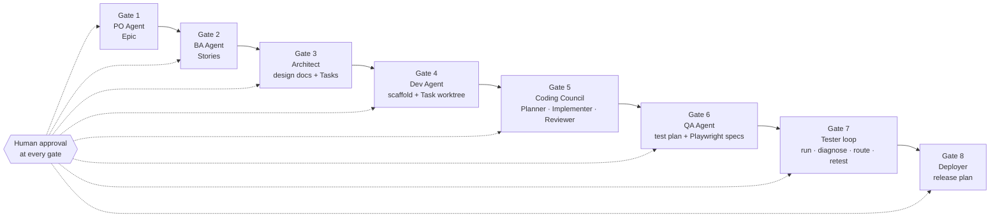
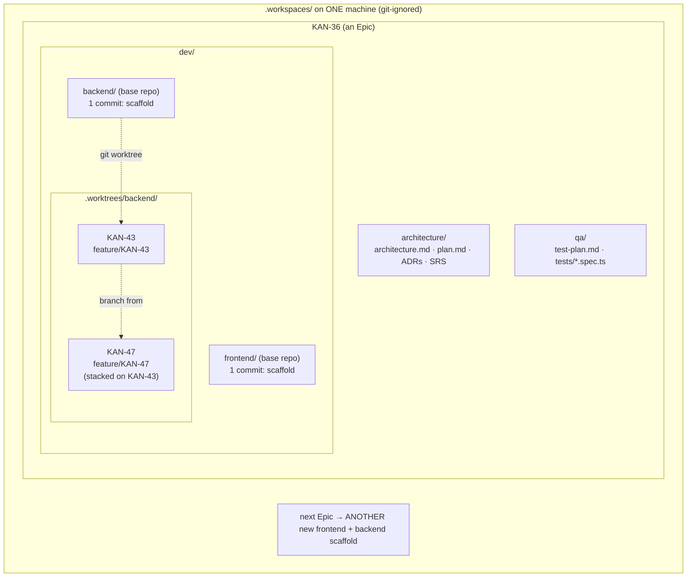
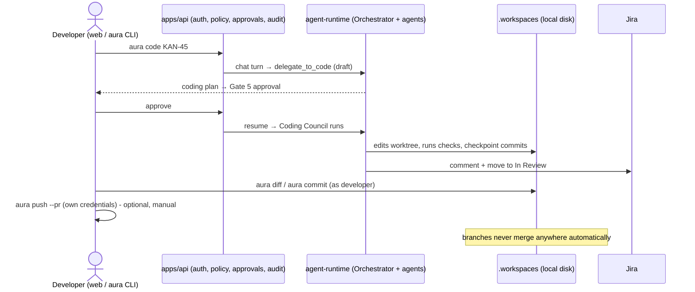
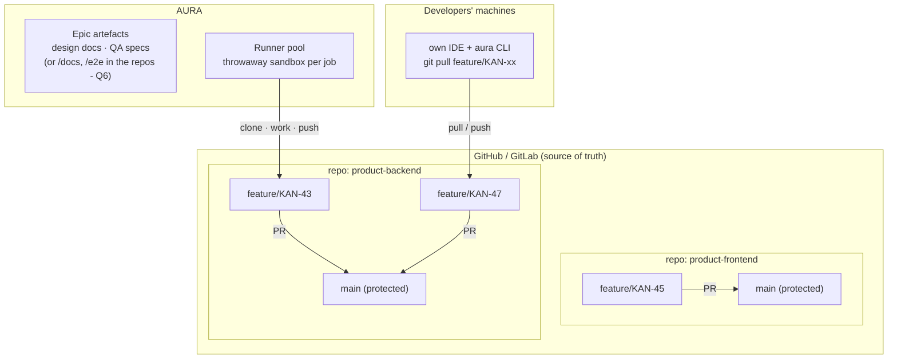
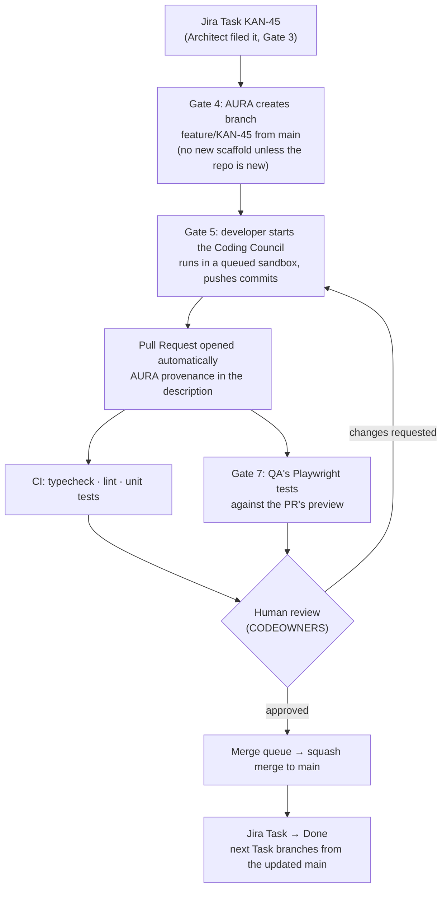
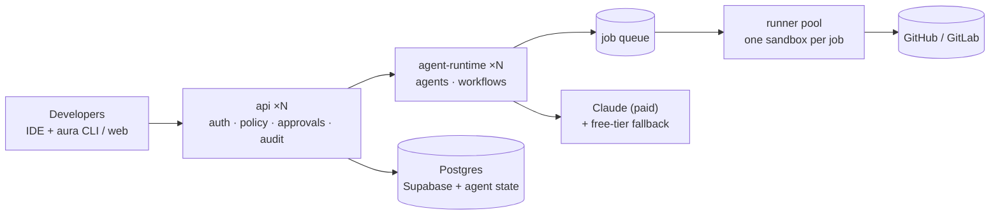

# AURA — points to clarify with the mentor

Date: 2026-09-25 · Status: **open, for mentor review**
Related: [ARCHITECTURE.md](ARCHITECTURE.md) · [ADR-2 team-scale deployment](adr/0002-team-scale-deployment.md) · [plan: CLI + Coding Council](plans/aura-code-cli-council.md)

AURA is a governed AI-agent harness for the software delivery lifecycle. Specialised agents (PO, BA,
Architect, Dev, Coding, QA, Tester, Deployer) produce the work, Jira is the system of record, and a
human approves every consequential step. This page shows **how code flows today**, **the flow I
propose for many developers**, and **the decisions I need the mentor's view on** (§5).

---

## 1. Current state (as built)

### 1.1 End-to-end pipeline

### 1.2 Where code lives today

**How a Task flows today (local mode):**

### 1.3 Problems found (KAN-36 review, 2026-09-25)

| # | Problem | Fixed already? |
|---|---|---|
| P1 | Workspace landed inside `apps/agent-runtime/src/mastra/public/` (relative root resolved from Mastra's cwd) | ✅ resolves against repo root |
| P2 | Task worktrees nested inside the base repo - base `npm test` ran every Task's tests | ✅ worktrees are siblings |
| P3 | Task dependencies never installed (KAN-47 didn't compile) | ✅ per-Task `node_modules` when `package.json` changes |
| P4 | QA specs copied into apps broke the backend's unit tests | ✅ single canonical copy in `qa/tests/` |
| P5 | NestJS template itself failed typecheck | ✅ fixed at scaffold time |
| P6 | **A new app is scaffolded per Epic** - Epic KAN-36 got its own backend | ❌ design question (§5 Q1) |
| P7 | **Task branches never merge** - no PR, no `main`, no "done" for code | ❌ design question (§5 Q2) |
| P8 | **Hidden Task dependencies** - KAN-47 needs KAN-43's code | ❌ design question (§5 Q3) |
| P9 | **QA specs don't match the implemented API** (`/api/password-reset/…` vs `/v1/auth/…`) | ❌ design question (§5 Q4) |
| P10 | Code history exists only on one machine's disk | ❌ design question (§5 Q5) |

---

## 2. Proposed workflow for many developers

### 2.1 Where code would live

### 2.2 How a Task would flow

### 2.3 Rules that let 30+ developers work in parallel

| Rule | Why |
|---|---|
| One repo per product/service, never per Epic | Epics add to the existing app |
| Short-lived branches (hours to a couple of days), trunk-based | Small PRs, few conflicts, easy review |
| `main` is protected: PR required, CI green, 1 human approval | AI output never reaches `main` unreviewed |
| Merge queue | Many merges at once can't break `main` |
| Dependent Tasks merge in order, or as explicit stacked PRs | No hidden coupling (P8) |
| Lockfile committed; CI and sandboxes install from it | Identical dependencies everywhere |
| The developer authors the commit; AURA goes in trailers and the PR description | Clear accountability and audit |

### 2.4 Runtime shape (from ADR-2)

---

## 3. Making the AI harness efficient

| Lever | Proposal |
|---|---|
| **Cost** | Model per job: Sonnet for coding, Haiku for summaries/diagnosis; prompt caching; token budgets per run / developer / team |
| **Speed** | Queued, bounded parallelism; dependency cache on runners; run only affected checks; council "lean mode" for small Tasks |
| **Quality** | Small Tasks (one PR each); council self-review → CI → Gate 7 → human review; a failing check always blocks |
| **Context** | Agents get the diff, relevant files and acceptance criteria, never the whole repo |
| **Reliability** | Every job is re-runnable from branch + approved draft; retries have no side effects |

---

## 4. Current vs proposed

| Area | Current | Proposed |
|---|---|---|
| Unit of code | New app **per Epic** under `.workspaces/<EPIC>/dev/` | **One repo per product/service** |
| Gate 4 | Scaffold (first Task) + local worktree | Create `feature/<TASK>` in the product repo (scaffold only for a brand-new repo) |
| Gate 5 result | Commits in a local worktree | Commits pushed + **automatic PR** |
| Gate 7 | Runs QA specs against a local run | Runs against the **PR preview**; result posted on the PR |
| Done | Jira "In Review", branch stays local | **Merge to `main`** → Jira Done |
| Where agents run | The runtime's own machine | Queued throwaway sandboxes |
| Developer access | Same machine (`aura open` path) | `git pull` the branch / VS Code, from any machine |
| Source of truth | Local disk | GitHub / GitLab |

---

## 5. Questions for the mentor

**Q1 — Code boundary.** Should AURA work on **one repo per product/service** (Epics add features to
existing apps) rather than scaffolding a new app per Epic? If per-product: who creates the repo, and
does AURA still own "scaffold" for brand-new services?

**Q2 — Definition of done for a Task.** Is "PR merged to `main`" the right end of a Task's code
workflow? Should Gate 5's approval **open** the PR and a human PR review **merge** it, or should
merging also be an AURA gate?

**Q3 — Dependent Tasks.** When a Task depends on another (KAN-47 on KAN-43), which should AURA
enforce: (a) merge the first before starting the second, (b) stacked PRs, or (c) the Architect plans
Tasks so they're independent?

**Q4 — Who adapts when tests and code disagree?** QA's specs use `/api/password-reset/...`; the
implementation uses `/v1/auth/...`. Should the **API contract** (from the Architect's design) be the
single source both QA and coding must follow, so this mismatch can't happen? Or is Gate 7's diagnose
→ route loop enough?

**Q5 — Git hosting.** GitHub or GitLab, and can AURA use a **GitHub App / bot account** to push
branches and open PRs, with developers using their own credentials for everything else?

**Q6 — Where do design docs and QA specs live?** Keep them in AURA's per-Epic workspace (today), or
move them into the product repos (`/docs/<EPIC>/…`, `/e2e/…`) so they're versioned and reviewed
with the code?

**Q7 — Models and budget.** Is a paid model (Claude) with per-team budgets acceptable for the Coding
Council, or must it stay on free tiers? What monthly budget per team is reasonable?

**Q8 — Isolation level.** Are containers (Docker, one per job) enough for running agent-written code
on shared runners, or is stronger isolation (gVisor/Firecracker) required by company policy?

**Q9 — Scope of the web terminal.** On a shared deployment, should the browser terminal be kept
(restricted, attached to the Task's sandbox) or removed in favour of the developer's own IDE only?

**Q10 — Priority.** Given limited time, is this order right?
1. Git-backed workflow: product repos, branches, automatic PRs, merge (Q1–Q3, Q5)
2. Queued runner pool and Postgres state (ADR-2)
3. SSO, paid models, budgets
4. Project Files "Changes" view (diff against `main`)

---

*After the mentor's answers, the agreed decisions go into **ADR-3 (Git workflow)** and ADR-2 is
updated to match.*
