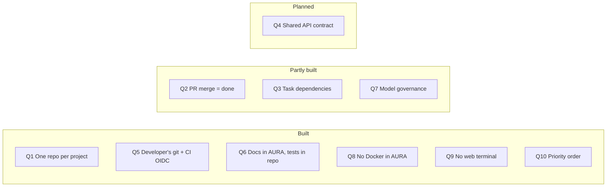

# Clarifications

| | |
|---|---|
| **Raised** | 2026-09-25 (mentor review) |
| **Answered against code** | 2026-10-02, after V7 |
| **Result** | All 10 questions answered. 6 built, 3 partly built, 1 planned. Open decisions carry a recommendation (§4) |

Decisions are recorded in [ADR-3](adr/0003-git-workflow.md) and [ADR-4](adr/0004-vscode-developer-workspace.md).
Work is tracked in the [Roadmap](plans/aura-git-control-plane.md).

---

## 1. Summary

```mermaid
flowchart LR
    subgraph BUILT["Built"]
        Q1["Q1 One repo per project"]
        Q5["Q5 Developer's git + CI OIDC"]
        Q6["Q6 Docs in AURA, tests in repo"]
        Q8["Q8 No Docker in AURA"]
        Q9["Q9 No web terminal"]
        Q10["Q10 Priority order"]
    end
    subgraph PARTIAL["Partly built"]
        Q2["Q2 PR merge = done"]
        Q3["Q3 Task dependencies"]
        Q7["Q7 Model governance"]
    end
    subgraph TODO["Planned"]
        Q4["Q4 Shared API contract"]
    end
```

---

## 2. Questions, answers and status

| # | Question | Answer | Status | Roadmap |
|---|---|---|---|---|
| Q1 | Should code live in one repo per product, not one app per Epic? | **Yes.** One repository per project. Scaffold only when the repository is new | 🟢 VS Code Connect Repository / Initialize Project; `projects` and `repositories` tables | — |
| Q2 | When is a Task's code done? | PR merged → *Ready for Release*. Released at Gate 8 → *Done*. Merging is always a human action on GitHub | 🟡 Gate 6 opens the PR and CI reports back. Jira status from merge events is not built | 4.1, 4.2 |
| Q3 | How are dependent Tasks handled? | The Architect sets `dependsOn` per Task; it becomes a Jira link. Start Work waits until dependencies are merged. No stacked branches | 🟡 `task_dependencies` table exists. Architect drafts have no `dependsOn` yet | 4.4 |
| Q4 | How do QA tests and code agree on the API? | The Architect emits one **OpenAPI 3.1** contract. Coders build to it, the test-writer tests against it, and CI runs a contract check | 🔴 Not built | 4.5 |
| Q5 | Which Git host and credentials? | **GitHub**, through the developer's own `git` and `gh`. CI reports to AURA with a GitHub OIDC token. AURA holds no Git credentials (replaces the GitHub App plan) | 🟢 Gate 6 and `POST /ci/report` | — |
| Q6 | Where do design docs and tests live? | Design documents, ADRs, SRS and the QA plan are versioned in AURA's Postgres. Tests live in the repository on the Task branch. CI results are the evidence | 🟢 `design_docs` table; the test-writer coder writes tests; CI on the PR | — |
| Q7 | Which models and budget? | Contracted providers with zero data retention for company data; free tier only for public projects. Provider, model and tokens recorded per run. Budgets per run, user and project | 🟡 Models per agent in the registry with fallback; token ledger. No model policy or budgets yet | 3.3, 3.5 |
| Q8 | Is Docker isolation enough? | AURA runs no code itself. Agents run commands on the developer's machine under the permission engine (built-in denies, allow/ask/deny rules, no bypass mode). CI on GitHub is the isolated, authoritative run | 🟢 Docker and host checks removed in V7 | — |
| Q9 | Keep the web terminal? | **No.** The developer's VS Code is the only place code runs | 🟢 Removed in V7 | — |
| Q10 | What order? | One lane (done) → delivery loop → company pilot (without SSO) → company rollout → automation and more agents | 🟢 Agreed; Phase 3 (delivery loop) is next | §1 |

Related review items:

| Item | Status |
|---|---|
| Remove Claude Code / Codex coding providers | 🟢 Done |
| Run CI and QA in parallel on the PR | 🟡 CI runs on every PR and QA is notified. An "AURA QA" check run on the PR is planned (4.3) |

---

## 3. Problems found in the KAN-36 review

| # | Problem | Status |
|---|---|---|
| P1 | Workspace created inside `apps/agent-runtime` | 🟢 Fixed; server workspaces removed in V7 |
| P2 | Task worktrees nested inside the base repo | 🟢 Fixed; worktrees live under `.aura/worktrees/` in the developer's clone |
| P3 | Task dependencies not installed | 🟢 Fixed |
| P4 | QA specs broke backend unit tests | 🟢 Fixed; tests are written on the Task branch and run by CI |
| P5 | NestJS template failed typecheck | 🟢 Fixed |
| P6 | New app per Epic | 🟢 Fixed by Q1 |
| P7 | Task branches never merge | 🟡 PRs open at Gate 6; merge tracking is 4.2 (Q2) |
| P8 | Hidden Task dependencies | 🟡 See Q3 |
| P9 | QA specs don't match the API | 🔴 See Q4 |
| P10 | Code history on one machine only | 🟢 Fixed by Q5; code is pushed to GitHub |

---

## 4. Open decisions

None blocks current work. Each needs a decision before its roadmap step starts; the recommendation
is the default if nobody objects.

| Decision | Options | Recommendation | Needed by |
|---|---|---|---|
| Company sign-in | Microsoft Entra ID · Google Workspace · Okta | The company's existing directory, through Supabase SAML/OIDC | 3.1 |
| Contracted model provider | Anthropic API · AWS Bedrock · Google Vertex AI · Azure OpenAI | The provider in the same cloud as hosting, with zero data retention and a DPA | 3.3 |
| Hosting cloud and region | AWS · Google Cloud · Azure; Mumbai or Singapore | The nearest region allowed under Sri Lanka PDPA No. 9 of 2022 cross-border rules, confirmed by legal | 3.6 |
| Bridge routing across API replicas | Postgres `LISTEN/NOTIFY` · Redis pub/sub | Postgres: no new infrastructure | 5.1 |
| Jira test management | Plain Bugs · Xray · Zephyr | Plain Bugs plus AURA's QA page; Xray only if QA asks | 4.3 |
| Vector store for codebase knowledge | pgvector · external | pgvector in the existing Postgres | Later |
| Git hosts beyond GitHub | GitLab (`glab`) | After Phase 3 | Later |
| LLM-judged evals | Own scorers only · Langfuse / Braintrust | Own deterministic scorers; a judge only for prose quality | 3.9 |
