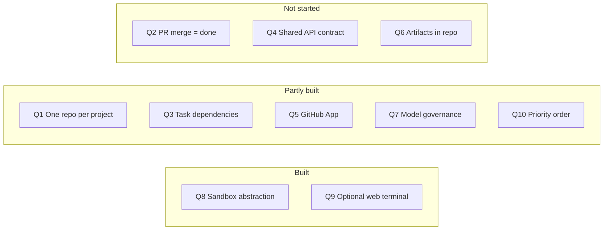

# Clarifications

| | |
|---|---|
| **Raised** | 2026-09-25 (mentor review) |
| **Checked against code** | 2026-10-02 |
| **Result** | All 10 questions answered. 2 answers built, 5 partly built, 3 not started. A few smaller decisions are still open (§4). |

Decisions are recorded in [ADR-3](adr/0003-git-workflow.md). Work is tracked in the
[Roadmap](plans/aura-git-control-plane.md).

---

## 1. Summary

```mermaid
flowchart LR
    subgraph BUILT["Built"]
        Q8["Q8 Sandbox abstraction"]
        Q9["Q9 Optional web terminal"]
    end
    subgraph PARTIAL["Partly built"]
        Q1["Q1 One repo per project"]
        Q3["Q3 Task dependencies"]
        Q5["Q5 GitHub App"]
        Q7["Q7 Model governance"]
        Q10["Q10 Priority order"]
    end
    subgraph TODO["Not started"]
        Q2["Q2 PR merge = done"]
        Q4["Q4 Shared API contract"]
        Q6["Q6 Artifacts in repo"]
    end
```

---

## 2. Questions, answers and status

| # | Question | Answer | Status in code |
|---|---|---|---|
| Q1 | Should code live in one repo per product, not one app per Epic? | **Yes.** Scaffold only when a repo is new | 🟡 `projects` and `repositories` tables and the admin page exist. Gate 4 still scaffolds per Epic |
| Q2 | When is a Task's code done? | PR merged → *Ready for Release*. Released → *Done*. Merging stays a human action on the Git host | 🔴 No PRs, no merge, no Jira status mapping |
| Q3 | How are dependent Tasks handled? | `dependsOn` on Tasks. Dependencies merge first. Stacking only by explicit choice | 🟡 `task_dependencies` table exists. Architect drafts have no `dependsOn`; Gate 4 does not check |
| Q4 | How do QA tests and code agree on the API? | One **OpenAPI** contract for Coding and QA, plus a contract check | 🔴 Not built |
| Q5 | Which Git host and credentials? | **GitHub App**, not personal tokens | 🟡 `GitProvider` interface and `local` provider built. GitHub provider not built |
| Q6 | Where do design docs and QA specs live? | Engineering files in the repo; run evidence in AURA | 🔴 Still in AURA's per-Epic workspace |
| Q7 | Which models and budget? | No lock-in: route through a model gateway; record provider, model, tokens and cost per run | 🟡 Models per role in the registry; token ledger per agent and model. No cost in money, no team budgets, no gateway service |
| Q8 | Is Docker isolation enough? | Yes for now, behind a sandbox abstraction | 🟢 `lib/sandbox.ts` (`host` / `docker`); server mode requires `docker` |
| Q9 | Keep the web terminal? | Optional. The developer's IDE comes first | 🟢 `TERMINAL_MODE=off` / `restricted`; server mode refuses `full` |
| Q10 | What order? | Git → durable execution → identity/security → AI control plane → more agents | 🟡 Phase 1 in progress (steps 1.1–1.2 done) |

Related review items:

| Item | Status |
|---|---|
| Remove Claude Code / Codex coding providers | 🟢 Done |
| Run CI and QA in parallel on the PR | 🔴 Needs PRs first |

---

## 3. Problems found in the KAN-36 review

| # | Problem | Status |
|---|---|---|
| P1 | Workspace created inside `apps/agent-runtime` | 🟢 Fixed |
| P2 | Task worktrees nested inside the base repo | 🟢 Fixed |
| P3 | Task dependencies not installed | 🟢 Fixed |
| P4 | QA specs broke backend unit tests | 🟢 Fixed |
| P5 | NestJS template failed typecheck | 🟢 Fixed |
| P6 | New app per Epic | 🟡 See Q1 |
| P7 | Task branches never merge | 🔴 See Q2 |
| P8 | Hidden Task dependencies | 🟡 See Q3 |
| P9 | QA specs don't match the API | 🔴 See Q4 |
| P10 | Code history on one machine only | 🟡 See Q5 |

---

## 4. Still open

These are not blocking. Each needs a decision before its roadmap step starts.

| Decision | Options | Needed by |
|---|---|---|
| Job queue | pg-boss · BullMQ + Redis | Phase 2 |
| Database provisioning for scaffolds | Local Postgres container · managed instance | Data discipline in Gate 4 |
| Jira test management | Plain Bugs · Xray · Zephyr | Test reporting |
| Vector store | pgvector · external | Codebase knowledge |
| Git hosts beyond GitHub | GitLab support | After Phase 1 |
| LLM-judged evals | Own scorers only · Langfuse / Braintrust | Eval expansion |
