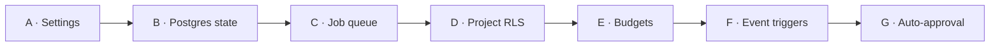
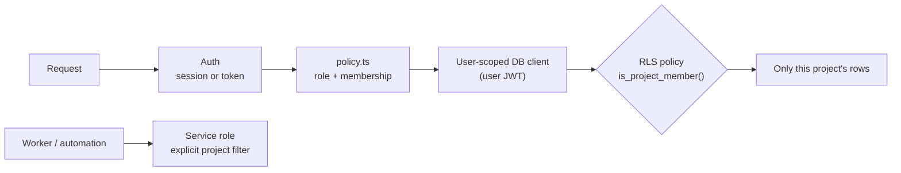
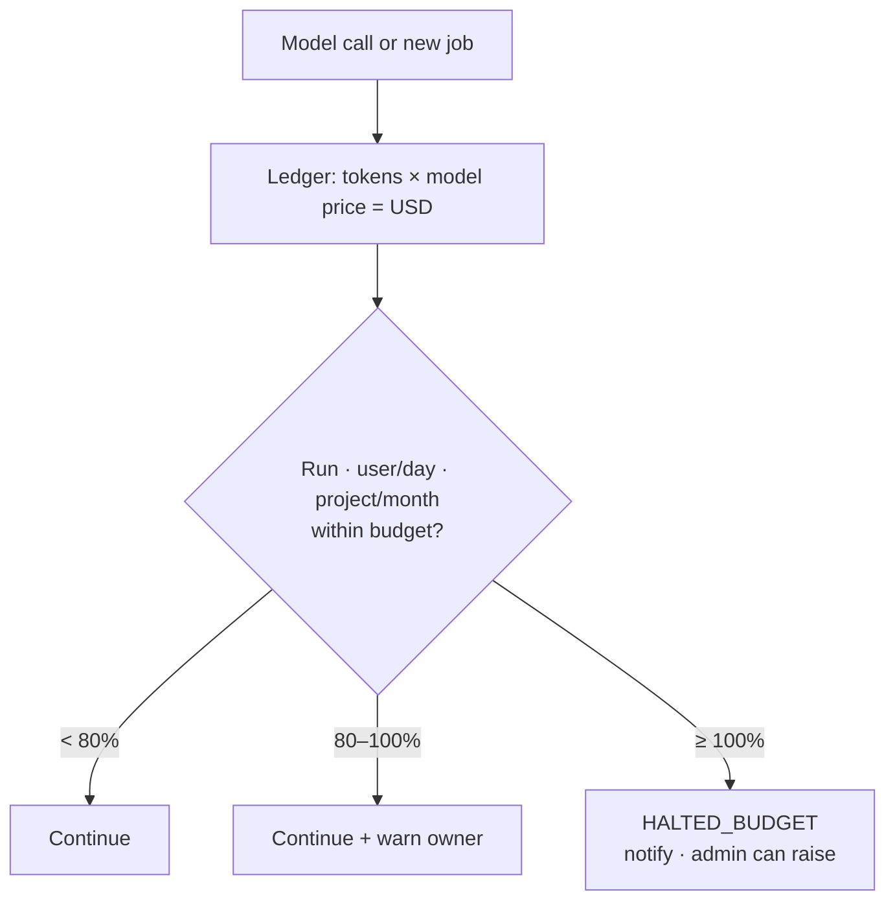
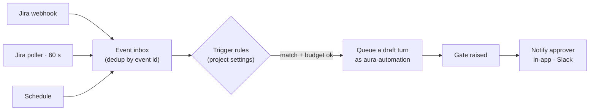
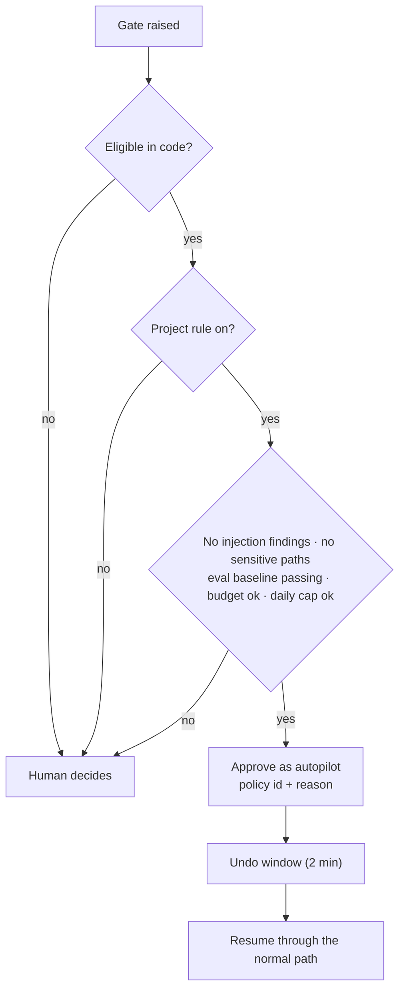

# Plan: Settings, Durable Execution, Project Security, Budgets, Automation

| | |
|---|---|
| **Status** | Approved 2026-10-02 · Parts A–C **completed** · Parts D–G planned (Roadmap Phases 3–4) |
| **Date** | 2026-10-02 |
| **Moves** | Automation L2 → L3 (part L4) · company reliability ~30 → ~60 |
| **Covers** | Roadmap Phase 2 (durable execution), part of Phase 3 (RLS, budgets), stages A1–A3, dashboard settings |

**Today:**
- A person starts every step.
- Turns run as queued jobs and runtime state is in Postgres (Parts A–C, completed).
- The API reads every table with the service role, so RLS never applies to it.
- Spending is only limited per legacy Coding Council run.

**After this plan:**
- Turns run as queued jobs on Postgres and survive restarts.
- Data is scoped per project at the database level.
- Spending has hard limits per user and project.
- Jira events start drafts on their own, and low-risk gates can auto-approve.
- Settings live in the dashboard.

**Why this order:** settings hold the configuration for every later part. Postgres comes before
the queue and RLS. RLS and budgets come **before** automation, so automated runs are scoped and
capped from their first day. Each part works on its own and ships with tests.

---

## 1. Decisions to approve

| # | Decision | Proposed | Alternative |
|---|---|---|---|
| D1 | Queue | **pg-boss** on the Supabase Postgres (no new infrastructure) | BullMQ + Redis |
| D2 | Where jobs run | **Worker inside `apps/api`** first; separate `apps/worker` later | Separate service now |
| D3 | Runtime state | **Postgres** when `DATABASE_URL` is set; libSQL stays for plain local mode | Postgres only |
| D4 | Live updates | `GET /runs/:id/events`: replay `run_steps`, then live tail (`LISTEN/NOTIFY`) | Keep one request open per turn |
| D5 | RLS enforcement | API **reads with a user-scoped client** (user JWT); service role only for system jobs and audit writes | Keep service role + code checks only |
| D6 | Token users and RLS | API mints a **short-lived Supabase JWT** (5 min) for the token's owner, signed with `SUPABASE_JWT_SECRET` | Skip RLS for token (extension) calls |
| D7 | Budget currency | **USD**, from a model price table in Settings; tokens still recorded | Tokens only |
| D8 | Budget breach | Warn at 80%; **hard stop** at 100% → run `HALTED_BUDGET`; admin can raise | Warn only |
| D9 | Event source | **Jira webhook** + **polling fallback** (60 s) for local use | Webhook only |
| D10 | Who starts event runs | System actor **`aura-automation`**: can draft, never approve | Project owner's identity |
| D11 | Auto-approval ceiling | Fixed **in code** per tool × mode; project settings can only narrow it | Fully configurable |
| D12 | Never auto-approved | Gate 5 code, Gate 8, filing Epics, injection findings, sensitive paths (auth, payments, secrets, migrations) | — |
| D13 | Auto-approval default | **Off** for every project until an admin enables a rule | On by default |

---

## 2. Parts A–C — Completed

Built and unit-tested on 2026-10-02. How they work now is in [ARCHITECTURE.md](../ARCHITECTURE.md).

| Part | Result | Where |
|---|---|---|
| A · Settings | `settings` table (migration 0008), registry with bounds, `GET/PUT /settings`, Admin → Settings, Profile → Preferences; values sent with each turn | ARCHITECTURE §7.1 |
| B · Postgres state | `PostgresStore` (`@mastra/pg` 1.25.0) and `RuntimeDb` on Postgres when `DATABASE_URL` is set; `migrate-state` | ARCHITECTURE §7 |
| C · Queued turns | pg-boss turn jobs, `run_events` (migration 0009), `GET /runs/:id/events`, heartbeat and `INTERRUPTED` sweep | ARCHITECTURE §2 |

| Still open from A–C | Where it is tracked |
|---|---|
| Restart test of `PostgresStore` and `migrate-state` against the real Supabase | Roadmap, live checks |
| Turn concurrency per project and per model provider (C7) | Roadmap, Phase 2 |

---

## 5. Part D — Project membership and RLS

Two independent locks: `policy.ts` checks membership in code, and Postgres checks it again. A bug
in one is caught by the other.

| Step | Change | Done when |
|---|---|---|
| D1 | Migration `0010_project_scope.sql`: `project_members (project_id, user_id, role)`; `project_id` on `workflow_runs`, `approval_requests`, `audit_logs`, `task_branches`, `settings`, runtime drafts | Backfill puts existing rows in the KAN project |
| D2 | SQL helpers `is_project_member(project_id)`, `is_admin()`; `select` policies on every governance table; writes stay API-only | Policy tests in SQL (`supabase test db` or pgTAP) |
| D3 | API: per-request user-scoped Supabase client for reads; service role only for writes, audit and system jobs | Reading another project's run returns nothing even if code forgets a filter |
| D4 | Token users: API mints a 5-minute Supabase JWT for the token owner | Token calls are scoped by RLS too |
| D5 | `policy.ts`: `can()` takes a project; Orchestrator turns carry `projectId` | Unit tests: non-member is refused |
| D6 | Admin → Projects: manage members and their roles per project | Admin adds a Developer to one project only |
| D7 | Runtime tables: queries filter by `projectId` from the request context | A draft from project A can't be filed in project B |

---

## 6. Part E — Budgets

| Budget | Scope | Checked |
|---|---|---|
| Per run | One turn or Task loop | Before each model call |
| Per user per day | Developer, BA, … | Before a job starts and before each model call |
| Per project per month | Whole team | Same |
| Automation share | Event-started runs per project per day | Before a triggered job is queued |

| Step | Change | Done when |
|---|---|---|
| E1 | Token ledger gains `project_id`, `user_id`, `run_id` (from the request context) | Usage page filters by project and user |
| E2 | Model price table in Settings (USD per 1M input / output / cached tokens) | Cost shown next to tokens |
| E3 | `budget.ts` in the runtime: one check function used by the gateway, the coder ↔ Evaluator loop and every structured call | Unit tests at 79%, 80%, 100% |
| E4 | Worker refuses to start a job when a budget is spent; run → `HALTED_BUDGET` | Breach stops work before it starts |
| E5 | Warnings at 80% (in-app, Slack if set); audit `budget.warning` / `budget.exceeded` | Owner told before the stop |
| E6 | Admin → AI Usage: spend vs budget per project and user; raise a limit (audited) | One place to see and change |
| E7 | The VS Code extension shows remaining budget | Developer sees it while working |

---

## 7. Part F — Event triggers

| Trigger | Event | Action | Default |
|---|---|---|---|
| T1 | Task → *Ready for Development* | Draft Gate 4 (worktree) | On |
| T2 | Gate 4 executed | Draft Gate 5 (coding plan) | On |
| T3 | Gate 5 done, Reviewer approved | Draft Gate 6 (QA specs) | Off |
| T4 | Gate 6 filed | Draft Gate 7 (test run) | Off |
| T5 | Epic created with label `aura` | Draft Gate 2 (Stories) | Off |
| T6 | Gate 1–3 approved | Draft the next gate | Off |
| T7 | Nightly | Approval expiry, stale worktrees, usage and budget summary | On |

GitHub events (PR merged, CI failed) join after Roadmap Phase 1 adds the GitHub provider.

| Step | Change | Done when |
|---|---|---|
| F1 | Migration `0011_events.sql`: `events` (source, external id, payload, status), `triggers` (project, rule, enabled) | Duplicate deliveries stored once |
| F2 | `POST /webhooks/jira` verified with `JIRA_WEBHOOK_SECRET` | Unsigned calls refused; deliveries audited |
| F3 | Jira poller job, used when no webhook is configured | Works on localhost |
| F4 | System actor `aura-automation`: member of opted-in projects, run grant, no approve grant | Policy test: it never decides a gate |
| F5 | Rule engine (plain code): event → queued draft turn, after the budget check | Unit tests per trigger |
| F6 | Notifications: inbox badge, optional Slack webhook (Settings → Automation) | Approver told about a new gate |
| F7 | Kill switch per project and global | One click stops all triggers |

---

## 8. Part G — Auto-approval (autopilot)

| Eligible step (code ceiling) | Why low consequence |
|---|---|
| Gate 4 `execute` when the base repo exists | Creates a branch and worktree only |
| Gate 7 `execute` retest after an AURA fix | Runs tests in a sandbox |
| QA `revise-scenario` filing for a high-confidence test defect | Changes one test file |
| `delegate_to_ci` `file-defect` | Files a Jira Bug with evidence |

| Step | Change | Done when |
|---|---|---|
| G1 | `AUTO_ELIGIBLE` ceiling in `gateway/risk.ts`, checked by a test | A new mode is never eligible by accident |
| G2 | Auto-decider (pure function) in the API policy module, run when a gate is created | Unit tests |
| G3 | Decision stored with `decided_by = autopilot`, rule id and version; audit `approval.auto_approved` | Audit export shows the rule |
| G4 | Gateway accepts an autopilot decision only for eligible steps | Test: autopilot cannot approve Gate 5 |
| G5 | Settings → Automation: rules, daily cap, kill switch | Admin turns a rule on and sees it act |
| G6 | Inbox lists auto-approved gates with **Undo** during the window | A person can stop it |

---

## 9. New configuration

Added to `.env.example` only. AURA never writes `.env` values.

| Variable | App | Purpose |
|---|---|---|
| `DATABASE_URL` | api, agent-runtime | Direct Postgres (Supabase session mode, port 5432) |
| `SUPABASE_JWT_SECRET` | api | Becomes required: user-scoped JWTs for RLS (exists today as optional) |
| `JIRA_WEBHOOK_SECRET` | api | Verifies Jira webhooks |

Everything else in this plan is a dashboard setting.

---

## 10. Risks

| Risk | Mitigation |
|---|---|
| `@mastra/pg` must match `@mastra/core` 1.67 | Pinned to 1.25.0; newer releases need core 1.68 |
| Transaction pooler breaks `LISTEN/NOTIFY` | Require the session-mode connection |
| A retried job repeats a side effect | Idempotency keys; idempotent execute modes; manual Resume when unsure |
| RLS change hides data from the API by mistake | Backfill first; SQL policy tests; feature flag to fall back to service-role reads |
| Price table out of date | Admin-editable; cost shown as an estimate |
| Budget stop in the middle of a Task | Stop between coder rounds, never mid-write |
| Event storms | Dedup by event id; per-project rate limit; kill switch |
| Wrong auto-approval | Code ceiling, never-list, undo window, daily cap, full audit |

---

## 11. Result

| Measure | Before | After |
|---|---:|---:|
| Automation score | ~50 | ~72 |
| Company reliability | ~30 | ~60 |
| Automation level | L2 | L3 (L4 for eligible gates) |
| Run survives a restart or closed browser | No | Yes |
| Database enforces project scope | No | Yes |
| Hard spending limits | Council run only | Run, user, project, automation |
| Settings changed without a restart | No | Yes |

**Still needed for a company after this plan:** SSO, a secret manager and paid models.
