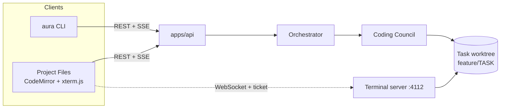
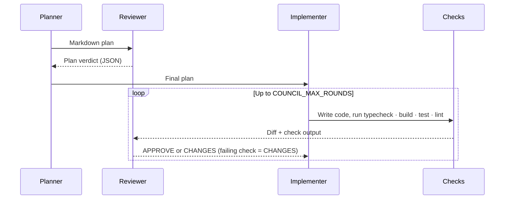
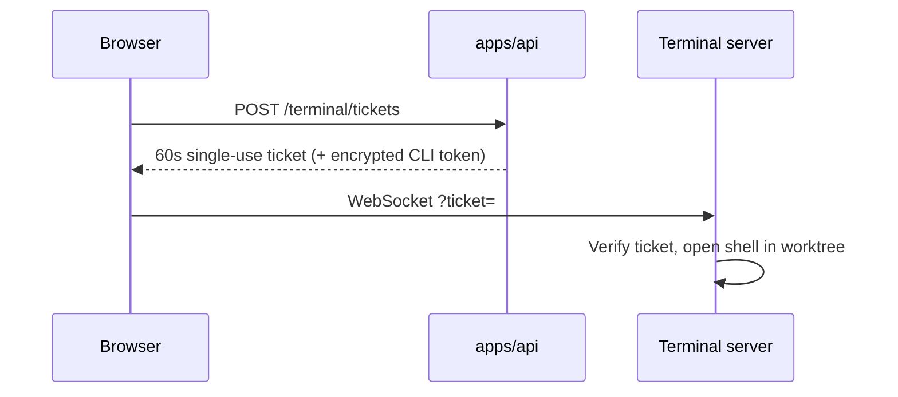

# Developer Tools: `aura` CLI, Coding Council, Web Terminal

| | |
|---|---|
| **Status** | Built. VS Code extension and remote mode are not built |
| **Related** | [ARCHITECTURE.md](../ARCHITECTURE.md) · [SETUP.md](../../SETUP.md) |

These tools let a developer work on a Jira Task from their own terminal, while every action still
goes through `apps/api` (auth, policy, approvals, audit).

---

## 1. Overview

---

## 2. `aura` CLI

| Command | Server call |
|---|---|
| `login` · `logout` · `whoami` | `GET /me`, `PUT /me/git-identity` |
| `tasks [--epic]` | `GET /jira/epics/:key` |
| `open [TASK] [--code\|--path]` | `GET /dev-workspace/tasks/:taskKey` |
| `code [TASK] [-p council\|mastra]` | `POST /threads`, `POST /threads/:id/messages` |
| `approve` · `reject` · `revise` | `POST /approvals/:id/decide` (with snapshot hash) |
| `say "text"` | `POST /council/:draftId/notes` |
| `status` | `GET /approvals`, `GET /council/usage` |
| `diff` · `commit` · `push [--pr]` | Local `git` and `gh` |

- **Login:** personal access token `aura_pat_…`, stored in `~/.config/aura/config.json` (mode 0600).
  `AURA_TOKEN` / `AURA_API_URL` override it.
- **Commit:** `aura commit` makes one commit authored by the developer, folds in the council's
  checkpoint commits, and adds `Co-authored-by: AURA Coding Council`, `AURA-Task` and `AURA-Run`.
- **Push:** uses the developer's own git credentials and `gh`.

---

## 3. Coding Council

| Role | Tools | Models (first → fallback) |
|---|---|---|
| Planner | `list_files`, `read_file`, `search_files` | `groq/openai/gpt-oss-120b` → `google/gemini-3.5-flash-lite` |
| Implementer | Read tools + `write_file`, `edit_file`, `run_check` | `groq/openai/gpt-oss-120b` → `google/gemini-3.5-flash-lite` |
| Reviewer | None (JSON verdict) | `google/gemini-3.5-flash-lite` → `groq/qwen/qwen3.8-27b` |

| Behaviour | Detail |
|---|---|
| Modes | `lean` (Implementer plans), `full`, `auto` (full for sensitive or large Tasks). Chosen at draft time and shown at Gate 5 |
| Checks | Fixed check ids from the project's `package.json`; no shell. Run on host or in Docker (`SANDBOX_MODE`) |
| Commits | One checkpoint commit per round on the Task branch |
| Retries | Fallback chain per role; on provider errors wait and retry (max 2) |
| Budget | `COUNCIL_TOKEN_BUDGET` stops the run cleanly and keeps the work |
| Streaming | Each turn streams as SSE event `council` and is saved as a run step |
| Transcript | `<worktree>/.aura/council/<draftId>.md` (excluded from git) |
| Outcome | Task moves to *In Review* only if the Reviewer approves |

### Files

| Piece | File (`apps/agent-runtime/src/mastra/`) |
|---|---|
| Loop | `workflows/coding-council.ts` |
| Agents | `agents/council-agents.ts` |
| Tools | `tools/council-tools.ts` |
| Checks | `lib/sandbox.ts` |
| Verdict schema, mode choice | `contracts/council.ts` |
| Models | `agents/registry.ts` |
| Notes and usage | `store/council-notes.ts`, `store/usage-store.ts` |

### Cost

A small Task takes about 15–40 model requests. Most go to the Implementer's tool loop.

| Option | Relative cost | Use |
|---|---|---|
| Single agent (`mastra`) | ~50% | Trivial Tasks |
| Lean council | ~75% | Default for normal Tasks |
| Full council | 100% | Sensitive or large Tasks |

---

## 4. Web terminal

| Setting | Behaviour |
|---|---|
| Access | Developer role only; each session start is audited |
| `full` mode | Real shell (Python `pty` bridge); loopback only |
| `restricted` mode | Allowlisted commands: `aura`, `git`, `npm test/run`, `ls`, `cat`, `pwd` |
| Environment | Allowlist; no LLM keys, Jira token or secrets |
| Limits | 3 sessions per user; closes after 30 minutes idle |
| CLI token | 8-hour `terminal` token, so `aura` works without login |

---

## 5. Known limits

| Limit | Impact |
|---|---|
| Council notes are kept in memory | A runtime restart drops unread notes |
| Host checks run project scripts | Local use only; server mode requires Docker |
| Council runs can pass 10 minutes | Raise `RUN_TURN_TIMEOUT_MS` |
| Terminal tokens are not revoked on close | They expire after 8 hours |
| Free-tier models | Keep Tasks small |

## 6. Not built

VS Code extension · remote (non-local) worktrees · Monaco editor · council notes box in the web UI.
