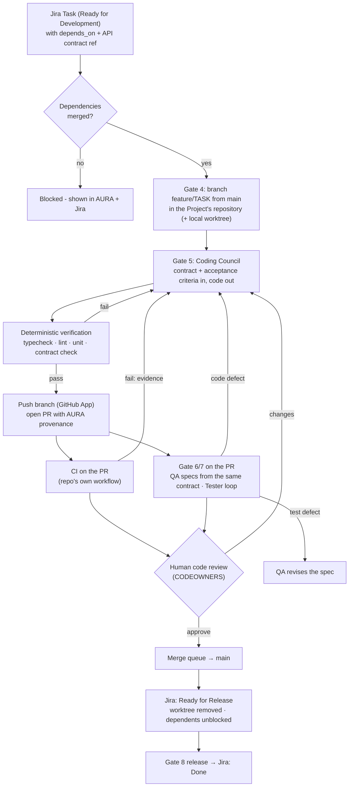
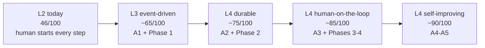

# AURA — from local agent pipeline to a Git-governed engineering control plane

Status: **Approved — Phase 0 done (2026-09-25), Phase 1 next**
Inputs: [clarify.md](../clarify.md) (questions) · mentor assessment (760/1000) · [ADR-2](../adr/0002-team-scale-deployment.md) (team-scale deployment) · [aura-code-cli-council.md](aura-code-cli-council.md) (what was built today)

---

## 1. Goal

Change what AURA *is* from **"a chain of agents (PO → BA → Architect → Dev → QA → Tester →
Deployer)"** to **"a control plane that governs AI work performed against a company's software
repositories"**. The agents become replaceable workers; the durable objects are:

```text
Organization → Project → Repository → Epic → Task → Branch → AI Run → Commit
            → Pull Request → CI + QA evidence → Human review → Merge → Release
```

The principle that stays untouched, because it is the most valuable part of AURA today:

> **Agents propose. Deterministic infrastructure authorizes, executes, verifies and records.**

### Success criteria for this plan

1. A Jira Task goes from "Ready for Development" to **a merged PR on `main`** of a real repository,
   with AURA driving every step and a human approving at the gates and in review.
2. The Coding Agent and the QA Agent work from **one shared API contract**, so the KAN-36 class of
   mismatch (`/api/password-reset/...` vs `/v1/auth/...`) cannot happen.
3. Task dependencies are **explicit data**, not something rediscovered from file timestamps.
4. AURA depends on **model APIs through its own gateway**, not on developers' personal CLI logins.
5. Every step ships with **automated tests** for the deterministic code it adds.

### 1.1 How automated is AURA today? — **46 / 100**

An *automated* AI harness means work moves forward on its own when something happens (a Task becomes
ready, CI fails, a PR merges), agents do the work inside safe limits, machines verify it, and humans
step in only where policy says a decision needs a person. Measured against that:

| Dimension | Weight | Score | Evidence (as of 2026-09-25) |
|---|---:|---:|---|
| **Governance & safety** (policy, gates, audit, provenance) | 15% | **90** | Policy outside the LLM, 8 gates, append-only audit, provenance on every artefact |
| **Autonomy inside a step** | 15% | **70** | Coding Council plans/implements/reviews/fixes on its own; Tester loop diagnoses and routes on its own |
| **Machine verification** | 10% | **65** | Allowlisted checks, failing check forces CHANGES, real Playwright results; no contract check, no CI |
| **Triggers / event-driven flow** | 15% | **10** | **Nothing starts by itself** - no Jira/GitHub webhooks, no scheduler; every step begins with a human chat message or CLI command |
| **Hand-offs between steps** | 10% | **30** | The Orchestrator chains steps inside one conversation; nothing carries on after a gate without a human re-driving it |
| **Integration (Git, PR, CI, Jira)** | 10% | **30** | Jira read/write ✓; branches local only; no push, PR, CI or merge |
| **Durability & recovery** | 10% | **20** | In-process runs, local files, in-memory notes; a restart loses running work; no queue, no retries |
| **Cost & capacity control** | 5% | **35** | Per-run token budget + daily usage; no per-team budgets, no cost in money, no concurrency limits |
| **Observability** | 5% | **50** | Mastra traces, run steps, Runners tab; no metrics, alerts or SLOs |
| **Auto-approval policy** (risk tiers) | 5% | **0** | Every gate needs a human, even for trivially safe steps |
| **Weighted total** | | **≈ 46** | |

**Automation level: L2 of 5.**

| Level | Meaning | AURA |
|---|---|---|
| L0 | Humans do the work | |
| L1 | AI drafts, humans do everything else | |
| **L2** | **AI does each step when a human asks; a human approves every step** | **← today** |
| L3 | **Event-driven**: steps start automatically from Jira/GitHub events; humans approve at gates | Phase 1 + A1 |
| L4 | **Human on the loop**: low-risk gates auto-approve by policy; humans review PRs, merges and exceptions | Phases 2–4 + A2–A3 |
| L5 | Fully autonomous, humans only audit | **Not a goal** - merge to `main`, releases and security-sensitive changes always keep a human |

**How far to "automated" (L4, ~85/100):** the gap is almost entirely *plumbing*, not AI.
Triggers, Git/PR/CI integration, durable execution and risk-tiered auto-approval account for about 35
of the missing points. None of it needs smarter agents.

### Non-goals (explicitly later)

Multi-repository Projects, multi-tenant organizations, SSO, Kubernetes, stronger-than-Docker
isolation, more agents. They are sequenced in §6–§10, not built here.

---

## 2. Target flow for one Task



**Jira lifecycle** (mapping configurable per Jira project):

| Event | Jira status |
|---|---|
| Branch created (Gate 4) | In Progress |
| PR opened | In Review |
| PR merged | Ready for Release |
| Released (Gate 8) | Done |

---

## 3. Decisions to approve

| # | Decision | Proposed | Alternative |
|---|---|---|---|
| D1 | Code boundary | **One repository per Project** (single repo for Phase 1; frontend and backend as folders, or pick one service) | Multi-repo Project (later, §10) |
| D2 | Git host | **GitHub**, via a **GitHub App** (branches, PRs, check runs, webhooks) behind a `GitProvider` interface; a local bare-repo provider for AURA's own tests | GitLab first |
| D3 | Definition of done | PR merged → **Ready for Release**; Gate 8 release → **Done** | Merged = Done |
| D4 | Dependencies | `dependsOn` on Architect Tasks → Jira "is blocked by" links → **Gate 4 refuses until dependencies are merged**; a human can choose "stack on dependency branch" explicitly | Always stacked |
| D5 | Shared contract | Architect produces **OpenAPI 3.1** (`openapi/openapi.yaml` in the repo); Coding Council and QA both receive it; a deterministic **contract check** runs in verification | Prose API design (today) |
| D6 | Coding providers | **Remove Claude Code / Codex providers.** Coding runs only through AURA's own agents via the model gateway | Keep as optional |
| D7 | CI vs QA | Run **in parallel** on the PR; merge requires CI ✓ + Gate 7 ✓ + human approval | Sequential |
| D8 | Artifact homes | Repo: `openapi/`, `docs/adr/`, `docs/architecture/`, `e2e/` (Playwright). AURA DB: runs, approvals, audit, provenance, traces | Everything stays in AURA's workspace (today) |
| D9 | Local mode | Keep: worktrees on the developer's machine, CLI, web terminal; they operate on clones of the GitHub repo | Drop local mode |

---

## 4. Phase 0 — Clean foundation ✅ done 2026-09-25

Result: ADR-3 accepted; Claude Code/Codex removed; Vitest in every app (`make test`); **79 tests**
(web 8, API 24, agent-runtime 34, CLI 13); `.github/workflows/ci.yml` runs install → typecheck → lint → test,
verified locally (not yet run on GitHub). The two pre-existing web lint errors were fixed so CI starts green.

| Step | Change | Files | Done when |
|---|---|---|---|
| 0.1 | **ADR-3 "Git workflow"** records D1–D9 | `docs/adr/0003-git-workflow.md`, `docs/clarify.md` (answers) | Approved ADR |
| 0.2 | **Remove Claude Code / Codex** providers: `CODING_COMMANDS`, the CLI-login mounts, `anthropic`/`openai` provider values, CLI `--provider` choices, Profile page cards, Orchestrator prompt lines. Mark migration 0004's `coding_agent_credentials` for removal in 0007 | `delegate-tools/code.ts`, `contracts/coding-drafts.ts`, `agents/orchestrator.ts`, `agents/registry.ts`, `apps/cli/src/commands/code.ts`, `apps/web/src/features/profile/*`, `RunnersPanel.tsx` | Typecheck green; `delegate_to_code` offers `council` and `mastra` only |
| 0.3 | **Test harness for AURA itself** (none exists today): Vitest in `apps/api`, `apps/agent-runtime`, `apps/cli`, `apps/web`; `make test`, `pnpm -r test` | each `package.json`, `vitest.config.ts`, `Makefile` | `make test` runs in CI-less local mode |
| 0.4 | **First tests on existing deterministic code**: policy grants and `access.ts` matrix, terminal ticket sign/verify, sandbox check resolution + `ensureTaskDependencies`, `taskWorktreeDir`/`findTaskWorktree`, CLI commit trailers/squash rule | `*.test.ts` next to each | ≥ 40 tests, all green |
| 0.5 | **CI for AURA's own repo**: GitHub Actions workflow running typecheck + lint + tests on PRs | `.github/workflows/ci.yml` | Workflow green on a PR |

---

## 5. Phase 1 — Git becomes real (the main milestone)

### 5.1 Data model (migration `0007_projects_repositories.sql`)

```sql
create table public.projects (
  id uuid primary key default gen_random_uuid(),
  key text not null unique,            -- e.g. "RESETPW"
  name text not null,
  jira_project_key text not null,       -- ties Jira Epics/Tasks to this Project
  created_at timestamptz not null default now()
);

create table public.repositories (
  id uuid primary key default gen_random_uuid(),
  project_id uuid not null references public.projects (id) on delete cascade,
  provider text not null check (provider in ('github', 'local')),
  owner text not null,                  -- GitHub org/user
  name text not null,                   -- repo name
  default_branch text not null default 'main',
  installation_id bigint,               -- GitHub App installation
  created_at timestamptz not null default now(),
  unique (provider, owner, name)
);

create table public.task_branches (
  task_key text primary key,            -- Jira Task key
  repository_id uuid not null references public.repositories (id),
  branch text not null,                 -- feature/<TASK>
  base_sha text not null,
  pr_number integer,
  pr_state text check (pr_state in ('open', 'merged', 'closed')),
  head_sha text,
  ci_state text,                        -- pending | success | failure
  qa_state text,                        -- pending | success | failure
  created_at timestamptz not null default now(),
  updated_at timestamptz not null default now()
);

create table public.task_dependencies (
  task_key text not null,
  depends_on text not null,
  primary key (task_key, depends_on)
);
```

(`coding_agent_credentials` from 0004 is dropped here - D6.)

### 5.2 Components

```mermaid
flowchart LR
    subgraph API["apps/api"]
        PR_API["projects / repositories API<br/>(admin)"]
        HOOK["/webhooks/github<br/>(signature-verified)"]
        TB["task_branches service"]
    end
    subgraph RT["apps/agent-runtime"]
        GP["GitProvider interface<br/>github · local"]
        G4["delegate_to_dev → branch, not scaffold"]
        G5["delegate_to_code → push + open PR"]
        G7["tester workflow → runs on PR head,<br/>posts check run"]
    end
    GH[("GitHub")]
    GP <--> GH
    HOOK <-- "pull_request · check_suite" --- GH
    HOOK --> TB
    G4 & G5 & G7 --> GP
```

### 5.3 Steps

| Step | Change | Done when |
|---|---|---|
| 1.1 | **Projects & repositories**: migration 0007, admin API (`/projects`, `/repositories`), web Admin screen to register a repo | Admin registers `org/repo`; policy restricts to admin |
| 1.2 | **`GitProvider` interface** (`createBranch`, `push`, `openPullRequest`, `getPullRequest`, `createCheckRun`, `updateCheckRun`, `mergeState`) with `github` (App auth via installation tokens, short-lived) and `local` (bare repo on disk, for tests + offline) | Contract tests pass against the `local` provider; `github` tested against a sandbox repo |
| 1.3 | **Gate 4 = branch**: `delegate_to_dev` creates `feature/<TASK>` from `main` of the Task's repository (worktree = clone/fetch of that repo); scaffolding only when the repository is empty | KAN-45-style Task gets a branch in the registered repo, no new app |
| 1.4 | **Gate 5 → PR**: after the council's verification passes and Gate 5 is approved, push the branch with the App token and open a PR; the PR description carries provenance (run id, model ids, approvals, transcript link) | A PR exists on GitHub for the Task; `task_branches` updated |
| 1.5 | **Webhooks + polling fallback**: `pull_request` (opened/synchronize/closed), `check_suite`/`check_run` → `task_branches`; polling every 60s when no public URL (local dev) | PR/CI state visible in AURA within a minute |
| 1.6 | **Gate 7 on the PR**: tester workflow checks out the PR head, runs QA's specs, posts a GitHub **check run** "AURA QA"; diagnosis routes as today | Check run appears on the PR with pass/fail and evidence |
| 1.7 | **Jira lifecycle** per §2, status names configurable (`JIRA_STATUS_MAP`); worktree removed after merge | Merged PR moves the Task to Ready for Release |
| 1.8 | **CLI + Project Files**: `aura pull <TASK>` (fetch the branch locally), `aura pr` (open PR in browser), Project Files **Changes view** (diff vs `main`, commit list, PR/CI/QA status) | A developer can review a Task's change without leaving AURA |
| 1.9 | **Repo hygiene defaults** (documented, applied via App where permitted): branch protection on `main`, required checks (CI + AURA QA), CODEOWNERS review, merge queue | Settings verified on the sandbox repo |

### 5.4 Contract-first and dependencies (Phase 1b, right after 1.4)

| Step | Change | Done when |
|---|---|---|
| 1.10 | **Architect emits OpenAPI 3.1**: the `api-design` step returns a structured spec (validated), filed as `openapi/openapi.yaml` through an **Architect PR** on the repo (Gate 3 approval → PR) | Design PR contains a valid OpenAPI file |
| 1.11 | **Coding Council and QA consume the contract**: both prompts receive the relevant paths/schemas; QA's specs call only contract paths | Generated code and specs use identical paths |
| 1.12 | **Contract check** in verification: static scan of implemented routes (NestJS decorators / Express routers) and of QA spec request paths against the OpenAPI paths; mismatch = failing check | KAN-36's mismatch would be caught before any PR |
| 1.13 | **`dependsOn`** on Architect Tasks → filed as Jira "is blocked by" links → `task_dependencies`; Gate 4 refuses while a dependency's PR is unmerged (explicit "stack on dependency" override, recorded in audit) | KAN-47 cannot start before KAN-43 merges unless a human chooses stacking |

---

## 6. Phase 2 — Durable execution (ADR-2 steps 2–3)

| Step | Change |
|---|---|
| 2.1 | Job queue (BullMQ on Redis, or a Postgres queue) for scaffold / council / checks / tests; idempotency keys per `(draftId, step)` |
| 2.2 | Runner service: one ephemeral container per job, behind a **`Sandbox` interface** (`docker` now; `gvisor` / `firecracker` later) |
| 2.3 | Mastra storage, drafts, model usage, council notes → Postgres; `api` and `agent-runtime` run as 2+ replicas |
| 2.4 | Progress over pub/sub → existing SSE events; retries with backoff; dead-letter queue visible in Runners |

## 7. Phase 3 — Enterprise identity & security

SSO (SAML/OIDC) with role mapping from IdP groups · organization isolation (`organizations` table,
row-level security, every query scoped) · secret management for the GitHub App key and model keys ·
budgets per run / developer / team · admin token management.

## 8. Phase 4 — AI control plane · Phase 5 — more agents

- **Phase 4:** **Model gateway** (one service every agent calls: provider routing per role, cost
  and token accounting per run, budgets, rate limits, fallbacks), **tool gateway** (every tool call
  schema-validated, policy-checked, logged), prompt and agent versions, **evals** per agent,
  canary prompts, run replay, tracing and metrics/alerts.
- **Phase 5:** new agents only after Phases 1–4 run reliably.

---

## 9. Automation roadmap (A1–A5)

These run alongside the phases above; each raises the automation level without removing a human
from the decisions that matter.



| Stage | What becomes automatic | Human stays in |
|---|---|---|
| **A1 — Event triggers** (with Phase 1) | Jira webhook: Task → *Ready for Development* **and dependencies merged** → AURA drafts Gate 4 + Gate 5 plans and pings the owner. GitHub webhooks: CI failure on an AURA PR → bounded auto-fix loop (≤ 2 attempts, evidence attached); PR merged → Jira update, worktree cleanup, dependents unblocked | Approving Gate 4/5 plans, code review, merge |
| **A2 — Unattended runs** (with Phase 2) | Every approved step runs from the queue without anyone watching; restarts resume; failed steps retry with backoff; notifications (Slack/email) on gate waiting, failure, SLA breach | Deciding gates and exceptions |
| **A3 — Risk-tiered auto-approval** (with Phase 4) | Per-project **autopilot policy**: gates marked 🟢 LOW auto-approve (e.g. Gate 7 retest after an AURA fix, QA spec revision classified `bad_test` with high confidence, Gate 4 branch creation for an unblocked Task). Every auto-approval is recorded like a human one, with the policy that allowed it | 🟡/🔴 gates, **merge to `main` (always)**, release (always), anything touching auth/payments/secrets (always) |
| **A4 — Scheduled maintenance** | Nightly regression of each repo's full E2E suite; stale-branch and worktree cleanup; dependency-update Tasks (created, planned, PR'd, tested - human merges); flaky-test detection | Merging, prioritising |
| **A5 — Self-improving harness** | **Evals** on every agent from recorded runs (was the plan approved? did the PR merge first time? did CI/QA pass?); prompt/model changes tested against evals before rollout (canary); a model gateway chooses the cheapest model that meets each role's eval bar | Approving prompt/model promotions |

**Guardrails that never automate away** (enforced in the policy engine, not prompts): merge to a
protected branch, production release, changes to auth/security/payment code paths, secrets,
permission changes, and anything the policy cannot classify.

## 10. Future plans (after this plan's scope)

| Horizon | Plan | Why |
|---|---|---|
| Next | **Multi-repository Projects** (frontend, backend, infra, mobile) with cross-repo Tasks | Real products span repos |
| Next | **Deployment automation**: Gate 8 drives the repo's own pipeline (preview → staging → production) with change records and rollback | Closes the loop from Task to production |
| Next | **Incident loop**: production error / alert → AURA drafts a Bug with evidence → normal Task flow | Same harness for maintenance, not only new work |
| Later | **Codebase knowledge**: repo-aware retrieval (code, ADRs, OpenAPI, past PRs) shared by all agents, with provenance | Better plans and fewer wrong assumptions |
| Later | **IDE extension** (VS Code): Tasks, gates, council discussion, Changes view in the editor | Developers never leave their IDE |
| Later | **Multi-tenant SaaS**: organizations, per-tenant isolation, stronger sandboxes (gVisor/Firecracker), regional data residency | Serving several companies |
| Later | **Harness analytics**: lead time, first-pass merge rate, AI vs human rework, cost per merged Task | Proves (or disproves) the value to the business |

## 11. How each step is verified

- Every step ships **unit tests** for its deterministic code (Phase 0.3 harness), and runs on AURA's
  own CI (0.5).
- Git and GitHub steps are tested against the **`local` provider** (bare repo) in CI, and against a
  **dedicated sandbox GitHub repo** manually before merge.
- Phase 1 ends with **one real end-to-end run**: a Task in a test Jira project → branch → council →
  PR → CI + AURA QA → human review → merge → Ready for Release. It's recorded in a daily log with
  evidence (PR link, check runs, audit export).

## 12. Risks

| Risk | Mitigation |
|---|---|
| GitHub webhooks need a public URL; local dev has none | Polling fallback (1.5); optional tunnel for demos |
| Contract check is heuristic (static route scan) | Start with NestJS/Express patterns only; mismatches reported with evidence; human can override |
| Removing Claude Code/Codex loses a strong coder | The council can use Claude models via the gateway; quality comes from the model, not the CLI |
| KAN-36 was built on per-Epic scaffolds | Migrate it once into a registered test repo as the first Project (keeps its history) |
| Scope creep into Phases 2–5 | This plan's approval covers **Phase 0 + Phase 1** only; later phases get their own approval |

## 13. What approval covers

Approving this plan approves **D1–D9** and starts **Phase 0 (0.1 → 0.5), then Phase 1 (1.1 → 1.13)
together with A1 (event triggers)**, in that order, one verifiable step at a time. Each step is
reported with its test results before the next one begins. Expected result: **L3, about 65/100**.
Phases 2–5, A2–A5 and the future plans in §10 get their own approval.
