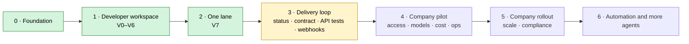
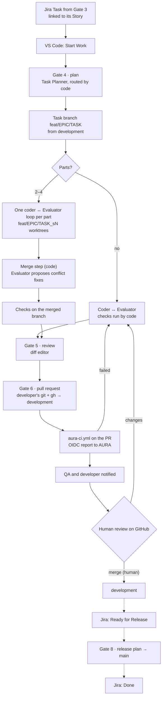
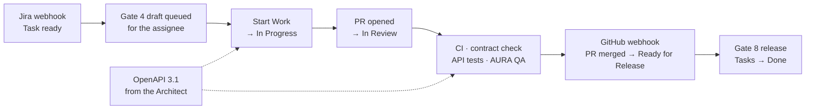
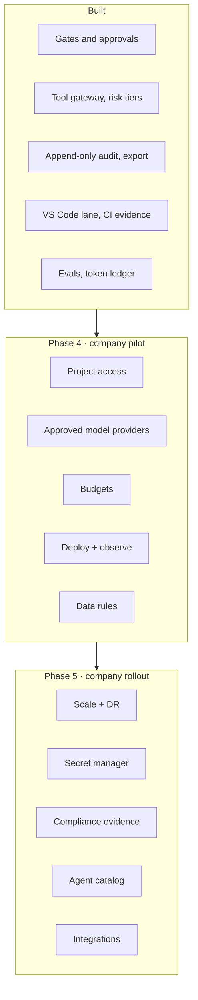
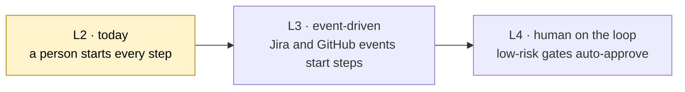

# AURA Roadmap

| | |
|---|---|
| **Goal** | A company AI harness: agents across the delivery lifecycle, governed in the cloud, coding in the developer's VS Code |
| **Current phase** | Phase 3: **delivery loop** (§5) |
| **Decisions** | [ADR-4](../adr/0004-vscode-developer-workspace.md) · [ADR-3](../adr/0003-git-workflow.md) |
| **Detailed plans** | [Automation and durability](aura-automation-durability.md) (Parts D–G) |
| **Completed plans** | [VS Code agents](aura-vscode-agents.md) · [Runtime refactor](aura-runtime-refactor.md) · [CLI and Council](aura-code-cli-council.md) |

> **Agents propose. Deterministic code authorizes, routes, merges, verifies and records. People approve and merge.**

```text
Project → Repository → Epic → Story → Task → Branch → AI run → Commit → Pull request
        → CI + QA evidence → Human review → Merge → Release
```

---

## 1. Phases


```mermaid
flowchart LR
    P0["0 · Foundation"]:::done --> P1["1 · Developer workspace<br/>V0–V6"]:::done --> P2["2 · One lane<br/>V7"]:::done --> P3["3 · Delivery loop<br/>status · contract · API tests · webhooks"]:::wip --> P4["4 · Company pilot<br/>access · models · cost · ops"] --> P5["5 · Company rollout<br/>scale · compliance"] --> P6["6 · Automation and more agents"]
    classDef done fill:#d4f4dd,stroke:#2e7d32,color:#000
    classDef wip fill:#fff4cc,stroke:#b8860b,color:#000
```

| Phase | Scope | Status |
|---|---|---|
| 0 | ADR-3, AURA-only coding models, Vitest everywhere, CI for AURA, projects and repositories, settings, Postgres state, queued turns | 🟢 Done |
| 1 | VS Code extension and bridge, Gates 4–6, coders and Evaluator, parallel parts and merge step, PR and CI lane, QA notifications (V0–V6) | 🟢 Built · live checks pending (§3) |
| 2 | V7: one lane. Every Task runs through VS Code; web and API are modular monoliths | 🟢 Done |
| 3 | Delivery loop: webhooks, Task status from Git events, merge tracking, dependencies, one OpenAPI contract for coders and QA, API test suites, AURA QA check, Jira events start runs (§5) | 🔴 **Next** |
| 4 | Company pilot without SSO: project access, approved model providers, budgets, deployment, observability (§6.2) | 🔴 |
| 5 | Company rollout: replicas, secret manager, compliance evidence, agent catalog (§6.3) | 🔴 |
| 6 | CI-failure fix offers, risk-tiered auto-approval, direct gate actions, new agents (§6.4) | 🔴 |

---

## 2. The workflow for one Task

Solid boxes are built; dashed boxes are planned.


```mermaid
flowchart TD
    J["Jira Task from Gate 3<br/>linked to its Story"] --> S["VS Code: Start Work"]
    S --> G4["Gate 4 · plan<br/>Task Planner, routed by code"]
    G4 --> BR["Task branch feat/EPIC/TASK<br/>from development"]
    BR --> SPLIT{"Parts?"}
    SPLIT -- "no" --> LOOP["Coder ↔ Evaluator<br/>checks run by code"]
    SPLIT -- "2–4" --> PAR["One coder ↔ Evaluator loop per part<br/>feat/EPIC/TASK_sN worktrees"]
    PAR --> MERGE["Merge step (code)<br/>Evaluator proposes conflict fixes"]
    MERGE --> CHK["Checks on the merged branch"]
    LOOP --> G5["Gate 5 · review<br/>diff editor"]
    CHK --> G5
    G5 --> G6["Gate 6 · pull request<br/>developer's git + gh → development"]
    G6 --> CI["aura-ci.yml on the PR<br/>OIDC report to AURA"]
    CI --> QA["QA and developer notified"]
    CI -- "failed" --> LOOP
    QA --> REV{"Human review on GitHub"}
    REV -- "changes" --> LOOP
    REV -- "merge (human)" --> DEV["development"]
    DEV -.-> RFR["Jira: Ready for Release"]
    RFR -.-> G8["Gate 8 · release plan → main"]
    G8 -.-> DONE["Jira: Done"]
```

| Who | Does | Decides |
|---|---|---|
| Router (`task/router.ts`) | Picks the coder from issue type, labels, discipline and the Epic's stack | Code |
| Task Planner | Proposes the plan and optional parts | Developer at Gate 4 |
| `task/split.ts` | Accepts parts only with disjoint file scopes | Code |
| Coders | Edit files and run commands in the developer's workspace | — |
| Checks | `.aura/settings.json` `checks`, run by code | Exit codes |
| Evaluator | Reviews the real diff and check output | Code decides pass (`roundPassed`) |
| Merge step | `git merge --no-ff` part by part; refuses conflict proposals with markers | Code |
| Git agent | PR draft with provenance, commit, push, `gh pr create` | Developer at Gate 6 |
| CI | `aura-ci.yml` jobs on GitHub Actions | Authoritative result |
| QA | Designs the test plan and scenarios; the `test-writer` coder turns them into tests on the Task branch | QA Engineer |
| Merge | On GitHub | A human, never AURA |

| Event | Jira today | Planned (Phase 3) |
|---|---|---|
| Task ready (Jira) | — | Gate 4 plan draft queued for the assignee (3.8) |
| Start Work | — | Status → In Progress (3.2) |
| Gate 5 accepted | Comment on the Task | — |
| PR opened | Comment with the PR link | Status → In Review (3.2) |
| PR merged | — | Status → Ready for Release; worktrees cleaned (3.2, 3.3) |
| Released (Gate 8) | Epic → Ready for Release | Tasks → Done (3.2) |

---

## 3. Live checks pending (Phase 1)

| Check | Proves |
|---|---|
| ✅ Migrations 0001–0012 applied to Supabase and `DATABASE_URL` set in both apps (2026-10-02; data reset, so `migrate-state` was not needed) | Postgres state and queue on the real database |
| Restart the runtime during a gate | Gates and drafts survive (`PostgresStore`) |
| Sign in, Start Work and run one Task with a live model in a real VS Code window | Gates 4–6 end to end |
| A two-part Task with a conflict | Parallel parts and the merge step with live coders |
| A PR with `aura-ci.yml` and the repository variable `AURA_API_URL` | OIDC report, QA notification, PR view |
| Gate 3 and the QA plan with a live model | Design documents and scenarios saved to Postgres |

---

## 4. Phase 2 · V7, one lane (done)

Every Task runs through VS Code. No code path touches `.workspaces`, Docker or a server shell.

| Step | Result |
|---|---|
| 7.1 | Dev and Tester agents, `delegate_to_dev`, `_code`, `_test`, `_git`, `_ci` and `tester-workflow.ts` removed with their tiers, grants and registry entries |
| 7.2 | Coding Council, single coding agent, file and council tools, council routes and usage store removed |
| 7.3 | Server workspaces and the API modules `workspace`, `dev-workspace`, `qa-workspace`, `test-runs`, `docker`, `runners` removed |
| 7.4 | Docker exec and host checks removed; server mode checks only the runtime token and `DATABASE_URL` |
| 7.5 | Web terminal, `TERMINAL_*` and the API terminal module removed |
| 7.6 | Unused `git/` `GitProvider` module removed |
| 7.7 | QA drafts scenarios as steps only (one model call, no test code); the `test-writer` coder writes the tests on the Task branch; CI runs them |
| 7.8 | The test plan has no gate number; the web pipeline shows Gates 1–3, test plan, Gates 4–6 in VS Code, Gate 8 |
| 7.9 | Docker runs panel, Council views and removed gates gone from the web app, `@aura/client` and the extension |
| 7.10 | ARCHITECTURE, SRS, ADRs, threat model, runbook, SETUP and story updated |
| 7.11 | Web and API refactored into modules with a public `index.ts` each; deep cross-module imports fail the build |

Follow-ups:

| Item | Where |
|---|---|
| Drop `profiles.git_name` and `git_email` (no longer read) | New migration |
| Update `docs/clarify.md` Q6, Q8 and Q9 to the one-lane answers | Docs |

---

## 5. Phase 3 · Delivery loop (next)

**Done when** a Task moves through Jira by itself from Start Work to Done, its API is built and
tested against one contract, and a Jira event can start its plan. Every gate stays human.


```mermaid
flowchart LR
    JW["Jira webhook<br/>Task ready"] --> Q["Gate 4 draft queued<br/>for the assignee"]
    Q --> SW["Start Work<br/>→ In Progress"]
    SW --> PR["PR opened<br/>→ In Review"]
    PR --> CI["CI · contract check<br/>API tests · AURA QA"]
    CI --> GH["GitHub webhook<br/>PR merged → Ready for Release"]
    GH --> G8["Gate 8 release<br/>Tasks → Done"]
    OA["OpenAPI 3.1<br/>from the Architect"] -.-> SW
    OA -.-> CI
```

| Step | Build | Proves |
|---|---|---|
| 3.1 ✅ | **Webhook endpoints** in a new `webhooks` API module: `POST /webhooks/github` (HMAC `X-Hub-Signature-256`) and `POST /webhooks/jira` (shared secret); a `webhook_deliveries` table drops repeats; every delivery audited | Events reach AURA safely |
| 3.2 ✅ | **Task status from Git events** through one `jira.transitionTo(key, status)` in the API, matched by status name from a per-project mapping in Settings: Start Work → In Progress, PR opened → In Review, PR merged → Ready for Release, Gate 8 release → Done (the Tasks, not only the Epic) | Jira follows the code with no manual moves |
| 3.3 ✅ | **Merge tracking**: `pr_state = merged`, `merged_at` and `merge_sha` on `task_branches` (new migration) from the GitHub webhook; the extension removes the Task's worktrees and `_sN` branches | AURA knows what shipped |
| 3.4 ✅ | **Dependencies**: the Task Planner's `dependsOn` → Jira "blocks" links → `task_dependencies`; Start Work waits until each dependency is merged | Tasks land in a safe order |
| 3.5 | **One OpenAPI contract**: the Architect emits OpenAPI 3.1 as a new design document kind `openapi` (validated in code, versioned like the others); coders and QA read it through `design_docs`; Gate 6 commits it to `contracts/openapi.yaml` | Coding and QA share one source of truth |
| 3.6 | **API test suites**: QA scenarios reference `operationId`s; the `test-writer` coder writes API tests from the contract and the scenarios; `aura-ci.yml` adds a contract job (lint, plus a breaking-change check against `development`) | The API is tested against its contract |
| 3.7 | **AURA QA check**: `aura-ci.yml` reports scenario results; AURA passes the PR check only when every scenario linked to the Task has a passing test | QA evidence on every PR |
| 3.8 | **Jira events start runs**: a Task moved to the configured "ready" status, or labelled `aura`, queues a Gate 4 plan draft for its assignee (matched by email) and notifies them; it runs when their VS Code connects. Nothing is auto-approved | Event-driven start (A1) |
| 3.9 | **Repository defaults** from Initialize Project: protected `main` and `development`, required checks (CI, contract, AURA QA), CODEOWNERS | Merges follow the rules |

Order: 3.1 → 3.2 → 3.3; 3.4 alongside 3.5 → 3.6 → 3.7; 3.8 after 3.1; 3.9 last.

| Prerequisite | Why |
|---|---|
| A public API URL (a tunnel such as `cloudflared` for the pilot team; the deployed API in Phase 4) | Jira, GitHub and CI reports cannot reach `localhost` |
| *In Review* and *Ready for Release* statuses in the Jira workflow, or a mapping to existing ones | The default Jira workflow has only To Do, In Progress and Done |

Sources: ADR-3 D3 (status, merge), D4 (dependencies), D5 (contract), D7 (QA check, repository
defaults); automation plan Part F (Jira triggers).

---

## 6. Company AI harness

AURA works for one team on one machine today. A company harness adds the controls a security,
legal and finance review asks for, and the operations to run it for every team.


```mermaid
flowchart TD
    subgraph TODAY["Built"]
        T1["Gates and approvals"]
        T2["Tool gateway, risk tiers"]
        T3["Append-only audit, export"]
        T4["VS Code lane, CI evidence"]
        T5["Evals, token ledger"]
    end
    subgraph PILOT["Phase 4 · company pilot"]
        P1["Project access"]
        P2["Approved model providers"]
        P3["Budgets"]
        P4["Deploy + observe"]
        P5["Data rules"]
    end
    subgraph ROLLOUT["Phase 5 · company rollout"]
        R1["Scale + DR"]
        R2["Secret manager"]
        R3["Compliance evidence"]
        R4["Agent catalog"]
        R5["Integrations"]
    end
    TODAY --> PILOT --> ROLLOUT
```

### 6.1 Gaps by area

| Area | Today | A company needs | Phase |
|---|---|---|---|
| Identity | Email sign-in; one role per user | SSO (Entra ID or Google Workspace), SCIM provisioning | Future (§8) |
| Access | Roles checked in `policy.ts`; every project visible | Project membership, role per project, row-level security, least-privilege admin roles | 4 |
| Models | Free-tier Groq and Gemini | Paid providers under a data-processing agreement with zero retention; model allow-list per data class | 4 |
| Data protection | Untrusted text fenced and scanned | Data class per project, secret and PII redaction before prompts, retention and erasure jobs, hosting region (Sri Lanka PDPA No. 9 of 2022) | 4 |
| Cost | Token ledger per agent | Budgets per run, user, project and department; alerts; monthly chargeback report | 4 |
| Deployment | `make dev` on one machine; migrations pasted into the SQL editor | Container images, infrastructure as code, staging and production, migration pipeline, backups | 4 |
| Observability | `/metrics`, audit log | OpenTelemetry traces API → runtime → bridge, central logs, alerts, SLOs, status page | 4 |
| Reliability | One API process holds the bridge | Several API replicas with bridge routing, runtime replicas, restore drills | 5 |
| Secrets | `.env` files | Secret manager, rotation, no secrets on disk | 5 |
| Compliance | Audit export | SOC 2 / ISO 27001 evidence pack, access reviews, change log for prompts and policy | 5 |
| Supply chain | CI for AURA | Signed extension builds, private extension registry, SBOM, dependency and code scanning | 5 |
| Agents | Fixed set in `registry.ts` | Agent catalog: owner, version, eval score, risk tiers; prompt changes reviewed and promoted like code | 5 |
| Integrations | Jira, GitHub through `gh`, in-app notifications | Jira and GitHub webhooks (3.1), Slack or Teams, email, Confluence for design documents, several repositories per project | 3–5 |
| Product | Admin pages per screen | Organisation settings, onboarding, usage and quality dashboards per department | 5 |

### 6.2 Phase 4 · company pilot (without SSO)

**Done when** one real team uses AURA for a month with project-scoped access, on paid, contracted
models, inside a budget, on a deployed environment with alerts. Email sign-in stays.

| Step | Build | Proves |
|---|---|---|
| 4.1 | `project_members` table, project-scoped grants in `policy.ts`, RLS on runs, approvals, design documents and task PRs | People see only their projects |
| 4.2 | Model policy: provider allow-list per project data class, contracted providers first, free tier only for `public` projects; provider and model on every audit row | Data stays with approved processors |
| 4.3 | Redaction before every prompt: secrets, keys and configured PII patterns, with findings on the draft | No secret leaves the company |
| 4.4 | Budgets per run, user and project, enforced in the gateway; warnings at 80 %; Admin → Usage by department | Predictable cost |
| 4.5 | Dockerfiles for api, runtime and web; Terraform for one cloud; staging and production; migrations applied and recorded by CI | Repeatable deployment |
| 4.6 | OpenTelemetry tracing across api, runtime and the bridge; log shipping; alerts on failed turns, stuck gates and CI report errors | Problems are seen before users report them |
| 4.7 | Retention settings for runs, drafts and audit exports; an erasure job per user | Data rules can be met |
| 4.8 | Evals for Architect, QA, Task Planner and Evaluator; evals run in CI on prompt changes | Quality does not drop silently |

### 6.3 Phase 5 · company rollout

| Step | Build |
|---|---|
| 5.1 | Bridge call routing across API replicas (Redis or Postgres `LISTEN/NOTIFY`); runtime replicas on shared Postgres |
| 5.2 | Secret manager for every service secret; scheduled rotation; admin token management |
| 5.3 | Compliance pack: audit export by period, access review report, prompt and policy change history |
| 5.4 | Agent catalog page: owner, version, models, eval scores, risk tiers; promotion needs an approval |
| 5.5 | Signed VS Code extension in a private registry; SBOM and dependency scanning in CI |
| 5.6 | Slack or Teams notifications and gate links; email digests |
| 5.7 | Backup and restore drill; documented recovery time and recovery point |

### 6.4 Phase 6 · automation and more agents

| Step | Build | Source |
|---|---|---|
| 6.1 | CI failure → bounded fix offer (Jira triggers arrive earlier, in 3.8) | Automation plan Part F |
| 6.2 | Risk-tiered auto-approval, off by default | Automation plan Part G |
| 6.3 | **R3** direct gate actions: extension and web buttons run a delegate tool mode through the gateway with no Orchestrator call | Runtime refactor F5 |
| 6.4 | **R5** spike: Mastra `requireApproval` on one gate, mapped to AURA approvals | Runtime refactor F2 |
| 6.5 | New agents, only after Phases 3–5 run reliably | — |

---

## 7. Automation levels


```mermaid
flowchart LR
    L2["L2 · today<br/>a person starts every step"]:::now --> L3["L3 · event-driven<br/>Jira and GitHub events start steps"]
    L3 --> L4["L4 · human on the loop<br/>low-risk gates auto-approve"]
    classDef now fill:#fff4cc,stroke:#b8860b,color:#000
```

| Stage | Becomes automatic | Human keeps |
|---|---|---|
| A1 · Event triggers | Task ready → plan draft and PR merged → Jira update (Phase 3); CI failure → fix offer (Phase 6) | Gates, review, merge |
| A2 · Unattended runs | Queued runs, notifications (built); resume after restart | Gates and exceptions |
| A3 · Risk-tiered auto-approval | Low-risk gates per project policy | Code, PR, release, merge |
| A4 · Scheduled maintenance | Nightly regression, dependency updates | Merge, priorities |
| A5 · Self-improving harness | Evals from real runs, cheapest model that passes | Prompt and model promotion |

**Never automated:** merge to a protected branch, production release, auth/security/payment
code, secrets, permission changes, and anything the policy cannot classify.

---

## 8. Future

| Horizon | Item |
|---|---|
| Next | SSO (Entra ID or Google Workspace, OIDC/SAML) with group → role mapping; SCIM provisioning; password sign-in off in server mode |
| Next | Multi-repository projects |
| Next | Gate 8 drives a real deployment pipeline with rollback |
| Next | Incident loop: alert → Bug with evidence → normal Task flow |
| Later | Email and Slack notifications |
| Later | Codebase knowledge (code, ADRs, OpenAPI, past PRs) for all agents |
| Later | A cloud sandbox for unattended work |
| Later | Multi-tenant SaaS |
| Later | Delivery analytics: lead time, first-pass merge rate, cost per merged Task |

---

## 9. Risks

| Risk | Severity | Mitigation |
|---|---|---|
| Agents run commands on the developer's machine | High | Permission engine, built-in denies, file containment, Workspace Trust, no bypass mode |
| Prompt injection in repository or issue text leads to commands | High | Untrusted text scanned and fenced; `ask` for network and installs; Evaluator review |
| Prompt fatigue → "allow everything" | Medium | Good default allow-list in Initialize Project |
| Nothing runs while VS Code is closed | Medium | Accepted; runs pause and resume |
| Local results can be flaky or edited | Medium | CI on the PR is authoritative |
| One API process holds the bridge WebSocket | Medium | Call routing across replicas (5.1) |
| Design documents are not in the PR diff | Low | Linked from the PR description |
| KAN-36 was built on the server lane | Low | Import its design documents; continue its Tasks in VS Code |
| Free-tier models keep prompts under consumer terms | High | Contracted providers and a model policy before any company data (4.2) |
| One person per role holds every gate | Medium | Project membership with several approvers per role (4.1) |
| Public webhook endpoints can be forged or replayed | High | Signature or shared-secret check, `webhook_deliveries` drops repeats, rate limit, every delivery audited (3.1) |
| The Jira workflow lacks In Review or Ready for Release | Medium | Per-project status mapping; a missing status is logged, never invented (3.2) |
| A Jira event starts work nobody asked for | Medium | It only queues a Gate 4 draft for the assignee; nothing runs past a gate without a person (3.8) |
