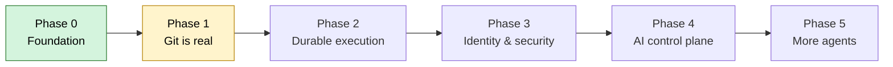
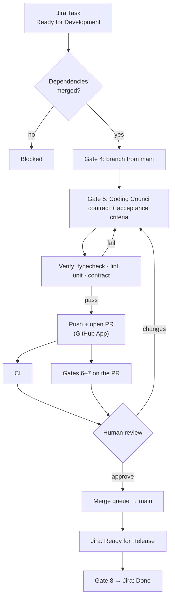
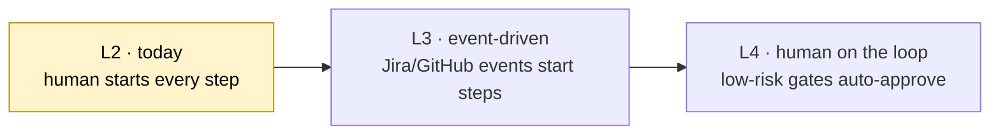

# AURA Roadmap

| | |
|---|---|
| **Goal** | Move AURA from a local agent pipeline to a control plane for AI work on real Git repositories |
| **Current phase** | Phase 1, step 1.3 |
| **Decisions** | [ADR-3](../adr/0003-git-workflow.md) · [ADR-2](../adr/0002-team-scale-deployment.md) |

> **Agents propose. Deterministic infrastructure authorizes, executes, verifies and records.**

```text
Project → Repository → Epic → Task → Branch → AI Run → Commit → Pull Request
        → CI + QA evidence → Human review → Merge → Release
```

---

## 1. Phases


```mermaid
flowchart LR
    P0["Phase 0<br/>Foundation"]:::done --> P1["Phase 1<br/>Git is real"]:::wip --> P2["Phase 2<br/>Durable execution"] --> P3["Phase 3<br/>Identity & security"] --> P4["Phase 4<br/>AI control plane"] --> P5["Phase 5<br/>More agents"]
    classDef done fill:#d4f4dd,stroke:#2e7d32,color:#000
    classDef wip fill:#fff4cc,stroke:#b8860b,color:#000
```

| Phase | Scope | Status |
|---|---|---|
| 0 | ADR-3, remove Claude Code / Codex, Vitest everywhere, CI for AURA | 🟢 Done |
| 1 | Projects, GitHub, PRs, contract-first APIs, dependencies | 🟡 In progress |
| 2 | Job queue, runner pool, all state in Postgres | 🔴 |
| 3 | SSO, organization isolation, secret manager, budgets | 🔴 |
| 4 | Model gateway, evals for all agents, canary, replay, alerts | 🟡 Tool gateway, evals and metrics built |
| 5 | New agents | 🔴 |

---

## 2. Target flow for one Task


```mermaid
flowchart TD
    J["Jira Task<br/>Ready for Development"] --> DEP{"Dependencies<br/>merged?"}
    DEP -- no --> WAIT["Blocked"]
    DEP -- yes --> G4["Gate 4: branch from main"]
    G4 --> G5["Gate 5: Coding Council<br/>contract + acceptance criteria"]
    G5 --> VER["Verify: typecheck · lint · unit · contract"]
    VER -- fail --> G5
    VER -- pass --> PR["Push + open PR<br/>(GitHub App)"]
    PR --> CI["CI"]
    PR --> QA["Gates 6–7 on the PR"]
    CI --> REV{"Human review"}
    QA --> REV
    REV -- changes --> G5
    REV -- approve --> MERGE["Merge queue → main"]
    MERGE --> RFR["Jira: Ready for Release"]
    RFR --> REL["Gate 8 → Jira: Done"]
```

| Event | Jira status |
|---|---|
| Branch created | In Progress |
| PR opened | In Review |
| PR merged | Ready for Release |
| Released | Done |

---

## 3. Phase 1 steps

| Step | Change | Status |
|---|---|---|
| 1.1 | Projects and repositories: migration 0007, admin API and page | 🟢 Done |
| 1.2 | `GitProvider` interface: `local` provider + contract tests | 🟢 Done |
| 1.2b | `github` provider (GitHub App installation tokens) | 🔴 |
| 1.3 | Gate 4 creates `feature/<TASK>` in the project repo; scaffold only for an empty repo | 🔴 Next |
| 1.4 | Gate 5 pushes the branch and opens a PR with provenance | 🔴 |
| 1.5 | GitHub webhooks + 60s polling fallback → `task_branches` | 🔴 |
| 1.6 | Gate 7 runs on the PR head and posts an "AURA QA" check run | 🔴 |
| 1.7 | Jira status changes per §2 (`JIRA_STATUS_MAP`); worktree removed after merge | 🔴 |
| 1.8 | `aura pull`, `aura pr`, Project Files "Changes" view | 🔴 |
| 1.9 | Repo defaults: protected `main`, required checks, CODEOWNERS, merge queue | 🔴 |
| 1.10 | Architect emits OpenAPI 3.1 (`openapi/openapi.yaml`) via its own PR | 🔴 |
| 1.11 | Coding Council and QA both use the contract | 🔴 |
| 1.12 | Contract check: routes and QA paths vs OpenAPI | 🔴 |
| 1.13 | `dependsOn` → Jira links → `task_dependencies`; Gate 4 blocks until merged | 🔴 |

**Phase 1 is done when** one real Task goes branch → council → PR → CI + AURA QA → review →
merge → *Ready for Release*, with evidence in a daily log.

---

## 4. Later phases

| Phase | Steps |
|---|---|
| 2 · Durable execution | 2.1 Job queue with idempotency keys · 2.2 Runner service, one container per job, behind a `Sandbox` interface · 2.3 Mastra storage, drafts and usage in Postgres; 2+ replicas · 2.4 Progress over pub/sub, retries, dead-letter queue |
| 3 · Identity & security | SSO with role mapping · organizations + row-level security · secret manager · budgets per run, developer and team · admin token management |
| 4 · AI control plane | Model gateway (routing, cost, budgets, fallback) · evals for Architect, QA, Tester and Orchestrator · canary prompts · run replay · OTLP export and alerts |
| 5 · More agents | Only after Phases 1–4 run reliably |

---

## 5. Automation levels


```mermaid
flowchart LR
    L2["L2 · today<br/>human starts every step"]:::now --> L3["L3 · event-driven<br/>Jira/GitHub events start steps"]
    L3 --> L4["L4 · human on the loop<br/>low-risk gates auto-approve"]
    classDef now fill:#fff4cc,stroke:#b8860b,color:#000
```

| Stage | Becomes automatic | Human keeps |
|---|---|---|
| A1 · Event triggers (with Phase 1) | Task ready → drafts Gate 4/5; CI failure → bounded auto-fix; PR merged → Jira update | Gate approvals, review, merge |
| A2 · Unattended runs (with Phase 2) | Queued runs, restarts resume, notifications | Gates and exceptions |
| A3 · Risk-tiered auto-approval (with Phase 4) | Low-risk gates per project policy | Medium/high gates, merge, release |
| A4 · Scheduled maintenance | Nightly regression, cleanup, dependency updates | Merge, priorities |
| A5 · Self-improving harness | Evals from real runs, cheapest model that passes | Prompt and model promotion |

**Never automated:** merge to a protected branch, production release, auth/security/payment
code, secrets, permission changes, and anything the policy cannot classify.

---

## 6. Future

| Horizon | Item |
|---|---|
| Next | Multi-repository projects |
| Next | Gate 8 drives a real deployment pipeline with rollback |
| Next | Incident loop: alert → Bug with evidence → normal Task flow |
| Later | Codebase knowledge (code, ADRs, OpenAPI, past PRs) for all agents |
| Later | VS Code extension |
| Later | Multi-tenant SaaS, stronger sandboxes, data residency |
| Later | Delivery analytics: lead time, first-pass merge rate, cost per merged Task |

---

## 7. Risks

| Risk | Mitigation |
|---|---|
| Webhooks need a public URL | Polling fallback; tunnel for demos |
| Contract check is a heuristic | Start with NestJS/Express; human can override |
| KAN-36 uses per-Epic scaffolds | Migrate it once into a registered repo |
| Scope creep | Each phase gets its own approval |
