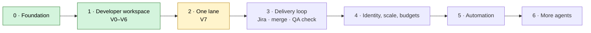
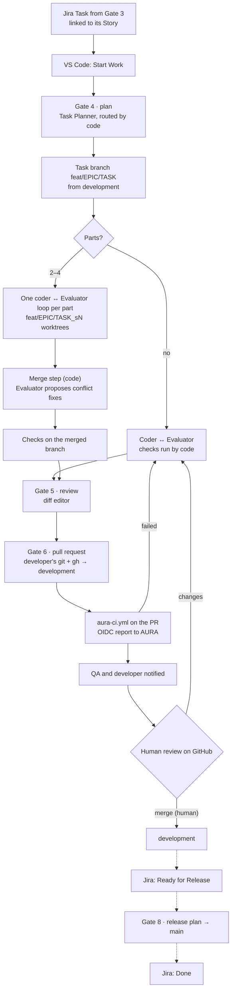
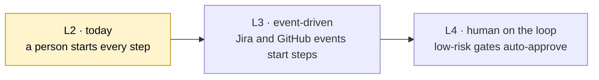

# AURA Roadmap

| | |
|---|---|
| **Goal** | A control plane for AI work on real Git repositories: agents in the developer's VS Code, governance in the cloud |
| **Current phase** | Phase 2: **V7**, one lane (remove the server lane) |
| **Decisions** | [ADR-4](../adr/0004-vscode-developer-workspace.md) · [ADR-3](../adr/0003-git-workflow.md) |
| **Detailed plans** | [Automation and durability](aura-automation-durability.md) (Parts D–G) |
| **Completed plans** | [VS Code agents](aura-vscode-agents.md) · [Runtime refactor](aura-runtime-refactor.md) · [CLI and Council](aura-code-cli-council.md) |

> **Agents propose. Deterministic code authorizes, routes, merges, verifies and records. People approve and merge.**

```text
Project → Repository → Epic → Story → Task → Branch → AI run → Commit → Pull request
        → CI + QA evidence → Human review → Merge → Release
```

---

## 1. Phases


```mermaid
flowchart LR
    P0["0 · Foundation"]:::done --> P1["1 · Developer workspace<br/>V0–V6"]:::done --> P2["2 · One lane<br/>V7"]:::wip --> P3["3 · Delivery loop<br/>Jira · merge · QA check"] --> P4["4 · Identity, scale, budgets"] --> P5["5 · Automation"] --> P6["6 · More agents"]
    classDef done fill:#d4f4dd,stroke:#2e7d32,color:#000
    classDef wip fill:#fff4cc,stroke:#b8860b,color:#000
```

| Phase | Scope | Status |
|---|---|---|
| 0 | ADR-3, AURA-only coding models, Vitest everywhere, CI for AURA, projects and repositories, settings, Postgres state, queued turns | 🟢 Done |
| 1 | VS Code extension and bridge, Gates 4–6, coders and Evaluator, parallel parts and merge step, PR and CI lane, QA notifications (V0–V6) | 🟢 Built · live checks pending (§3) |
| 2 | V7: remove the server lane so every Task runs through VS Code | 🔴 **Next** |
| 3 | Jira status from Git events, merge tracking, AURA QA check, dependencies, contract-first APIs | 🔴 |
| 4 | SSO, project RLS, secret manager, budgets, several API replicas | 🔴 |
| 5 | Event triggers, risk-tiered auto-approval, direct gate actions | 🔴 |
| 6 | New agents | 🔴 |

---

## 2. The workflow for one Task

Solid boxes are built; dashed boxes are planned.


```mermaid
flowchart TD
    J["Jira Task from Gate 3<br/>linked to its Story"] --> S["VS Code: Start Work"]
    S --> G4["Gate 4 · plan<br/>Task Planner, routed by code"]
    G4 --> BR["Task branch feat/EPIC/TASK<br/>from development"]
    BR --> SPLIT{"Parts?"}
    SPLIT -- "no" --> LOOP["Coder ↔ Evaluator<br/>checks run by code"]
    SPLIT -- "2–4" --> PAR["One coder ↔ Evaluator loop per part<br/>feat/EPIC/TASK_sN worktrees"]
    PAR --> MERGE["Merge step (code)<br/>Evaluator proposes conflict fixes"]
    MERGE --> CHK["Checks on the merged branch"]
    LOOP --> G5["Gate 5 · review<br/>diff editor"]
    CHK --> G5
    G5 --> G6["Gate 6 · pull request<br/>developer's git + gh → development"]
    G6 --> CI["aura-ci.yml on the PR<br/>OIDC report to AURA"]
    CI --> QA["QA and developer notified"]
    CI -- "failed" --> LOOP
    QA --> REV{"Human review on GitHub"}
    REV -- "changes" --> LOOP
    REV -- "merge (human)" --> DEV["development"]
    DEV -.-> RFR["Jira: Ready for Release"]
    RFR -.-> G8["Gate 8 · release plan → main"]
    G8 -.-> DONE["Jira: Done"]
```

| Who | Does | Decides |
|---|---|---|
| Router (`task/router.ts`) | Picks the coder from issue type, labels, discipline and the Epic's stack | Code |
| Task Planner | Proposes the plan and optional parts | Developer at Gate 4 |
| `task/split.ts` | Accepts parts only with disjoint file scopes | Code |
| Coders | Edit files and run commands in the developer's workspace | — |
| Checks | `.aura/settings.json` `checks`, run by code | Exit codes |
| Evaluator | Reviews the real diff and check output | Code decides pass (`roundPassed`) |
| Merge step | `git merge --no-ff` part by part; refuses conflict proposals with markers | Code |
| Git agent | PR draft with provenance, commit, push, `gh pr create` | Developer at Gate 6 |
| CI | `aura-ci.yml` jobs on GitHub Actions | Authoritative result |
| QA | Designs the test plan and scenarios; follows PRs and CI | QA Engineer |
| Merge | On GitHub | A human, never AURA |

| Event | Jira today | Planned (Phase 3) |
|---|---|---|
| Gate 5 accepted | Comment on the Task | — |
| PR opened | Comment with the PR link | Status → In Review |
| PR merged | — | Status → Ready for Release; worktrees cleaned |
| Released (Gate 8) | — | Status → Done |

---

## 3. Live checks pending (Phase 1)

| Check | Proves |
|---|---|
| Apply migrations 0008–0012 to Supabase; set `DATABASE_URL` in both apps; run `migrate-state` once | Postgres state and queue on the real database |
| Restart the runtime during a gate | Gates and drafts survive (`PostgresStore`) |
| Sign in, Start Work and run one Task with a live model in a real VS Code window | Gates 4–6 end to end |
| A two-part Task with a conflict | Parallel parts and the merge step with live coders |
| A PR with `aura-ci.yml` and the repository variable `AURA_API_URL` | OIDC report, QA notification, PR view |
| Gate 3 and the QA plan with a live model | Design documents and scenarios saved to Postgres |

---

## 4. Phase 2 · V7, one lane

Every Task runs through VS Code. **Done when** no code path touches `.workspaces`, Docker or a
server shell.

| Step | Remove or change | Files |
|---|---|---|
| 7.1 | Legacy web Gates 4, 5 and 7 and the server git/CI tools | `delegate_to_dev`, `_code`, `_test`, `_git`, `_ci`; Dev and Tester agents; `tester-workflow.ts`; their risk tiers, grants, registry entries and Orchestrator instructions |
| 7.2 | Coding Council and single coding agent | `coding-council.ts`, `council-agents.ts`, `mastra-coding-agent.ts`, `tools/file-tools.ts`, `tools/council-tools.ts`, `contracts/council.ts`, council routes and usage store |
| 7.3 | Server workspaces | `workspace/*`, `AURA_WORKSPACE_ROOT`, workspace routes in runtime and API (`workspace`, `dev-workspace`, `qa-workspace`, `test-runs`, `docker`, `runners`); `.workspaces/` after `import-design-docs` |
| 7.4 | Docker and host checks | `lib/docker-exec.ts`, `lib/sandbox.ts`, `SANDBOX_MODE` |
| 7.5 | Web terminal | `terminal/*`, `TERMINAL_*`, the API terminal module (ticket signing stays for the bridge) |
| 7.6 | Unused `GitProvider` module | `agent-runtime/src/mastra/git/` (superseded by ADR-4 D8; used only by its own tests) |
| 7.7 | Playwright specs | The `test-writer` coder writes QA's scenarios as spec files on the Task branch; CI runs them (replaces Gate 7) |
| 7.8 | Gate names | The QA plan stops sharing the number 6 with the PR gate; the web pipeline shows Gates 1–3, QA plan, Gate 8 |
| 7.9 | Web leftovers | Docker runs panel, pipeline tracker steps for removed gates |
| 7.10 | Docs | ARCHITECTURE §4.3 and the legacy rows in SRS and ADR-1 |

---

## 5. Later phases

| Phase | Step | Source |
|---|---|---|
| 3 · Delivery loop | 3.1 Jira status from Git events (§2 table), via CI reports and a GitHub webhook | ADR-3 D3 |
| | 3.2 Merge tracking in `task_branches`; worktree and branch cleanup after merge | ADR-3 D3 |
| | 3.3 "AURA QA" check run on the PR from the QA scenarios' CI results | ADR-3 D7 |
| | 3.4 `dependsOn` → Jira links → `task_dependencies`; Start Work waits for merged dependencies | ADR-3 D4 |
| | 3.5 Architect emits OpenAPI 3.1; coders and QA use it; a contract check in CI | ADR-3 D5 |
| | 3.6 Repo defaults from Initialize Project: protected `main` and `development`, required checks, CODEOWNERS | ADR-3 D7 |
| 4 · Identity, scale, budgets | 4.1 SSO with role mapping | SRS FR-AUTH-1 |
| | 4.2 Project membership and RLS | Automation plan Part D |
| | 4.3 Budgets per run, user and project | Automation plan Part E |
| | 4.4 Bridge call routing across API replicas; turn concurrency per project and provider | ARCHITECTURE §5 limits |
| | 4.5 Secret manager; admin token management | — |
| 5 · Automation | 5.1 Event triggers (Jira webhook, CI failure → bounded fix offer) | Automation plan Part F |
| | 5.2 Risk-tiered auto-approval, off by default | Automation plan Part G |
| | 5.3 **R3** direct gate actions: extension and web buttons run a delegate tool mode through the gateway with no Orchestrator call | Runtime refactor F5 |
| | 5.4 **R5** spike: Mastra `requireApproval` on one gate, mapped to AURA approvals | Runtime refactor F2 |
| | 5.5 Evals for Architect, QA, Evaluator and the vscode-agent | ARCHITECTURE §8 |
| 6 · More agents | Only after Phases 2–5 run reliably | — |

---

## 6. Automation levels


```mermaid
flowchart LR
    L2["L2 · today<br/>a person starts every step"]:::now --> L3["L3 · event-driven<br/>Jira and GitHub events start steps"]
    L3 --> L4["L4 · human on the loop<br/>low-risk gates auto-approve"]
    classDef now fill:#fff4cc,stroke:#b8860b,color:#000
```

| Stage | Becomes automatic | Human keeps |
|---|---|---|
| A1 · Event triggers | Task ready → plan draft; CI failure → fix offer; PR merged → Jira update | Gates, review, merge |
| A2 · Unattended runs | Queued runs, notifications (built); resume after restart | Gates and exceptions |
| A3 · Risk-tiered auto-approval | Low-risk gates per project policy | Code, PR, release, merge |
| A4 · Scheduled maintenance | Nightly regression, dependency updates | Merge, priorities |
| A5 · Self-improving harness | Evals from real runs, cheapest model that passes | Prompt and model promotion |

**Never automated:** merge to a protected branch, production release, auth/security/payment
code, secrets, permission changes, and anything the policy cannot classify.

---

## 7. Future

| Horizon | Item |
|---|---|
| Next | Multi-repository projects |
| Next | Gate 8 drives a real deployment pipeline with rollback |
| Next | Incident loop: alert → Bug with evidence → normal Task flow |
| Later | Email and Slack notifications |
| Later | Codebase knowledge (code, ADRs, OpenAPI, past PRs) for all agents |
| Later | A cloud sandbox for unattended work |
| Later | Multi-tenant SaaS, data residency (Sri Lanka PDPA No. 9 of 2022) |
| Later | Delivery analytics: lead time, first-pass merge rate, cost per merged Task |

---

## 8. Risks

| Risk | Severity | Mitigation |
|---|---|---|
| Agents run commands on the developer's machine | High | Permission engine, built-in denies, file containment, Workspace Trust, no bypass mode |
| Prompt injection in repository or issue text leads to commands | High | Untrusted text scanned and fenced; `ask` for network and installs; Evaluator review |
| Prompt fatigue → "allow everything" | Medium | Good default allow-list in Initialize Project |
| Nothing runs while VS Code is closed | Medium | Accepted; runs pause and resume |
| Local results can be flaky or edited | Medium | CI on the PR is authoritative |
| One API process holds the bridge WebSocket | Medium | Call routing across replicas (4.4) |
| Design documents are not in the PR diff | Low | Linked from the PR description |
| KAN-36 was built on the server lane | Low | Import its design documents; continue its Tasks in VS Code |
