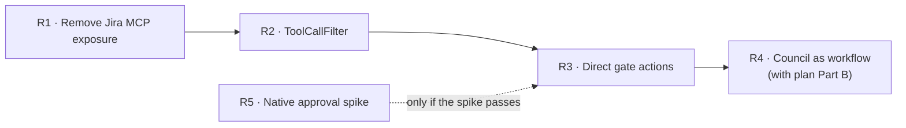

# Plan: Agent Runtime Review and Refactor

| | |
|---|---|
| **Status** | Proposed · **deferred** (not approved; a higher-priority issue comes first) |
| **Date** | 2026-10-02 |
| **Checked against** | Mastra `@mastra/core` 1.67.0 embedded docs (`node_modules/@mastra/core/dist/docs/`) |
| **Related** | [Automation and durability plan](aura-automation-durability.md) · [ARCHITECTURE.md](../ARCHITECTURE.md) |

---

## 1. Verdict

| Question | Answer | Reason |
|---|---|---|
| Implemented according to Mastra docs? | 🟡 **Partial** | Current APIs throughout (Agent, Memory, `createTool`, `createWorkflow`, composite storage, observability, server middleware, request context, structured output); typechecks against 1.67; 112 tests pass. Three patterns differ from the docs' guidance (§2: F1–F3) |
| Efficient? | 🟡 **Partial** | Sub-agents are single structured calls with no memory (good). Every gate still passes through the Orchestrator LLM, which used 69% of all tokens in the baseline |
| Token-saving? | 🟡 **Partial** | Built: draft preview, compact prompt (−43% fixed cost), low reasoning effort, 16-message window. Not used: `ToolCallFilter`, a non-LLM path for explicit gate actions, prompt caching |
| Correct? | 🟢 **Yes, one gap** | Governance enforced in code by the tool gateway. The Coding Council is only partly verified with live models |

---

## 2. Findings

| # | Finding | Where | Mastra guidance | Impact |
|---|---|---|---|---|
| F1 | All 63 Jira MCP tools are re-published by the runtime through `mcpServers: jiraMcp.toMCPServerProxies()`. Nothing in AURA uses that endpoint | `src/mastra/index.ts` | `mcpServers` is for serving MCP servers to outside clients | A path to Jira writes that skips the tool gateway; open on loopback in local mode without a runtime token |
| F2 | Gates use `ask_user`, then the model re-calls the tool with `approved=true` | `agents/orchestrator.ts`, `gateway/` | Native tool approval: `requireApproval` (boolean or per-call function), `approveToolCall` / `declineToolCall` | One extra Orchestrator model call per gate; the approval flag passes through the model (the gateway makes it safe) |
| F3 | The Coding Council is a hand-written loop, not a workflow | `workflows/coding-council.ts` | Councils are built "with agents and workflows" (multi-agent guide) | No snapshots, no resume after restart, not visible in Studio |
| F4 | Old tool calls and results stay in the Orchestrator's context | `agents/orchestrator.ts` memory | `ToolCallFilter({ preserveModelOutput: true })` removes them from the model input, not from storage | Larger input on every step |
| F5 | Explicit actions (UI buttons, extension commands) still go through an LLM router | API → Orchestrator | Use a workflow when the path is known in advance | The largest remaining token cost |
| F6 | A comment in `config/models.ts` says the Orchestrator has "~800-line instructions" | `config/models.ts` | — | Out of date (the prompt is compact now) |

### Mastra features considered and not adopted

| Feature | Why not (now) |
|---|---|
| Durable / evented agents | Beta; cross-process needs Redis PubSub; AURA's API must stay the only caller. Revisit after plan Part C |
| Schedules and signal providers | They start runs inside the runtime, skipping the API's policy, budgets and audit. Triggers stay in the API (plan Part F) |
| `PromptInjectionDetector` processor | Model-based, costs tokens per call. AURA's rule-based scanner (`gateway/untrusted.ts`) is free and already wired to the approval card |
| `PostgresStore` | **Adopted** in plan Part B |

---

## 3. Refactors

| # | Change | Effort | Gain | Risk |
|---|---|---|---|---|
| R1 | Remove `mcpServers` Jira proxies from `index.ts` (keep the MCP *client* used by delegate tools) | Small | Closes an ungoverned path | None known; confirm Studio doesn't need it |
| R2 | Add `ToolCallFilter({ preserveModelOutput: true })` to the Orchestrator's input processors; fix the F6 comment | Small | Smaller context per step | Check the model still sees each draft's id |
| R3 | **Direct gate actions:** an API endpoint runs a delegate tool mode (`draft`, `file`, `execute`) through the gateway with no Orchestrator call, for UI buttons and the VS Code extension. Chat stays for free text. Same approvals, audit and run steps | Medium–large | Most gate steps cost **0 Orchestrator tokens** | Two entry paths to keep identical; one shared server function |
| R4 | Rebuild the Coding Council with `createWorkflow` (plan → build → checks → review in a `dountil` loop), registered with Mastra | Medium | Resume after restart (with `PostgresStore`), Studio view, same behaviour and checkpoints | Must keep the current turn events (`council` SSE) |
| R5 | Spike: native `requireApproval` on one gate (Gate 1), mapped to AURA approval requests | Spike (1–2 days) | Removes one model call per gate and the model-supplied flag | Open question: how *revise with feedback* maps to decline |

**Order when approved:** R1 and R2 first (same day), then R3, then R4 together with plan Part B. R5
is a spike; it changes nothing unless its result is approved.

### Done when

| # | Check |
|---|---|
| R1 | `GET /api/mcp/...` on the runtime returns 404; Jira delegate tools still work |
| R2 | Orchestrator input tokens per step drop on the AI Usage page; gateway tests pass |
| R3 | A Gate 1 draft started from a button records a run, a gate and audit rows with no Orchestrator model call in the token ledger |
| R4 | A council run interrupted by a restart resumes from its last completed round |
| R5 | Written result: works / does not work, with the revise mapping |
