# Plan: AURA for Developers in VS Code

| | |
|---|---|
| **Status** | **Completed** 2026-10-02 (V0–V6). V7 (removals) and the live checks are in the [Roadmap](aura-git-control-plane.md) |
| **Decision** | [ADR-4](../adr/0004-vscode-developer-workspace.md) |
| **As built** | [ARCHITECTURE.md](../ARCHITECTURE.md) |

Developers work in VS Code, where the AURA extension behaves like Claude Code: a chat panel, tools
that run on their machine, permission prompts and diffs. The agent loop runs in AURA's cloud
runtime. Everyone else uses the web app. AURA's cloud holds no source code.

```mermaid
flowchart LR
    V0["V0 bridge spike"]:::done --> V1["V1 extension base"]:::done --> V2["V2 tools, modes, hooks"]:::done --> V3["V3 design docs in Postgres"]:::done
    V3 --> V4["V4 router, coders, Evaluator"]:::done --> V5["V5 parallel parts, merge"]:::done --> V6["V6 PR, CI lane, QA"]:::done --> V7["V7 removals"]
    classDef done fill:#d4f4dd,stroke:#2e7d32,color:#000
```

| Phase | Result | Described in |
|---|---|---|
| V0 | Bridge relay and Mastra `Workspace` on the developer's machine; 9/9 scenarios, 2–18 ms per call | ARCHITECTURE §5 |
| V1 | Browser sign-in, Tasks view, chat panel, Stop / Resume / Open Run in Web, Initialize Project, Connect Repository | ARCHITECTURE §5 |
| V2 | Full tool set, background processes, permission modes, rules, hooks, `.aura/AURA.md`, skills | ARCHITECTURE §5 |
| V3 | Design documents and QA plans in Postgres; Architect frontend and integration specialists; Design documents and QA pages; Project Files and the code editor removed from the web | ARCHITECTURE §7 |
| V4 | Code router, five coders, Evaluator loop, Gates 4 and 5, Plan and Review views, notes | ARCHITECTURE §4.1 |
| V5 | Task branch, 2–4 parallel parts on `_s<N>` worktrees, merge step with conflict proposals | ARCHITECTURE §4.2 |
| V6 | Git agent (Gate 6 PR with the developer's `gh`), PR view, `aura-ci.yml` OIDC reports, QA page and notifications | ARCHITECTURE §4.1, §7 |
| V7 | Remove the server lane | Roadmap |
