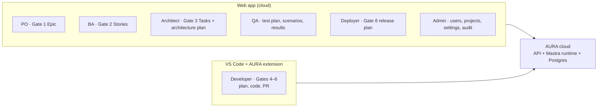
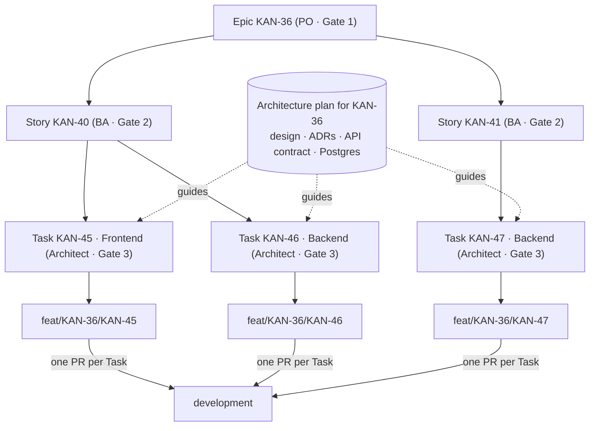
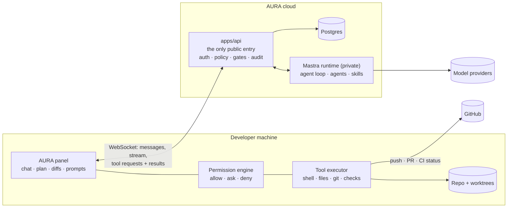
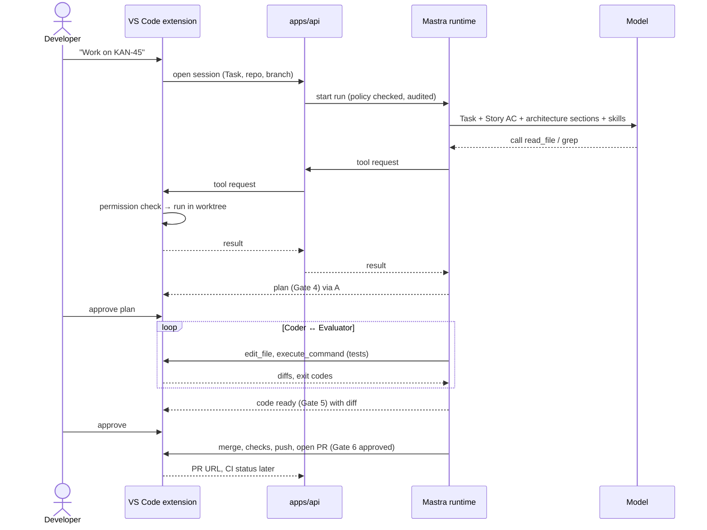
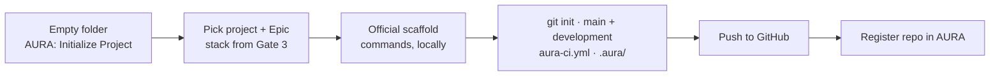
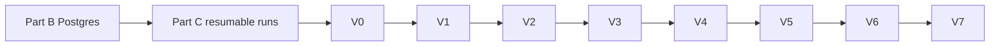
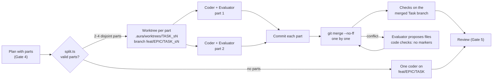
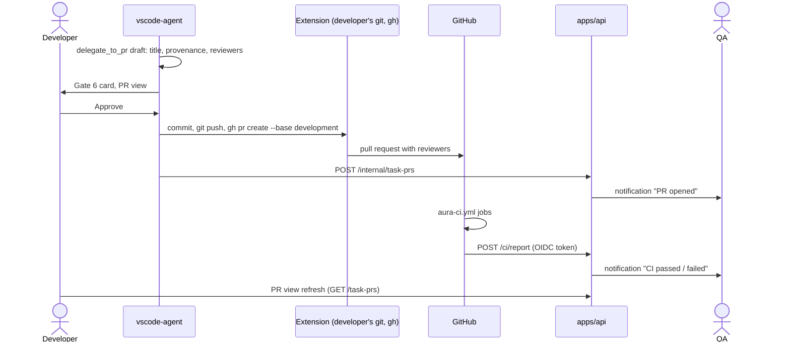

# Plan: AURA for Developers in VS Code (Claude-Code-style), Web App for Everyone Else

| | |
|---|---|
| **Status** | **Approved 2026-10-02** · Parts B, C, V0–V6 built (live checks pending) · V7 next |
| **Target** | AI agent harness for a leading Sri Lankan technology company |
| **Date** | 2026-10-02 |
| **Needs** | ADR-4 (supersedes ADR-1, ADR-2 D1–D2/D5, ADR-3 D2/D8) |
| **Out of scope for now** | Token cost and budgets: optimise after this is built |

**In one line:** Developers work in **VS Code**, where the AURA extension behaves like Claude Code:
a chat panel, tools that run on their machine, permission prompts and diffs. The agent loop runs
in AURA's **cloud** Mastra runtime. **Everyone else** (PO, BA, Architect, QA, Deployer, Admin) uses
the **web app**. AURA in the cloud holds **no code, no files and no Docker**.

---

## 0. Who uses what



| Role | Client | Does |
|---|---|---|
| Project Owner | Web | Epic (Gate 1) |
| Business Analyst | Web | Stories (Gate 2) |
| Architect | Web | Architecture plan and Tasks (Gate 3); edits design docs |
| Developer | **VS Code** | Picks a Task, approves the plan, works with the agents, approves code and the PR (Gates 4–6) |
| QA Engineer | Web | Approves the test plan and scenarios (Gate 7 design); follows each Task's PR and its CI results; gets notified when they change |
| Deployer | Web | Release plan (Gate 8) |
| Admin | Web | Users, projects, repositories, settings, audit |

### Web app after this change

The web app shows **no source code**. Project Files and the CodeMirror editor are removed; code is
seen in VS Code (developers) and in the pull request on GitHub (reviewers, QA).

| Page | Who | Content | Editor |
|---|---|---|---|
| Design documents | Architect edits; PO, BA, QA, Developer read | Architecture plan, ADRs, SRS per Epic (Postgres, versioned) | Markdown editor with preview |
| QA | QA edits; Developer, Architect read | Test plan and scenarios per Story/Task (Postgres); per Task: the PR link, its CI status and test summary, notifications on change | Structured form + Markdown |
| Runs, Approvals, Jira, Agents | By role | As today | — |
| Admin | Admin | Users, Projects & Repositories, Settings, AI Usage, Audit | — |

**QA sees no code.** QA designs *what* to test (scenarios, expected results), then follows each
Task's **pull request and its CI results**, and is **notified** (in-app, optionally email or Slack)
when a PR opens, CI finishes or CI fails. Spec code is written by agents in the developer's
session and reviewed in the PR by developers. A change QA wants is a scenario revision, which the
agents apply in the next session.

---

## 1. Work hierarchy

`KAN` is the Jira **project key**; every item is an issue in it. Work runs on one Epic at a time.



A coding agent always receives the Task, its Story's acceptance criteria and the architecture
plan sections for that Task.

---

## 2. How it works: Claude Code, with governance

Claude Code runs an agent loop: the model asks for a tool, the client runs it on your machine
under permission rules, the result goes back, and the loop continues until the work is done.
AURA keeps that loop but splits it in two:



| Part | Claude Code | AURA |
|---|---|---|
| Agent loop | On your machine | **Cloud** Mastra runtime |
| Model calls and keys | Your machine | Cloud only |
| Tools (shell, files, git) | Your machine | **Your machine**, through the extension |
| Permission prompts | Terminal / IDE | VS Code panel |
| Project memory | `CLAUDE.md` | `.aura/AURA.md` |
| Skills | `.claude/skills` | AURA library (cloud) + `.aura/skills` (repo) |
| Hooks | `settings.json` | `.aura/settings.json`, run by the extension |
| Subagents | Task tool | Specialist coders, Evaluator, Planner |
| Plan mode | Read-only until you approve | Gate 4: read-only tools until the plan is approved |
| Todo list | TodoWrite | Planner's sub-tasks shown as a live checklist |
| Approvals and audit | None | Gates, policy, audit log, provenance (server-side) |

### Why the loop stays in the cloud

| Option | Good | Bad | Verdict |
|---|---|---|---|
| **A. Loop in cloud, tools on laptop** | Gates and policy enforced by the server; multi-agent work and parallel sub-tasks coordinated in one place; keys and prompts never on laptops; full audit | One network hop per tool call (~50–150 ms, small next to model latency) | **Chosen** |
| B. Loop in the extension, cloud as model proxy (exactly like Claude Code) | Fastest tool calls; works like Claude Code internally | A modified extension can skip gates and audit; coordination of parallel agents and evaluators lives on one laptop; prompts and skills ship to every client | Rejected for a company tool |

The extension never calls the runtime directly. It talks only to `apps/api`, which checks the user,
the policy and the run, then relays to the private runtime. This keeps one public entry point.

---

## 3. A session, step by step



- The developer can type at any time: a note goes to the running agents (like typing in Claude Code).
- **Esc / Stop** cancels the current tool call and pauses the run.
- Closing VS Code pauses the run at the next tool call; reopening resumes it.

---

## 4. The VS Code extension

| Part | Shows / does |
|---|---|
| **AURA panel** | Chat with the Orchestrator; streamed text; each tool call inline (command, output, file diff) |
| **Tasks view** | The Epic → Story → Task tree from Jira; status; "Start work" |
| **Plan view** | Gate 4 plan as a checklist: sub-tasks, agents, branches; ticks off live |
| **Review view** | Gate 5: full diff per file with VS Code's diff editor; Evaluator notes; check results |
| **PR view** | Gate 6: title, description, reviewers; PR link and CI status afterwards |
| **Permission prompt** | Allow once · Allow for this project · Deny, with the exact command |
| **Status bar** | Connection, active run, current agent |
| **Commands** | AURA: Sign In · Initialize Project · Connect Repository · Start Task · Stop · Resume · Open Run in Web |

Sign-in uses a browser login (OAuth device flow through `apps/api`), not a pasted token. The
extension reuses `@aura/client`.

---

## 5. Tool bridge

| Message | Direction | Content |
|---|---|---|
| `tool.request` | cloud → extension | `callId`, `runId`, tool, arguments, worktree, timeout |
| `tool.progress` | extension → cloud | Streamed output of long commands |
| `tool.result` | extension → cloud | `callId`, output (capped), exit code, diff for file edits |
| `tool.denied` | extension → cloud | The developer or a rule refused; the agent is told why |
| `run.cancel` | either way | Stop the current call |

Guarantees: every call has an id and a timeout; a result is accepted once; output is size-capped;
on reconnect, pending calls are re-sent and re-checked; the cloud signs each request so the
extension only runs calls for runs its user started.

In the runtime this is a Mastra **`Workspace`** with a custom sandbox and filesystem provider whose
methods send `tool.request` and wait for `tool.result` (Mastra docs: custom sandbox provider,
resolver per thread). Agents then get Mastra's standard tools, skills and `requireApproval`.

---

## 6. Permissions, modes, hooks, memory

| Mode | File edits | Shell | When |
|---|---|---|---|
| Plan | Read-only | Read-only commands | Until Gate 4 is approved |
| Default | Ask | Ask unless allowed | Normal work |
| Accept edits | Allowed in the worktree | Ask unless allowed | Developer's choice per session |

There is no "bypass all" mode. Admins can restrict modes per project.

**Rules** in project settings and `.aura/settings.json`: `allow` (e.g. `npm test`, `npm run lint`,
`git status`), `ask` (installs, network, deletes), `deny`. Built-in denies the developer can't
override: `git push --force`, writes outside the repo, `curl … | sh`, reading `~/.ssh`, `~/.aws`,
`~/.config/gh`.

**Hooks** (run by the extension, not the model): after an edit run the formatter; before a commit
run lint; after a test run upload the report.

**Project memory:** `.aura/AURA.md` (conventions, commands, architecture notes) is loaded into
every coder's context, like `CLAUDE.md`.

---

## 7. Agents, tools and skills

| Agent | Chosen by | Job |
|---|---|---|
| Orchestrator | — | Understands the developer's free text; explicit actions go straight to the router |
| Router | **Code** | Picks agents from discipline, issue type (Bug → issue-solver), labels, file scope |
| Task Planner | Router | Single vs parallel; sub-tasks with owned file scopes; becomes the Gate 4 plan |
| Coders | Router | `frontend-react`, `backend-nestjs`, `backend-spring`, `issue-solver`, `test-writer` |
| Evaluator | Always | Reviews diff + real check output; discusses with the coder until approved or out of rounds |
| Merge step | After parallel work | `git merge` in code; on conflict the Evaluator proposes, checks run, developer approves |
| Git agent | Always | Push, PR to `development`, description with provenance, reviewers, PR comment |
| Architect specialists | Web (Gate 3) | API, data, security, frontend, integration designers + synthesis; saved to Postgres |
| QA agent | Web | Test plan and scenarios (Postgres); spec files written into the Task branch by the developer's session |

**Tools:** `execute_command` (+ background processes), `read_file`, `write_file`, `edit_file`,
`list_files`, `grep`, `glob`, `git_*`, `run_checks`, `ci_status`, `design_docs`.

**Skills:** AURA library (`nestjs-module`, `react-feature`, `debug-failing-test`,
`write-unit-tests`, `playwright-e2e`, `code-review`, `git-hygiene`) plus the repo's
`.aura/skills/*/SKILL.md`.

---

## 8. Branches

| Branch | From | Into | Created by |
|---|---|---|---|
| `main` | — | — | Initialise; releases only |
| `development` | `main` | `main` | Initialise |
| `feat/<EPIC>/<TASK>` | `development` | `development` via PR | Extension, after Gate 4 |
| `feat/<EPIC>/<TASK>_s<N>` | `feat/<EPIC>/<TASK>` | `feat/<EPIC>/<TASK>` via merge step | Extension, per parallel sub-task |

`_s1`, not `/s1` (git can't hold both `feat/X/T` and `feat/X/T/s1`). Sub-branch worktrees live in
`.aura/worktrees/` (git-ignored) and are deleted after a clean merge. One active run per Task.

---

## 9. Project initialisation (developer, in VS Code)



Existing repo: **AURA: Connect Repository**. An Admin can also register the repo in the web app
first; the extension then only connects.

---

## 10. Tests and checks

| Lane | Where | What | Role |
|---|---|---|---|
| Local | Extension, inside the coder ↔ Evaluator loop | lint · typecheck · unit · build | Fast feedback |
| Local | Extension, before Gate 6 | Full set + Playwright e2e | Proves the merged branch |
| CI | GitHub Actions on the PR (`aura-ci.yml`) | Same checks | **Authoritative**; result stored on the run and shown to QA in the web app; failures go back to the coder |

Results come from exit codes and JUnit/JSON reports, never from a model's claim.

---

## 11. Data in the cloud

| Stored in Postgres | Not stored |
|---|---|
| Users, roles, projects, repositories, settings | Source code |
| Runs, steps, sessions, tool call log (command, exit code, sizes) | Full file contents |
| Approvals, audit, provenance | `.workspaces/` (removed) |
| Architecture plans, ADRs, SRS, QA plans and scenarios (versioned) | |
| CI and local test results | |

---

## 12. Phases



| Phase | Scope | Done when |
|---|---|---|
| Part B, C | Postgres state; queued, resumable runs | A run survives a runtime restart |
| V0 | ADR-4. Spike: API WebSocket relay + Mastra `Workspace` bridge provider; `read_file` and `execute_command` round-trip with a permission prompt | 🟢 **Passed** (see §12.1) |
| V1 | Extension base: device-flow sign-in, Tasks view, AURA panel with streaming, Stop / Resume / Open Run in Web, status bar with the active run, Initialize / Connect Repository | 🟡 Built and unit-tested (§12.2); live check in VS Code pending. Tasks are linked to their Stories in Jira since V3 |
| V2 | Full tool set, permission engine, modes, hooks, `.aura/AURA.md`, skills | 🟡 Built and unit-tested (§12.3); the end-to-end Task with a live model is pending |
| V3 | Design docs, ADRs, SRS, QA plans in Postgres; Architect specialists; Design documents and QA web pages (Markdown editor, no CodeMirror) | 🟡 Built and unit-tested (§12.4); Gate 3 writes nothing to disk; Project Files removed. Live Gate 3 / Gate 6 run pending |
| V4 | Router, coder specialists, Evaluator loop, Plan and Review views | 🟡 Built and unit-tested (§12.5): a Bug goes to issue-solver; Gate 5 review in the diff editor. Live Task run pending |
| V5 | Task Planner, parallel sub-branches, merge step | 🟡 Built and unit-tested (§12.6): a two-part Task runs as `_s1` + `_s2` and merges, including a conflict (tested against a real git repository). Live run pending |
| V6 | Git agent, PR view, CI lane; QA page with PR and CI status per Task; notifications | 🟡 Built and unit-tested (§12.7): PR to `development` with reviewers; QA notified of the CI result. Live PR and CI run pending |
| V7 | Removal (§13) and docs | No code path touches `.workspaces`, Docker or a server shell |

---

### 12.1 V0 result (2026-10-02)

Built: `packages/aura-bridge` (protocol), `apps/api` bridge hub + `/bridge` WebSocket + tickets +
`POST /internal/bridge/calls`, `apps/agent-runtime` `vscode-agent` with a bridge filesystem and
sandbox, and `apps/vscode` (sign in, connect, ask, permission prompts).

End-to-end run with real code in all three parts, no model calls:

| # | Scenario | Result |
|---|---|---|
| 1 | Extension connects with a ticket | ✅ |
| 2 | Mastra generates its standard workspace tools on the bridge | ✅ 11 tools |
| 3 | `read_file` | ✅ no prompt, 18 ms |
| 4 | `list_files` | ✅ 7 ms |
| 5 | `execute_command npm test` | ✅ no prompt, real output, 116 ms |
| 6 | `write_file` | ✅ prompt → allowed → file on disk |
| 7 | `npm install left-pad` | ✅ prompt → denied → agent told |
| 8 | `git push --force` | ✅ refused by rule, no prompt |
| 9 | Read `../../etc/passwd` | ✅ refused, outside the workspace |

**Verdict: go.** Bridge overhead is 2–18 ms per call. Found and fixed during the run: Mastra's
write tool needs Mastra's own error classes (`FileNotFoundError`, `PermissionError`).

**Limits found:** a single bridge call (prompt + operation) is capped at 4.5 minutes by Node
`fetch` on the runtime → API hop; longer commands need streamed progress (V2). One API process
holds the WebSocket and receives the call (several API replicas need call routing, with Part C's
Postgres). The agent turn with a live model and the VS Code UI itself are verified by hand.

### 12.2 V1 scope as built

| Plan item (§3, §4) | Built |
|---|---|
| Sign in with the browser (device flow) | ✅ `AURA: Sign In`; a pasted token still works |
| Tasks view | ✅ Epic → Stories, Tasks, Bugs; Start Work, Open in Jira |
| AURA panel | ✅ Streamed text, each tool call inline with its result, resumes after a reload |
| Stop / Esc | ✅ Stop button, Esc in the panel, `AURA: Stop`, status bar: kills the running command at once, then `POST /runs/:id/stop` ends the turn as `INTERRUPTED` |
| Resume | ✅ `AURA: Resume` continues the conversation; reopening VS Code re-attaches to a running turn |
| Open Run in Web | ✅ Opens `/app/runs/<id>` (`aura.webUrl`, else the last sign-in's address) |
| Status bar | ✅ Connection, project, and the Task the agent is working on (click to stop) |
| Initialize Project, Connect Repository | ✅ |
| Permission prompt | ✅ Allow once · Allow for this session · Allow for this project (V2) · Deny |
| Typing while the agent works | ✅ V4: a note to the running Task, read by the coders at their next step |
| Plan, Review, PR views | ✅ Plan, Review (V4); PR (V6) |

### 12.3 V2 scope as built

| Plan item (§5–§7) | Built |
|---|---|
| Tools | ✅ Mastra's workspace tools on the bridge: `read_file`, `write_file`, `edit_file`, `list_files` (glob patterns), `grep` (searched on the developer's machine in one call, `fs.grep`), `file_stat`, `mkdir`, `delete`, `execute_command` (with `background: true`), `get_process_output`, `kill_process`; plus `load_skill` |
| Background processes | ✅ `proc.spawn/read/list/kill`: dev servers and long runs don't hit the 4.5-minute call limit; output is read when asked, never polled idle; stopped when VS Code closes or with **AURA: Stop Background Processes** |
| Modes | ✅ Plan (read-only), Default (ask), Accept edits; status bar and **AURA: Set Permission Mode**; Admin → Settings → *VS Code permission modes* restricts them per project |
| Rules | ✅ `.aura/settings.json` (team) and `.aura/settings.local.json` (yours, git-ignored): `Bash(cmd)`, `Bash(cmd:*)`, `Edit(glob)`, `Read(glob)` in `allow` / `ask` / `deny`; built-in denies always win; JSON schema in VS Code |
| Hooks | ✅ `afterEdit` (with `{file}`), `beforeCommit` (a failure stops the commit and tells the agent why). Upload of test reports moves to V6 with the CI lane |
| Project memory | ✅ `.aura/AURA.md` read at the start of every turn; refused if it carries an injection pattern |
| Skills | ✅ Library: `nestjs-module`, `react-feature`, `debug-failing-test`, `write-unit-tests`, `playwright-e2e`, `code-review`, `git-hygiene`; plus `.aura/skills/<name>/SKILL.md`, which replaces a library skill of the same name |
| Initialize Project | ✅ Also writes a starting `.aura/settings.json` (lint before commit, `.env` files never read) |

### 12.4 V3 scope as built

| Plan item (§0, §7, §11) | Built |
|---|---|
| Postgres | ✅ Migration `0010`: `design_documents` (one row per Epic and slug) and `design_document_versions` (append-only, SHA-256 per version, author person or agent, note, draft id). Kinds: `architecture`, `srs`, `plan`, `adr`, `qa-plan`, `qa-scenario` |
| API | ✅ `/design-docs`: every pipeline role reads; the role with the Architect's or QA's run grant edits that agent's kinds. A save names its `baseVersion`; a stale save is refused (409), an unchanged one adds no version. `/internal/design-docs` for the runtime. All writes audited |
| Gate 3 | ✅ `file` saves the architecture plan, SRS, delivery plan and one document per ADR to Postgres (nothing on disk); the Jira comment links the web pages; each Task is linked to the Stories it implements |
| Architect specialists | ✅ Frontend and integration designers join API, data, security and AI in parallel; both sections are optional (empty when the Epic has no UI or no external system) |
| Gate 6 | ✅ The test plan and one document per scenario (steps, Story, no code) go to Postgres; a scenario the Tester loop revises gets a new version. The Playwright files stay in the QA workspace until V6, because Gate 7 still runs them there |
| VS Code agent | ✅ `design_docs`: lists and reads an Epic's documents, fenced as untrusted |
| Web | ✅ **Design documents** and **QA** pages: Epic picker, documents by kind, Markdown preview, editor with side-by-side preview, version history. Project Files, the terminal and runners panels, CodeMirror and xterm are removed; old links redirect |
| Existing documents | ✅ `pnpm --filter api import-design-docs [--epic KAN-36] [--dry-run]` loads `.workspaces/<EPIC>/architecture` and `qa/test-plan.md` |
| QA per Task: PR, CI, notifications | ✅ V6 (§12.7) |

### 12.5 V4 scope as built

```mermaid
sequenceDiagram
    actor D as Developer
    participant A as vscode-agent
    participant C as coder (routed by code)
    participant E as Evaluator
    A->>A: read Task, design docs, code (workspace read-only)
    A->>D: delegate_to_planner → plan → Gate 4 card
    D->>A: Approve
    loop up to vscode.evaluatorRounds
        A->>C: delegate_to_coder: plan (+ findings, notes)
        C->>C: edit files, run checks (bridge)
        A->>A: code runs the checks, reads git diff
        A->>E: diff + real check output
        E-->>A: verdict; code decides pass
    end
    A->>D: review → Gate 5 card, Review view, diff editor
    D->>A: Approve → delegate_to_review accept
```

| Plan item (§3, §4, §7) | Built |
|---|---|
| Router | ✅ In code (`task/router.ts`): Bug → `issue-solver`; test labels → `test-writer`; Frontend → `frontend-react`; Backend, Data, AI, Integration → `backend-nestjs` or `backend-spring` from the Epic's Gate 3 stack; otherwise `issue-solver` |
| Coders | ✅ `frontend-react`, `backend-nestjs`, `backend-spring`, `issue-solver`, `test-writer`: one Mastra agent each on the bridge workspace, with their library skills in the prompt and `design_docs`; they never commit or push |
| Evaluator loop | ✅ Code runs the checks (`.aura/settings.json` `checks`, else the plan's) and reads `git diff`; the Evaluator (no tools, a different model family) reviews; a round passes only with green checks and no blocker or major finding. Rounds: Admin → Settings → *VS Code review rounds* (default 3) |
| Gate 4 | ✅ `delegate_to_planner`: the agent proposes the plan as structured input; code routes and stores it; until it is approved the conversation's workspace is read-only (the extension answers as in plan mode, whatever the developer's mode) |
| Gate 5 | ✅ `delegate_to_coder execute` needs the Gate 4 approval (tool gateway, once); `revise` re-runs the same plan with the developer's feedback; `delegate_to_review accept` records Gate 5 and comments the Jira Task |
| Who decides | The developer who started the run (no other role can answer these gates) |
| Plan view | ✅ The plan as a checklist (steps, files, checks, risks), the coder, and the loop's live activity |
| Review view | ✅ Changed files open in VS Code's diff editor (last commit ↔ working tree), check results, Evaluator findings |
| Gate cards | ✅ In the chat: Approve · Revise · Reject, with feedback |
| Notes | ✅ Typing while a Task runs sends a note (`POST /runs/:id/notes`, migration `0011`); the coders read it at their next step |

### 12.6 V5 scope as built



| Plan item (§7, §8) | Built |
|---|---|
| Task branch | ✅ After Gate 4, code checks out `feat/<EPIC>/<TASK>` (created from `development`, else the current commit). It never switches over uncommitted work: the developer commits or stashes first |
| Task Planner | ✅ The agent may list 2–4 `subtasks` (steps + owned folders). Code (`task/split.ts`) accepts them only if every step is in exactly one part, scopes don't overlap and each step's files are in its part's scope; otherwise the planner call fails with the reason. Each part's coder comes from its files (`coderForFiles`) |
| Sub-branches | ✅ `feat/<EPIC>/<TASK>_s<N>` in a worktree under `.aura/worktrees/` (ignored by its own `.gitignore`); the main folder's `node_modules` is linked in so checks run. Bridge calls for a part carry `worktree`; the extension resolves paths and commands inside it and refuses paths that leave it. Permission rules see the path the agent asked for |
| Scope enforcement | ✅ A part that changes a file outside its scope gets a blocker finding, so the round cannot pass |
| Parallel coders | ✅ The parts' loops run at the same time; developer notes reach every part |
| Merge step | ✅ Code commits each part and merges it with `--no-ff`. On a conflict the Evaluator proposes each conflicting file whole; code refuses a proposal with markers, missing or extra files, else writes and commits it. An unresolved conflict aborts the merge, keeps that part's branch and worktree, and stops merging. Merged parts' worktrees and sub-branches are removed |
| Checks | ✅ After the merge, the checks run on the merged Task branch; the review passes only if every part passed, merged, and the checks are green |
| Plan view | ✅ *Branch* and a *Parallel parts* checklist (coder, state, rounds, merge result); the activity lines are prefixed with the part |
| Review view | ✅ Changed files and diffs since the Task's start commit (covers merged commits); the parts and their merge results |
| Gate 5 revise | Runs one coder on the merged Task branch with the developer's feedback |

### 12.7 V6 scope as built



| Plan item (§4, §7, §10) | Built |
|---|---|
| Git agent | ✅ `delegate_to_pr` (deterministic, `git-agent`): `draft` (low) writes the title, the description with provenance (plan, checks with exit codes, Evaluator verdict and rounds, parallel parts, Gate 4 and 5 drafts, the AURA run) and the reviewers (`.aura/settings.json` `"reviewers"`, or what the developer asks); `open` (medium, after Gate 6) commits the accepted change (beforeCommit hooks run), pushes the Task branch and runs `gh pr create --base development` with the developer's own GitHub sign-in, then records the PR in AURA and comments on the Jira Task; `status` (low) reads the PR and its CI |
| Without `gh` | The branch is pushed and the agent gives a GitHub compare link; the first CI report on the PR fills in its number |
| Gate 6 | The requester decides (same as Gates 4 and 5); the gate card says "Pull request" |
| PR view | ✅ Title, branch → base, reviewers, the commit / push / open steps, then the PR link and CI (jobs, tests); refreshes every minute while CI runs, or on *Refresh CI Status* |
| CI lane | ✅ `aura-ci.yml` (from Initialize Project) has `aura-start` and `aura-report` jobs on pull requests: they ask GitHub Actions for an OIDC token with audience `aura` and post to `POST /ci/report`. apps/api verifies GitHub's signature and trusts the token's repository; no secret is stored. Turn it on with the repository variable `AURA_API_URL` |
| PR and CI per Task | ✅ In `task_branches` (migration `0012`): repository, PR number and link, reviewers, CI state (`pending`, `running`, `success`, `failure`, `cancelled`), run link, jobs and test summary |
| QA page | ✅ *Pull requests and CI* above the test plan: each Task's PR, CI badge with the failed jobs or test counts, reviewers; no code |
| Notifications | ✅ In-app (migration `0012`, bell in the web app's top bar): QA hears when a PR opens; QA and the developer hear once per result when CI passes or fails. Email and Slack are not built |
| CI failures back to the coder | The agent offers `delegate_to_coder revise` with the failing jobs, then Gates 5 and 6 again |

## 13. Removed

| Removed | Files / config |
|---|---|
| `.workspaces/` and server worktrees | `workspace/*`, `AURA_WORKSPACE_ROOT`, workspace routes (runtime and API) |
| Docker | `lib/docker-exec.ts`, `SANDBOX_MODE`, Docker scaffold, Docker test runs, `delegate_to_ci` |
| Host checks | `lib/sandbox.ts` |
| Web terminal, Runners | `terminal/*`, `TERMINAL_*` (ticket signing reused for the bridge) |
| Project Files (all of it, for every role) — **removed in V3** | `apps/web/src/features/project-files/*`, `/app/project-files` route and nav item, `access.ts` matrix |
| CodeMirror, xterm — **removed in V3** | `@uiw/react-codemirror`, `@uiw/codemirror-theme-vscode`, `@codemirror/lang-*`, `@xterm/*` in `apps/web/package.json`; `shared/lib/vscodeTheme.ts` |
| Workspace file routes in the API | `modules/workspace`, `dev-workspace`, `qa-workspace`, `test-runs`, `docker`, `runners` |
| Coding Council, single coding agent | `coding-council.ts`, `council-agents.ts`, `mastra-coding-agent.ts` |
| `aura` CLI | `apps/cli` — **removed 2026-10-02** |
| Claude Code / Codex | Already gone from code; stale comments in `code.ts`, `registry.ts`, `ProfilePage.tsx` and doc mentions cleaned; migration `0004` stays as applied history |
| GitHub App plan | ADR-3 D2, roadmap step 1.2b |

---

## 14. Issues

| # | Issue | Severity | Answer in this plan |
|---|---|---|---|
| 1 | **Agents get a shell on the developer's machine** with their keys, tokens and network | High | Permission engine, built-in denies, file containment, stripped environment, Workspace Trust, no bypass mode. A shell can't be fully contained |
| 2 | **Prompt injection can now run commands** (repo files, issue text, dependency output) | High | Scan tool output as untrusted; `ask` for network and installs; Evaluator review |
| 3 | Prompt fatigue → "allow everything" | Medium | Good default allow-list; ask only for risky classes |
| 4 | Nothing runs while VS Code is closed | Medium | Accepted; pause and resume |
| 5 | Parallel sub-branches conflict | Medium | Disjoint file scopes enforced by file tools; conflicts to Evaluator + developer |
| 6 | Local results can be flaky or edited | Medium | CI is authoritative |
| 7 | CI e2e needs a database (GitHub service containers) | Low | "No Docker" applies to AURA, not to GitHub's runners |
| 8 | Design docs in Postgres aren't in the PR diff | Low | Linked from the PR description; optional export later |
| 9 | QA can't write files without VS Code | Medium | Decided: QA designs scenarios in the web app; agents write spec files in the developer's session; QA follows the PR and CI results with notifications |
| 13 | Architects lose the side-by-side view of design and code | Low | Design docs link to the Task's PR; code review happens on GitHub |
| 10 | Large rebuild; much existing code dropped | High effort | V0 is a go/no-go spike before removals |
| 11 | Mastra `Workspace` with a remote provider is new ground | Medium | Proven in V0 |
| 12 | Two developers start the same Task | Low | One active run per Task (Postgres lock) |

---

## 15. Effect on other plans

| Plan | Change |
|---|---|
| [Automation and durability](aura-automation-durability.md) | A done. B, C required first. D (RLS) stays. E (budgets) postponed. F, G after V6 |
| [Runtime refactor](aura-runtime-refactor.md) | R1, R2 still apply. R3 becomes extension commands. R4 replaced by coders + Evaluator. R5 folded into the bridge (`requireApproval`) |
| [Roadmap](aura-git-control-plane.md) | Phase 1 steps 1.3–1.9 replaced by V1–V6; GitHub App dropped |
