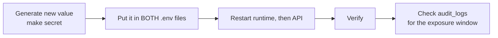

# Runbook: rotate a shared secret

Use this when a shared secret may have leaked (committed, pasted into a chat or ticket, or left on a
machine that's no longer trusted), or on a schedule.

| Secret | Shared by | If it leaks, someone can |
|---|---|---|
| `MASTRA_RUNTIME_TOKEN` | `apps/api/.env`, `apps/agent-runtime/.env` | Call the runtime directly and skip policy, approvals and audit |

## Steps

1. **Generate** a new value: `make secret` (64 hex characters).
2. **Replace** it in `apps/api/.env` **and** `apps/agent-runtime/.env`. The two must match.
3. **Restart** the runtime first, then the API (`make dev`, or restart each service). Between the
   two restarts the API gets `401` from the runtime. That's expected and lasts only seconds.
4. **Verify:**
   - `curl -s -o /dev/null -w '%{http_code}\n' http://localhost:4111/api/agents` → `401`
   - The web app header shows the runtime as connected (`GET /health/runtime` → `200`).
5. **Investigate** the exposure window. Look in `audit_logs` for approvals, runs and
   `bridge.tool.call` events you don't recognise. Anything that went straight to the
   runtime with a leaked `MASTRA_RUNTIME_TOKEN` leaves **no** API audit row, so also check the
   runtime's log and Mastra traces, and Jira and git history, for writes without a matching
   approval.

## Related

- Personal access tokens (`aura_pat_…`) are per user: revoke them on the Profile page instead.
- Model and Jira API keys live only in `apps/agent-runtime/.env`. Rotate them in the provider's
  console, then restart the runtime.
- Threat model: [../security/threat-model.md](../security/threat-model.md).
